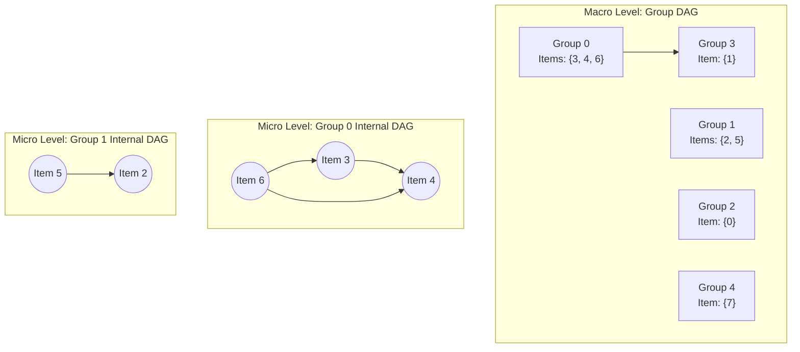

# Guided Example: Sort Items by Groups Respecting Dependencies

## 1. Problem Essence & Algorithmic Mental Model

We are given $n$ discrete items labeled $0$ to $n-1$, and $m$ groups labeled $0$ to $m-1$. Each item either belongs to one of the $m$ groups or belongs to no group at all (indicated by $\text{group}[i] = -1$). Additionally, we are provided with a dependency graph specified by $\text{beforeItems}$, where $\text{beforeItems}[i]$ lists all items that must be placed before item $i$ in any valid sequence.

Our objective is to return a complete ordering of all $n$ items that satisfies two strict invariants:
1. **Item Dependency Precedence**: If item $u \in \text{beforeItems}[v]$, then $u$ must appear strictly before $v$.
2. **Contiguous Group Clustering**: All items belonging to the same group must appear contiguously as an unbroken block in the final list. Items with $\text{group}[i] = -1$ are unconstrained by each other and need not be grouped together.

If no ordering can simultaneously fulfill both requirements (due to cycles in dependencies or conflicting group constraints), we must return an empty list `[]`.

A flat topological sort over individual items fails because it cannot enforce that same-group items form unbroken blocks. Conversely, ordering groups without considering item-level dependencies risks creating intra-group deadlocks.

The resolving architecture is **Two-Level Hierarchical Topological Sorting**:
- **Dummy Group Normalization**: Assign every ungrouped item ($\text{group}[i] = -1$) its own unique, isolated group identifier ($m, m+1, \dots$). Now, every item belongs to exactly one group.
- **Graph Decoupling**:
  - **Macro Level (Inter-Group Graph)**: For every dependency $u \to v$, if $\text{group}[u] \neq \text{group}[v]$, add a directed edge from $\text{group}[u]$ to $\text{group}[v]$.
  - **Micro Level (Intra-Group Graph)**: For every dependency $u \to v$, if $\text{group}[u] = \text{group}[v]$, add a directed edge from item $u$ to item $v$.
- **Hierarchical Resolution**:
  1. Topologically sort the **Group Graph**. If a cycle exists, return `[]`.
  2. For each group in topological order, topologically sort its internal items using the **Item Graph**. If an internal cycle exists, return `[]`.
  3. Concatenate the sorted internal items across groups in macro topological order.

```
Hierarchical Graph Architecture:

Macro (Group Level):
      [Group A] ───────────────> [Group B]
         │                          │
         ▼                          ▼
Micro (Item Level):          Micro (Item Level):
   (Item 1) -> (Item 2)        (Item 3) -> (Item 4)

Result: [Item 1, Item 2] concatenated with [Item 3, Item 4]
```

---

## 2. Mathematical Formalism & Invariants

Let $V_{\text{item}} = \{0, 1, \dots, n-1\}$.
Let the group mapping be $g: V_{\text{item}} \to \mathbb{Z}_{\ge 0}$, where ungrouped items receive unique IDs $m + k$:
$$g(i) = \begin{cases} \text{group}[i] & \text{if } \text{group}[i] \neq -1 \\ m + \text{rank}(i) & \text{if } \text{group}[i] = -1 \end{cases}$$
The total number of groups is $M_{\text{total}} = m + \sum [ \text{group}[i] = -1 ] \le n + m$.

### Graph Definitions
1. **Inter-Group Directed Graph** $G_G = (V_G, E_G)$:
   - Vertices: $V_G = \{0, 1, \dots, M_{\text{total}} - 1\}$.
   - Directed Edges:
     $$E_G = \{(g(u), g(v)) \mid u \in \text{beforeItems}[v] \land g(u) \neq g(v)\}$$
2. **Intra-Group Directed Graph** $G_I = (V_{\text{item}}, E_I)$:
   - Vertices: $V_{\text{item}} = \{0, 1, \dots, n-1\}$.
   - Directed Edges:
     $$E_I = \{(u, v) \mid u \in \text{beforeItems}[v] \land g(u) = g(v)\}$$

### Necessary and Sufficient Condition for Feasibility
An ordering exists if and only if:
1. $G_G$ is a Directed Acyclic Graph (DAG), possessing a valid topological sort:
   $$\pi_G: V_G \to \{0, \dots, |V_G|-1\}$$
2. For every active group $\gamma \in V_G$, the subgraph $G_I$ induced by vertices $\{i \mid g(i) = \gamma\}$ is a DAG, possessing an internal topological sort:
   $$\pi_{I, \gamma}: g^{-1}(\gamma) \to \{0, \dots, |g^{-1}(\gamma)|-1\}$$

### Global Ordering Assembly
The final permutation is the lexicographical product of the two topological orders:
$$u \prec v \iff \left( \pi_G(g(u)) < \pi_G(g(v)) \right) \lor \left( g(u) = g(v) \land \pi_{I, g(u)}(u) < \pi_{I, g(u)}(v) \right)$$

---

## 3. Concrete Example Execution & State Evolution

Consider the configuration:
- $n = 8, m = 2$
- $\text{group} = [-1, -1, 1, 0, 0, 1, 0, -1]$
- $\text{beforeItems} = [[], [6], [5], [6], [3, 6], [], [], []]$

### Normalization of Groups
Ungrouped items ($-1$) at indices 0, 1, 7 receive fresh unique group IDs:
- Item 0 $\to$ Group 2
- Item 1 $\to$ Group 3
- Item 7 $\to$ Group 4

| Item $i$ | Original Group | Normalized Group $g(i)$ | Dependencies $\text{beforeItems}[i]$ | Edge Categorization |
|---|---|---|---|---|
| 0 | -1 | Group 2 | None | - |
| 1 | -1 | Group 3 | $\{6\}$ | Item $6 \in$ Group 0 $\implies$ Group $0 \to$ Group 3 |
| 2 | 1 | Group 1 | $\{5\}$ | Item $5 \in$ Group 1 $\implies$ Intra-group: $5 \to 2$ |
| 3 | 0 | Group 0 | $\{6\}$ | Item $6 \in$ Group 0 $\implies$ Intra-group: $6 \to 3$ |
| 4 | 0 | Group 0 | $\{3, 6\}$ | Both in Group 0 $\implies$ Intra-group: $3 \to 4, 6 \to 4$ |
| 5 | 1 | Group 1 | None | - |
| 6 | 0 | Group 0 | None | - |
| 7 | -1 | Group 4 | None | - |



### Topological Sort Traces

#### 1. Group-Level Topological Sort (Kahn's Algorithm on $G_G$):
- In-degrees of Groups:
  - Group 0: 0
  - Group 1: 0
  - Group 2: 0
  - Group 3: 1 (from Group 0)
  - Group 4: 0
- Valid Group Topological Order:
  $$\pi_G = [\text{Group 0}, \text{Group 1}, \text{Group 2}, \text{Group 4}, \text{Group 3}]$$
  (All 5 groups scheduled, no macro cycles).

#### 2. Item-Level Topological Sort within Each Group:
- **Group 0**: Items $\{3, 4, 6\}$. Edges: $6 \to 3, 3 \to 4, 6 \to 4$.
  - In-degrees: $6: 0, 3: 1, 4: 2$.
  - Internal order: $[6, 3, 4]$.
- **Group 1**: Items $\{2, 5\}$. Edges: $5 \to 2$.
  - Internal order: $[5, 2]$.
- **Group 2**: Item $\{0\}$. Internal order: $[0]$.
- **Group 4**: Item $\{7\}$. Internal order: $[7]$.
- **Group 3**: Item $\{1\}$. Internal order: $[1]$.

#### 3. Global Assembly:
Concatenating internal orders according to group order $\pi_G$:
$$[6, 3, 4] \circ [5, 2] \circ [0] \circ [7] \circ [1] = [6, 3, 4, 5, 2, 0, 7, 1]$$

Every dependency is respected, and items of Group 0 ($[6, 3, 4]$) and Group 1 ($[5, 2]$) form contiguous blocks!

---

## 4. Multi-Approach Comparison & Trade-Offs

| Approach / Strategy | Flat Topological Sort with Post-Validation | Backtracking Search with Group State | Two-Level Hierarchical Topological Sort (Optimal) |
|---|---|---|---|
| **Paradigm** | Standard item Kahn's sort, reject if group splits | Exponential DFS search | Dual DAG decomposition |
| **Time Complexity** | $\mathcal{O}(V + E)$ (Fails nearly all valid instances) | Exponential $\mathcal{O}(2^N)$ | Strictly $\mathcal{O}(V + E)$ |
| **Contiguity Guarantee** | Not guaranteed (arbitrary interleaving) | Enforced via pruning, but TLE | Structurally guaranteed by construction |
| **Cycle Detection** | Detects only flat cycles | Time Limit Exceeded | Detects both macro group cycles and micro item cycles |
| **Memory Overhead** | Single graph | Deep recursion tree | Two lightweight adjacency graphs |

```
Execution Pipeline:
[Normalize -1 Groups] ---> [Build Inter-Group Graph] ---> [Kahn's Sort Groups] (Cycle? -> return [])
                                                               │
                                                               ▼
[Concatenate Result]  <--- [Kahn's Sort within Group] <--- [Iterate Groups in Order]
```

---

## 5. Algorithmic Edge Cases & Boundary Analysis

| Edge Case Scenario | Condition Description | System Response & Correctness |
|---|---|---|
| **Inter-Group Cycle** | Group A depends on B, and Group B depends on A | Group-level Kahn's queue empties before all groups visited; returns `[]`. |
| **Intra-Group Cycle** | Item $u \to v \to u$ within same group | Item-level Kahn's queue empties before all group items visited; returns `[]`. |
| **All Items in Group -1** | No grouping constraints present | Every item assigned a unique group ID; reduces to standard flat topological sort. |
| **All Items in Single Group** | $m = 1$, all $\text{group}[i] = 0$ | Group graph has 1 node; ordering dictated entirely by item graph dependencies. |
| **Zero Dependencies** | $\text{beforeItems}[i] = []$ for all $i$ | Any arbitrary ordering grouping same-group elements contiguously is returned. |

---

## 6. Mathematical Verification & Complexity Derivation

Let $N = n$ be the number of items, $M = m$ be the number of initial groups, and $E = \sum |\text{beforeItems}[i]|$ be the number of dependency edges.

### 1. Normalization Phase:
- Reassigning $-1$ groups to $m, m+1, \dots$ takes $\mathcal{O}(N)$ operations.
- Total groups bounded by $N + M$.

### 2. Graph Construction:
- Allocating adjacency lists and in-degree arrays: $\mathcal{O}(N + M)$ time.
- Processing each dependency $u \in \text{beforeItems}[v]$:
  - If $g(u) == g(v)$: add to item graph, increment item in-degree: $\mathcal{O}(1)$.
  - If $g(u) \neq g(v)$: add to group graph, increment group in-degree: $\mathcal{O}(1)$.
- Total construction time: $\mathcal{O}(N + M + E)$.

### 3. Group Topological Sort:
- Running Kahn's algorithm on $G_G$ visits at most $N + M$ group vertices and at most $E$ edges:
  $$\mathcal{O}(N + M + E)$$

### 4. Item Topological Sorts:
- For each group $\gamma$, running Kahn's algorithm on its induced subgraph visits $|g^{-1}(\gamma)|$ vertices and its internal edges.
- Summing across all groups:
  $$\sum_{\gamma} \mathcal{O}(|V_\gamma| + |E_\gamma|) = \mathcal{O}(N + E)$$

### Total Asymptotics:
- **Total Time Complexity:** $\mathcal{O}(N + M + E)$ optimal linear time with respect to graph size.
- **Total Auxiliary Space Complexity:** $\mathcal{O}(N + M + E)$ auxiliary memory for adjacency lists, in-degree counters, and BFS queues.

---

## 7. Synthesis & Strategic Takeaways

1. **Hierarchical Graph Decomposition**: When problem constraints enforce both fine-grained ordering (dependencies) and coarse-grained clustering (contiguous group blocks), decompose the problem into a two-level hierarchy of macro-nodes and micro-nodes.
2. **Dummy Group Normalization**: Representing "unconstrained" or missing properties as unique singleton groups ($-1 \to m + k$) unifies edge cases into a single uniform data model.
3. **Decoupling Cycles by Granularity**: A cycle between groups and a cycle between items within a group are structurally distinct failure modes. The two-level topological sort naturally pinpoints and rejects both without conflating their boundaries.
