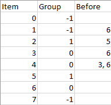

## Description

There are `n` items each belonging to zero or one of `m` groups where $\text{group}[i]$ is the group that the `i`-th item belongs to and it's equal to `-1` if the `i`-th item belongs to no group. The items and the groups are zero indexed. A group can have no item belonging to it.

Return a sorted list of the items such that:

- The items that belong to the same group are next to each other in the sorted list.

- There are some relations between these items where $\text{beforeItems}[i]$ is a list containing all the items that should come before the `i`-th item in the sorted array (to the left of the `i`-th item).

Return any solution if there is more than one solution and return an **empty list** if there is no solution.
### Function Contract

- `n`: Input parameter.
- Returns expected result.

### Examples

#### Example 1

**

**

- **Input:** $n = 8, m = 2, group = [-1,-1,1,0,0,1,0,-1], beforeItems = [[],[6],[5],[6],[3,6],[],[],[]]$
- **Output:** `[6,3,4,1,5,2,0,7]`
#### Example 2

- **Input:** $n = 8, m = 2, group = [-1,-1,1,0,0,1,0,-1], beforeItems = [[],[6],[5],[6],[3],[],[4],[]]$
- **Output:** `[]`
- **Explanation:** This is the same as example 1 except that 4 needs to be before 6 in the sorted list.
### Constraints

- $1 \le m \le n \le 3 * 10^{4}$

- $\text{group.length} = \text{beforeItems.length} = n$

- $-1 \le \text{group}[i] \le m - 1$

- $0 \le \text{beforeItems}[i].length \le n - 1$

- $0 \le \text{beforeItems}[i][j] \le n - 1$

- $i \neq \text{beforeItems}[i][j]$

- $\text{beforeItems}[i]$does not contain duplicates elements.