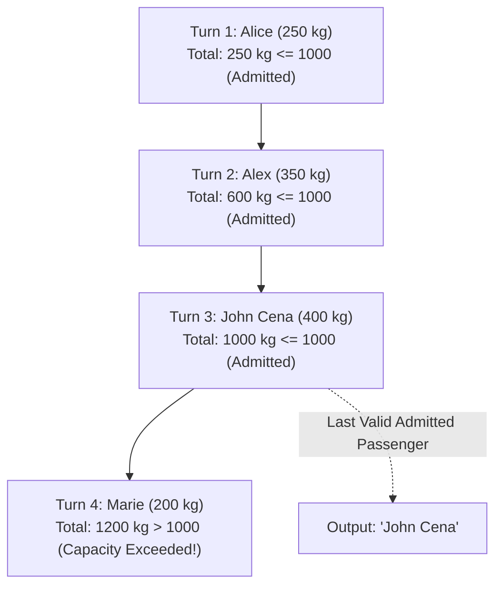

# Guided Example: Last Person to Fit in the Bus

## 1. Problem Essence & Algorithmic Mental Model

In queueing systems, transit dispatching, and cargo loading, physical capacity limits impose strict termination thresholds on sequential ingestion streams. We are given a relational table representing a line of people waiting to board a bus. Each record contains a unique `person_id`, the person's name `person_name`, their individual `weight` in kilograms, and their assigned boarding sequence number `turn`. The bus has a strict weight capacity limit of $1000\text{ kg}$.

Passengers board the bus one by one in strictly ascending order of `turn`. When the cumulative weight of the passengers on board plus the next waiting passenger strictly exceeds $1000\text{ kg}$, boarding ceases immediately, and that passenger (along with everyone behind them in line) cannot board. We must identify the `person_name` of the last person who successfully boards the bus without violating the capacity threshold.

The computational structure maps directly to **Prefix Sum (Cumulative Window Aggregation) over Chronological Streams**:
1. **Chronological Ingestion**: Order the passenger sequence by `turn` ascending:
   $$\tau_1 < \tau_2 < \dots < \tau_n$$
2. **Cumulative Weight Accumulation**: For each passenger $i$, the total load carried by the bus upon that passenger boarding is the running sum of weights of all passengers up to and including turn $i$:
   $$\text{RunningWeight}(i) = \sum_{j=1}^i \text{weight}_j$$
3. **Threshold Boundary Filtering**: Filter for all passengers satisfying:
   $$\text{RunningWeight}(i) \le 1000$$
4. **Boundary Extremum Selection**: Among all passengers who successfully boarded, select the passenger with the maximum `turn` (the last person admitted).

```
Passengers by Turn:
Turn 1: Alice (250 kg)  --> Running Total: 250 kg  <= 1000 (Fits)
Turn 2: Bob   (350 kg)  --> Running Total: 600 kg  <= 1000 (Fits)
Turn 3: Alex  (400 kg)  --> Running Total: 1000 kg <= 1000 (Fits - Exact Capacity!)
Turn 4: John  (200 kg)  --> Running Total: 1200 kg > 1000  (Over Capacity!)

Last Person Admitted: Alex (Turn 3)
```

---

## 2. Mathematical Formalism & Invariants

Let $\mathcal{Q} = \{\rho_1, \dots, \rho_n\}$ be the set of passenger records:
$$\rho = (\text{id}, \text{name}, w, t) \in \mathbb{Z}^+ \times \Sigma^* \times \mathbb{Z}^+ \times \mathbb{Z}^+$$
where $t$ denotes the unique boarding sequence number (`turn`), and $w$ denotes the weight.

### Monotonic Sequence Invariant
Sort the tuples such that:
$$t_{(1)} < t_{(2)} < \dots < t_{(n)}$$
Let $w_{(i)}$ denote the weight corresponding to sequence rank $i$.

### Running Sum Definition
Define the cumulative prefix weight function $W: \{1, \dots, n\} \to \mathbb{Z}^+$:
$$W(k) = \sum_{i=1}^k w_{(i)}$$
Because all weights are strictly positive ($w_{(i)} > 0$), the sequence of cumulative weights is strictly monotonically increasing:
$$0 < W(1) < W(2) < \dots < W(n)$$

### Admissible Passenger Set
Define the set of boarding passengers who do not violate the $1000\text{ kg}$ threshold:
$$\mathcal{A} = \{k \in \{1, \dots, n\} \mid W(k) \le 1000\}$$
The problem guarantee states that the first person never exceeds $1000\text{ kg}$ ($w_{(1)} \le 1000$), ensuring $\mathcal{A} \neq \emptyset$.

### Target Champion Selector
Because $W(k)$ is strictly increasing, $\mathcal{A}$ forms a contiguous integer prefix $\{1, 2, \dots, k^*\}$.
The last person admitted is the unique maximal element:
$$k^* = \max \mathcal{A} = \arg\max_{k \in \{1, \dots, n\}} \{ t_{(k)} \mid W(k) \le 1000 \}$$
The desired output is the passenger name $\text{name}_{(k^*)}$.

---

## 3. Concrete Example Execution & State Evolution

Consider an input dataset with six passengers:

### Input Passenger Stream
| `person_id` | `person_name` | `weight` | `turn` |
|---|---|---|---|
| 5 | `"Alice"` | 250 | 1 |
| 4 | `"Bob"` | 175 | 5 |
| 3 | `"Alex"` | 350 | 2 |
| 6 | `"John Cena"` | 400 | 3 |
| 1 | `"Winston"` | 500 | 6 |
| 2 | `"Marie"` | 200 | 4 |

### Chronological Cumulative Sum Trace

Sorting records by `turn` ascending:

| Order Rank $i$ | `turn` | `person_name` | Individual `weight` | Running Sum $W(i)$ | Capacity Constraint ($W(i) \le 1000$) | Status |
|---|---|---|---|---|---|---|
| 1 | 1 | `"Alice"` | 250 | 250 | $250 \le 1000$ (True) | Boards bus |
| 2 | 2 | `"Alex"` | 350 | $250 + 350 = 600$ | $600 \le 1000$ (True) | Boards bus |
| 3 | 3 | `"John Cena"` | 400 | $600 + 400 = 1000$ | $1000 \le 1000$ (True) | Boards bus (Bus Full!) |
| 4 | 4 | `"Marie"` | 200 | $1000 + 200 = 1200$ | $1200 \le 1000$ (False) | Rejected |
| 5 | 5 | `"Bob"` | 175 | $1200 + 175 = 1375$ | $1375 \le 1000$ (False) | Rejected |
| 6 | 6 | `"Winston"` | 500 | $1375 + 500 = 1875$ | $1875 \le 1000$ (False) | Rejected |



The admitted passenger set is:
$$\mathcal{A} = \{\text{Alice (Turn 1)}, \text{Alex (Turn 2)}, \text{John Cena (Turn 3)}\}$$
The last person admitted by turn order is **John Cena** at Turn 3.

---

## 4. Multi-Approach Comparison & Trade-Offs

| Metric / Dimension | Self-Join Triangular Grid (`a.turn >= b.turn`) | Subquery Correlated Scan | Window Function (`SUM OVER`) (Optimal) |
|---|---|---|---|
| **Query Strategy** | Quadratic Cartesian join filtered by inequality | Correlated subquery per row | Single sort + streaming window accumulator |
| **Relational Algebra Complexity** | $\mathcal{O}(N^2)$ join state | $\mathcal{O}(N^2)$ table probes | $\mathcal{O}(N \log N)$ sort + $\mathcal{O}(N)$ scan |
| **Memory Footprint** | Massive intermediate join buffer | Repeated cache misses | Minimal window spool buffer |
| **Execution Plan Nodes** | Nested Loop / Hash Join + Hash Aggregate | Nested Index Probes | Sort Node + Window Aggregate Node |
| **Scalability on $10^5$ Rows**| Fails / Extremely slow | Times out | Executes in milliseconds |

```
Query Execution Plan Comparison:

Self-Join Method:
[Table A] \
           ====> [Nested Loop Join (a.turn >= b.turn)] ====> [Group By person_id] ====> [Filter]
[Table B] /       (Evaluates N*(N+1)/2 rows!)

Window Function Method (Optimal):
[Table Scan] ====> [Sort by turn ASC] ====> [Window Stream Accumulator] ====> [Pick Last <= 1000]
```

---

## 5. Algorithmic Edge Cases & Boundary Analysis

| Boundary Scenario | Input Condition | Expected Result | System Invariant |
|---|---|---|---|
| **Exact Capacity Match** | Cumulative sum reaches exactly 1000 | The passenger who hits 1000 is returned | Constraint $W(k) \le 1000$ includes equality; exact threshold is legal. |
| **Only First Person Fits** | Person 1 weighs 950, Person 2 weighs 100 | Person 1 returned | Person 1 has $950 \le 1000$, Person 2 has $1050 > 1000$. |
| **All Passengers Fit** | Sum of all weights $\le 1000$ | Passenger with maximum `turn` returned | Filter retains all $N$ rows; `ORDER BY turn DESC LIMIT 1` emits the very last passenger. |
| **Single Passenger in Table** | Exactly one person in line | That single person returned | Guaranteed to weigh $\le 1000$; automatically selected. |
| **Large Out-of-Order Turns** | Turns are non-consecutive (e.g. 10, 50, 1000) | Order preserved | Relational sorting by `turn ASC` is robust against non-consecutive positive turn values. |

---

## 6. Mathematical Verification & Complexity Derivation

Let $N$ be the total number of passengers in the `Queue` table.

### 1. Window Function Pipeline (Optimal Execution):
1. **Sorting**:
   - The query planner sorts $N$ records by `turn ASC`:
     $$\mathcal{O}(N \log N) \text{ time}$$
2. **Streaming Cumulative Aggregation**:
   - A single cursor streams through the sorted tuples, maintaining a running sum of `weight`.
   - Each row performs 1 addition and 1 comparison:
     $$\mathcal{O}(N) \text{ time}$$
3. **Filtering and Selection**:
   - Filtering for rows where $\text{running\_weight} \le 1000$ and picking the top row under `ORDER BY turn DESC LIMIT 1`:
     $$\mathcal{O}(N) \text{ time}$$

### Asymptotic Summary:
- **Total Time Complexity:** $\mathcal{O}(N \log N)$ optimal sorting time.
- **Total Space Complexity:** $\mathcal{O}(N)$ auxiliary memory for sort spooling and window calculation.

---

## 7. Synthesis & Strategic Takeaways

1. **Window Aggregates Replace Quadratic Self-Joins**: Calculating running totals via self-joins (`a.turn >= b.turn`) generates $\frac{N(N+1)}{2}$ intermediate joined rows. Using an analytical window function (`SUM() OVER (ORDER BY turn)`) collapses quadratic state into an $\mathcal{O}(N)$ streaming calculation.
2. **Monotonicity Guarantees Early Stopping**: Because weights are strictly positive ($w_i > 0$), the cumulative sum is strictly monotonic. Once the running weight crosses 1000, all subsequent passengers in the stream are guaranteed to remain invalid, enabling immediate pipeline short-circuiting.
3. **Boundary Inclusivity Discipline**: In capacity problems, verify whether the boundary is inclusive ($\le 1000$) or exclusive ($< 1000$). Adhering to the exact specification preserves correctness when total weight equals the threshold.
