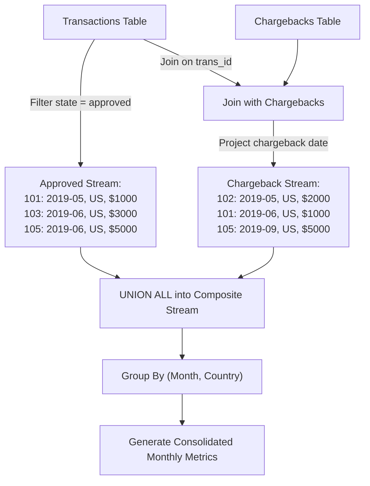

# Guided Example: Monthly Transactions II

## 1. Problem Essence & Algorithmic Mental Model

In financial accounting, payment processing, and fraud risk monitoring, merchant analytics must track both sales inflows and subsequent dispute reversals (chargebacks). We are provided with two relational tables:
1. `Transactions`: records payment attempts with columns `id`, `country`, `state` (`approved` or `declined`), `amount`, and `trans_date`.
2. `Chargebacks`: records retroactive payment disputes with columns `trans_id` and `trans_date`.

Our objective is to generate a comprehensive monthly reporting table that, for each combination of calendar month (`YYYY-MM`) and geographic territory (`country`), computes four key financial metrics:
1. `approved_count`: The number of approved transactions occurring in that month.
2. `approved_amount`: The gross monetary total of approved transactions in that month.
3. `chargeback_count`: The number of chargebacks occurring in that month.
4. `chargeback_amount`: The gross monetary total of transactions charged back in that month.

Groups where all four metrics are zero must be omitted from the output.

The principal conceptual complexity arises from **Temporal Dislocation**:
A transaction might be initiated and approved in May, but its associated chargeback might not occur until July.
- For May, the transaction is credited as an approved transaction.
- For July, the event is recorded as a chargeback, using July's timestamp for chronological grouping, while pulling the monetary value and country code from the original May transaction record.

Treating this as a simple join between `Transactions` and `Chargebacks` on the transaction date fails because chargebacks belong to the month they occurred, not the month the initial payment was processed.

The optimal relational architecture employs **Multi-Event Stream Unification via UNION ALL**:
1. **Event Stream A (Approved Transactions)**: Extract all transactions with `state = 'approved'`. The event date is the transaction's own timestamp `trans_date`.
2. **Event Stream B (Chargebacks)**: Join `Chargebacks` with `Transactions` on `trans_id = t.id`. The event date is the **chargeback's timestamp**, inheriting the `country` and `amount` from the underlying transaction.
3. **Unified Group-By and Conditional Aggregation**: Union both streams into a single dataset, partition by $(\text{month}, \text{country})$, compute conditional counts and sums, and prune zero-activity cohorts.

```
Transaction 101: Approved in May (2019-05-18) for $1000 in US
Chargeback on 101: Occurs in July (2019-07-03)

May Reporting (2019-05, US):
- approved_count: +1, approved_amount: +1000

July Reporting (2019-07, US):
- chargeback_count: +1, chargeback_amount: +1000 (Uses July date, US country, $1000 amount!)
```

---

## 2. Mathematical Formalism & Invariants

Let $\mathcal{T}$ be the set of transaction tuples $\tau = (id, \text{country}, \text{state}, a, d_T)$.
Let $\mathcal{C}$ be the set of chargeback tuples $\chi = (id, d_C)$.

### Date Truncation Mapping
Define the month extraction operator $\mu: \text{Date} \to \mathcal{M}$:
$$\mu(d) = \text{year}(d) \circ \text{"-"} \circ \text{pad}_2(\text{month}(d))$$

### Event Stream Decomposition
We map disparate financial activities into a unified event schema $(d, \text{country}, \text{type}, a)$:
1. **Approved Stream**:
   $$\mathcal{E}_{\text{app}} = \{(\mu(d_T), \text{country}, \text{'approved'}, a) \mid (id, \text{country}, \text{state}, a, d_T) \in \mathcal{T} \land \text{state} = \text{'approved'}\}$$
2. **Chargeback Stream**:
   $$\mathcal{E}_{\text{cb}} = \{(\mu(d_C), \text{country}, \text{'chargeback'}, a) \mid (id, d_C) \in \mathcal{C} \land (id, \text{country}, \text{state}, a, d_T) \in \mathcal{T}\}$$

### Unified Multiset Union
The composite event relation is:
$$\mathcal{E} = \mathcal{E}_{\text{app}} \uplus \mathcal{E}_{\text{cb}}$$

### Partition Aggregation Functions
For each distinct partition key $k = (m, c) \in \mathcal{M} \times \Sigma^*$, let $\mathcal{E}_k = \{e \in \mathcal{E} \mid e.d = m \land e.\text{country} = c\}$.
The four metrics evaluate to:
$$\begin{aligned}
C_{\text{app}}(k) &= \sum_{e \in \mathcal{E}_k} [e.\text{type} = \text{'approved'}] \\
A_{\text{app}}(k) &= \sum_{e \in \mathcal{E}_k} e.a \cdot [e.\text{type} = \text{'approved'}] \\
C_{\text{cb}}(k)  &= \sum_{e \in \mathcal{E}_k} [e.\text{type} = \text{'chargeback'}] \\
A_{\text{cb}}(k)  &= \sum_{e \in \mathcal{E}_k} e.a \cdot [e.\text{type} = \text{'chargeback'}]
\end{aligned}$$

### Cohort Inclusion Predicate
A partition cohort $(m, c)$ is retained if and only if it contains active activity:
$$C_{\text{app}}(k) > 0 \lor C_{\text{cb}}(k) > 0$$

---

## 3. Concrete Example Execution & State Evolution

Consider the input data:

### Transactions Table
| $id$ | $\text{country}$ | $\text{state}$ | $\text{amount}$ | $\text{trans\_date}$ |
|---|---|---|---|---|
| 101 | `"US"` | `"approved"` | 1000 | `2019-05-18` |
| 102 | `"US"` | `"declined"` | 2000 | `2019-05-19` |
| 103 | `"US"` | `"approved"` | 3000 | `2019-06-10` |
| 104 | `"US"` | `"declined"` | 4000 | `2019-06-13` |
| 105 | `"US"` | `"approved"` | 5000 | `2019-06-15` |

### Chargebacks Table
| $\text{trans\_id}$ | $\text{trans\_date}$ |
|---|---|
| 102 | `2019-05-29` |
| 101 | `2019-06-30` |
| 105 | `2019-09-18` |



### Unified Stream Event Table
Merging the streams yields six normalized events:

| Event Source | Transaction ID | Event Month | Country | Event Type | Amount |
|---|---|---|---|---|---|
| Transaction | 101 | `2019-05` | `"US"` | Approved | 1000 |
| Chargeback | 102 | `2019-05` | `"US"` | Chargeback | 2000 |
| Transaction | 103 | `2019-06` | `"US"` | Approved | 3000 |
| Transaction | 105 | `2019-06` | `"US"` | Approved | 5000 |
| Chargeback | 101 | `2019-06` | `"US"` | Chargeback | 1000 |
| Chargeback | 105 | `2019-09` | `"US"` | Chargeback | 5000 |

### Partition Aggregation Trace

| Partition Key $(\text{month}, \text{country})$ | Approved Events | Chargeback Events | Approved Count | Approved Amount | Chargeback Count | Chargeback Amount |
|---|---|---|---|---|---|---|
| `('2019-05', 'US')` | Tx 101 ($1000) | Cb 102 ($2000) | **1** | **1000** | **1** | **2000** |
| `('2019-06', 'US')` | Tx 103 ($3000), Tx 105 ($5000) | Cb 101 ($1000) | **2** | **8000** | **1** | **1000** |
| `('2019-09', 'US')` | None | Cb 105 ($5000) | **0** | **0** | **1** | **5000** |

All three cohorts possess at least one non-zero metric and are retained in the final output.

---

## 4. Multi-Approach Comparison & Trade-Offs

| Dimension / Metric | Full Outer Join of Two Aggregated Subqueries | Multi-Table Correlated Scalar Subqueries | Stream Unification (`UNION ALL`) (Optimal) |
|---|---|---|---|
| **Query Strategy** | Pre-aggregate each table, outer join on `(month, country)` | Scalar subqueries inside select clause | Concatenate events via `UNION ALL`, single Group-By |
| **Relational Algebra Complexity** | 2 aggregation scans + 1 full outer join | $\mathcal{O}(K \cdot N)$ repeated correlated probes | 1 scan of each table + 1 unified hash aggregate |
| **Null Key Handling** | Difficult: outer join drops non-matching month/country | Error-prone | Automatic: grouped naturally by hash key |
| **Zero-Activity Filtering** | Requires `COALESCE` across joined columns | High branching overhead | Direct `HAVING` clause on simple sum |
| **Memory Footprint** | Two large intermediate aggregation tables | Dynamic correlated query buffers | Single streaming hash aggregation table |

```
Query Execution Plan Comparison:

Full Outer Join Method:
[Transactions Aggregation] \
                             ====> [Full Outer Join on (month, country)] ====> [Filter Nulls]
[Chargebacks Aggregation]  /

Stream Unification (Optimal):
[Filter Approved Tx] \
                       ====> [UNION ALL] ====> [Single Hash Aggregate] ====> [Filter Non-Zero]
[Join Chargebacks Tx] /
```

---

## 5. Algorithmic Edge Cases & Boundary Analysis

| Boundary Scenario | Condition State | Handling Mechanism & Behavior |
|---|---|---|
| **Month with Only Chargebacks** | `2019-09` has zero approved transactions | Approved metrics evaluate to 0; chargeback metrics populate correctly; cohort retained. |
| **Month with Only Approved Transactions** | Month has approved txs, zero chargebacks | Chargeback metrics evaluate to 0; approved metrics populate; cohort retained. |
| **Chargeback on a Declined Transaction** | Tx 102 was declined, but charged back | Handled accurately: the chargeback stream does not filter on `state = 'approved'`. |
| **Multiple Chargebacks in Same Month** | Two distinct disputes occur in same month | Both events add to `chargeback_count` and `chargeback_amount`. |
| **Cohort with Only Declined Transactions** | Transactions occurred, but all declined and zero chargebacks | Both approved and chargeback counts evaluate to 0; `HAVING` clause prunes this cohort. |

---

## 6. Mathematical Verification & Complexity Derivation

Let $N = |\text{Transactions}|$ and $M = |\text{Chargebacks}|$.
Let $K$ be the number of distinct $(\text{month}, \text{country})$ cohorts in the output.

### 1. Ingestion and Stream Unification:
- Scanning `Transactions` and filtering for `state = 'approved'` produces at most $N$ rows in $\mathcal{O}(N)$ time.
- Joining `Chargebacks` with `Transactions` via index on primary key `id` requires $\mathcal{O}(M)$ time and produces $M$ rows.
- Concatenating the two streams with `UNION ALL` runs in $\mathcal{O}(N + M)$ time without deduplication overhead.

### 2. Grouping and Aggregation:
- Total rows entering the group-by engine: $\le N + M$.
- Using hash-based aggregation, each row evaluates 4 conditional checks ($\mathcal{O}(1)$ arithmetic operations) and updates the bucket corresponding to $(\text{month}, \text{country})$.
- Total aggregation time: $\mathcal{O}(N + M)$.

### 3. Filtering and Output Emission:
- The hash table holds $K \le N + M$ buckets.
- The `HAVING` filter evaluates each bucket in $\mathcal{O}(1)$ time.
- Total emission time: $\mathcal{O}(K) \le \mathcal{O}(N + M)$.

### Asymptotic Summary:
- **Total Time Complexity:** $\mathcal{O}(N + M)$ strictly linear in the input data size.
- **Total Space Complexity:** $\mathcal{O}(N + M)$ auxiliary memory for hash tables and event streams.

---

## 7. Synthesis & Strategic Takeaways

1. **Temporal Attribution Discipline**: In data modeling, transactions and their post-hoc modifications (chargebacks, refunds, returns) happen at different points in time. Always align events to the timestamp of the event itself rather than backdating or forward-dating related entities.
2. **Stream Unification as an Alternative to Outer Joins**: When aggregating metrics from multiple tables across shared categorical dimensions where either table might have missing cohorts, concatenating normalized event streams with `UNION ALL` and grouping once is far cleaner and more performant than complex full outer joins.
3. **Information Preservation in Relational Disjunction**: Chargebacks can occur on transactions regardless of their initial status. Separating the approved sales pipeline from the dispute pipeline prevents filtering rules in one domain from accidentally corrupting metrics in the other.
