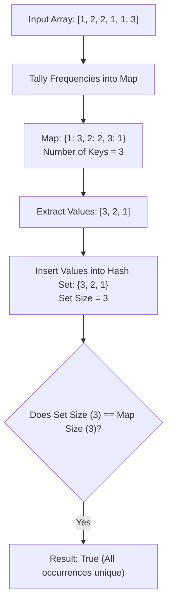

# Guided Example: Unique Number of Occurrences

## 1. Problem Essence & Algorithmic Mental Model

Given an array of integers $\text{arr}$, we are asked to determine whether the occurrence frequency of each distinct value in the array is unique. That is, no two distinct integers in the array may appear the exact same number of times. We return `true` if all frequency counts are distinct, and `false` otherwise.

Consider two illustrative inputs:
- In $\text{arr} = [1, 2, 2, 1, 1, 3]$:
  - Value $1$ occurs 3 times.
  - Value $2$ occurs 2 times.
  - Value $3$ occurs 1 time.
  The multiset of frequencies is $\{3, 2, 1\}$. Every frequency is distinct ($3 \neq 2 \neq 1$), so the output is `true`.
- In $\text{arr} = [1, 2]$:
  - Value $1$ occurs 1 time.
  - Value $2$ occurs 1 time.
  The frequency $1$ is shared by two distinct elements, violating uniqueness, so the output is `false`.

The problem translates directly into testing for **Function Injectivity in Set Theory**:
1. **Multiset Aggregation**: Construct the empirical frequency distribution mapping each distinct value $x$ to its occurrence count $f(x)$.
2. **Injectivity Criterion**: The function $f: \text{Domain} \to \mathbb{Z}^+$ is injective if and only if no two distinct inputs produce identical outputs:
   $$x_1 \neq x_2 \implies f(x_1) \neq f(x_2)$$
3. **Cardinality Verification**: For finite sets, a function is injective if and only if the cardinality of its image equals the cardinality of its domain:
   $$|\{f(x) \mid x \in \text{Domain}\}| = |\text{Domain}|$$

We count frequencies into a hash table or direct-address array, extract the list of frequencies into a hash set to deduplicate them, and verify if the set size equals the number of distinct elements.

```
Array: [1, 2, 2, 1, 1, 3]

Step 1: Compute Frequencies (Domain -> Counts)
1 -> 3
2 -> 2
3 -> 1
Domain Size = 3 distinct numbers

Step 2: Collect Frequency Image
Frequencies: {3, 2, 1}
Image Size = 3 distinct counts

Domain Size (3) == Image Size (3)  ===>  Output: TRUE (All counts unique!)
```

---

## 2. Mathematical Formalism & Invariants

Let $A = [a_0, a_1, \dots, a_{n-1}]$ be an array of $n$ integers.
Define the distinct universe of elements:
$$\mathcal{U} = \text{support}(A) = \{x \in \mathbb{Z} \mid \exists i, \ a_i = x\}$$

### Frequency Mapping
Define the occurrence counting function $f: \mathcal{U} \to \{1, 2, \dots, n\}$:
$$f(x) = \sum_{i=0}^{n-1} [a_i = x]$$

### Image Set Definition
The image of the frequency mapping is the set of observed occurrence counts:
$$\text{Image}(f) = \{f(x) \mid x \in \mathcal{U}\}$$

### Injectivity Invariant & Pigeonhole Principle
The condition of unique occurrences requires:
$$\forall u, v \in \mathcal{U}, \quad u \neq v \implies f(u) \neq f(v)$$

By the Pigeonhole Principle, if any two elements share the identical count ($f(u) = f(v)$ for $u \neq v$), the image set cardinality collapses strictly below the domain cardinality:
$$|\text{Image}(f)| < |\mathcal{U}|$$
Conversely, if every element has a distinct count, every element contributes a unique count to the image:
$$|\text{Image}(f)| = |\mathcal{U}|$$

The boolean decision predicate is therefore:
$$\text{IsUnique}(A) = (|\text{Image}(f)| = |\mathcal{U}|)$$

---

## 3. Concrete Example Execution & State Evolution

Consider the sequence:
$$\text{arr} = [1, 2, 2, 1, 1, 3]$$
Length $n = 6$.

### Frequency Counting Trace

| Array Index $i$ | Element $a_i$ | Frequency Map Mutation | Distinct Numbers Discovered |
|---|---|---|---|
| 0 | 1 | $\{1: 1\}$ | $\{1\}$ |
| 1 | 2 | $\{1: 1, 2: 1\}$ | $\{1, 2\}$ |
| 2 | 2 | $\{1: 1, 2: 2\}$ | $\{1, 2\}$ |
| 3 | 1 | $\{1: 2, 2: 2\}$ | $\{1, 2\}$ |
| 4 | 1 | $\{1: 3, 2: 2\}$ | $\{1, 2\}$ |
| 5 | 3 | $\{1: 3, 2: 2, 3: 1\}$ | $\{1, 2, 3\}$ |

Domain cardinality: $|\mathcal{U}| = 3$.



### Contrast Trace with Colliding Frequencies
Consider $\text{arr} = [1, 2]$ of length $n = 2$:

| Value $x$ | Frequency $f(x)$ | Insertion into Frequency Set | Set Size | Collision Detected? |
|---|---|---|---|---|
| 1 | 1 | Insert 1 $\to \{1\}$ | 1 | No |
| 2 | 1 | Insert 1 $\to \{1\}$ (Duplicate!) | 1 | **Yes! Duplicate 1** |

Here $|\mathcal{U}| = 2$, but $|\text{Image}(f)| = 1$.
$1 \neq 2 \implies$ Output is **False**.

---

## 4. Multi-Approach Comparison & Trade-Offs

| Metric / Dimension | Quadratic Pairwise Frequency Scan | Sort Frequencies and Scan Adjacents | Hash Map + Hash Set (Optimal) |
|---|---|---|---|
| **Strategy** | For each $u$, count $u$; compare with all other counts | Tally in map, sort counts, check $c_i == c_{i+1}$ | Tally in map, convert values to set |
| **Time Complexity** | $\mathcal{O}(N^2)$ | $\mathcal{O}(N + U \log U)$ | $\mathcal{O}(N)$ strictly linear |
| **Space Complexity** | $\mathcal{O}(1)$ | $\mathcal{O}(U)$ frequency vector | $\mathcal{O}(U)$ hash table & set |
| **Early Termination** | Slow | After sorting | Instant if frequency seen in set |
| **Implementation Complexity**| Nested loops | Moderate | 2 lines of high-level code |

```
Execution Comparison:

Pairwise Method:
For each element: Count occurrences across full array, compare with other counts -> O(N^2)

Hash Set Method (Optimal):
[Single Pass Tally] ===> [Extract Frequencies] ===> [len(set) == len(map)] -> O(N) Instant!
```

---

## 5. Algorithmic Edge Cases & Boundary Analysis

| Scenario | Input Example | Expected Output | Behavioral Verification |
|---|---|---|---|
| **Single Element Array** | `[100]` | `true` | Exactly 1 distinct element with count 1. Set size 1 equals map size 1. |
| **All Elements Identical** | `[4, 4, 4, 4]` | `true` | Exactly 1 distinct element (4) with count 4. Set size 1 equals map size 1. |
| **Two Elements with Count 1** | `[1, 2]` | `false` | Two elements sharing frequency 1; set size 1 does not equal map size 2. |
| **Negative Values** | `[-3, 0, 1, -3, 1, 1]` | `true` | Frequencies: `{-3: 2, 0: 1, 1: 3}`. Frequencies $\{2, 1, 3\}$ are unique. |
| **Large Cardinality Uniform Counts**| `[1, 2, 3, 4, 5]` | `false` | Five elements all with count 1; set size 1, map size 5. |

---

## 6. Mathematical Verification & Complexity Derivation

Let $N = |\text{arr}|$ be the total number of elements, and let $U = |\mathcal{U}|$ be the number of distinct integers ($1 \le U \le N$).

### Execution Steps:
1. **Frequency Tallying**:
   - We scan through the $N$ integers from index $0$ to $N-1$.
   - Inserting or incrementing an entry in a hash map takes $\mathcal{O}(1)$ average time.
   - Total tallying time: $\mathcal{O}(N)$.
2. **Frequency Set Construction**:
   - We iterate over the $U$ frequency counts extracted from the map.
   - Inserting each count into a hash set takes $\mathcal{O}(1)$ average time.
   - Total set insertion time: $\mathcal{O}(U)$.
3. **Cardinality Comparison**:
   - Comparing $|\text{set}| == |\text{map}|$ takes $\mathcal{O}(1)$ operations.

### Total Asymptotics:
- **Total Time Complexity:** $\mathcal{O}(N + U) = \mathcal{O}(N)$ strictly linear time.
- **Total Auxiliary Space Complexity:** $\mathcal{O}(U) \le \mathcal{O}(N)$ memory to store the frequency map and uniqueness set.

---

## 7. Synthesis & Strategic Takeaways

1. **Injectivity via Set Cardinality**: To verify that a function or mapping produces distinct outputs across a finite domain, compare the size of the deduplicated output set against the domain size ($|\text{set}(\text{values})| == |\text{keys}|$).
2. **Multiset Reduction Pipeline**: Transforming an raw sequence into a frequency distribution compresses the problem from token coordinates into statistical multiplicities, discarding irrelevant positional sequence.
3. **Early Exit Optimization**: When inserting frequency counts into a hash set one by one, if an insertion ever encounters a pre-existing value, the algorithm can short-circuit and return `false` immediately without evaluating remaining elements.
