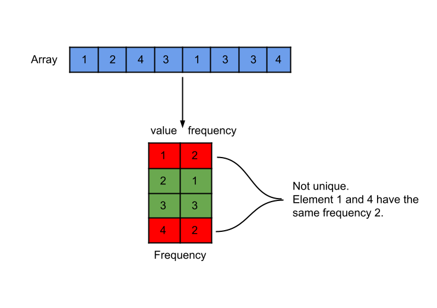
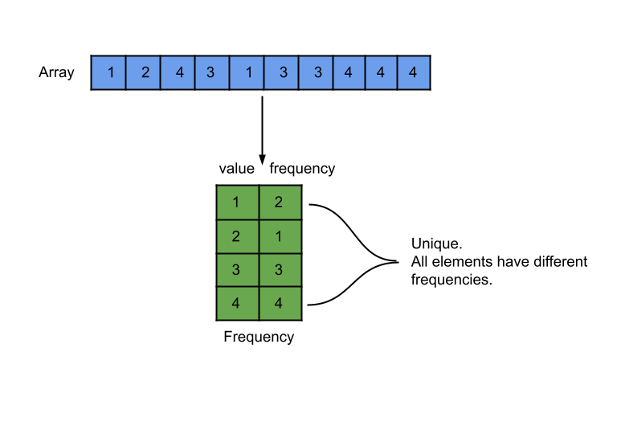

## Solution Article

---

### Approach 1: Counting Sort

#### Intuition

We are given an integer array, and we need to check if the frequency of each element in the array is unique or not.





We can make use of the fact that the integers in the array will always be in the range `[-1000, 1000]`. This range is of length `2000`, and therefore we need an array of the same size to store the frequency of each element.

Counting sort is a sorting technique that is based on the keys between specific ranges.
In this technique, we perform sorting by counting objects having distinct key values like hashing.

Now we have the frequencies of all elements of array `arr` in an array of size `2000`, and we need to check if all non-zero elements in this array are unique or not (i.e. all frequencies are unique or not). To check this, we will sort the array and then can check if any two consecutive elements are the same or not.

Note: The array `arr`'s elements could be negative as well. Hence we will add $K = 1000$ to each element to make it non-negative.

#### Algorithm

1. Store the frequencies of elements of array `arr` in the array `freq`.
2. Sort the array `freq` in ascending order.
3. Iterate over the array `freq`, and for each non-zero value, check if the next value is the same. If yes, return `false`.
4. We can return `true` after iterating over the whole array.

#### Implementation

```cpp
class Solution {
public:
    // Constant to make elements non-negative.
    static constexpr int K = 1000;

    bool uniqueOccurrences(vector<int>& arr) {
        vector<int> freq(2 * K  + 1);

        // Store the frequency of elements in the unordered map.
        for (int num : arr) {
            freq[num + K]++;
        }

        // Sort the frequency count.
        sort(freq.begin(), freq.end());

        // If the adjacent freq count is equal, then the freq count isn't unique.
        for (int i = 0; i < 2 * K; i++) {
            if (freq[i] && freq[i] == freq[i + 1]) {
                return false;
            }
        }

        // If all the elements are traversed, it implies frequency counts are unique.
        return true;
    }
};
```

#### Complexity Analysis

Here, $N$ is the size of array `arr`, and $K$ is equal to `1000`.

* Time complexity: $O(N + K\log K)$.

  We first iterate over the array `arr` to store the frequency in the array `freq`. This takes $O(N)$ time. Then we sort the array `freq` that has a size of $2K = 2000$. Hence it takes $O(2K \log 2K)$ time that can be simplified to $O(K \log K)$. In the end, we iterate over the array `freq` to check duplicate values, and this takes $O(2K)$ time. Therefore the total time complexity is equal to $O(N + K\log K)$.

* Space complexity: $O(K)$.

  The only space required is the frequency array `freq` of size `2K` to store the frequency of all the elements. Thus, the total space complexity is equal to $O(K)$.

---

### Approach 2: HashMap & HashSet

#### Intuition

If we have the frequencies of all elements, we can put them in a hash set. If the size of the hash set is equal to the number of elements, it implies that the frequencies are unique. Hence, we will find the frequencies of all elements in a hash map and then put them in a hash set.

#### Algorithm

1. Store the frequencies of elements in the array `arr` in the hash map `freq`.
2. Iterate over the hash map `freq` and insert the frequencies of all unique elements of array `arr` in the hash set `freqSet`.
3. Return `true` if the size of hash set `freqSet` is equal to the size of hash map `freq`, otherwise return `false`.

#### Implementation

```cpp
class Solution {
public:
    bool uniqueOccurrences(vector<int>& arr) {
        // Store the frequency of elements in the unordered map.
        unordered_map<int, int> freq;
        for (int num : arr) {
            freq[num]++;
        }

        // Store the frequency count of elements in the unordered set.
        unordered_set<int> freqSet;
        for (auto [key, value] : freq) {
            freqSet.insert(value);
        }

        // If the set size is equal to the map size,
        // It implies frequency counts are unique.
        return freqSet.size() == freq.size();
    }
};
```

#### Complexity Analysis

Here, $N$ is the size of array `arr`.

* Time complexity: $O(N)$.

  We iterate over the array `arr` to find the frequency and store them in the hash map `freq`. Then, we insert these frequencies in the hash set `freqSet`, which has the insertion complexity of $O(1)$. Hence, the total time complexity is equal to $O(N)$.

* Space complexity: $O(N)$.

  We are storing the $N$ frequencies in the hash map `freq` that takes $O(1)$ space for each element. We also store the frequency count in the hash set. Therefore, the total space complexity is equal to $O(N)$.

---