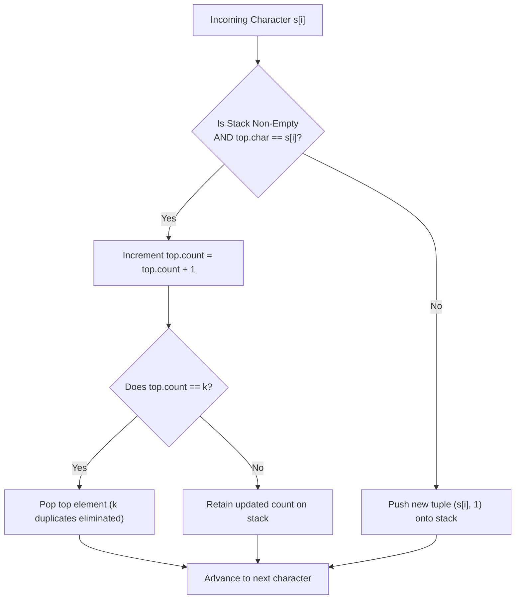

# Guided Example: Remove All Adjacent Duplicates in String II

## 1. Problem Essence & Algorithmic Mental Model

Given a string $s$ and a positive integer $k \ge 2$, a $k$-duplicate removal consists of locating $k$ adjacent, identical characters in $s$ and eliminating them. When these characters are excised, the remaining left and right substrings snap together, which can cause previously separated identical characters to become adjacent and potentially form a new run of $k$ identical characters. This process repeats recursively until no run of $k$ adjacent, identical characters remains.

Consider the string $s = \text{"deeedbbcccbdaa"}$ with $k = 3$:
1. Erasing `"eee"` leaves `"ddbbcccbdaa"`.
2. Erasing `"ccc"` leaves `"ddbbbdaa"`.
3. Erasing `"bbb"` brings the adjacent `'d'`s together, forming `"dddaa"`.
4. Erasing `"ddd"` brings the remaining `'a'`s together, leaving `"aa"`.
5. No further runs of 3 exist, yielding the final irreducible string `"aa"`.

A naive simulation scans the string, searches for runs of length $k$, deletes them, and restarts the scan from the beginning. In the worst case (such as nested cancellations $\sigma_1^k \sigma_2^k \dots$), this repeated string compaction requires $\mathcal{O}(N^2 / k)$ time, which is unacceptably slow for $N = 10^5$.

The optimal paradigm is an **Explicit Stack with Run-Length Encoding**:
Instead of storing individual characters on a stack and repeatedly popping $k$ items backward, the stack maintains condensed tuples:
$$(\text{character}, \text{consecutive\_count})$$
When a new character $c$ arrives:
- If the stack is non-empty and the top tuple matches character $c$, we increment its consecutive count. If the count reaches $k$, the run is complete and we immediately pop the tuple off the stack.
- If the stack is empty or the top character differs from $c$, we push a new tuple $(c, 1)$ onto the stack.
This processes each character in strictly $\mathcal{O}(1)$ time, achieving a globally linear $\mathcal{O}(N)$ runtime with zero redundant re-evaluations.

```
Input: "deeedbbcccbdaa", k = 3

Stack Evolution:
Push 'd' -> [(d, 1)]
Push 'e' -> [(d, 1), (e, 1)]
Push 'e' -> [(d, 1), (e, 2)]
Push 'e' -> [(d, 1), (e, 3)] ==> Count reached k=3! POP! -> [(d, 1)]
Push 'e' was cancelled! 'd' is now exposed at top!
```

---

## 2. Mathematical Formalism & Invariants

Let $S = [s_0, s_1, \dots, s_{n-1}]$ be the input character sequence of length $n$, and let $k \ge 2$.
Define the stack $\mathcal{K}$ as an ordered sequence of pairs:
$$\mathcal{K} = \big[ (c_1, v_1), (c_2, v_2), \dots, (c_m, v_m) \big] \in (\Sigma \times \{1, 2, \dots, k-1\})^*$$

### Stack Invariants
At every discrete step $i \in [0, n]$:
1. **Adjacent Character Alternation**:
   No two adjacent records on the stack share the same character:
   $$\forall j \in \{1, \dots, m-1\}, \quad c_j \neq c_{j+1}$$
2. **Strict Count Bound**:
   Every active count is strictly strictly less than $k$:
   $$\forall j \in \{1, \dots, m\}, \quad 1 \le v_j \le k - 1$$
3. **Prefix Irreducibility**:
   The string materialized by expanding the stack $\bigoplus_{j=1}^m c_j^{v_j}$ contains zero contiguous runs of length $k$.

### Transition Function
For incoming character $s_i \in \Sigma$:
- **Case 1: Stack Empty**:
  Push $(s_i, 1)$.
- **Case 2: Match Top Character ($s_i = c_m$)**:
  - If $v_m + 1 = k$: Pop top entry $(c_m, v_m)$ from stack.
  - If $v_m + 1 < k$: Update top entry to $(c_m, v_m + 1)$.
- **Case 3: Distinct from Top Character ($s_i \neq c_m$)**:
  Push $(s_i, 1)$.

Each transition preserves all three invariants unconditionally.

---

## 3. Concrete Example Execution & State Evolution

Consider the sequence $s = \text{"deeedbbcccbdaa"}$ with $k = 3$.
Length $n = 14$.

### Detailed Stack Simulation Trace

| Step $i$ | Incoming Char $s_i$ | Stack Before Action | Matching Top? | New Top Count | Action Taken | Stack After Action |
|---|---|---|---|---|---|---|
| 0 | `'d'` | `[]` | No (empty) | 1 | Push `('d', 1)` | `[('d', 1)]` |
| 1 | `'e'` | `[('d', 1)]` | No (`'e' != 'd'`) | 1 | Push `('e', 1)` | `[('d', 1), ('e', 1)]` |
| 2 | `'e'` | `[('d', 1), ('e', 1)]` | Yes (`'e' == 'e'`) | 2 | Increment to 2 | `[('d', 1), ('e', 2)]` |
| 3 | `'e'` | `[('d', 1), ('e', 2)]` | Yes (`'e' == 'e'`) | 3 | $3 = k \implies$ **Pop!** | `[('d', 1)]` |
| 4 | `'d'` | `[('d', 1)]` | Yes (`'d' == 'd'`) | 2 | Increment to 2 | `[('d', 2)]` |
| 5 | `'b'` | `[('d', 2)]` | No (`'b' != 'd'`) | 1 | Push `('b', 1)` | `[('d', 2), ('b', 1)]` |
| 6 | `'b'` | `[('d', 2), ('b', 1)]` | Yes (`'b' == 'b'`) | 2 | Increment to 2 | `[('d', 2), ('b', 2)]` |
| 7 | `'c'` | `[('d', 2), ('b', 2)]` | No (`'c' != 'b'`) | 1 | Push `('c', 1)` | `[('d', 2), ('b', 2), ('c', 1)]` |
| 8 | `'c'` | `[..., ('c', 1)]` | Yes (`'c' == 'c'`) | 2 | Increment to 2 | `[('d', 2), ('b', 2), ('c', 2)]` |
| 9 | `'c'` | `[..., ('c', 2)]` | Yes (`'c' == 'c'`) | 3 | $3 = k \implies$ **Pop!** | `[('d', 2), ('b', 2)]` |
| 10 | `'b'` | `[('d', 2), ('b', 2)]` | Yes (`'b' == 'b'`) | 3 | $3 = k \implies$ **Pop!** | `[('d', 2)]` |
| 11 | `'d'` | `[('d', 2)]` | Yes (`'d' == 'd'`) | 3 | $3 = k \implies$ **Pop!** | `[]` |
| 12 | `'a'` | `[]` | No (empty) | 1 | Push `('a', 1)` | `[('a', 1)]` |
| 13 | `'a'` | `[('a', 1)]` | Yes (`'a' == 'a'`) | 2 | Increment to 2 | `[('a', 2)]` |



### Materialization of Final String:
Final stack contents: `[('a', 2)]`.
Expanding records: `'a' * 2 = \text{"aa"}`.

---

## 4. Multi-Approach Comparison & Trade-Offs

| Metric / Dimension | Repeated String Rescanning | Raw Character Stack | Run-Length Encoded Stack (Optimal) |
|---|---|---|---|
| **Data Structure** | Mutable string / Array buffer | Standard stack of characters | Stack of `(character, count)` pairs |
| **Worst-Case Time** | $\mathcal{O}(N^2 / k)$ | $\mathcal{O}(N \cdot k)$ (popping $k$ elements) | $\mathcal{O}(N)$ strictly linear |
| **Memory Footprint** | $\mathcal{O}(N)$ string allocations | $\mathcal{O}(N)$ characters | $\mathcal{O}(N)$ compressed pairs |
| **Cancellation Cost**| $\mathcal{O}(N)$ string slice copies | $k$ sequential pop operations | Exactly $1$ pop operation ($\mathcal{O}(1)$) |
| **Implementation Complexity**| String index slicing | Backtracking pop loop | Clean scalar count increment |

```
Cancellation Cost Comparison for k = 1000:
- Raw Stack: Must pop 1,000 times to delete one run.
- RLE Stack: Increments counter to 1,000, then executes 1 pop! (1000x fewer memory writes)
```

---

## 5. Algorithmic Edge Cases & Boundary Analysis

| Scenario | Input Condition | Expected Result | System Invariant |
|---|---|---|---|
| **Complete String Annihilation** | `s = "aaabbb", k = 3` | `""` (empty string) | Both runs cancel out completely; stack terminates empty. |
| **Zero Reductions Possible** | `s = "abcdef", k = 2` | `"abcdef"` | Every character distinct; all pushed as count 1; full string returned. |
| **Cascading Domino Deletion** | Nested wrappers e.g. `s = "abbba", k = 3` | `""` | Inner `'b'`s pop, exposing `'a'`s which merge and pop. |
| **$k$ Greater Than String Length**| $|s| < k$ | Returns $s$ unchanged | No run can ever reach length $k$; all characters retained. |
| **Single Character String** | `s = "a", k = 2` | `"a"` | Count 1 never reaches $k=2$; returned unchanged. |

---

## 6. Mathematical Verification & Complexity Derivation

Let $N = |s|$ be the total number of characters in the input string.

### Processing Analysis:
1. **Per-Character Ingestion**:
   - Each character $s_i$ is examined exactly once in the main loop ($N$ iterations).
   - In each iteration, inspecting the stack top takes $\mathcal{O}(1)$ time.
   - Performing a count increment, tuple push, or tuple pop takes $\mathcal{O}(1)$ time.
   - Every character is pushed at most once and popped at most once.
   - Total loop time: $\mathcal{O}(N)$.
2. **String Reconstruction**:
   - The final stack contains at most $N$ compressed pairs.
   - Expanding each pair $(c_j, v_j)$ into $v_j$ characters creates a string of total length $L \le N$.
   - Reconstruction runs in $\mathcal{O}(N)$ time.

### Total Asymptotics:
- **Total Time Complexity:** $\mathcal{O}(N)$ strictly optimal linear time, completely independent of the magnitude of $k$.
- **Total Auxiliary Space Complexity:** $\mathcal{O}(N)$ auxiliary memory to store the run-length stack.

---

## 7. Synthesis & Strategic Takeaways

1. **Run-Length Compression on Stacks**: Instead of pushing individual duplicate elements onto a stack, condensing identical consecutive tokens into a count accumulator turns $\mathcal{O}(k)$ batch deletions into instantaneous $\mathcal{O}(1)$ pop operations.
2. **The Snapping Boundary Pattern**: Whenever deleting an interior contiguous segment causes surrounding elements to touch, a stack naturally models the interaction: popping an interior entry immediately exposes its former predecessor at the top of the stack.
3. **Invariance of Irreducible Prefixes**: At all times, the stack represents the fully reduced, canonical form of the prefix processed so far. Incoming characters only interact with the active tail, preserving global reduction without backtracking.
