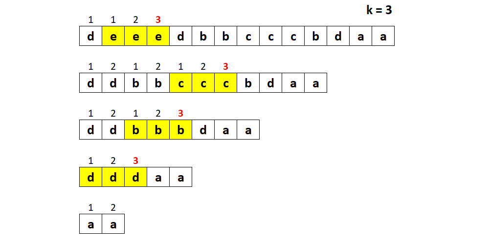
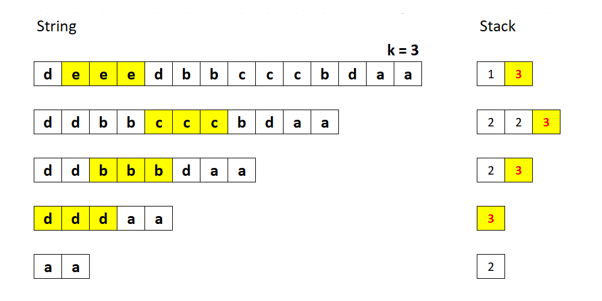
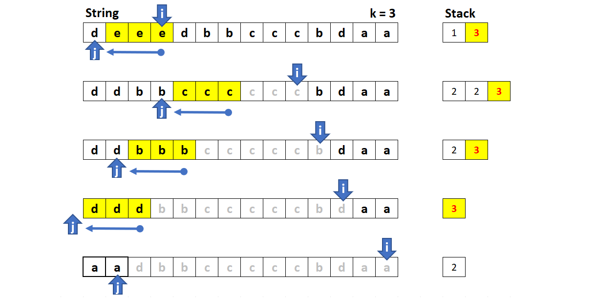

[TOC]

## Solution

---

### Approach 1: Brute Force

We can do exactly what the problem asks: count repeating adjacent letters and remove them when the count reaches `k`. Then, we do it again until there is nothing to remove.



**Algorithm**

1. Remember the length of the string.

2. Iterate through the string:

- If the current character is the same as the one before, increase the count.

- Otherwise, reset the count to `1`.

- If the count equals `k`,  erase last `k` characters.

3. If the length of the string was changed, repeat starting from the first step.

```cpp
string removeDuplicates(string s, int k) {
    int length = -1;
    while (length != s.size()) {
        length = s.size();
        for (int i = 0, count = 1; i < s.size(); ++i) {
            if (i == 0 || s[i] != s[i - 1]) {
                count = 1;
            } else if (++count == k) {
                s.erase(i - k + 1, k);
                break;
            }
        }
    }
    return s;
}
```

**Complexity Analysis**

- Time complexity: $\mathcal{O}(n^2 / k)$, where $n$ is a string length. We scan the string no more than $n / k$ times.

- Space complexity: $\mathcal{O}(1)$. A copy of a string may be created in some languages, however, the algorithm itself only uses the current string.

---

### Approach 2: Memoise Count

If you observe how the count changes in the approach above, you may have an idea to store it for each character. That way, we do not have to start from the beginning each time we remove a substring. This approach will give us linear time complexity, and the trade-off is the extra memory to store counts.

**Algorithm**

1. Initialize `counts` array of size `n`.

2. Iterate through the string:

- If the current character is the same as the one before, set $\text{counts}[i]$ to $counts[i - 1] + 1$.

- Otherwise, set $\text{counts}[i]$ to `1`.

- If $\text{counts}[i]$ equals `k`,  erase last `k` characters and decrease `i` by `k`.

```cpp
string removeDuplicates(string s, int k) {
    vector<int> count(s.size());
    for (int i = 0; i < s.size(); ++i) {
        if (i == 0 || s[i] != s[i - 1]) {
            count[i] = 1;
        } else {
            count[i] = count[i - 1] + 1;
            if (count[i] == k) {
                s.erase(i - k + 1, k);
                i = i - k;
            }
        };
    }
    return s;
}
```

**Complexity Analysis**

- Time complexity: $\mathcal{O}(n)$, where $n$ is a string length. We process each character in the string once.

- Space complexity: $\mathcal{O}(n)$ to store the count for each character.

---

### Approach 3: Stack

Instead of storing counts for each character, we can use a stack. When a character does not match the previous one, we push `1` to the stack. Otherwise, we increment the count on the top of the stack.



**Algorithm**

1. Iterate through the string:

- If the current character is the same as the one before, increment the count on the top of the stack.

- Otherwise, push `1` to the stack.

- If the count on the top of the stack equals `k`, erase last `k` characters and pop from the stack.

> Note that, since `Integer` is immutable in Java, we need to pop the value first, increment it, and then push it back (if it's less than `k`).

```cpp
string removeDuplicates(string s, int k) {
    stack<int> counts;
    for (int i = 0; i < s.size(); ++i) {
        if (i == 0 || s[i] != s[i - 1]) {
            counts.push(1);
        } else if (++counts.top() == k) {
            counts.pop();
            s.erase(i - k + 1, k);
            i = i - k;
        }
    }
    return s;
}
```

**Complexity Analysis** <a name="approach3complexity"></a>

- Time complexity: $\mathcal{O}(n)$, where $n$ is a string length. We process each character in the string once.

- Space complexity: $\mathcal{O}(n)$ for the stack.

---
### Approach 4: Stack with Reconstruction

If we store both the count and the character in the stack, we do not have to modify the string. Instead, we can reconstruct the result from characters and counts in the stack.

**Algorithm**

1. Iterate through the string:

- If the current character is the same as on the top of the stack, increment the count.

- Otherwise, push `1` and the current character to the stack.

- If the count on the top of the stack equals `k`, pop from the stack.

2. Build the result string using characters and counts in the stack.

```cpp
string removeDuplicates(string s, int k) {
    vector<pair<int, char>> counts;
    for (int i = 0; i < s.size(); ++i) {
        if (counts.empty() || s[i] != counts.back().second) {
            counts.push_back({ 1, s[i] });
        } else if (++counts.back().first == k) {
            counts.pop_back();
        }
    }
    s = "";
    for (auto &p : counts) {
        s += string(p.first, p.second);
    }
    return s;
}
```

**Complexity Analysis**

- Same as for [approach 3](#approach3complexity) above.

---

### Approach 5: Two Pointers

This method was proposed by @[lee215](https://leetcode.com/lee215/), and we can use it to optimize string operations in approaches 2 and 3. Here, we copy characters within the same string using the fast and slow pointers. Each time we need to erase `k` characters, we just move the slow pointer `k` positions back.



**Algorithm**

1. Initialize the slow pointer (`j`) with zero.

2. Move the fast pointer (`i`) through the string:

- Copy s[i] into s[j].

- If $s[j]$ is the same as $s[j - 1]$, increment the count on the top of the stack.

- Otherwise, push `1` to the stack.

- If the count equals `k`,  decrease `j` by `k` and pop from the stack.

3. Return `j` first characters of the string.

```cpp
string removeDuplicates(string s, int k) {
    auto j = 0;
    stack<int> counts;
    for (auto i = 0; i < s.size(); ++i, ++j) {
        s[j] = s[i];
        if (j == 0 || s[j] != s[j - 1]) {
            counts.push(1);
        } else if (++counts.top() == k) {
            counts.pop();
            j -= k;
        }
    }
    return s.substr(0, j);
}
```

**Complexity Analysis**

- Same as for [approach 3](#approach3complexity) above.