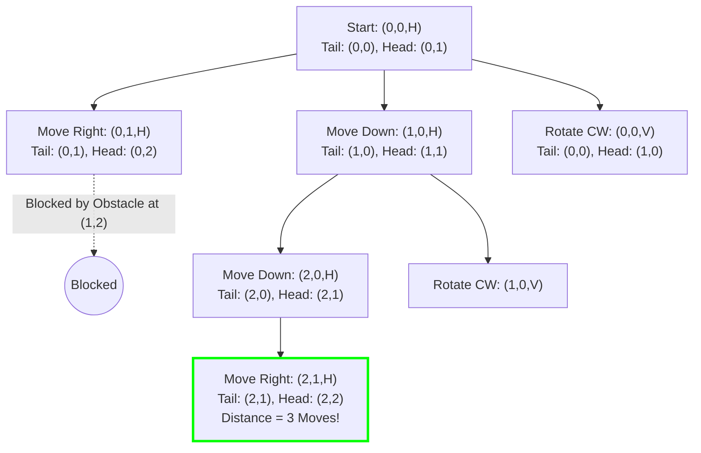

# Guided Example: Minimum Moves to Reach Target with Rotations

## 1. Problem Essence & Algorithmic Mental Model

We are given an $n \times n$ grid containing passable empty cells ($0$) and blocked obstacle cells ($1$). A 2-cell long snake begins in the top-left corner aligned horizontally, with its tail at coordinate $(0, 0)$ and its head at $(0, 1)$. Our objective is to determine the minimum number of valid moves required to navigate the snake to the bottom-right corner in a horizontal alignment—tail at $(n-1, n-2)$ and head at $(n-1, n-1)$. If the destination cannot be reached, we return $-1$.

The snake can perform four distinct geometric maneuvers, provided all affected cells lie strictly within the grid boundaries and contain no obstacles ($0$):
1. **Move Right**: Translate both tail and head one column to the right.
2. **Move Down**: Translate both tail and head one row downward.
3. **Rotate Clockwise (Horizontal $\to$ Vertical)**: Pivot around the tail $(r, c)$. The tail remains fixed while the head rotates from $(r, c+1)$ to $(r+1, c)$. This rotation requires that both the destination cell $(r+1, c)$ **and** the sweep-clearance cell $(r+1, c+1)$ are obstacle-free.
4. **Rotate Counterclockwise (Vertical $\to$ Horizontal)**: Pivot around the tail $(r, c)$. The tail remains fixed while the head rotates from $(r+1, c)$ to $(r, c+1)$. This rotation requires that both the destination cell $(r, c+1)$ **and** the sweep-clearance cell $(r+1, c+1)$ are obstacle-free.

Because every move incurs an identical uniform cost of $1$, finding the minimum number of moves is a **Shortest Path Problem on an Unweighted State Graph**, solved optimally via **Breadth-First Search (BFS)**.

The critical design insight is **State Space Condensation**:
A 2-cell snake does not require tracking two independent coordinates. Its complete geometric state is uniquely defined by a 3-tuple:
$$(r, c, \text{orientation}) \in \{0, \dots, n-1\}^2 \times \{\text{Horizontal}, \text{Vertical}\}$$
where $(r, c)$ designates the coordinates of the tail. For an $n \times n$ grid, the entire state graph comprises at most $2n^2$ states, allowing BFS to explore the configuration space in milliseconds.

```
Rotation Sweep Clearance Invariant:

Horizontal -> Vertical (Clockwise):
[ Tail (r,c) ] [ Head (r,c+1) ]
[ Dest (r+1,c) ] [ Clearance (r+1,c+1) ]  <-- BOTH bottom cells must be 0!

Vertical -> Horizontal (Counterclockwise):
[ Tail (r,c) ]   [ Dest (r,c+1) ]
[ Head (r+1,c) ] [ Clearance (r+1,c+1) ]  <-- BOTH right cells must be 0!
```

---

## 2. Mathematical Formalism & Invariants

Let the grid be $G \in \{0, 1\}^{n \times n}$.
Define the state space:
$$\mathcal{S} = \{(r, c, \theta) \mid 0 \le r < n, \ 0 \le c < n, \ \theta \in \{0, 1\}\}$$
where $\theta = 0$ indicates a horizontal snake (occupying tail $(r, c)$ and head $(r, c+1)$), and $\theta = 1$ indicates a vertical snake (occupying tail $(r, c)$ and head $(r+1, c)$).

### Initial and Target States
- Start State: $s_0 = (0, 0, 0)$
- Target State: $s_{\text{target}} = (n-1, n-2, 0)$

### Admissibility Invariant
A state $(r, c, \theta)$ is valid if and only if both body cells are in-bounds and free:
$$\begin{aligned}
\theta = 0 &\implies c + 1 < n \land G[r][c] = 0 \land G[r][c+1] = 0 \\
\theta = 1 &\implies r + 1 < n \land G[r][c] = 0 \land G[r+1][c] = 0
\end{aligned}$$

### Transition Rules $\mathcal{T}(r, c, \theta)$
From state $(r, c, \theta)$:
1. **Horizontal ($\theta = 0$)**:
   - *Right*: $(r, c+1, 0)$ if $c + 2 < n \land G[r][c+2] = 0$.
   - *Down*: $(r+1, c, 0)$ if $r + 1 < n \land G[r+1][c] = 0 \land G[r+1][c+1] = 0$.
   - *Clockwise Rotate*: $(r, c, 1)$ if $r + 1 < n \land G[r+1][c] = 0 \land G[r+1][c+1] = 0$.
2. **Vertical ($\theta = 1$)**:
   - *Down*: $(r+1, c, 1)$ if $r + 2 < n \land G[r+2][c] = 0$.
   - *Right*: $(r, c+1, 1)$ if $c + 1 < n \land G[r][c+1] = 0 \land G[r+1][c+1] = 0$.
   - *Counterclockwise Rotate*: $(r, c, 0)$ if $c + 1 < n \land G[r][c+1] = 0 \land G[r+1][c+1] = 0$.

Notice the elegant symmetry: rotating and translating across the perpendicular axis share identical $2 \times 2$ obstacle-free clearance preconditions!

---

## 3. Concrete Example Execution & State Evolution

Consider the $3 \times 3$ grid ($n = 3$):
$$\begin{bmatrix} 0 & 0 & 0 \\ 0 & 0 & 1 \\ 0 & 0 & 0 \end{bmatrix}$$
Start state: $(0, 0, 0)$ (tail at $(0,0)$, head at $(0,1)$).
Target: $(2, 1, 0)$ (tail at $(2,1)$, head at $(2,2)$).

### BFS State Graph Exploration Trace

| Step Depth | Dequeued State $(r, c, \theta)$ | Snake Body Cells | Valid Candidate Moves Evaluated | Enqueued Next States | Target Hit? |
|---|---|---|---|---|---|
| Level 0 | $(0, 0, 0)$ | $[(0,0), (0,1)]$ | Move Right, Move Down, Clockwise Rotate | $(0, 1, 0), (1, 0, 0), (0, 0, 1)$ | No |
| Level 1 | $(0, 1, 0)$ | $[(0,1), (0,2)]$ | Down blocked by $G[1][2]=1$; Rotate blocked | None | No |
| Level 1 | $(1, 0, 0)$ | $[(1,0), (1,1)]$ | Right blocked ($G[1][2]=1$); Down, Rotate | $(2, 0, 0), (1, 0, 1)$ | No |
| Level 1 | $(0, 0, 1)$ | $[(0,0), (1,0)]$ | Move Down: $(1, 0, 1)$ (already seen); Move Right | $(0, 1, 1)$ | No |
| Level 2 | $(2, 0, 0)$ | $[(2,0), (2,1)]$ | Move Right: $(2, 1, 0)$ | **$(2, 1, 0)$** | **Yes!** |



### Optimal Path Trajectory:
1. Move Down: $(0, 0, 0) \to (1, 0, 0)$ (occupies $(1,0)$ and $(1,1)$).
2. Move Down: $(1, 0, 0) \to (2, 0, 0)$ (occupies $(2,0)$ and $(2,1)$).
3. Move Right: $(2, 0, 0) \to (2, 1, 0)$ (occupies $(2,1)$ and $(2,2)$).
Total moves required = **3**.

---

## 4. Multi-Approach Comparison & Trade-Offs

| Metric / Dimension | Backtracking DFS with Path History | A* Search with Manhattan Heuristic | Breadth-First Search (BFS) (Optimal) |
|---|---|---|---|
| **Optimality Guarantee** | Requires exploring all paths | Guaranteed with admissible heuristic | Guaranteed by unweighted edge property |
| **Time Complexity** | Exponential ($\mathcal{O}(4^{N^2})$) | $\mathcal{O}(N^2 \log N)$ priority queue | $\mathcal{O}(N^2)$ optimal linear time |
| **Auxiliary Memory** | $\mathcal{O}(N^2)$ recursion stack | Priority queue overhead | $\mathcal{O}(N^2)$ flat boolean / bitset visited array |
| **State Encoding** | Storing two $(x, y)$ coordinate pairs | Complex heuristic computation | 3 integers: `(row, col, orientation)` |
| **Cycle Handling** | High risk of infinite cycles | Handled via closed set | Visited set prevents duplicate visits |

```
State Representation Efficiency:

Naive Representation:
State = (tail_row, tail_col, head_row, head_col) -> 4 integers, N^4 potential states

Condensed Representation (Optimal):
State = (tail_row, tail_col, orientation)        -> 3 integers, 2*N^2 potential states (50x smaller!)
```

---

## 5. Algorithmic Edge Cases & Boundary Analysis

| Boundary Case | Input Condition | System Behavior & Invariant |
|---|---|---|
| **Target Blocked by Obstacle** | $G[n-1][n-2] = 1$ or $G[n-1][n-1] = 1$ | Target is impossible to occupy; BFS terminates and returns $-1$. |
| **Rotation Sweep Blocked** | Destination free, but clearance cell $(r+1, c+1) = 1$ | Rotation disallowed; prevents the snake from clipping through corners. |
| **No Path Exists** | Wall of 1s separating top from bottom | Queue exhausts all reachable states; returns $-1$ cleanly. |
| **Smallest Grid ($N = 2$)** | $2 \times 2$ grid | Start state $(0,0,0)$ requires: rotate CW to $(0,0,1)$, move right to $(0,1,1)$, rotate CCW to $(1,0,0)$ (if free). |
| **Destination Reached Vertically** | Reaches bottom right, but oriented vertically | Does not trigger success; contract mandates horizontal orientation at finish. |

---

## 6. Mathematical Verification & Complexity Derivation

Let $N = n$ be the grid dimension.

### State Space Bound:
- The tail position $(r, c)$ can occupy at most $N \times N$ cells.
- The orientation $\theta \in \{0, 1\}$ has 2 possible values.
- Total vertices in state graph:
  $$|V| = 2N^2$$
- For $N = 100$, $|V| = 2 \times 10^4 = 20,000$ states.

### Edge Transitions:
- From each valid state, at most 3 transition edges are evaluated (Right, Down, Rotate).
- Total directed edges in state graph:
  $$|E| \le 3 \times |V| = 6N^2$$
- Each edge evaluation performs $\mathcal{O}(1)$ boundary and grid lookups.

### BFS Execution Cost:
- Each state enters the FIFO queue at most once and is marked in the visited set in $\mathcal{O}(1)$ time.
- Total BFS operations:
  $$\mathcal{O}(|V| + |E|) = \mathcal{O}(N^2)$$

### Complexity Summary:
- **Total Time Complexity:** $\mathcal{O}(N^2)$ optimal linear time with respect to the grid area.
- **Total Auxiliary Space Complexity:** $\mathcal{O}(N^2)$ auxiliary memory for the visited table and BFS queue.

---

## 7. Synthesis & Strategic Takeaways

1. **State Condensation for Extended Rigid Bodies**: For rigid multi-cell objects moving on a discrete grid, parameterize position using a canonical anchor (e.g. the tail) paired with an orientation enum. This bounds state-space complexity to $\mathcal{O}(N^2)$ rather than $\mathcal{O}(N^4)$.
2. **Kinematic Clearance Bounds**: Physical rotation occupies an area during movement. The requirement that both the final cell and the diagonal corner cell must be obstacle-free reflects physical 2D rotational dynamics, avoiding corner-cutting bugs.
3. **BFS as the Unweighted Geodesic Engine**: In pathfinding where every legal action (whether translation or rotation) consumes 1 turn, standard queue-based BFS guarantees finding the minimum moves without priority queue overhead.
