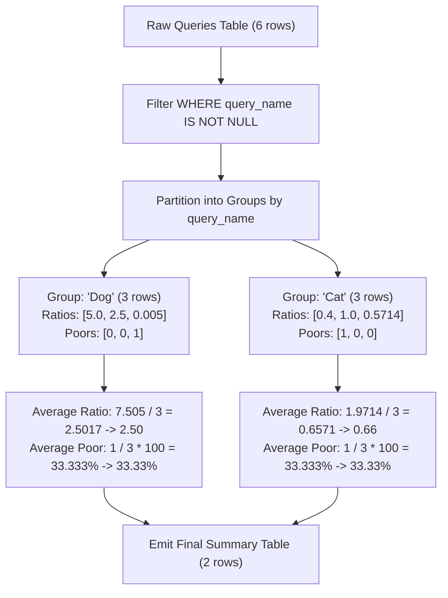

# Guided Example: Queries Quality and Percentage

## 1. Problem Essence & Algorithmic Mental Model

In information retrieval, search engine evaluation, and recommendation systems, ranking models are assessed by evaluating how prominently high-quality documents are placed within query result sets. We are given a relational table `Queries` recording search instances, with columns `query_name`, `result`, `position` (the 1-indexed rank of the result from 1 to 500), and `rating` (a quality score from 1 to 5).

Our goal is to compute two search effectiveness metrics for each distinct search term (`query_name`):
1. **Quality**: Defined as the arithmetic mean of the position-weighted score across all results returned for that query:
   $$\text{Quality} = \frac{1}{|Q|} \sum_{\rho \in Q} \frac{\rho.\text{rating}}{\rho.\text{position}}$$
   Because higher ratings at earlier positions (smaller values of `position`) produce larger ratios, this metric rewards systems that elevate relevant documents to the top.
2. **Poor Query Percentage**: Defined as the percentage of results returned for that query that received a poor rating (strictly less than 3, i.e., rating 1 or 2):
   $$\text{PoorQueryPercentage} = \left( \frac{|\{\rho \in Q \mid \rho.\text{rating} < 3\}|}{|Q|} \right) \times 100$$

Both metrics must be rounded to two decimal places. Records where `query_name` is null represent malformed requests and must be excluded from evaluation.

The optimal relational data flow is **Filtered Hash Group-By with Indicator Aggregations**:
1. **Null Exclusion**: Filter out tuples where `query_name` is null.
2. **Partitioning**: Group the remaining tuples by `query_name`.
3. **Single-Pass Mean Reduction**:
   - Compute `AVG(rating / position)` for quality.
   - Project a boolean indicator $[\text{rating} < 3] \in \{0, 1\}$ and compute its average multiplied by 100 for poor query percentage.
   - Apply 2-decimal arithmetic rounding.

```
Query "Dog":
Result 1: pos 1, rating 5 --> ratio: 5 / 1 = 5.0,  poor: 0 (rating >= 3)
Result 2: pos 2, rating 5 --> ratio: 5 / 2 = 2.5,  poor: 0 (rating >= 3)
Result 3: pos 1, rating 1 --> ratio: 1 / 1 = 1.0,  poor: 1 (rating < 3)

Calculations:
Quality = (5.0 + 2.5 + 1.0) / 3 = 8.5 / 3 = 2.833... -> 2.83
Poor Percentage = (0 + 0 + 1) / 3 * 100 = 33.333... -> 33.33%
```

---

## 2. Mathematical Formalism & Invariants

Let $\mathcal{R} = \{\rho_1, \rho_2, \dots, \rho_N\}$ be the relation of search query results:
$$\rho = (q, \text{res}, p, r) \in (\Sigma^* \cup \{\text{null}\}) \times \Sigma^* \times [1, 500] \times [1, 5]$$

### Active Relation Filter
Remove non-attributed queries:
$$\mathcal{R}^* = \{\rho \in \mathcal{R} \mid \rho.q \neq \text{null}\}$$

### Partitioning by Search Term
For each distinct query term $\kappa \in \{ \rho.q \mid \rho \in \mathcal{R}^* \}$, let the partition of associated results be:
$$Q_\kappa = \{\rho \in \mathcal{R}^* \mid \rho.q = \kappa\}$$
where $|Q_\kappa| \ge 1$.

### Metric Definitions
1. **Quality Metric**:
   $$M_{\text{qual}}(\kappa) = \text{round}\left( \frac{1}{|Q_\kappa|} \sum_{\rho \in Q_\kappa} \frac{\rho.r}{\rho.p}, \ 2 \right)$$
2. **Poor Query Indicator Function**:
   Define the characteristic indicator:
   $$\mathbb{I}_{\text{poor}}(\rho) = \begin{cases} 1 & \text{if } \rho.r < 3 \\ 0 & \text{if } \rho.r \ge 3 \end{cases}$$
3. **Poor Query Percentage**:
   $$M_{\text{poor}}(\kappa) = \text{round}\left( \left( \frac{1}{|Q_\kappa|} \sum_{\rho \in Q_\kappa} \mathbb{I}_{\text{poor}}(\rho) \right) \times 100, \ 2 \right)$$

---

## 3. Concrete Example Execution & State Evolution

Consider the input dataset:

### Queries Relation
| `query_name` | `result` | `position` | `rating` | Ratio $\frac{\text{rating}}{\text{position}}$ | Poor? ($\text{rating} < 3$) |
|---|---|---|---|---|---|
| `"Dog"` | `"Golden Retriever"` | 1 | 5 | $5 / 1 = 5.0$ | 0 (No) |
| `"Dog"` | `"German Shepherd"` | 2 | 5 | $5 / 2 = 2.5$ | 0 (No) |
| `"Dog"` | `"Mule"` | 200 | 1 | $1 / 200 = 0.005$ | 1 (Yes) |
| `"Cat"` | `"Shirazi"` | 5 | 2 | $2 / 5 = 0.4$ | 1 (Yes) |
| `"Cat"` | `"Siamese"` | 3 | 3 | $3 / 3 = 1.0$ | 0 (No) |
| `"Cat"` | `"Sphynx"` | 7 | 4 | $4 / 7 \approx 0.5714$ | 0 (No) |



### Partition Aggregation Trace

| `query_name` | Row Elements $(p, r)$ | Sum of Ratios $\sum \frac{r}{p}$ | Average Ratio | Rounded Quality | Poor Count ($\sum \mathbb{I}$) | Poor Ratio $\frac{\text{Poor}}{\lvert Q \rvert} \times 100$ | Rounded Poor % |
|---|---|---|---|---|---|---|---|
| `"Dog"` | $(1, 5), (2, 5), (200, 1)$ | $5.0 + 2.5 + 0.005 = 7.505$ | $7.505 / 3 = 2.50167$ | **2.50** | $0 + 0 + 1 = 1$ | $\frac{1}{3} \times 100 = 33.333\%$ | **33.33** |
| `"Cat"` | $(5, 2), (3, 3), (7, 4)$ | $0.4 + 1.0 + 0.57143 = 1.97143$ | $1.97143 / 3 = 0.65714$ | **0.66** | $1 + 0 + 0 = 1$ | $\frac{1}{3} \times 100 = 33.333\%$ | **33.33** |

---

## 4. Multi-Approach Comparison & Trade-Offs

| Dimension / Metric | Subquery Correlated Projections | Window Function + Deduplication | Single-Pass Hash Group-By (Optimal) |
|---|---|---|---|
| **Query Strategy** | Separate `SELECT` subqueries for each metric | `AVG() OVER (PARTITION BY)` + `SELECT DISTINCT` | `GROUP BY query_name` with `AVG()` |
| **Table Scans** | Multiple correlated passes | Single pass + window spool buffer | Single pass linear scan ($\mathcal{O}(N)$) |
| **Time Complexity** | $\mathcal{O}(K \cdot N)$ | $\mathcal{O}(N \log N)$ sorting | $\mathcal{O}(N)$ hash grouping |
| **Memory Footprint** | Dynamic nested buffers | Stores all partitioned window frames | $\mathcal{O}(K)$ hash table entries |
| **Floating-Point Precision** | Potential divergence across subqueries | Consistent | Consistent floating-point accumulator |

```
Execution Plan Comparison:

Window Function + Distinct:
[Scan] -> [Sort on query_name] -> [Window Spool] -> [Evaluate 2 Window AVGs] -> [Hash Unique] (Excessive Nodes)

Hash Group-By (Optimal):
[Scan WHERE query_name IS NOT NULL] -> [Hash Aggregate on query_name] -> [Emit Round()] (Streamlined!)
```

---

## 5. Algorithmic Edge Cases & Boundary Analysis

| Boundary Scenario | Input Condition | System Behavior & Verification |
|---|---|---|
| **Null Query Name** | Row has `query_name = null` | Filtered out by `WHERE query_name IS NOT NULL`; never forms an empty grouping bucket. |
| **All Results Poor** | All ratings are 1 or 2 | Poor percentage evaluates to $\frac{\lvert Q \rvert}{\lvert Q \rvert} \times 100 = 100.00$. |
| **Zero Results Poor** | All ratings are 3, 4, or 5 | Poor percentage evaluates to $\frac{0}{\lvert Q \rvert} \times 100 = 0.00$. |
| **High Position Displacement** | Result placed at position 500 | Ratio is $\frac{r}{500}$, contributing a tiny value; handled accurately in standard IEEE-754 double precision. |
| **Integer Division Truncation Risk** | Division performed in integer mode | Ratios must cast to floating-point (`1.0 * rating / position`) to prevent integer truncation to 0. |

---

## 6. Mathematical Verification & Complexity Derivation

Let $N = |\text{Queries}|$ be the total number of records, and let $K$ be the number of distinct valid query terms ($K \le N$).

### Execution Stages in Database Planner:
1. **Filtering Phase**:
   - Scanning $N$ rows and checking `query_name IS NOT NULL` takes $\mathcal{O}(N)$ linear time.
2. **Hash Group-By Ingestion**:
   - For each valid row:
     - Compute ratio: $\text{float}(r) / \text{float}(p)$ ($\mathcal{O}(1)$ floating-point division).
     - Compute indicator: $1.0$ if $r < 3$ else $0.0$ ($\mathcal{O}(1)$ comparison).
     - Dispatch to hash table bucket keyed on `query_name`: $\mathcal{O}(1)$ average time.
     - Update running sum and count accumulators: $\mathcal{O}(1)$.
   - Total accumulation across $N$ rows: $\mathcal{O}(N)$ time.
3. **Reduction & Projection**:
   - For each of the $K$ hash entries:
     - Divide sums by count: 2 divisions.
     - Multiply poor ratio by 100: 1 multiplication.
     - Apply 2-decimal rounding: $\mathcal{O}(1)$.
   - Emitting $K$ rows takes $\mathcal{O}(K) \le \mathcal{O}(N)$ time.

### Asymptotic Summary:
- **Total Time Complexity:** $\mathcal{O}(N)$ strictly linear time.
- **Total Auxiliary Space Complexity:** $\mathcal{O}(K)$ auxiliary memory to maintain hash grouping accumulators.

---

## 7. Synthesis & Strategic Takeaways

1. **Indicator Aggregation for Proportions**: The expected value of a Bernoulli indicator random variable is its probability ($E[\mathbb{I}] = P$). Applying `AVG(CASE WHEN condition THEN 1.0 ELSE 0.0 END) * 100` computes percentages directly in a single pass without needing separate numerator and denominator counts.
2. **Type Promotion in Numeric Ratios**: In SQL engines, dividing two integer columns (`rating / position`) performs integer division, truncating fractional values to zero. Ensuring at least one operand is floating-point guarantees full numeric precision before rounding.
3. **Explicit Null Pruning**: When grouping by categorical fields that may contain null tokens, explicitly specifying `WHERE column IS NOT NULL` guarantees compliance with schemas that forbid null keys in the final output.
