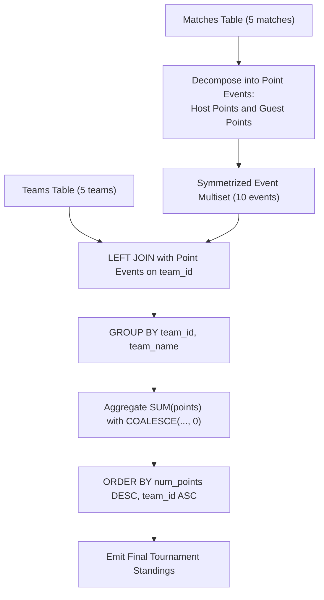

# Guided Example: Team Scores in Football Tournament

## 1. Problem Essence & Algorithmic Mental Model

In competitive sports league management, tournament standings are determined by awarding points based on individual match outcomes. We are provided with two relational schemas:
1. `Teams`: contains the definitive registry of participating clubs, specified by `team_id` and `team_name`.
2. `Matches`: records completed fixtures between pairs of clubs, specifying `match_id`, `host_team`, `guest_team`, `host_goals`, and `guest_goals`.

Tournament points are awarded under the standard association football scoring system:
- **Win (3 Points)**: Awarded to the team that scores strictly more goals than its opponent.
- **Draw / Tie (1 Point)**: Awarded to both teams if the match ends with equal goals scored.
- **Loss (0 Points)**: Awarded to the team that scores strictly fewer goals.

Our objective is to compute the total tournament points (`num_points`) accumulated by every registered team. The output must be sorted in descending order of total points, with ties broken by `team_id` ascending. Crucially, teams that have participated in zero matches (or lost all their games) must still appear in the final table with a score of $0$ points.

The core challenge involves two structural requirements:
1. **Asymmetric Participant Roles**: In any given fixture, a club acts either as the host or as the guest. Points must be credited to the correct team based on which side scored more goals.
2. **Total Entity Preservation (Left Outer Join)**: If we perform an inner join between `Teams` and `Matches`, any registered club that played zero matches will be discarded from the output relation. A left outer join (or zero-score baseline union) is mandatory to preserve the entire universe of clubs.

```
Match: Host 10 vs Guest 20 (Score: 3 - 0)
- Host 10 wins: gets 3 points
- Guest 20 loses: gets 0 points

Match: Host 30 vs Guest 50 (Score: 2 - 2)
- Both draw: Host 30 gets 1 point, Guest 50 gets 1 point

Team 40 (Never played a match):
- Must still appear in output with 0 points!
```

---

## 2. Mathematical Formalism & Invariants

Let $\mathcal{T}$ be the set of registered teams:
$$\mathcal{T} = \{(t, \text{name}) \in \mathbb{Z}^+ \times \Sigma^*\}$$
Let $\mathcal{M}$ be the set of played matches:
$$\mathcal{M} = \{(m, h, g, s_h, s_g) \in \mathbb{Z}^+ \times \mathbb{Z}^+ \times \mathbb{Z}^+ \times \mathbb{Z}_{\ge 0} \times \mathbb{Z}_{\ge 0}\}$$

### Point Allocation Function
For each match $\mu = (m, h, g, s_h, s_g)$, define the points awarded to the host and guest teams:
$$P_h(\mu) = \begin{cases} 3 & \text{if } s_h > s_g \\ 1 & \text{if } s_h = s_g \\ 0 & \text{if } s_h < s_g \end{cases} \qquad P_g(\mu) = \begin{cases} 3 & \text{if } s_g > s_h \\ 1 & \text{if } s_h = s_g \\ 0 & \text{if } s_g < s_h \end{cases}$$

### Match Symmetrization Mapping
Decompose each match into two directed point events:
$$\sigma(\mu) = \{(h, P_h(\mu)), (g, P_g(\mu))\}$$
Let the multiset of all awarded point events be:
$$\mathcal{E} = \biguplus_{\mu \in \mathcal{M}} \sigma(\mu)$$

### Total Team Score Invariant
For every registered team $(t, \text{name}) \in \mathcal{T}$, its total points are the sum over all matching events:
$$S(t) = \sum_{(u, p) \in \mathcal{E}} p \cdot [u = t]$$
If team $t$ appears in zero matches, the sum over an empty set evaluates strictly to $0$.

### Sorting Total Order
The result relation is ordered under the strict total order $\succ$:
$$t_1 \succ t_2 \iff (S(t_1) > S(t_2)) \lor (S(t_1) = S(t_2) \land t_1 < t_2)$$

---

## 3. Concrete Example Execution & State Evolution

Consider the tournament configuration:

### Teams Table
| `team_id` | `team_name` |
|---|---|
| 10 | `"FC Barcelona"` |
| 20 | `"Real Madrid"` |
| 30 | `"Liverpool"` |
| 40 | `"Arsenal"` |
| 50 | `"Juventus"` |

### Matches Table
| `match_id` | `host_team` | `guest_team` | `host_goals` | `guest_goals` |
|---|---|---|---|---|
| 1 | 10 | 20 | 3 | 0 |
| 2 | 30 | 10 | 2 | 2 |
| 3 | 10 | 50 | 5 | 1 |
| 4 | 20 | 30 | 1 | 0 |
| 5 | 50 | 30 | 0 | 3 |

*Notice that Team 40 (`"Arsenal"`) has zero matches in the schedule.*



### Match Outcome Decomposition Trace

| `match_id` | Host vs Guest | Score | Host Points Awarded | Guest Points Awarded |
|---|---|---|---|---|
| 1 | 10 vs 20 | $3 - 0$ | Team 10: **3 pts** (Win) | Team 20: **0 pts** (Loss) |
| 2 | 30 vs 10 | $2 - 2$ | Team 30: **1 pt** (Draw) | Team 10: **1 pt** (Draw) |
| 3 | 10 vs 50 | $5 - 1$ | Team 10: **3 pts** (Win) | Team 50: **0 pts** (Loss) |
| 4 | 20 vs 30 | $1 - 0$ | Team 20: **3 pts** (Win) | Team 30: **0 pts** (Loss) |
| 5 | 50 vs 30 | $0 - 3$ | Team 50: **0 pts** (Loss) | Team 30: **3 pts** (Win) |

### Team Standings Aggregation Trace

| `team_id` | `team_name` | Individual Point Events Earned | Sum of Points | Final `num_points` | Standings Rank |
|---|---|---|---|---|---|
| 10 | `"FC Barcelona"` | Match 1 (3), Match 2 (1), Match 3 (3) | $3 + 1 + 3 = 7$ | **7** | 1 |
| 20 | `"Real Madrid"` | Match 1 (0), Match 4 (3) | $0 + 3 = 3$ | **3** | 3 (Tied with 30, $20 < 30$) |
| 30 | `"Liverpool"` | Match 2 (1), Match 4 (0), Match 5 (3) | $1 + 0 + 3 = 4$ | **4** | 2 |
| 50 | `"Juventus"` | Match 3 (0), Match 5 (0) | $0 + 0 = 0$ | **0** | 4 (Tied with 40, $40 < 50$) |
| 40 | `"Arsenal"` | No matches played | (Null) $\to 0$ | **0** | 4 ($40 < 50$, takes precedence!) |

### Final Ordered Output
1. Team 10 (`"FC Barcelona"`): 7 points
2. Team 30 (`"Liverpool"`): 4 points
3. Team 20 (`"Real Madrid"`): 3 points
4. Team 40 (`"Arsenal"`): 0 points
5. Team 50 (`"Juventus"`): 0 points

---

## 4. Multi-Approach Comparison & Trade-Offs

| Metric / Dimension | Correlated Subquery per Team | Cartesian Left Join with Disjunctive ON | Unpivot UNION ALL + Outer Join (Optimal) |
|---|---|---|---|
| **Query Strategy** | Subquery for host pts + subquery for guest pts | `LEFT JOIN Matches ON t.id = m.host OR t.id = m.guest` | Symmetrize matches via `UNION ALL`, then join `Teams` |
| **Join Condition Type**| Correlated index probes | Disjunctive (`OR`) join predicate | Pure equi-join on `team_id` |
| **Join Efficiency** | $\mathcal{O}(T \cdot M)$ scans | Optimizer cannot use hash join effectively | Fast hash join ($\mathcal{O}(T + M)$) |
| **Zero-Match Safety** | Handled via `COALESCE` | Left join preserves zero-match rows | Left join preserves zero-match rows |
| **Query Execution Plan**| Nested loop over subqueries | Table scan with filter expressions | Stream aggregate -> Hash join -> Sort |

```
Execution Comparison:

Disjunctive Join (ON host OR guest):
[Teams Table] ===(OR Join Predicate)===> [Matches Table] (Prevents Hash Join; slow nested loop!)

Unpivot + Equi-Join (Optimal):
[Host Events] \
                ===> [UNION ALL] ===> [Hash Left Join on team_id] ===> [Sort Standings]
[Guest Events]/                        (High-speed linear execution!)
```

---

## 5. Algorithmic Edge Cases & Boundary Analysis

| Scenario | Condition State | Expected Behavior | System Invariant |
|---|---|---|---|
| **Zero-Match Team** | Team 40 registered but never scheduled | Output contains Team 40 with `num_points = 0` | Outer join produces null match fields; null points coalesce to 0. |
| **Team Loses Every Match** | Team 50 played 2 matches, lost both | Output contains Team 50 with `num_points = 0` | Point sum evaluates to $0 + 0 = 0$. |
| **Score Tie-Breaker** | Team 40 and Team 50 both have 0 points | Team 40 listed before Team 50 | Secondary ordering `team_id ASC` places $40$ before $50$. |
| **Score Draw Match** | `host_goals == guest_goals` | Both teams receive exactly 1 point | Case condition `WHEN host_goals = guest_goals THEN 1` credits both. |
| **High Goal Scorers** | Matches with double-digit scores (e.g. 10 - 2) | Winner still receives 3 points | Points depend on sign of goal difference, not goal volume. |

---

## 6. Mathematical Verification & Complexity Derivation

Let $T = |\text{Teams}|$ and $M = |\text{Matches}|$.

### Execution Steps in Database Query Planner:
1. **Match Unpivoting (`UNION ALL`)**:
   - Projecting host events: $M$ tuples in $\mathcal{O}(M)$ time.
   - Projecting guest events: $M$ tuples in $\mathcal{O}(M)$ time.
   - Total symmetrized events: $2M$ tuples in $\mathcal{O}(M)$ time.
2. **Left Outer Join with Teams**:
   - Performing a hash outer join between $T$ teams and $2M$ events takes:
     $$\mathcal{O}(T + M) \text{ time}$$
3. **Aggregation**:
   - Grouping by `(team_id, team_name)` and evaluating `SUM(points)` collapses records into $T$ distinct team rows.
   - Time: $\mathcal{O}(T + M)$.
4. **Sorting Standings**:
   - Sorting $T$ rows by `num_points DESC, team_id ASC`:
     $$\mathcal{O}(T \log T) \text{ comparisons}$$

### Asymptotic Summary:
- **Total Time Complexity:** $\mathcal{O}(M + T \log T)$ optimal relational processing time.
- **Total Space Complexity:** $\mathcal{O}(T + M)$ auxiliary memory for hash tables and sort buffers.

---

## 7. Synthesis & Strategic Takeaways

1. **Role Symmetrization Pattern**: In paired competitive schemas (host vs guest, white vs black, home vs away), unpivoting matches into two uniform event records simplifies complex multi-column checks into a single straightforward aggregation.
2. **Avoid Disjunctive Joins**: Joins using `ON a.id = b.col1 OR a.id = b.col2` prevent query optimizers from utilizing equi-join hash tables, falling back to slow nested-loop scans. Symmetrizing the right-hand table via `UNION ALL` restores standard equi-join performance.
3. **Entity Preservation Invariant**: When reporting on a master catalog (such as `Teams`), always use a `LEFT JOIN` rooted on the catalog. Teams that had zero recorded activity must never be silently dropped from final standings.
