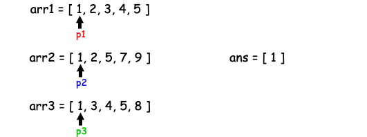
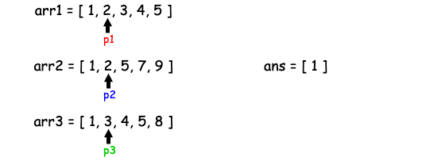
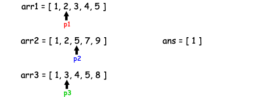
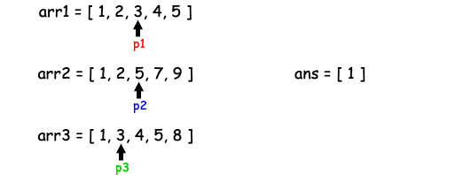
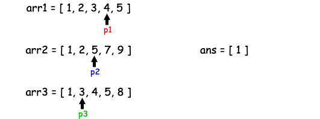
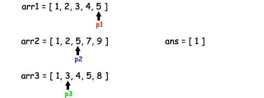
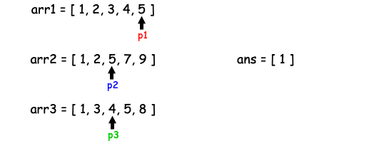
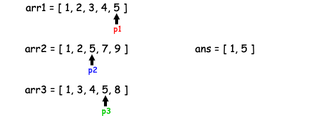

[TOC]

## Solution

---

### Approach 1: Brute Force with Hashmap

#### Intuition

One of the most straightforward approaches would be counting the frequencies of each item in `arr1`, `arr2`, and `arr3` so that we would be able to find the numbers that appear exactly three times.
This is feasible because all of the three arrays are _strictly increasing_, hence we can rule out the possibility that some element appears more than once in any of the arrays.

#### Algorithm

- We would initiate a Hashmap `counter` to record the numbers that appear in the three arrays and the number of times they appear;
- then we scan `arr1`, `arr2`, and `arr3` to count the frequencies;
- finally, we would iterate through `counter` to find the numbers that appear three times.

#### Implementation

```python
class Solution:
    def arraysIntersection(
        self, arr1: List[int], arr2: List[int], arr3: List[int]
    ) -> List[int]:
        ans = []

        # you can use a dict to count the frequencies
        # or you can use collections.Counter
        # more info is available here:
        # https://docs.python.org/3/library/collections.html

        counter = collections.Counter(
            arr1 + arr2 + arr3
        )  # concatenate them together

        for item in counter:
            if counter[item] == 3:
                ans.append(item)
        return ans
```

#### Complexity Analysis

* Time Complexity: $\mathcal{O}(n)$, where $n$ is the total length of all of the input arrays.
* Space Complexity: $\mathcal{O}(n)$, where $n$ is the total length of all of the input arrays.
This is because we adopted a Hashhmap to store all numbers and their number of appearances.

---

### Approach 2: Three Pointers

#### Intuition

You may notice that Approach 1 does not utilize the fact that all arrays are _sorted_.
Indeed, instead of using a Hashmap to store the frequencies, we can use three pointers `p1`, `p2`, and `p3` to iterate through `arr1`, `arr2`, and `arr3` accordingly:

- Each time, we want to increment the pointer that points to the smallest number, i.e., $min(\text{arr1}[p1], \text{arr2}[p2], \text{arr3}[p3])$ forward;
- if the numbers pointed to by `p1`, `p2`, and `p3` are the same, we should then store it and move all three pointers forward.

Moreover, we don't have to move the pointer pointing to the smallest number - we only need to move the pointer pointing to a smaller number. In this case, we avoid comparing three numbers and finding the smallest one before deciding which one to move.
You may find the rationale behind this in the Algorithm.

















#### Algorithm

- Initiate three pointers `p1`, `p2`, `p3`, and place them at the beginning of `arr1`, `arr2`, `arr3` by initializing them to 0;
- while they are within the boundaries:
  - if $\text{arr1}[p1] = \text{arr2}[p2] \&\& \text{arr2}[p2] = \text{arr3}[p3]$, we should store it because it appears three times in `arr1`, `arr2`, and `arr3`;
  - else
- if $\text{arr1}[p1] < \text{arr2}[p2]$, move the smaller one, i.e., `p1`;
- else if $\text{arr2}[p2] < \text{arr3}[p3]$, move the smaller one, i.e., `p2`;
- if neither of the above conditions is met, it means $\text{arr1}[p1] \ge \text{arr2}[p2] \&\& \text{arr2}[p2] \ge \text{arr3}[p3]$, therefore move `p3`.

#### Implementation

```python
class Solution:
    def arraysIntersection(
        self, arr1: List[int], arr2: List[int], arr3: List[int]
    ) -> List[int]:
        ans = []
        # prepare three pointers to iterate through three arrays
        # p1, p2, and p3 point to the beginning of arr1, arr2, and arr3 accordingly
        p1 = p2 = p3 = 0
        while p1 < len(arr1) and p2 < len(arr2) and p3 < len(arr3):
            if arr1[p1] == arr2[p2] == arr3[p3]:
                ans.append(arr1[p1])
                p1 += 1
                p2 += 1
                p3 += 1
            else:
                if arr1[p1] < arr2[p2]:
                    p1 += 1
                elif arr2[p2] < arr3[p3]:
                    p2 += 1
                else:
                    p3 += 1
        return ans
```

#### Complexity Analysis

* Time Complexity: $\mathcal{O}(n)$, where $n$ is the total length of all of the input arrays.
* Space Complexity: $\mathcal{O}(1)$, as we only initiate three integer variables using constant space.

---