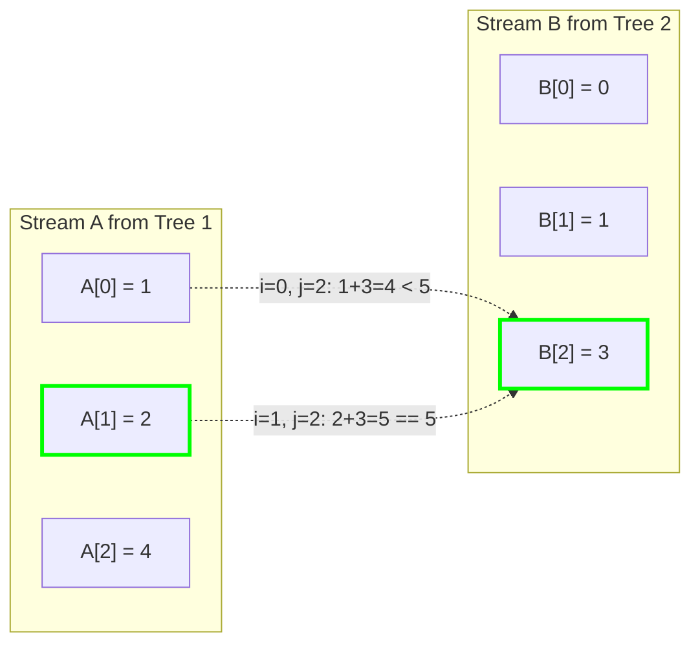

# Guided Example: Two Sum BSTs

## 1. Problem Essence & Algorithmic Mental Model

Given the roots of two independent Binary Search Trees (BSTs), $T_1$ and $T_2$, along with an integer $\text{target}$, we must determine whether there exists a node in $T_1$ with value $v_1$ and a node in $T_2$ with value $v_2$ such that their sum equals the target:
$$v_1 + v_2 = \text{target}$$
If such a pair exists, we return `true`; otherwise, we return `false`.

A naive brute-force method would extract all elements from both trees and evaluate all $|T_1| \times |T_2|$ pairwise sums, requiring quadratic $\mathcal{O}(N_1 \cdot N_2)$ time.

The foundational structural property of Binary Search Trees provides the key to linear efficiency:
**The BST Inorder Monotonicity Theorem**:
An inorder traversal (Left $\to$ Root $\to$ Right) of any valid Binary Search Tree visits nodes in strictly increasing numerical order.
By performing an inorder traversal on both trees:
- $T_1$ produces a sorted sequence $A = [a_0 < a_1 < \dots < a_{n_1 - 1}]$.
- $T_2$ produces a sorted sequence $B = [b_0 < b_1 < \dots < b_{n_2 - 1}]$.

Once the elements are laid out in sorted order, the problem reduces to the classic **Two-Pointer Bidirectional Convergence**:
1. Initialize a left pointer $i = 0$ at the smallest element of sequence $A$.
2. Initialize a right pointer $j = n_2 - 1$ at the largest element of sequence $B$.
3. Evaluate the active sum $S = A[i] + B[j]$:
   - If $S = \text{target}$: A valid pair is found; return `true` immediately.
   - If $S < \text{target}$: The sum is too small. Because $B[j]$ is already the maximum available element among remaining candidates in $B$, pairing any element smaller than $B[j]$ with $A[i]$ would yield an even smaller sum. Thus, $A[i]$ can never participate in any valid pair with current or smaller elements of $B$. We advance $i \leftarrow i + 1$.
   - If $S > \text{target}$: The sum is too large. Because $A[i]$ is the smallest available element among remaining candidates in $A$, pairing any element larger than $A[i]$ with $B[j]$ would yield an even larger sum. Thus, $B[j]$ can never participate in a valid pair. We retreat $j \leftarrow j - 1$.
This guarantees locating a matching pair or proving none exists in strictly $\mathcal{O}(N_1 + N_2)$ time.

```
Tree 1 (Inorder): A = [ 0,  1,  4 ]  (Pointer i starts at 0 -> smallest)
Tree 2 (Inorder): B = [ 1,  2,  3 ]  (Pointer j starts at 2 -> largest)
Target = 5

Step 1: A[0] + B[2] = 0 + 3 = 3 < 5  --> Advance i to 1
Step 2: A[1] + B[2] = 1 + 3 = 4 < 5  --> Advance i to 2
Step 3: A[2] + B[2] = 4 + 3 = 7 > 5  --> Retreat j to 1
Step 4: A[2] + B[1] = 4 + 2 = 6 > 5  --> Retreat j to 0
Step 5: A[2] + B[0] = 4 + 1 = 5 == 5 --> MATCH FOUND! Return TRUE!
```

---

## 2. Mathematical Formalism & Invariants

Let $T_1 = (V_1, E_1)$ and $T_2 = (V_2, E_2)$ be two valid BSTs with sizes $|V_1| = n_1$ and $|V_2| = n_2$.

### Inorder Projection Bijective Ordering
Define the inorder sequence extraction operator $\mathcal{I}$:
$$\mathcal{I}(T_1) = A = (a_0, a_1, \dots, a_{n_1-1}) \quad \text{where } a_0 < a_1 < \dots < a_{n_1-1}$$
$$\mathcal{I}(T_2) = B = (b_0, b_1, \dots, b_{n_2-1}) \quad \text{where } b_0 < b_1 < \dots < b_{n_2-1}$$

### Search Space Pruning Invariants
At any step with pointer indices $(i, j) \in [0, n_1] \times [-1, n_2 - 1]$:
1. **Left Invariant (Discarded Prefix of $A$)**:
   $$\forall k < i, \ \forall l \le j, \quad A[k] + B[l] < \text{target}$$
   Every element discarded from $A$ cannot sum to target with any remaining candidate in $B$.
2. **Right Invariant (Discarded Suffix of $B$)**:
   $$\forall k \ge i, \ \forall l > j, \quad A[k] + B[l] > \text{target}$$
   Every element discarded from $B$ cannot sum to target with any remaining candidate in $A$.
3. **Target Invariance**:
   If there exists $(u, v) \in V_1 \times V_2$ such that $u + v = \text{target}$, then $u \in \{A[i], \dots, A[n_1-1]\}$ and $v \in \{B[0], \dots, B[j]\}$.

---

## 3. Concrete Example Execution & State Evolution

Consider the two trees:
- $T_1$: Root 2, left child 1, right child 4.
- $T_2$: Root 1, left child 0, right child 3.
- $\text{target} = 5$.

### Inorder Traversal Extraction
- $T_1$ inorder traversal: visits node 1, node 2, node 4 $\implies A = [1, 2, 4]$.
- $T_2$ inorder traversal: visits node 0, node 1, node 3 $\implies B = [0, 1, 3]$.



### Convergence Trace

| Iteration | Left Index $i$ | Right Index $j$ | Active Element $A[i]$ | Active Element $B[j]$ | Sum $S = A[i] + B[j]$ | Comparison with Target (5) | Pointer Adjustment |
|---|---|---|---|---|---|---|---|
| Step 1 | 0 | 2 | 1 | 3 | $1 + 3 = 4$ | $4 < 5$ (Too small) | Advance $i \leftarrow 1$ |
| Step 2 | 1 | 2 | 2 | 3 | $2 + 3 = 5$ | $5 = 5$ (Exact match!) | **Return True** |

Match confirmed: node with value 2 in $T_1$ and node with value 3 in $T_2$ sum to $2 + 3 = 5$.

---

## 4. Multi-Approach Comparison & Trade-Offs

| Approach / Dimension | All-Pairs Nested Traversal | Tree-1 Traversal + BST Search in Tree-2 | Inorder Flattening + Two Pointers (Optimal) |
|---|---|---|---|
| **Strategy** | For every node in $T_1$, scan all of $T_2$ | For each $u \in T_1$, search $\text{target} - u$ in $T_2$ | Extract sorted arrays, two-pointer scan |
| **Time Complexity** | $\mathcal{O}(N_1 \cdot N_2)$ quadratic | $\mathcal{O}(N_1 \cdot H_2) \le \mathcal{O}(N_1 \cdot N_2)$ | $\mathcal{O}(N_1 + N_2)$ strictly linear |
| **Auxiliary Memory** | $\mathcal{O}(H_1 + H_2)$ recursion | $\mathcal{O}(H_1 + H_2)$ recursion | $\mathcal{O}(N_1 + N_2)$ (or $\mathcal{O}(H_1+H_2)$ with iterators) |
| **Skewed Tree Resistance**| Poor | Degrades to $\mathcal{O}(N_1 \cdot N_2)$ if $T_2$ is a chain | Completely immune to tree imbalance |
| **Early Termination** | Slow | Moderate | Instant upon first match |

```
Execution Comparison:

BST Search per Node:
For each node in T1: Walk down T2 (O(H2) time per lookup)
Worst Case (Skewed Trees): 5,000 * 5,000 = 25,000,000 operations!

Inorder Two-Pointer Convergence (Optimal):
[Flatten T1] + [Flatten T2] ---> Two pointers meet in at most N1 + N2 steps!
Worst Case: 5,000 + 5,000 = 10,000 operations! (2,500x faster!)
```

---

## 5. Algorithmic Edge Cases & Boundary Analysis

| Boundary Scenario | Input Condition | Expected Behavior | Handling Mechanism |
|---|---|---|---|
| **Target Unreachable** | No pair sums to target | Returns `false` | Pointers exhaust range ($i \ge n_1$ or $j < 0$); while loop terminates cleanly. |
| **Single-Node Trees** | Both trees contain 1 node | True if $r_1 + r_2 = \text{target}$, else False | Lists have length 1; evaluated in single step. |
| **Extreme Skewed Trees** | Both trees are linear chains | Linear $\mathcal{O}(N_1 + N_2)$ preserved | Inorder traversal flattens chains to sorted lists; tree height does not impact two-pointer speed. |
| **Negative Values** | Nodes contain negative values | Algebraic addition holds | Negative integers preserve strict monotonic ordering; comparisons remain exact. |
| **Target Exceeds All Sums** | $\text{target} \gg \max(A) + \max(B)$ | Returns `false` | Left pointer $i$ advances to end of $A$ without matching. |

---

## 6. Mathematical Verification & Complexity Derivation

Let $N_1 = |V_1|$ and $N_2 = |V_2|$ be the number of nodes in $T_1$ and $T_2$.

### 1. Inorder Traversal Phase:
- Traversing $T_1$ visits each of the $N_1$ nodes exactly once, appending values to array $A$:
  $$\mathcal{O}(N_1) \text{ time}$$
- Traversing $T_2$ visits each of the $N_2$ nodes exactly once, appending values to array $B$:
  $$\mathcal{O}(N_2) \text{ time}$$
- Recursion stack depth is bounded by tree heights $H_1 \le N_1$ and $H_2 \le N_2$.

### 2. Two-Pointer Convergence Phase:
- The pointer $i$ begins at $0$ and only increases.
- The pointer $j$ begins at $N_2 - 1$ and only decreases.
- In every iteration of the while loop, exactly one of the following occurs:
  - Terminate immediately (if $A[i] + B[j] == \text{target}$).
  - $i$ increases by 1.
  - $j$ decreases by 1.
- The maximum number of loop iterations before $i \ge N_1$ or $j < 0$ is:
  $$N_1 + N_2$$
- Each iteration performs $\mathcal{O}(1)$ basic arithmetic operations.
- Two-pointer scan time: $\mathcal{O}(N_1 + N_2)$.

### Asymptotic Summary:
- **Total Time Complexity:** $\mathcal{O}(N_1 + N_2)$ optimal linear time.
- **Total Space Complexity:** $\mathcal{O}(N_1 + N_2)$ auxiliary memory to store the flattened inorder arrays. *(Can be optimized to $\mathcal{O}(H_1 + H_2)$ auxiliary memory using dual stack-based generators).*

---

## 7. Synthesis & Strategic Takeaways

1. **BSTs are Latent Sorted Arrays**: An inorder traversal transforms a tree hierarchy into a monotonically sorted 1D array in linear time. Whenever an algorithm benefits from sorted data (such as binary search or two pointers), consider projecting the BST via inorder traversal.
2. **Bidirectional Search Space Elimination**: The two-pointer pattern on two independent sorted sequences relies on complementary monotonicities: increasing one pointer increases the sum, while decreasing the other decreases it. This allows eliminating an entire row or column of the Cartesian product at every step.
3. **Decoupling Tree Shape from Algorithmic Complexity**: Searching nodes directly inside unbalanced BSTs can degrade to $\mathcal{O}(N^2)$ worst-case time. Flattening the trees into sequential arrays decouples performance from tree height, guaranteeing strictly linear $\mathcal{O}(N_1 + N_2)$ performance.
