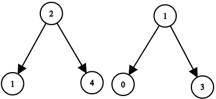
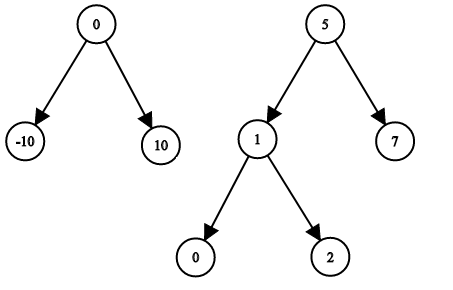

## Description

Given the roots of two binary search trees, `root1` and `root2`, return `true` if and only if there is a node in the first tree and a node in the second tree whose values sum up to a given integer `target`.
### Function Contract

**Inputs**

- `root1`: The root of the first nonempty binary search tree.
- `root2`: The root of the second nonempty binary search tree.
- `target`: The integer sum to test.

Let $n$ and $m$ be the respective numbers of nodes in the two trees. Each node has an integer value and optional left and right children. The examples serialize trees in level order, using `null` where an absent child must be shown.

**Return value**

Return `true` when one node from `root1` and one node from `root2` have values summing to `target`. Return `false` when no cross-tree pair has that sum.

### Examples

#### Example 1

- **Input:** $root1 = [2,1,4], root2 = [1,0,3], target = 5$
- **Output:** `true`
- **Explanation:** 2 and 3 sum up to 5.
#### Example 2

- **Input:** $root1 = [0,-10,10], root2 = [5,1,7,0,2], target = 18$
- **Output:** `false`
### Constraints

- The number of nodes in each tree is in the range `[1, 5000]`.

- $-10^{9} \le \text{Node.val}, target \le 10^{9}$