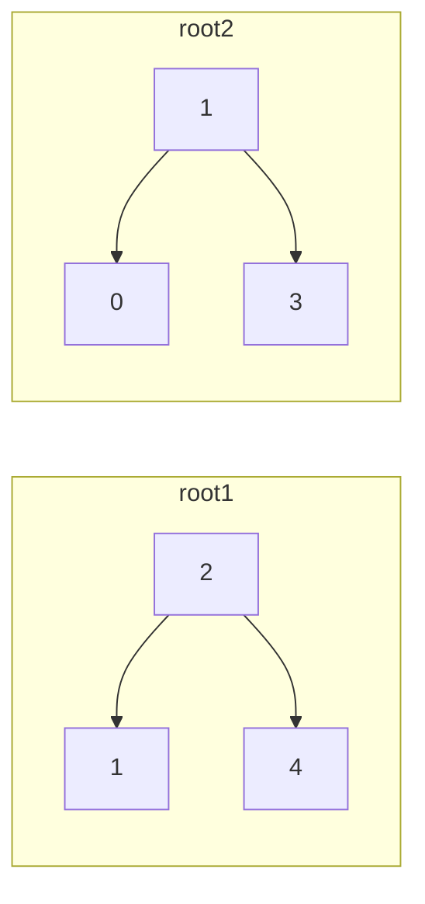
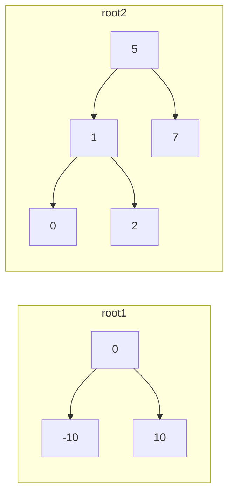

## Examples

**Example 1**

- Input: `root1 = [2,1,4], root2 = [1,0,3], target = 5`
- Output: `true`
- Explanation: The first tree's node `2` and the second tree's node `3` sum to `5`.

**Example 2**

- Input: `root1 = [0,-10,10], root2 = [5,1,7,0,2], target = 18`
- Output: `false`

