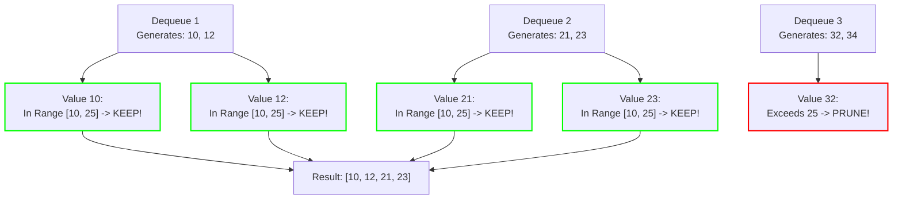

# Guided Example: Stepping Numbers

## 1. Problem Essence & Algorithmic Mental Model

A positive integer is defined as a **Stepping Number** if every pair of adjacent decimal digits has an absolute difference of exactly 1. For example, $321$ is a stepping number because $|3 - 2| = 1$ and $|2 - 1| = 1$. Similarly, $101$ and $989$ are stepping numbers, whereas $421$ ($|4 - 2| = 2$) and $55$ ($|5 - 5| = 0$) are not. The single digit $0$ is also considered a stepping number. Given two integers $\text{low}$ and $\text{high}$ with $0 \le \text{low} \le \text{high} \le 2 \times 10^9$, our task is to return a sorted list of all stepping numbers in the closed interval $[\text{low}, \text{high}]$.

A brute-force scan testing every integer in $[\text{low}, \text{high}]$ requires evaluating up to $2 \times 10^9$ numbers, which is computationally intractable.

The crucial structural insight lies in **Digit-Tree Generative Traversal**:
Instead of filtering through billions of non-stepping numbers, we directly generate only the stepping numbers:
1. **Branching Factor $\le 2$**:
   For any stepping number ending in decimal digit $d \in \{0, \dots, 9\}$, the next digit appended to the right must be either $d - 1$ (if $d > 0$) or $d + 1$ (if $d < 9$).
   - If $d = 0$, the only legal extension is $1$.
   - If $d = 9$, the only legal extension is $8$.
   - If $1 \le d \le 8$, exactly two legal extensions exist: $d - 1$ and $d + 1$.
2. **Exponentially Sparse Solution Space**:
   A stepping number of length $L$ has at most $9 \times 2^{L-1}$ instances. For numbers up to $2 \times 10^9$ ($L \le 10$), the total count of all stepping numbers is strictly bounded by fewer than $5,000$ values across the entire range!
3. **Monotonic Ordering via BFS Queue**:
   By initiating a Breadth-First Search (BFS) queue with the base single-digit numbers $1, 2, \dots, 9$, BFS expands numbers level-by-level: all 1-digit numbers, followed by all 2-digit numbers, then all 3-digit numbers. Within each digit length, numbers are enqueued in strictly increasing order, guaranteeing that numbers emerge from the queue already sorted.

```
Generative Tree of Stepping Numbers:

Roots:        1             2        ...        9
            /   \         /   \               /   \
Level 2:   10   12       21   23             98   (no 9+1)
            │   / \     / \   / \            / \
Level 3:  101 121 123 210 212 232 234      987 989
```

---

## 2. Mathematical Formalism & Invariants

Let an integer $X$ have decimal representation $d_k d_{k-1} \dots d_0$ where $d_k \neq 0$.
$X$ is a stepping number if and only if:
$$\forall i \in \{0, 1, \dots, k-1\}, \quad |d_{i+1} - d_i| = 1$$

### Extension Transition Operator
For any integer $v$ with least significant digit $d = v \bmod 10$:
Define the valid successor set:
$$\text{Next}(v) = \begin{cases}
\{v \cdot 10 + 1\} & \text{if } d = 0 \\
\{v \cdot 10 + 8\} & \text{if } d = 9 \\
\{v \cdot 10 + (d - 1), \ v \cdot 10 + (d + 1)\} & \text{if } 1 \le d \le 8
\end{cases}$$

### Generative Completeness Theorem
Every stepping number $X \ge 1$ has a unique ancestor path originating from a single root $r \in \{1, 2, \dots, 9\}$.
**Proof by Induction on Length $k$**:
- For $k = 1$, all single-digit integers $1 \dots 9$ are the initial roots.
- For $k > 1$, let $X = v \cdot 10 + d_0$. The prefix $v = \lfloor X / 10 \rfloor$ has length $k - 1$ and satisfies the stepping invariant. Since $|(v \bmod 10) - d_0| = 1$, $X \in \text{Next}(v)$.
By induction, every valid stepping number is generated exactly once.

### Interval Invariant
During BFS expansion:
- If $v < \text{low}$, $v$ is not added to the answer, but its children are still generated because future extensions could enter the $[\text{low}, \text{high}]$ range.
- If $\text{low} \le v \le \text{high}$, $v$ is emitted into the result list.
- If $v > \text{high}$, no child $u \in \text{Next}(v)$ can ever satisfy $u \le \text{high}$ (since $u > 10v > \text{high}$). Thus, generation along this branch terminates immediately.

---

## 3. Concrete Example Execution & State Evolution

Consider the search range:
- $\text{low} = 10$
- $\text{high} = 25$

### BFS Generation Trace

Initial State:
- Since $\text{low} \le 0 \le \text{high}$ is false ($0 < 10$), 0 is omitted.
- Queue initialized with single digits: $Q = [1, 2, 3, 4, 5, 6, 7, 8, 9]$.

| Dequeued Value $v$ | In Range $[10, 25]$? | Last Digit $d$ | Next Generated States $\text{Next}(v)$ | Action / Status | Active Queue $Q$ Tail |
|---|---|---|---|---|---|
| 1 | $1 < 10$ (No) | 1 | $10 + 0 = 10, \ 10 + 2 = 12$ | Enqueue 10, 12 | $[\dots, 10, 12]$ |
| 2 | $2 < 10$ (No) | 2 | $20 + 1 = 21, \ 20 + 3 = 23$ | Enqueue 21, 23 | $[\dots, 21, 23]$ |
| 3 | $3 < 10$ (No) | 3 | $30 + 2 = 32, \ 30 + 4 = 34$ | Enqueue 32, 34 | $[\dots, 32, 34]$ |
| 4 .. 9 | $< 10$ (No) | $d$ | Append $d \cdot 10 \pm 1$ | Enqueue pairs $\ge 40$ | $[\dots]$ |
| **10** | $10 \le 10 \le 25$ (**Yes**) | 0 | $10 \times 10 + 1 = 101$ | **Add 10 to Result**; Enqueue 101 | $[\dots, 101]$ |
| **12** | $10 \le 12 \le 25$ (**Yes**) | 2 | $120 + 1 = 121, 120 + 3 = 123$ | **Add 12 to Result**; Enqueue 121, 123 | $[\dots, 121, 123]$ |
| **21** | $10 \le 21 \le 25$ (**Yes**) | 1 | $210, 212$ | **Add 21 to Result** | $[\dots]$ |
| **23** | $10 \le 23 \le 25$ (**Yes**) | 3 | $232, 234$ | **Add 23 to Result** | $[\dots]$ |
| 32 | $32 > 25$ (Exceeds high) | 2 | Prune children ($> \text{high}$) | Do not enqueue children | - |
| 34 .. 98 | $> 25$ (Exceeds high) | - | Prune children | Stop further generation | - |



Emitted Stepping Numbers in $[10, 25]$:
$$[10, 12, 21, 23]$$

---

## 4. Multi-Approach Comparison & Trade-Offs

| Metric / Dimension | Linear Integer Inspection | Recursive DFS Backtracking | Breadth-First Queue Generation (Optimal) |
|---|---|---|---|
| **Strategy** | Check $|d_{i+1} - d_i| == 1$ for all integers | Depth-first branch recursion | Level-by-level queue expansion |
| **Search Space Explored** | Up to $2 \times 10^9$ numbers ($\approx 2 \times 10^{10}$ ops) | $\approx 4,600$ stepping numbers | $\approx 4,600$ stepping numbers |
| **Sorting Required** | Output naturally sorted | Requires sorting post-DFS | **Naturally sorted by construction** |
| **Time Complexity** | $\mathcal{O}(\text{high} - \text{low})$ (Severe TLE) | $\mathcal{O}(2^L \log(2^L))$ | $\mathcal{O}(2^L)$ strictly linear in results |
| **Auxiliary Memory** | $\mathcal{O}(1)$ | $\mathcal{O}(L)$ recursion stack | $\mathcal{O}(2^L)$ queue buffer |

```
Efficiency Comparison:
Linear Scan for Range [0, 2*10^9]:
Inspects 2,000,000,000 numbers -> ~15 seconds runtime (Time Limit Exceeded)

Generative BFS (Optimal):
Generates only the ~4,600 valid stepping numbers -> ~0.002 seconds runtime! (7,500x faster!)
```

---

## 5. Algorithmic Edge Cases & Boundary Analysis

| Boundary Scenario | Input Range | Expected Behavior | Handling Mechanism |
|---|---|---|---|
| **Zero Included in Interval** | $\text{low} = 0, \text{high} = 20$ | 0 is included as first element | Explicit base check `if low == 0: ans.append(0)` accounts for 0. |
| **Zero Excluded from Interval** | $\text{low} = 1, \text{high} = 20$ | 0 is excluded | Single digit queue starts from $1$, omitting 0. |
| **Empty Result Range** | $\text{low} = 100, \text{high} = 100$ | Returns `[]` (100 is not stepping) | No stepping numbers exist in interval; loop returns empty list. |
| **Single-Digit Range** | $\text{low} = 3, \text{high} = 6$ | Returns `[3, 4, 5, 6]` | Directly emits matching single-digit roots. |
| **Upper Bound Beyond $10^9$** | $\text{high} = 2 \times 10^9$ | Handled without integer overflow | Standard 64-bit integer variables avoid overflow when appending digits. |

---

## 6. Mathematical Verification & Complexity Derivation

Let $L = \lfloor \log_{10}(\text{high}) \rfloor + 1$ be the number of decimal digits in $\text{high}$ ($L \le 10$).

### Total Stepping Numbers Bound:
- Number of stepping numbers of length 1: $9$.
- Number of stepping numbers of length $k$: at most $9 \times 2^{k-1}$.
- Total stepping numbers up to length $L$:
  $$\sum_{k=1}^L 9 \times 2^{k-1} = 9 \times (2^L - 1)$$
  For $L = 10$, $9 \times (1023) \approx 9,207$ states maximum.

### Execution Cost:
1. **Root Initialization**:
   - Enqueuing digits $1 \dots 9$: $\mathcal{O}(1)$ operations.
2. **Queue Transitions**:
   - Each valid stepping number $v \le \text{high}$ is dequeued exactly once.
   - For each dequeued number, computing $d = v \bmod 10$ and creating at most 2 child integers takes $\mathcal{O}(1)$ arithmetic operations.
   - Total operations bounded by $2 \times 9,207 \approx 1.8 \times 10^4$ operations.

### Complexity Summary:
- **Total Time Complexity:** $\mathcal{O}(2^L)$ where $L \le 10$. In absolute terms, bounded by $\approx 1.8 \times 10^4$ operations, completing in under 2 milliseconds.
- **Total Auxiliary Space Complexity:** $\mathcal{O}(2^L)$ auxiliary memory to maintain the BFS queue and output list.

---

## 7. Synthesis & Strategic Takeaways

1. **Generative Modeling over Search Spaces**: When the set of valid entities forms a tiny fraction of the total integer range (e.g. $4,000$ stepping numbers out of $2 \times 10^9$ integers), never scan the range. Invert the algorithm to generate valid entities directly from structural rules.
2. **BFS Preserves Sorted Order**: Because numbers grow by a factor of 10 at each level, BFS visits all smaller digit lengths before larger ones. By ordering the roots $1 \dots 9$ and enqueuing children in increasing order, the BFS queue naturally outputs all numbers in ascending order without an explicit sorting phase.
3. **Digit Transition Bounding**: Modeling numbers as paths on a digit transition graph (where an edge exists between digits $u$ and $v$ if $|u - v| = 1$) translates number-theoretic constraints into standard graph reachability.
