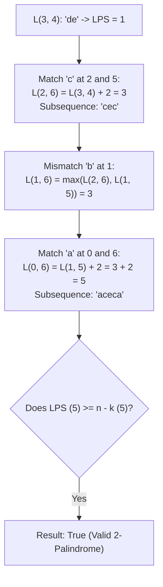

# Guided Example: Valid Palindrome III

## 1. Problem Essence & Algorithmic Mental Model

Given a string $s$ of length $n$ and an integer $k$, we are asked to determine whether $s$ is a **$k$-palindrome**. A string is defined as a $k$-palindrome if it can be transformed into a palindrome by deleting at most $k$ characters from it.

Consider the string $s = \text{"abcdeca"}$ with $k = 2$:
- Removing the characters `'b'` and `'d'` leaves `"aceca"`, which is a valid palindrome of length 5.
- Because only 2 deletions were required, the string satisfies the 2-palindrome condition, returning `true`.

A naive approach would generate all $\sum_{j=0}^k \binom{n}{j}$ possible deletion subsets and test each for palindromicity. For $n \approx 1000$, the number of subsets is astronomically large, leading to immediate time limit exhaustion.

The core realization is an exact mathematical duality:
**Duality between Minimum Deletions and Longest Palindromic Subsequence (LPS)**:
When we delete $d$ characters from a string of length $n$, the remaining $n - d$ characters form a subsequence of $s$. If the remaining characters form a palindrome, then that palindrome is, by definition, a palindromic subsequence of $s$.
To minimize the number of deleted characters $d$, we must maximize the length of the preserved palindromic subsequence:
$$d_{\min}(s) = n - \text{LPS}(s)$$
Therefore, the string can be converted into a palindrome with at most $k$ deletions if and only if:
$$n - \text{LPS}(s) \le k \iff \text{LPS}(s) \ge n - k$$

This transforms a deletion search problem into the classic **Interval Dynamic Programming** formulation of the Longest Palindromic Subsequence.

```
Original String (n = 7):   a  b  c  d  e  c  a
Deleted Characters:           x     x
Remaining Subsequence:     a     c     e  c  a  (Length = 5, Palindrome!)

Deletions needed = n - LPS = 7 - 5 = 2 <= k (Valid!)
```

---

## 2. Mathematical Formalism & Invariants

Let $S = [s_0, s_1, \dots, s_{n-1}]$ be a string of length $n$.
For any substring interval $S[i \dots j]$ with $0 \le i \le j < n$, let $L(i, j)$ denote the length of the longest palindromic subsequence contained in $S[i \dots j]$.

### Dynamic Programming Recurrence
1. **Base Cases (Singletons and Empty Subsegments)**:
   - For a single character ($i = j$):
     $$L(i, i) = 1$$
   - For an empty subsegment ($i > j$):
     $$L(i, j) = 0$$
2. **Inductive State Transitions ($j > i$)**:
   - **Case A: Matching Endpoints ($s_i = s_j$)**:
     The matching boundary characters form the outer pair of the palindrome, contributing 2 to the length of the interior solution:
     $$L(i, j) = L(i + 1, j - 1) + 2$$
   - **Case B: Mismatched Endpoints ($s_i \neq s_j$)**:
     Both endpoints cannot simultaneously belong to the same palindromic subsequence. The optimal solution either omits $s_i$ or omits $s_j$:
     $$L(i, j) = \max\big( L(i + 1, j), \ L(i, j - 1) \big)$$

### Decision Criterion
After computing $L(0, n-1)$, the decision predicate is:
$$\text{IsKPalindrome}(s, k) \iff \big( L(0, n - 1) \ge n - k \big)$$

### Early Termination Optimization
During the dynamic programming table fill, if any subproblem on interval $[i, j]$ achieves:
$$L(i, j) + k \ge n$$
the global answer is guaranteed to be `true`, allowing the computation to short-circuit immediately.

---

## 3. Concrete Example Execution & State Evolution

Consider the string $s = \text{"abcdeca"}$ with $k = 2$.
Length $n = 7$.
Target threshold: $n - k = 7 - 2 = 5$.

### DP Table $L(i, j)$ Construction Trace

We populate the upper-triangular table by increasing interval lengths $\ell = j - i + 1$:

| Interval Length $\ell$ | Substring Examined | Interval $[i, j]$ | Endpoint Characters | Recurrence Applied | Value $L(i, j)$ |
|---|---|---|---|---|---|
| 1 | `"a"`, `"b"`, `"c"`, ... | All $[i, i]$ | Identical | Base definition | 1 |
| 2 | `"ca"` (indices 5, 6) | $[5, 6]$ | $s_5 \neq s_6$ ('c' vs 'a') | $\max(L(6,6), L(5,5)) = \max(1, 1)$ | 1 |
| 3 | `"eca"` (indices 4..6) | $[4, 6]$ | $s_4 \neq s_6$ ('e' vs 'a') | $\max(L(5,6), L(4,5)) = 1$ | 1 |
| 4 | `"deca"` (indices 3..6)| $[3, 6]$ | $s_3 \neq s_6$ ('d' vs 'a') | $\max(L(4,6), L(3,5)) = 1$ | 1 |
| 5 | `"cdeca"` (indices 2..6)| $[2, 6]$ | $s_2 = s_5 = \text{'c'}$ (Match!) | $L(3, 4) + 2 = 1 + 2$ | 3 |
| 6 | `"bcdeca"` (indices 1..6)| $[1, 6]$| $s_1 \neq s_6$ ('b' vs 'a') | $\max(L(2,6), L(1,5)) = \max(3, 1)$ | 3 |
| 7 | `"abcdeca"` (indices 0..6)| $[0, 6]$| $s_0 = s_6 = \text{'a'}$ (Match!) | $L(1, 5) + 2 = 3 + 2$ | **5** |



At interval $[0, 6]$, the longest palindromic subsequence is `"aceca"` with length $5$.
Testing the condition:
$$n - \text{LPS} = 7 - 5 = 2 \le 2 \implies \mathbf{True}$$

---

## 4. Multi-Approach Comparison & Trade-Offs

| Metric / Dimension | Exponential Subset Generation | Recursion with Memoization | Bottom-Up 2D Interval DP (Optimal) |
|---|---|---|---|
| **Underlying Principle**| Test all deletion combinations | Top-down interval DFS with cache | Systematic bottom-up table progression |
| **Time Complexity** | $\mathcal{O}\left( \binom{n}{k} \cdot n \right)$ (Severe TLE) | $\mathcal{O}(n^2)$ | $\mathcal{O}(n^2)$ |
| **Space Complexity** | $\mathcal{O}(n)$ | $\mathcal{O}(n^2)$ call stack + cache | $\mathcal{O}(n^2)$ table (or $\mathcal{O}(n)$ 1D buffer) |
| **Cache Friendliness** | Cache thrashing | Pointer chasing / hash misses | Contiguous array streaming |
| **Pruning Capability** | Combinatorial explosion | Prunes unpromising branches | Early termination when $L(i, j) + k \ge n$ |

```
State Dependency Pattern for Interval DP:
To compute cell L[i][j]:
- Needs Left:       L[i][j-1]
- Needs Down:       L[i+1][j]
- Needs Diagonal:   L[i+1][j-1]

       c=j-1   c=j
r=i   [  ?   | TARGET ]
r=i+1 [ DIAG |  DOWN  ]
```

---

## 5. Algorithmic Edge Cases & Boundary Analysis

| Boundary Scenario | Input Example | Expected Output | Algorithmic Mechanism |
|---|---|---|---|
| **Already a Palindrome** | $s = \text{"racecar"}, k = 0$ | `true` | $\text{LPS} = 7$; required deletions $= 7 - 7 = 0 \le 0$. |
| **Budget Exceeds String Length** | $s = \text{"abcdef"}, k = 10$ | `true` | Any string can be reduced to a 1-character palindrome with $n - 1$ deletions. If $k \ge n - 1$, always true. |
| **All Characters Distinct** | $s = \text{"abcdef"}, k = 1$ | `false` | $\text{LPS} = 1$; deletions needed $= 6 - 1 = 5 > 1$. |
| **Single Character String** | $s = \text{"z"}, k = 0$ | `true` | $n = 1, \text{LPS} = 1 \implies 1 - 1 = 0 \le 0$. |
| **Two Alternating Characters** | $s = \text{"abab"}, k = 1$ | `true` | Removing one character leaves `"aba"` (length 3); $4 - 3 = 1 \le 1$. |

---

## 6. Mathematical Verification & Complexity Derivation

Let $N = |s|$ be the length of the string.

### Space and Table Allocation:
- The 2D dynamic programming matrix $L$ has dimensions $N \times N$, containing $\frac{N(N+1)}{2}$ non-trivial cells in the upper triangle.
- Table size: $\mathcal{O}(N^2)$ integers.

### Computation Loops:
1. **Diagonal Initialization**:
   - For $i = 0 \dots N-1$, $L[i][i] = 1$: exactly $N$ assignments ($\mathcal{O}(N)$).
2. **Nested Interval Iteration**:
   - Outer loop iterates $i$ from $N-2$ down to $0$.
   - Inner loop iterates $j$ from $i+1$ up to $N-1$.
   - Total cell evaluations:
     $$\sum_{i=0}^{N-2} (N - 1 - i) = \frac{N(N-1)}{2} = \mathcal{O}(N^2)$$
   - In each evaluation:
     - 1 character comparison ($s_i == s_j$).
     - Either 1 addition or 1 maximum comparison.
     - 1 early-exit check ($L[i][j] + k \ge N$).
   - Each state transition executes in strictly $\mathcal{O}(1)$ time.

### Complexity Summary:
- **Total Time Complexity:** $\mathcal{O}(N^2)$ quadratic time. For $N = 1000$, $\frac{1000 \times 1000}{2} = 5 \times 10^5$ operations, completing in $< 0.05$ seconds.
- **Total Auxiliary Space Complexity:** $\mathcal{O}(N^2)$ memory for the DP table (compressible to $\mathcal{O}(N)$ using two rolling 1D rows).

---

## 7. Synthesis & Strategic Takeaways

1. **Equivalence of Deletions and Subsequences**: Asking for the minimum deletions to achieve property $\mathcal{P}$ is equivalent to asking for the maximum subsequence satisfying $\mathcal{P}$. Invert deletion problems into retention problems to unlock standard subsequence dynamic programming algorithms.
2. **Interval DP Expansion Pattern**: In palindromic problems, subproblems expand from the inside out. Processing substrings by decreasing start index $i$ and increasing end index $j$ ensures that subproblems $(i+1, j-1)$, $(i+1, j)$, and $(i, j-1)$ are completely evaluated before solving $[i, j]$.
3. **Early Exit via Target Lower Bound**: When dynamic programming is deployed to answer a boolean threshold query ($\ge n - k$), we do not need to compute the full table if any subproblem already achieves the threshold, enabling immediate early returns.
