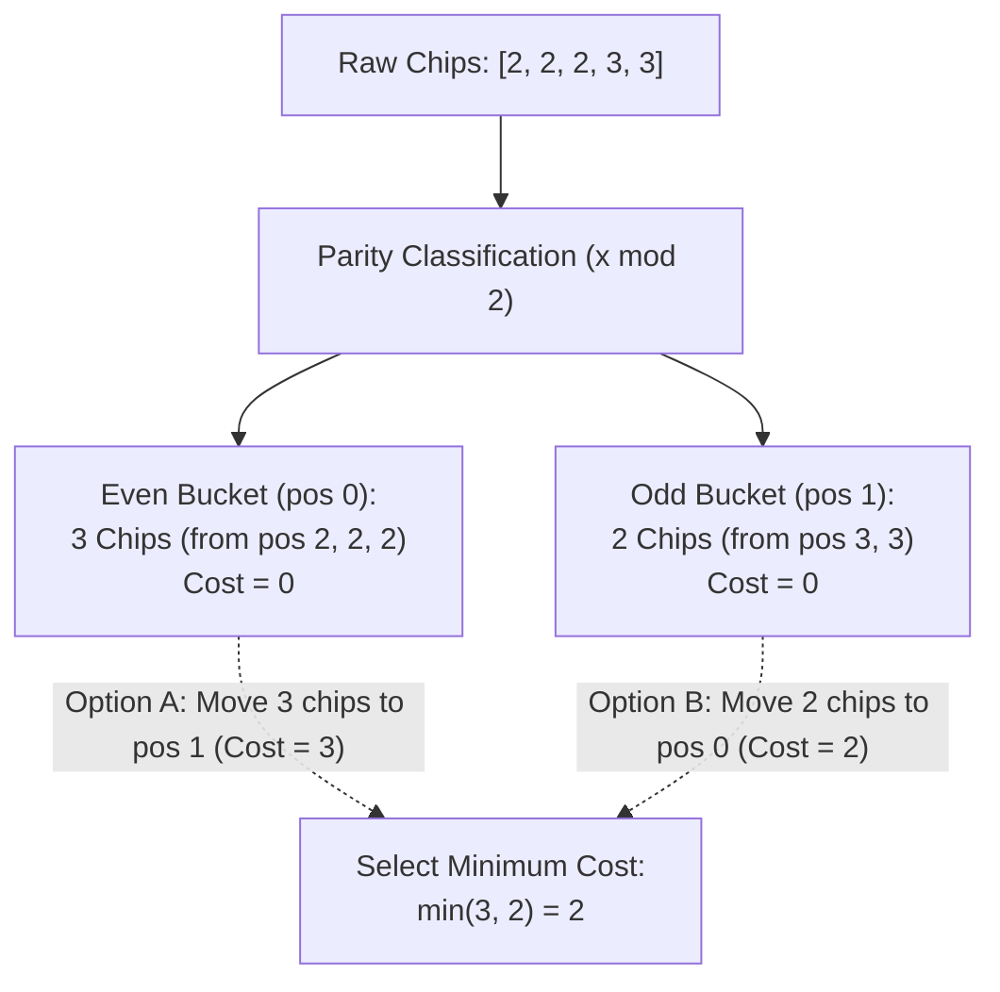

# Guided Example: Minimum Cost to Move Chips to the Same Position

## 1. Problem Essence & Algorithmic Mental Model

We are provided with an array $\text{position}$ where $\text{position}[i]$ denotes the initial 1D coordinate of the $i$-th chip. Multiple chips may initially occupy the same coordinate. We may move chips along the integer line according to two rules:
1. **Even-Step Jump ($\pm 2$)**: Move a chip 2 units to the left or right at a cost of **$0$** (completely free).
2. **Odd-Step Step ($\pm 1$)**: Move a chip 1 unit to the left or right at a cost of **$1$**.

Our objective is to compute the minimum total cost required to consolidate all chips onto the exact same position on the line.

A naive optimization model might attempt to evaluate every distinct integer coordinate $p \in [\min, \max]$ as a potential destination, computing distances and costs for all chips, resulting in $\mathcal{O}(N \cdot \text{range})$ operations.

However, the problem structure is entirely governed by **Parity Invariance (Modulo 2 Equivalence Classes)**:
1. **Free Intra-Parity Transport**: Moving by $\pm 2$ preserves the parity of a chip's coordinate ($x \equiv x \pm 2 \pmod 2$). Because this movement incurs zero cost, any chip at an even coordinate can be moved to **any** other even coordinate for free. Likewise, any chip at an odd coordinate can be moved to any other odd coordinate for free.
2. **Consolidation into Two Canonical Coordinates**:
   Without spending a single unit of cost:
   - All chips at even positions can freely assemble at coordinate $0$.
   - All chips at odd positions can freely assemble at coordinate $1$.
3. **The Single-Cost Cross-Parity Bridge**:
   Now, all $E$ even chips reside at $0$, and all $O$ odd chips reside at $1$. To unite them on the same square:
   - Move all $E$ chips from $0 \to 1$: each transition costs $1$, totaling $E \times 1 = E$.
   - Move all $O$ chips from $1 \to 0$: each transition costs $1$, totaling $O \times 1 = O$.
   The globally minimal cost is simply the smaller of the two parity counts:
   $$\text{MinCost} = \min(E, O)$$

```
Positions: [1, 2, 3]
- Chip 1 at pos 1 (Odd)
- Chip 2 at pos 2 (Even)
- Chip 3 at pos 3 (Odd)

Step 1: Free Parity Clustering (Cost = 0)
- Move Chip 3 from pos 3 to pos 1 (distance 2, cost 0!)
- Move Chip 2 to pos 0 (cost 0)
State: 2 chips at pos 1 (Odd), 1 chip at pos 0 (Even)

Step 2: Cross Parity Bridge
Option A: Move 1 Even chip (pos 0 -> 1) -> Cost = 1  <-- OPTIMAL!
Option B: Move 2 Odd chips (pos 1 -> 0)  -> Cost = 2
Result = min(2, 1) = 1
```

---

## 2. Mathematical Formalism & Invariants

Let $X = [x_0, x_1, \dots, x_{n-1}]$ be the array of chip coordinates.
Define the projection onto the finite field $\mathbb{Z}_2$:
$$\pi(x) = x \bmod 2 \in \{0, 1\}$$

### Cost Metric Between Positions
For any start position $u$ and target position $v$:
The minimum cost to transport a chip from $u$ to $v$ is:
$$\text{cost}(u, v) = |u - v| \bmod 2$$
Proof: Let $|u - v| = 2k + r$ where $r \in \{0, 1\}$ and $k \ge 0$. The chip can perform $k$ jumps of size 2 (cost $k \times 0 = 0$) followed by $r$ steps of size 1 (cost $r \times 1 = r$). Since each step of size 1 flips parity, $r = 1$ if and only if $\pi(u) \neq \pi(v)$. Thus $\text{cost}(u, v) = [\pi(u) \neq \pi(v)]$.

### Global Objective Function
For any target coordinate $T \in \mathbb{Z}$:
The total cost to bring all $n$ chips to target $T$ is:
$$\Phi(T) = \sum_{i=0}^{n-1} [\pi(x_i) \neq \pi(T)]$$
Notice that $\Phi(T)$ depends strictly on the parity of $T$:
- If $T$ is chosen to be even ($\pi(T) = 0$):
  $$\Phi_{\text{even}} = \sum_{i=0}^{n-1} [\pi(x_i) = 1] = \text{Count}(\text{Odd})$$
- If $T$ is chosen to be odd ($\pi(T) = 1$):
  $$\Phi_{\text{odd}} = \sum_{i=0}^{n-1} [\pi(x_i) = 0] = \text{Count}(\text{Even})$$

### Optimal Solution
The minimum cost across all possible target coordinates is:
$$\text{MinCost} = \min_{T \in \mathbb{Z}} \Phi(T) = \min(\text{Count}(\text{Odd}), \ \text{Count}(\text{Even}))$$

---

## 3. Concrete Example Execution & State Evolution

Consider the chip array:
$$\text{position} = [2, 2, 2, 3, 3]$$
Here $n = 5$.

### Parity Classification Trace

| Chip Index $i$ | Position $x_i$ | Parity $x_i \bmod 2$ | Classification | Running Even Count $E$ | Running Odd Count $O$ |
|---|---|---|---|---|---|
| 0 | 2 | 0 | Even | 1 | 0 |
| 1 | 2 | 0 | Even | 2 | 0 |
| 2 | 2 | 0 | Even | 3 | 0 |
| 3 | 3 | 1 | Odd | 3 | 1 |
| 4 | 3 | 1 | Odd | 3 | 2 |

Summary:
- Total Even Chips: $E = 3$.
- Total Odd Chips: $O = 2$.



### Candidate Target Comparison
- **Target $T = 2$ (Even Destination)**:
  - Chips at 2, 2, 2 pay 0 cost.
  - Chips at 3, 3 move 1 step to 2: pay $1 + 1 = 2$.
  - Total cost = $2$.
- **Target $T = 3$ (Odd Destination)**:
  - Chips at 3, 3 pay 0 cost.
  - Chips at 2, 2, 2 move 1 step to 3: pay $1 + 1 + 1 = 3$.
  - Total cost = $3$.

Optimal decision: Choose target with even parity, yielding minimum cost **2**.

---

## 4. Multi-Approach Comparison & Trade-Offs

| Approach / Dimension | Exhaustive Destination Grid Search | Median Position Heuristic | Parity Modulo Reduction (Optimal) |
|---|---|---|---|
| **Strategy** | Test all integers $T \in [\min, \max]$ | Calculate geometric median, evaluate cost | Tally even vs odd counts, take minimum |
| **Time Complexity** | $\mathcal{O}(N \cdot \text{range})$ | $\mathcal{O}(N \log N)$ (Fails on cost model!) | $\mathcal{O}(N)$ strictly single pass |
| **Space Complexity** | $\mathcal{O}(1)$ | $\mathcal{O}(1)$ | $\mathcal{O}(1)$ strictly two counters |
| **Mathematical Correctness** | Correct, but TLE if range is $10^9$ | Incorrect (Euclidean median is invalid) | Mathematically provably optimal |
| **Execution Speed** | Up to billions of cycles | Sorting overhead | Instantaneous bitwise tallying |

```
Execution Comparison:

Exhaustive Grid Search (Range 10^9):
T = 1, T = 2, T = 3, ... T = 1,000,000,000 (Completely impossible!)

Parity Reduction (Optimal):
[Count Evens] ---> [Count Odds] ---> [min(E, O)] (Executes in 1 microsecond!)
```

---

## 5. Algorithmic Edge Cases & Boundary Analysis

| Boundary Scenario | Input Example | Expected Cost | Behavioral Verification |
|---|---|---|---|
| **All Chips on Same Parity** | `[2, 4, 6, 8]` | 0 | $E = 4, O = 0 \implies \min(4, 0) = 0$. All chips can move to position 2 for free. |
| **Single Chip** | `[10]` | 0 | $E = 1, O = 0 \implies \min(1, 0) = 0$. Chip is already consolidated. |
| **Equal Parity Split** | `[1, 2, 3, 4]` ($E = 2, O = 2$) | 2 | Both choices yield identical cost: $\min(2, 2) = 2$. |
| **Large Coordinates** | `[1000000000, 1]` | 1 | $E = 1, O = 1 \implies \min(1, 1) = 1$. Parity modulo works regardless of magnitude. |
| **Two Chips at Same Spot** | `[5, 5]` | 0 | $E = 0, O = 2 \implies \min(0, 2) = 0$. Already at identical coordinate. |

---

## 6. Mathematical Verification & Complexity Derivation

Let $N = |\text{position}|$ be the number of chips in the array.

### Single-Pass Tallying:
1. Initialize scalar counter: $\text{odd\_count} = 0$.
2. Iterate through each element $p \in \text{position}$:
   - Compute bitwise parity: $p \ \& \ 1$ (or $p \bmod 2$).
   - Add to accumulator: $\text{odd\_count} \leftarrow \text{odd\_count} + (p \ \& \ 1)$.
   - This requires exactly 1 bitwise AND and 1 integer addition per element.
   - Total operations: $N$.
3. Compute even count:
   $$\text{even\_count} = N - \text{odd\_count}$$
4. Compute minimum:
   $$\min(\text{odd\_count}, \text{even\_count})$$
   (1 subtraction, 1 comparison).

### Asymptotic Summary:
- **Total Time Complexity:** $\mathcal{O}(N)$ strictly linear time.
- **Total Auxiliary Space Complexity:** $\mathcal{O}(1)$ strictly constant memory (two scalar registers).

---

## 7. Synthesis & Strategic Takeaways

1. **Zero-Cost Free Moves as Equivalence Relations**: Whenever a movement operator has cost zero, it defines an equivalence relation over coordinates. All states reachable via cost-zero moves can be contracted into a single topological super-node without loss of generality.
2. **Dimensional Collapse via Modular Arithmetic**: Moving $\pm 2$ for free collapses the infinite 1D lattice $\mathbb{Z}$ into the two-element quotient group $\mathbb{Z}_2 = \{0, 1\}$. The geometric optimization problem reduces to counting members of each coset.
3. **Beware of False Continuous Intuitions**: In Euclidean distance minimization, the optimal gathering point is the median. Here, because step-2 moves are free, the continuous distance metric is completely broken, and parity dictates the outcome.
