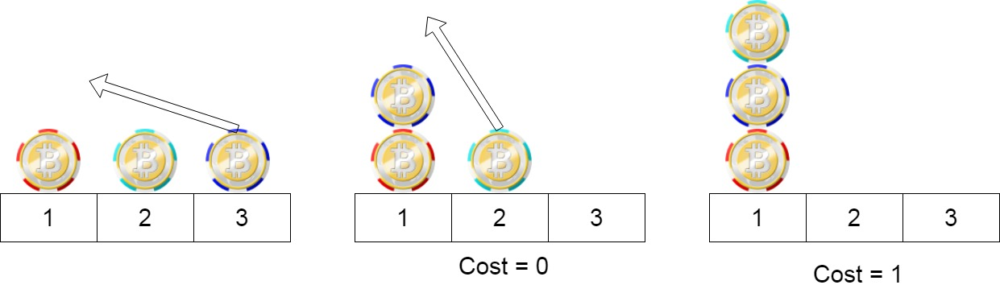
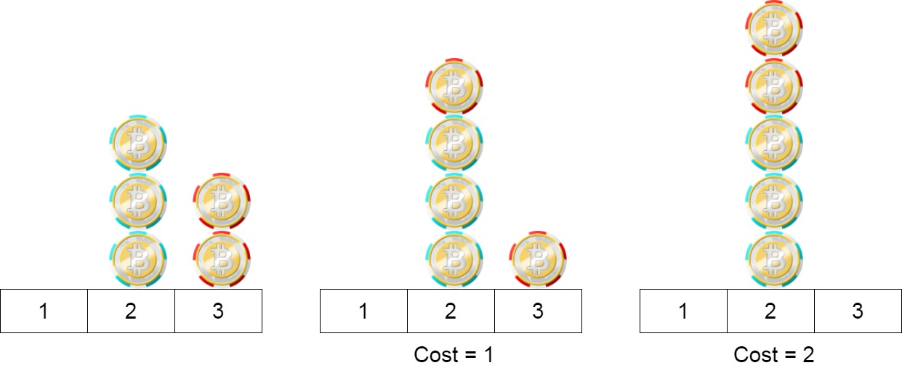

### 1. Description

We have `n` chips, where the position of the $i^{\text{th}}$ chip is $\text{position}[i]$.

We need to move all the chips to **the same position**. In one step, we can change the position of the $i^{\text{th}}$ chip from $\text{position}[i]$ to:

- $\text{position}[i] + 2$ or $\text{position}[i] - 2$ with $cost = 0$.

- $\text{position}[i] + 1$ or $\text{position}[i] - 1$ with $cost = 1$.

Return *the minimum cost* needed to move all the chips to the same position.

### 2. Function Contract

**Inputs**

- `position`: Input parameter (`List[int]`).

**Return value**

- Returns `int`.

### 3. Examples

#### Example 1

- **Input:** $position = [1,2,3]$
- **Output:** `1`
- **Explanation:** First step: Move the chip at position 3 to position 1 with cost = 0.
Second step: Move the chip at position 2 to position 1 with cost = 1.
Total cost is 1.

#### Example 2

- **Input:** $position = [2,2,2,3,3]$
- **Output:** `2`
- **Explanation:** We can move the two chips at position  3 to position 2. Each move has cost = 1. The total cost = 2.

#### Example 3

- **Input:** $position = [1,1000000000]$
- **Output:** `1`

### 4. Constraints

- $1 \le \text{position.length} \le 100$

- $1 \le \text{position}[i] \le 10^{9}$
