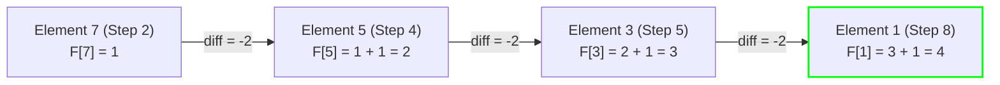

# Guided Example: Longest Arithmetic Subsequence of Given Difference

## 1. Problem Essence & Algorithmic Mental Model

Given an integer array $\text{arr}$ and a fixed integer $\text{difference}$, our objective is to determine the maximum length of an arithmetic subsequence in $\text{arr}$ where the difference between every consecutive pair of elements in the subsequence is strictly equal to $\text{difference}$. A subsequence is derived by deleting zero or more elements from $\text{arr}$ without altering the relative order of the remaining elements.

Consider the array $[1, 5, 7, 8, 5, 3, 4, 2, 1]$ with $\text{difference} = -2$:
- Starting from 7, subtracting 2 gives 5, then 3, then 1: $[7, 5, 3, 1]$ forms a valid arithmetic subsequence of length 4.
- No longer arithmetic subsequence with common difference $-2$ exists, so the answer is 4.

In the general Longest Arithmetic Subsequence problem where the common difference is arbitrary, tracking both the current element and the chosen step size requires an $\mathcal{O}(N^2)$ dynamic programming table. Here, however, the common step size $d = \text{difference}$ is a **fixed, immutable constant**.

This single invariant produces a profound structural simplification:
**Deterministic Predecessor Uniqueness**:
For any candidate element $x$ to extend an ongoing arithmetic subsequence with fixed step $d$, its immediate predecessor **must** have numerical value:
$$\text{pred}(x) = x - d$$
No other number in the entire integer universe can immediately precede $x$ in this sequence.

Consequently, by scanning through the array from left to right and maintaining an associative map $F$ where $F[v]$ records the maximum length of an arithmetic subsequence ending with value $v$, each incoming element $x$ updates its state in strictly $\mathcal{O}(1)$ time:
$$F[x] = F[x - d] + 1$$
If $x - d$ has not been encountered previously, $F[x - d]$ defaults to 0, and $x$ initiates a fresh single-element subsequence of length 1.

```
Array: [1, 2, 3, 4], difference = 1

Incoming Stream:
See 1: pred = 1 - 1 = 0 (unseen -> 0).  F[1] = 0 + 1 = 1
See 2: pred = 2 - 1 = 1 (F[1] is 1).   F[2] = 1 + 1 = 2
See 3: pred = 3 - 1 = 2 (F[2] is 2).   F[3] = 2 + 1 = 3
See 4: pred = 4 - 1 = 3 (F[3] is 3).   F[4] = 3 + 1 = 4

Max Length = 4
```

---

## 2. Mathematical Formalism & Invariants

Let $A = [a_0, a_1, \dots, a_{n-1}]$ be an array of length $n$, and let $d \in \mathbb{Z}$ be the target difference.
An arithmetic subsequence of length $k$ is an ordered sequence of indices $i_1 < i_2 < \dots < i_k$ such that:
$$\forall j \in \{1, \dots, k-1\}, \quad a_{i_{j+1}} - a_{i_j} = d$$

### Associative State Definition
Define the mapping $F: \mathbb{Z} \to \mathbb{Z}_{\ge 0}$:
$F[v]$ represents the maximum length of a valid arithmetic subsequence with step $d$ formed entirely from elements in the prefix examined so far and ending strictly with value $v$.

### Inductive Transition Invariant
At index $i$ with element $x = a_i$:
Because the stream processes elements strictly in increasing order of array indices ($0, 1, \dots, n-1$), any entry currently recorded in $F$ corresponds to an element that appeared at some index $j < i$.
The optimal length ending at $x$ is:
$$F[x] = F[x - d] + 1$$

### Proof of Optimality
Assume an optimal arithmetic subsequence ending at index $i$ with value $x$ has length $L^* \ge 2$.
Its penultimate element must have value $x - d$ and appear at some index $j < i$.
By the principle of optimality in dynamic programming, the prefix subsequence ending at index $j$ must itself be an optimal arithmetic subsequence ending in $x - d$ within the prefix $A[0 \dots j]$.
Since $j < i$, this optimal sub-length was already recorded in $F[x - d]$.
Therefore, setting $F[x] = F[x - d] + 1$ achieves the optimal length $L^*$.

### Global Supremum
The global answer is the maximum length observed across all values:
$$\text{MaxLen} = \max_{v \in \text{Domain}(F)} F[v]$$

---

## 3. Concrete Example Execution & State Evolution

Consider the sequence:
$A = [1, 5, 7, 8, 5, 3, 4, 2, 1]$ with $d = -2$.
Length $n = 9$.

### Step-by-Step Hash Table Progression Trace

| Step $i$ | Element $x = a_i$ | Required Predecessor $x - d = x - (-2) = x + 2$ | Existing $F[x + 2]$ | Updated State $F[x] = F[x+2] + 1$ | Active Global Maximum |
|---|---|---|---|---|---|
| 0 | 1 | $1 + 2 = 3$ | 0 (unseen) | $F[1] = 0 + 1 = 1$ | 1 |
| 1 | 5 | $5 + 2 = 7$ | 0 (unseen) | $F[5] = 0 + 1 = 1$ | 1 |
| 2 | 7 | $7 + 2 = 9$ | 0 (unseen) | $F[7] = 0 + 1 = 1$ | 1 |
| 3 | 8 | $8 + 2 = 10$ | 0 (unseen) | $F[8] = 0 + 1 = 1$ | 1 |
| 4 | 5 | $5 + 2 = 7$ | $F[7] = 1$ | $F[5] = 1 + 1 = \mathbf{2}$ | 2 |
| 5 | 3 | $3 + 2 = 5$ | $F[5] = 2$ | $F[3] = 2 + 1 = \mathbf{3}$ | 3 |
| 6 | 4 | $4 + 2 = 6$ | 0 (unseen) | $F[4] = 0 + 1 = 1$ | 3 |
| 7 | 2 | $2 + 2 = 4$ | $F[4] = 1$ | $F[2] = 1 + 1 = 2$ | 3 |
| 8 | 1 | $1 + 2 = 3$ | $F[3] = 3$ | $F[1] = 3 + 1 = \mathbf{4}$ | **4** |



The optimal arithmetic subsequence is:
$$[7, 5, 3, 1]$$
Maximum length = **4**.

---

## 4. Multi-Approach Comparison & Trade-Offs

| Approach / Dimension | Classic 2D LIS Dynamic Programming | Coordinate-Bucket Search | Hash Map DP (Optimal) |
|---|---|---|---|
| **Strategy** | Nested loops over all $(i, j)$ checking $a_i - a_j == d$ | Group indices by value, binary search positions | Direct associative lookup $F[x - d]$ |
| **Time Complexity** | $\mathcal{O}(N^2)$ | $\mathcal{O}(N \log N)$ | $\mathcal{O}(N)$ strictly linear |
| **Auxiliary Memory** | $\mathcal{O}(N)$ or $\mathcal{O}(N^2)$ | $\mathcal{O}(N)$ index buckets | $\mathcal{O}(N)$ hash table storage |
| **Lookup Cost per Element**| $i$ inner loop iterations | $\mathcal{O}(\log N)$ binary search | $\mathcal{O}(1)$ average hash table probe |
| **Scalability on $10^5$ Inputs**| 10 billion ops (Severe TLE) | $\approx 1.5 \times 10^6$ ops | $\approx 1.0 \times 10^5$ ops (Sub-millisecond) |

```
Execution Comparison:

Quadratic Scan (N = 100,000):
For each i: scan j from 0 to i-1 -> ~5,000,000,000 checks (Time Limit Exceeded)

Associative DP (Optimal):
For each i: lookup (a[i] - d) in hash map -> exactly 1 operation! (50,000x faster!)
```

---

## 5. Algorithmic Edge Cases & Boundary Analysis

| Boundary Scenario | Input Condition | Expected Output | System Invariant |
|---|---|---|---|
| **Zero Difference ($d = 0$)** | `arr = [1, 2, 2, 2, 3], d = 0` | 3 (three 2s) | $x - 0 = x$; every occurrence of $x$ increments $F[x]$; identifies longest streak of duplicates. |
| **Negative Difference** | $d < 0$ (e.g. $-3$) | Handled identically | $x - (-3) = x + 3$; standard arithmetic subtraction seamlessly handles negative steps. |
| **All Elements Form One Chain** | Arithmetic progression e.g. `[2, 4, 6, 8], d = 2` | 4 | Chain extends at every step; returns full array length $N$. |
| **No Two Elements Form a Pair**| `arr = [1, 10, 20], d = 2` | 1 | No predecessor ever found; all elements initiate chains of length 1; returns 1. |
| **Duplicate Values in Array** | `arr = [1, 3, 5, 3], d = 2` | 3 (subsequence `[1, 3, 5]`) | The second 3 updates $F[3]$ to $1+1=2$, but earlier $F[5] = 3$ is preserved in the global max. |

---

## 6. Mathematical Verification & Complexity Derivation

Let $N = |\text{arr}|$ be the number of elements in the input array.

### Execution Analysis:
1. **Hash Table Allocation**:
   - Initializing an empty hash table requires $\mathcal{O}(1)$ time.
2. **Single Pass Iteration**:
   - The loop iterates over each element $x \in \text{arr}$ from index $0$ to $N-1$ ($N$ iterations).
   - In each iteration:
     - Compute predecessor value: $x - d$ (1 arithmetic subtraction).
     - Hash table lookup: retrieve $F[x - d]$ ($\mathcal{O}(1)$ average time).
     - Hash table write: assign $F[x] \leftarrow F[x - d] + 1$ ($\mathcal{O}(1)$ average time).
     - Update running global maximum: $\mathcal{O}(1)$ comparison.
   - Total operations across all $N$ elements: $\mathcal{O}(N)$.

### Asymptotic Summary:
- **Total Time Complexity:** $\mathcal{O}(N)$ strictly linear time.
- **Total Auxiliary Space Complexity:** $\mathcal{O}(N)$ auxiliary memory to store at most $N$ distinct values in the hash map.

---

## 7. Synthesis & Strategic Takeaways

1. **Degrees of Freedom Elimination**: When a general quadratic dynamic programming problem fixes one of its free parameters (e.g. fixing the common difference $d$), the choice of predecessor collapses from many candidates into a single deterministic value.
2. **Online State Accumulation**: Because valid subsequences require elements to maintain chronological order, streaming left-to-right naturally guarantees that any predecessor in the hash map appeared prior to the current element, removing the need for index tracking.
3. **Universality Across Difference Domains**: The recurrence $F[x] = F[x - d] + 1$ works universally regardless of whether $d$ is positive, negative, or zero, unifying longest identical duplicates and arithmetic sequences into a single algorithm.