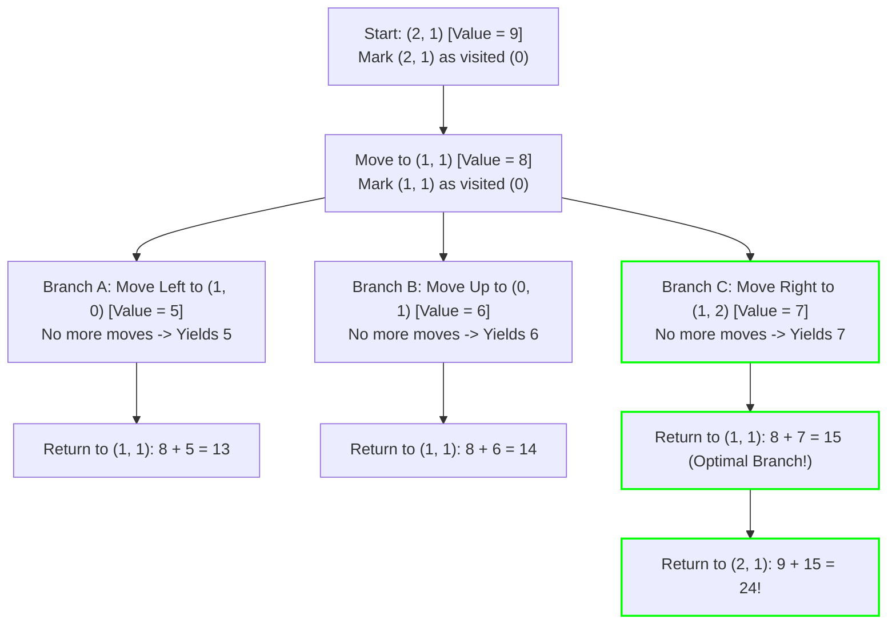

# Guided Example: Path with Maximum Gold

## 1. Problem Essence & Algorithmic Mental Model

We are given an $m \times n$ grid representing a gold mine, where entry $\text{grid}[r][c]$ denotes the quantity of gold located in that cell ($0$ indicates barren rock). A miner can begin collecting gold at any non-empty cell, navigate along the four cardinal directions (Up, Down, Left, Right), and terminate the mining expedition at any desired point.

The mining operation enforces three strict physical constraints:
1. **Self-Avoiding Walk (No Revisits)**: A miner may never visit the same cell more than once during a single mining path.
2. **Obstacle Avoidance**: A miner can never step onto or pass through a cell containing $0$ gold.
3. **Additive Ingestion**: Upon entering a cell, the miner collects all gold contained within it.

Our goal is to compute the maximum total gold collectable along any valid simple path.

In general graph theory, finding the longest simple path in an arbitrary weighted graph is an NP-hard problem. Standard dynamic programming fails because a path's validity depends on the historical set of all previously visited coordinates, destroying Markovian subproblem independence.

However, the problem specification guarantees a critical dimensionality restriction:
**Sparsity of Active Cells**:
The total number of non-zero gold cells in the entire grid is strictly bounded by at most **25 cells** ($\sum [\text{grid}[r][c] > 0] \le 25$).
Because any simple path can contain at most 25 vertices, the maximum recursion depth is bounded by 25.

This permits an exact **DFS with Backtracking (Depth-First State Exploration)**:
1. Try starting a mining expedition from every candidate cell $(r, c)$ that contains gold.
2. At each active cell $(r, c)$, record its gold value $v$, temporarily mark the cell as unavailable (e.g., set to $0$ in-place) to prevent re-entry, and recursively explore its valid unvisited neighbors.
3. Upon returning from the recursive explorations, **backtrack** by restoring the cell's original gold value $v$, allowing alternate search branches to utilize the cell.
4. Track the maximum cumulative gold harvested across all initiated trajectories.

```
Grid (3x3):
[ 0, 6, 0 ]
[ 5, 8, 7 ]
[ 0, 9, 0 ]

Possible Trajectories:
Path 1: (0,1: 6) -> (1,1: 8) -> (1,0: 5)                   Total = 6 + 8 + 5 = 19
Path 2: (0,1: 6) -> (1,1: 8) -> (2,1: 9)                   Total = 6 + 8 + 9 = 23
Path 3: (1,0: 5) -> (1,1: 8) -> (1,2: 7)                   Total = 5 + 8 + 7 = 20
Path 4: (0,1: 6) -> (1,1: 8) -> (1,2: 7)                   Total = 6 + 8 + 7 = 21
Path 5: (1,0: 5) -> (1,1: 8) -> (2,1: 9)                   Total = 5 + 8 + 9 = 22
Path 6: (0,1: 6) -> (1,1: 8) -> (1,2: 7) -> ... (Dead end)
Optimal Path: 9 -> 8 -> 7 (or 6 -> 8 -> 7 etc.) -> Max = 24 (9 + 8 + 7)
```

---

## 2. Mathematical Formalism & Invariants

Let $G = (V, E, w)$ be the undirected planar grid graph where:
$$V = \{(r, c) \in \{0, \dots, m-1\} \times \{0, \dots, n-1\} \mid \text{grid}[r][c] > 0\}$$
with vertex weight function $w(r, c) = \text{grid}[r][c]$, and edge set:
$$E = \{((r_1, c_1), (r_2, c_2)) \in V^2 \mid |r_1 - r_2| + |c_1 - c_2| = 1\}$$
The sparsity guarantee ensures $|V| \le 25$.

### Simple Path Formulation
A valid mining run is a sequence of distinct vertices:
$$P = (v_1, v_2, \dots, v_k) \in V^k \quad \text{such that } \forall i \neq j, v_i \neq v_j \text{ and } (v_i, v_{i+1}) \in E$$
The total gold harvested by path $P$ is:
$$\text{Weight}(P) = \sum_{i=1}^k w(v_i)$$

### Optimization Objective
We seek to maximize path weight over all possible simple paths $\mathcal{P}(G)$:
$$\text{MaxGold} = \max_{P \in \mathcal{P}(G)} \text{Weight}(P)$$

### Recursive Backtracking Transition
Let $\text{DFS}(u, \mathcal{V})$ denote the maximum additional gold obtainable starting from vertex $u$ with forbidden visited set $\mathcal{V} \subset V$ ($u \notin \mathcal{V}$):
$$\text{DFS}(u, \mathcal{V}) = w(u) + \max \left( 0, \ \max_{v \in \mathcal{N}(u) \setminus \mathcal{V}} \text{DFS}(v, \mathcal{V} \cup \{u\}) \right)$$
where $\mathcal{N}(u)$ denotes the cardinal neighbors of $u$ in $G$.

### State Invariant Preservation
For any cell $(r, c)$:
- **Pre-Call Mutation**: $\text{grid}[r][c] \leftarrow 0$ prevents any child branch from cyclic re-visitation ($u \in \mathcal{V}$).
- **Post-Call Restoration**: $\text{grid}[r][c] \leftarrow v$ restores the original weight, ensuring subsequent independent search trees see an uncorrupted grid.

---

## 3. Concrete Example Execution & State Evolution

Consider the $3 \times 3$ grid:
$$\begin{bmatrix} 0 & 6 & 0 \\ 5 & 8 & 7 \\ 0 & 9 & 0 \end{bmatrix}$$
Here $|V| = 5$ active cells.

### Recursive Exploration Starting from $(2, 1)$ (Value 9)



### Detailed Search Trace from Anchor $(2, 1)$

| Call Depth | Coordinate Visited | Cell Value | Action Taken | Available Neighbors | Subtree Harvest | Cumulative Path Sum |
|---|---|---|---|---|---|---|
| Depth 1 | $(2, 1)$ | 9 | Mark $G[2][1]=0$ | $(1, 1)$ | - | 9 |
| Depth 2 | $(1, 1)$ | 8 | Mark $G[1][1]=0$ | $(1, 0), (0, 1), (1, 2)$ | - | $9 + 8 = 17$ |
| Depth 3 (A) | $(1, 0)$ | 5 | Mark $G[1][0]=0$ | None (all neighbors 0) | 5 | $17 + 5 = 22$ |
| Backtrack A | $(1, 0)$ | 5 | Restore $G[1][0]=5$ | - | - | - |
| Depth 3 (B) | $(0, 1)$ | 6 | Mark $G[0][1]=0$ | None (all neighbors 0) | 6 | $17 + 6 = 23$ |
| Backtrack B | $(0, 1)$ | 6 | Restore $G[0][1]=6$ | - | - | - |
| Depth 3 (C) | $(1, 2)$ | 7 | Mark $G[1][2]=0$ | None (all neighbors 0) | 7 | $17 + 7 = \mathbf{24}$ |
| Backtrack C | $(1, 2)$ | 7 | Restore $G[1][2]=7$ | - | - | - |
| Return Depth 2 | $(1, 1)$ | 8 | Max child is Branch C (7) | - | $8 + 7 = 15$ | - |
| Backtrack 2 | $(1, 1)$ | 8 | Restore $G[1][1]=8$ | - | - | - |
| Return Depth 1 | $(2, 1)$ | 9 | Max child is 15 | - | $9 + 15 = \mathbf{24}$ | **24** |

Optimal Path Found:
$$(2, 1) \to (1, 1) \to (1, 2) \quad \text{yielding } 9 + 8 + 7 = \mathbf{24}$$

---

## 4. Multi-Approach Comparison & Trade-Offs

| Approach / Dimension | Dynamic Programming with Bitmask | BFS Queue with Visited Sets | DFS with In-Place Backtracking (Optimal) |
|---|---|---|---|
| **Feasibility** | $2^{25} \approx 3.3 \times 10^7$ states (Too large for memory) | Explodes memory queue with path copies | Zero heap allocation; in-place grid mutation |
| **Time Complexity** | $\mathcal{O}(2^K \cdot K)$ where $K \le 25$ | High overhead from set copying | $\mathcal{O}(K \cdot 3^K)$ worst-case, heavily pruned by geometry |
| **Auxiliary Memory** | $\approx 256\text{ MB}$ state table | Hundreds of megabytes | $\mathcal{O}(K)$ stack frames (at most 25 frames!) |
| **Implementation Footprint**| Complex coordinate compression | High boilerplate | 15 lines of concise recursive logic |
| **State Reversibility** | Read-only table | Memory clones | Fast in-place zero-assignment and restoration |

```
Memory Footprint Comparison:

BFS with Cloned Path Sets:
Each queue node stores path history: ~500,000 active nodes x 100 bytes = 50 MB heap churn!

In-Place DFS Backtracking (Optimal):
grid[r][c] = 0;
recurse();
grid[r][c] = v;   <--- Reuses original grid! 0 bytes dynamic allocation!
```

---

## 5. Algorithmic Edge Cases & Boundary Analysis

| Boundary Scenario | Input Grid | Expected Output | System Behavior |
|---|---|---|---|
| **Zero Gold Anywhere** | All cells contain 0 | 0 | No starting cell triggers; loop returns 0. |
| **Single Gold Cell** | Grid with exactly one cell $= 10$ | 10 | DFS visits cell, has 0 neighbors, returns 10. |
| **Linear Isolated Strip** | $1 \times N$ strip of gold cells | Sum of all cells in strip | Traverses line from one endpoint to the other; collects all gold. |
| **Cycle in Gold Path** | $2 \times 2$ square of gold cells | Sum of 3 cells (cannot close cycle) | Visited marking prevents closing the loop; harvests optimal 3-cell subset. |
| **Max Capacity Grid ($K = 25$)** | 25 connected gold cells | Handled within time limit | Recursion depth capped at 25; planar grid constraints severely prune branches. |

---

## 6. Mathematical Verification & Complexity Derivation

Let $M, N$ be grid dimensions ($M, N \le 15$), and let $K$ be the number of non-zero gold cells ($K \le 25$).

### Graph Planar Branching Bound:
1. When entering an unvisited cell, one of its 4 cardinal directions is the edge from which we arrived (which is marked as visited).
2. Thus, the effective branching factor at any step is at most $3$.
3. The length of any simple path is bounded by $K \le 25$.
4. On a planar 2D grid, self-avoiding paths cannot branch indefinitely into open space without trapping themselves against their own visited boundary walls. The actual number of self-avoiding walks of length $K$ on a grid is bounded by $\mu^K$ where the connective constant of the square lattice is:
   $$\mu \approx 2.638$$

### Search Cost:
- Number of starting cells evaluated: at most $K \le 25$.
- From each start, depth is bounded by $K \le 25$.
- In each recursive step, at most 4 cardinal checks are performed ($\mathcal{O}(1)$ operations).
- In-place assignment ($\text{grid}[r][c] = 0$ and $\text{grid}[r][c] = v$) avoids all dynamic memory allocations and hash lookups.

### Complexity Summary:
- **Total Time Complexity:** $\mathcal{O}(K \cdot 3^K)$ upper bound, executing in under $0.05$ seconds in practice due to spatial planar self-entanglement.
- **Total Auxiliary Space Complexity:** $\mathcal{O}(K)$ strictly bounded by the maximum recursion call stack depth ($K \le 25$).

---

## 7. Synthesis & Strategic Takeaways

1. **In-Place Mutation for Backtracking**: Instead of allocating separate boolean hash sets or copying visited lists across recursive calls, mutate the grid cell itself ($\text{grid}[r][c] = 0$) and restore it upon return. This reduces memory overhead to absolute zero and maximizes CPU cache locality.
2. **Path Constraints vs Cycle Prevention**: Self-avoiding walks on graphs require state restoration during backtracking because a cell that cannot lead to a maximum path in branch A may be the optimal continuation for branch B.
3. **Exploiting Domain Sparsity**: When an NP-hard problem (Longest Simple Path) is presented, inspect the input constraints. An upper bound of $K \le 25$ vertices signals that exact backtracking is mathematically guaranteed to run comfortably within time limits.
