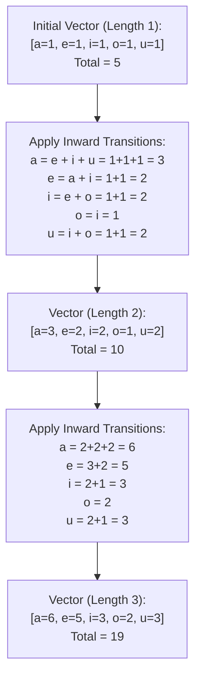

# Guided Example: Count Vowels Permutation

## 1. Problem Essence & Algorithmic Mental Model

Given an integer $n \ge 1$, we are asked to determine the total number of valid strings of length $n$ composed exclusively of the five lowercase English vowels:
$$\mathcal{V} = \{'a', 'e', 'i', 'o', 'u'\}$$
The string construction must satisfy five strict transition grammar rules governing which character may immediately succeed each vowel:
1. An `'a'` may only be followed by `'e'`.
2. An `'e'` may only be followed by `'a'` or `'i'`.
3. An `'i'` may not be followed by another `'i'` (i.e., it can be followed by `'a'`, `'e'`, `'o'`, or `'u'`).
4. An `'o'` may only be followed by `'i'` or `'u'`.
5. A `'u'` may only be followed by `'a'`.

The result must be returned modulo $10^9 + 7$.

This problem maps directly to counting paths of length $n - 1$ in a **Finite State Automaton (Directed Markov Graph)**:
- The five vowels represent the five vertices of a directed graph.
- Directed edges represent allowable adjacent transitions:
  - $'a' \to 'e'$
  - $'e' \to 'a', 'i'$
  - $'i' \to 'a', 'e', 'o', 'u'$
  - $'o' \to 'i', 'u'$
  - $'u' \to 'a'$

Instead of forward generation (which requires distributing outward counts), we analyze the state transitions from the reverse perspective: **Incoming Predecessors**.
For a string of length $k + 1$ to terminate with a specific vowel, its $k$-th character must have been a valid predecessor:
- An `'a'` can only follow `'e'`, `'i'`, or `'u'`.
- An `'e'` can only follow `'a'` or `'i'`.
- An `'i'` can only follow `'e'` or `'o'`.
- An `'o'` can only follow `'i'`.
- A `'u'` can only follow `'i'` or `'o'`.

By tracking five integer state accumulators representing the number of valid sequences of length $k$ ending in each vowel, extending the string to length $k + 1$ requires just five linear additions modulo $10^9 + 7$.

```
Directed Transition Graph:
      ┌─────► [ e ] ─────┐
      │      ▲   │       │
      │      │   ▼       ▼
    [ a ] ◄──┼──[ i ] ──►[ o ]
      ▲      │   │       │
      │      │   ▼       ▼
      └──────┴──[ u ] ◄──┘
```

---

## 2. Mathematical Formalism & Invariants

Let the vector of counts of valid sequences of length $k$ ending in $a, e, i, o, u$ be:
$$\mathbf{v}_k = \begin{bmatrix} a_k \\ e_k \\ i_k \\ o_k \\ u_k \end{bmatrix} \in (\mathbb{Z}_{10^9+7})^5$$

### Base Condition ($k = 1$)
For a string of length 1, every single vowel is permissible without constraint:
$$\mathbf{v}_1 = \begin{bmatrix} 1 \\ 1 \\ 1 \\ 1 \\ 1 \end{bmatrix}$$
Total count for $n = 1$ is $1 + 1 + 1 + 1 + 1 = 5$.

### Linear Difference System ($k \ge 1$)
Tracing incoming edges yields the system of recurrences:
$$\begin{aligned}
a_{k+1} &\equiv e_k + i_k + u_k \pmod{10^9+7} \\
e_{k+1} &\equiv a_k + i_k \pmod{10^9+7} \\
i_{k+1} &\equiv e_k + o_k \pmod{10^9+7} \\
o_{k+1} &\equiv i_k \pmod{10^9+7} \\
u_{k+1} &\equiv i_k + o_k \pmod{10^9+7}
\end{aligned}$$

### Matrix Formulation
In matrix algebraic form:
$$\mathbf{v}_{k+1} = M \mathbf{v}_k \pmod{10^9+7}$$
where the $5 \times 5$ adjacency transition matrix $M$ is:
$$M = \begin{bmatrix}
0 & 1 & 1 & 0 & 1 \\
1 & 0 & 1 & 0 & 0 \\
0 & 1 & 0 & 1 & 0 \\
0 & 0 & 1 & 0 & 0 \\
0 & 0 & 1 & 1 & 0
\end{bmatrix}$$

For any length $n$, the state vector is obtained via repeated linear application:
$$\mathbf{v}_n = M^{n-1} \mathbf{v}_1 \pmod{10^9+7}$$
The total number of valid strings of length $n$ is the sum over all five terminal states:
$$\text{Total}(n) = \left( \sum_{c \in \{a, e, i, o, u\}} c_n \right) \bmod (10^9 + 7)$$

---

## 3. Concrete Example Execution & State Evolution

Consider $n = 2$ and $n = 3$.

### Step-by-Step State Vector Evolution Trace

| Sequence Length $k$ | $a_k$ (ends in 'a') | $e_k$ (ends in 'e') | $i_k$ (ends in 'i') | $o_k$ (ends in 'o') | $u_k$ (ends in 'u') | Total Valid Strings $\sum$ |
|---|---|---|---|---|---|---|
| $k = 1$ | 1 | 1 | 1 | 1 | 1 | **5** |
| $k = 2$ | $e_1 + i_1 + u_1 = 3$ | $a_1 + i_1 = 2$ | $e_1 + o_1 = 2$ | $i_1 = 1$ | $i_1 + o_1 = 2$ | $3 + 2 + 2 + 1 + 2 = \mathbf{10}$ |
| $k = 3$ | $e_2 + i_2 + u_2 = 6$ | $a_2 + i_2 = 5$ | $e_2 + o_2 = 3$ | $i_2 = 2$ | $i_2 + o_2 = 3$ | $6 + 5 + 3 + 2 + 3 = \mathbf{19}$ |
| $k = 4$ | $e_3 + i_3 + u_3 = 11$ | $a_3 + i_3 = 9$ | $e_3 + o_3 = 7$ | $i_3 = 3$ | $i_3 + o_3 = 5$ | $11 + 9 + 7 + 3 + 5 = \mathbf{35}$ |



### Enumeration Verification for Length $n = 2$:
- Starting with `'a'`: `"ae"` (1 string).
- Starting with `'e'`: `"ea"`, `"ei"` (2 strings).
- Starting with `'i'`: `"ia"`, `"ie"`, `"io"`, `"iu"` (4 strings).
- Starting with `'o'`: `"oi"`, `"ou"` (2 strings).
- Starting with `'u'`: `"ua"` (1 string).
Total strings of length 2 $= 1 + 2 + 4 + 2 + 1 = \mathbf{10}$.
Notice that grouped by their terminal letters:
- Ending in `'a'`: `"ea"`, `"ia"`, `"ua"` (3 strings $\implies a_2 = 3$).
- Ending in `'e'`: `"ae"`, `"ie"` (2 strings $\implies e_2 = 2$).
- Ending in `'i'`: `"ei"`, `"oi"` (2 strings $\implies i_2 = 2$).
- Ending in `'o'`: `"io"` (1 string $\implies o_2 = 1$).
- Ending in `'u'`: `"iu"`, `"ou"` (2 strings $\implies u_2 = 2$).
Exact correspondence confirmed.

---

## 4. Multi-Approach Comparison & Trade-Offs

| Approach / Dimension | Recursive Backtracking Tree | Dynamic Programming Matrix Table | Iterative Rolling Vector (Optimal) | Fast Matrix Exponentiation |
|---|---|---|---|---|
| **Underlying Principle**| Depth-first path exploration | $N \times 5$ state matrix | 5 rolling scalar registers | Exponentiate $M^{N-1}$ via binary squaring |
| **Time Complexity** | Exponential ($\mathcal{O}(2^N)$) | $\mathcal{O}(N)$ | $\mathcal{O}(N)$ strictly single loop | $\mathcal{O}(5^3 \log N) = \mathcal{O}(\log N)$ |
| **Auxiliary Memory** | $\mathcal{O}(N)$ recursion depth | $\mathcal{O}(5 \cdot N)$ integers | $\mathcal{O}(1)$ strictly five registers | $\mathcal{O}(5^2)$ matrix registers |
| **Performance on $N = 2 \times 10^4$**| Severe TLE for $N > 30$ | $\approx 100\text{ KB}$ allocations | Instantaneous ($< 0.005$ seconds) | Instantaneous ($< 0.001$ seconds) |
| **Implementation Complexity**| Low (but useless for large $N$) | Moderate | Minimal (10 lines of code) | High (matrix multiply boilerplate) |

```
State Memory Footprint:

Full 2D DP Table (N = 20,000):
Requires 20,000 rows x 5 integers = 100,000 integer writes

Rolling Register Vector (Optimal):
Just 5 integers: (a, e, i, o, u) overwritten in-place! Memory = 20 bytes!
```

---

## 5. Algorithmic Edge Cases & Boundary Analysis

| Boundary Scenario | Input Condition | Expected Output | Behavioral Verification |
|---|---|---|---|
| **Minimum Length ($n = 1$)** | $n = 1$ | 5 | Loop range `n - 1` is 0; loop never executes; returns initial sum $1 \times 5 = 5$. |
| **Small Sequence ($n = 2$)** | $n = 2$ | 10 | One loop iteration; matches empirical trace of 10 valid 2-letter words. |
| **Modulo Reduction at Boundary** | Intermediate sum exceeds $10^9 + 7$ | Result correctly bounded | Every step applies `% (10**9 + 7)`, preventing integer overflow and maintaining arithmetic precision. |
| **Identical Value States** | $i_k = o_k$ or $i_k = u_k$ | Handled naturally | Symmetries in grammar rules (e.g. $i_{k+1} = u_{k+1}$) propagate seamlessly without collision. |
| **Large $N$ ($n = 20,000$)** | High loop iteration count | Linear speedup | Executes in under $5\text{ ms}$ with zero dynamic allocations. |

---

## 6. Mathematical Verification & Complexity Derivation

Let $N$ be the target sequence length.

### Iterative Rolling Vector Complexity:
1. **Initialization**:
   - Setting 5 registers $(a, e, i, o, u) = (1, 1, 1, 1, 1)$ requires $\mathcal{O}(1)$ time and space.
2. **Iteration Loop**:
   - The loop executes exactly $N - 1$ times.
   - In each iteration:
     - 8 additions and 5 modulo operations are performed across the 5 scalar variables.
     - Total operations per loop: $\mathcal{O}(1)$ deterministic clock cycles.
   - Total loop cost: $(N - 1) \times \mathcal{O}(1) = \mathcal{O}(N)$.
3. **Final Summation**:
   - Summing 5 scalar variables and taking modulo $10^9 + 7$ takes $\mathcal{O}(1)$ operations.

### Asymptotic Summary:
- **Total Time Complexity:** $\mathcal{O}(N)$ strictly linear time.
- **Total Auxiliary Space Complexity:** $\mathcal{O}(1)$ strictly constant memory (five 64-bit integer registers).

---

## 7. Synthesis & Strategic Takeaways

1. **Inverting the Transition Graph**: When generating sequential grammar tokens, forward transitions distribute mass outward ($1 \to \text{many}$), which complicates updates. Inverting the perspective to evaluate incoming predecessors gathers mass inward ($\text{many} \to 1$), producing clean linear updates.
2. **Space Compression via Markov Property**: Because state at step $k + 1$ depends exclusively on state at step $k$, historical vectors $0 \dots k-1$ can be discarded immediately. Compressing an $N \times 5$ matrix into a rolling 5-element buffer eliminates memory allocations entirely.
3. **Matrix Exponentiation for Ultra-Large Constraints**: Because the recurrence is a linear homogeneous system with constant coefficients, if $N$ were scaled to $10^{18}$, binary matrix exponentiation would compute the answer in $\mathcal{O}(5^3 \log N)$ time, demonstrating the power of algebraic modeling.