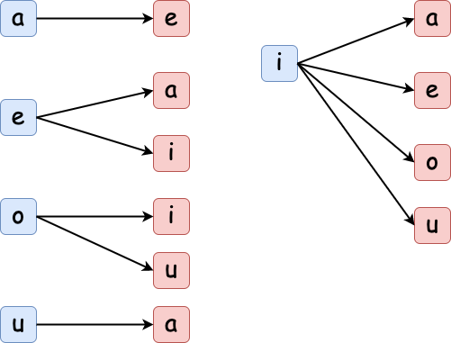
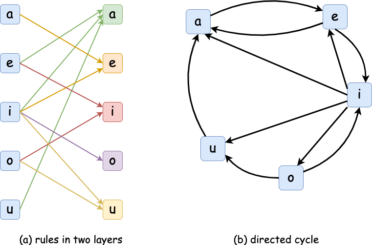

[TOC]

## Solution

---

### Overview

Don't be scared by the _complex_ rules! To solve this problem, we just need to tweak the rules a little bit.

There are five rules in the description (excluding the first bullet point) and each rule says **given a vowel, what vowels can be appended to it**. If we treat each vowel as a node, we can visualize the rules as shown in Figure 1. As you can see, Figure 1 illustrates all of the given rules.



*Figure 1. Visualization of the rules.*

We must follow all of the rules while looking for permutations, so let's put all of the rules together. As shown in Figure 2, there are two ways to visualize the rules: (a) demonstrates the relationship between each pair of letters - the current letter and the following letter while (b) presents the rules as a directed cycle.



*Figure 2. Putting the rules together.*

>We can also model this problem using the [state machine](https://en.wikipedia.org/wiki/Finite-state_machine). State machines are a mathematical model of computation and they have powerful applications in advanced dynamic programming problems such as the *Best Time to Buy and Sell Stock* problems. As shown in (b), if we picture strings that end with different vowels as different states, what we have acquired is actually a map of all possible state transitions.

That said, if we are given the number of strings of length `i` that end in each vowel, like `aCount`, `eCount`, `iCount`, `oCount`, and `uCount`, we can compute the number of strings of length $i + 1$ that end in each vowel by simple addition:
```
aCountNew = eCount + iCount + uCount
eCountNew = aCount + iCount
iCountNew = eCount + oCount
oCountNew = iCount
uCountNew = iCount + oCount
```

Starting from here, we have two approaches:

- Bottom-up: We will initialize the number of strings of size `1` to be `1` for each vowel. As the size grows from `1` to `n`, we will iteratively increase the count of strings that end in each vowel according to the rules above.
- Top-down: We can also perform the above idea recursively.

> In fact, we have more than two options.  There exist solutions that take $O(logN)$ time, however, they are more advanced and likely fall outside the scope of what you will be expected to know in an interview.  As such, they will not be discussed in this article.  All the same, we encourage you to learn about them in the [discussion section](https://leetcode.com/problems/count-vowels-permutation/discuss/?currentPage=1&orderBy=most_votes&query=log).
</br>

---

### Approach 1: Dynamic Programming (Bottom-up)

**Algorithm**

- Initialize five 1D arrays of size `n`, where $\text{aVowelPermutationCount}[i]$, $\text{eVowelPermutationCount}[i]$, $\text{iVowelPermutationCount}[i]$, $\text{oVowelPermutationCount}[i]$, and $\text{uVowelPermutationCount}[i]$ will store the number of strings of length `i` that end in each vowel accordingly.

- Initialize the first element in each of the five arrays to `1`. This is because for each starting vowel there is only one permutation when the length of the string is `1`.
- Iterate the string length, `i`, from `1` to `n`:
  - Follow the rules to count the number of strings that end in each vowel. Take the sum of the last element from each of the five arrays and that will be the answer.

**Implementation**

```python
class Solution:
    def countVowelPermutation(self, n: int) -> int:

        a_vowel_permutation_count = [1] * n
        e_vowel_permutation_count = [1] * n
        i_vowel_permutation_count = [1] * n
        o_vowel_permutation_count = [1] * n
        u_vowel_permutation_count = [1] * n

        MOD = 10 ** 9 + 7

        for i in range(1, n):
            a_vowel_permutation_count[i] = (e_vowel_permutation_count[i - 1] + i_vowel_permutation_count[i - 1] + u_vowel_permutation_count[i - 1]) % MOD
            e_vowel_permutation_count[i] = (a_vowel_permutation_count[i - 1] + i_vowel_permutation_count[i - 1]) % MOD
            i_vowel_permutation_count[i] = (e_vowel_permutation_count[i - 1] + o_vowel_permutation_count[i - 1]) % MOD
            o_vowel_permutation_count[i] = (i_vowel_permutation_count[i - 1]) % MOD
            u_vowel_permutation_count[i] = (i_vowel_permutation_count[i - 1] + o_vowel_permutation_count[i - 1]) % MOD

        result = 0

        result = (a_vowel_permutation_count[n - 1] + e_vowel_permutation_count[n - 1] + \
                  i_vowel_permutation_count[n - 1] + o_vowel_permutation_count[n - 1] + \
                  u_vowel_permutation_count[n - 1]) % MOD

        return result
```

**Complexity Analysis**

* Time complexity: $O(N)$ ($N$ equals the input length `n`). This is because iterating from `1` to `n` will take $O(N)$ time. The initializations take constant time. Putting them together gives us $O(N)$ time.

* Space complexity: $O(N)$. This is because we initialized and used five 1D arrays to store the intermediate results.

### Approach 2: Dynamic Programming (Bottom-up) with Optimized Space

It is worth noting that, in Approach 1, the `i`th element in each array only depends on the $i - 1$th element in some of the arrays. Therefore, the space complexity can be optimized by using five long variables (instead of 5 arrays of length `n`) to store the counts.

```python
class Solution:
    def countVowelPermutation(self, n: int) -> int:
        # initialize the number of strings ending with a, e, i, o, u
        a_count = e_count = i_count = o_count = u_count = 1
        MOD = 10 ** 9 + 7

        for i in range(1, n):
            a_count_new = (e_count + i_count + u_count) % MOD
            e_count_new = (a_count + i_count) % MOD
            i_count_new = (e_count + o_count) % MOD
            o_count_new = (i_count) % MOD
            u_count_new = (i_count + o_count) % MOD

            # https://docs.python.org/3/reference/expressions.html#evaluation-order
            a_count, e_count, i_count, o_count, u_count = \
                a_count_new, e_count_new, i_count_new, o_count_new, u_count_new

        return (a_count + e_count + i_count + o_count + u_count) % MOD
```

**Complexity Analysis**

* Time complexity: $O(N)$ ($N$ equals the input length `n`). This is because iterating from `1` to `n` will take $O(N)$ time. The initializations take constant time. Putting them together gives us $O(N)$ time.

* Space complexity: $O(1)$. This is because we don't use any additional data structures to store data.

<br/>

---

### Approach 3: Dynamic Programming (Top-down, Recursion)

### Overview

In **approach 1**, we filled the table `vowelPermutationCount` for each length and each vowel, by iterating length, `i`, from `1` to `n`.  However, in this approach, we will fill it from `n` to `1` using recursive calls.

Let's create a function `vowelPermutationCount(i, vowel)` that returns the number of strings of length `i` that end with `vowel`.  When `i` is `0`, the string is already of length `n`, so we return `1` signifying that `1` string has been formed.  Otherwise, in accordance with the given rules, the recursive solution will work as follows:
```
vowelPermutationCount(i, 'a') = vowelPermutationCount(i - 1, 'e') + vowelPermutationCount(i - 1, 'i') + vowelPermutationCount(i - 1, 'u')
vowelPermutationCount(i, 'e') = vowelPermutationCount(i - 1, 'a') + vowelPermutationCount(i - 1, 'i')
vowelPermutationCount(i, 'i') = vowelPermutationCount(i - 1, 'e') + vowelPermutationCount(i - 1, 'o')
vowelPermutationCount(i, 'o') = vowelPermutationCount(i - 1, 'i')
vowelPermutationCount(i, 'u') = vowelPermutationCount(i - 1, 'i') + vowelPermutationCount(i - 1, 'o')
```

We will also add memoization to the solution by using a 2D array `memo` of size `n x 5`, so that $\text{memo}[i][j]$ stores $\text{vowelPermutationCount}[i][j]$ to avoid repeated computations.

> If you are not familiar with memoization, it is an optimization technique that we use to reduce the time complexity of solutions by avoiding repeated computations. Feel free to check out our [Explore Card](https://leetcode.com/explore/learn/card/recursion-i/255/recursion-memoization/)!

#### Algorithm

We use the indices from `0` to `4` (inclusive) to represent the five vowels `a`, `e`, `i`, `o`, and `u`.

- Initialize a 2D array `memo` of size `n x 5` for memoization.
Return the sum of $vowelPermutationCount(n - 1, vowel)$ for each vowel as the answer.
- Function `vowelPermutationCount(i, vowel)`:
  - It returns a number of strings of length `i` that ends with `vowel`.
  - If this has been computed and saved to `memo`, return it directly.
  - According to each vowel, apply the appropriate rule, as stated above, to count.
  - Store the value in `memo` and return it.

Note that in Python, we use a hashmap for memoization, therefore we are able to use characters (`a`, `e`, `i`, `o`, and `u`) as the second parameter for the function `vowelPermutationCount`. The benefit of doing so is to enhance readability.

```python
class Solution:
    def countVowelPermutation(self, n: int) -> int:
        MOD = 10 ** 9 + 7
        @functools.cache
        def vowel_permutation_count(i, vowel):
            total = 1
            if i > 1:
                if vowel == 'a':
                    total = (vowel_permutation_count(i - 1, 'e') + vowel_permutation_count(i - 1, 'i') + vowel_permutation_count(i - 1, 'u')) % MOD
                elif vowel == 'e':
                    total = (vowel_permutation_count(i - 1, 'a') + vowel_permutation_count(i - 1, 'i')) % MOD
                elif vowel == 'i':
                    total = (vowel_permutation_count(i - 1, 'e') + vowel_permutation_count(i - 1, 'o')) % MOD
                elif vowel == 'o':
                    total = vowel_permutation_count(i - 1, 'i')
                else:
                    total = (vowel_permutation_count(i - 1, 'i') + vowel_permutation_count(i - 1, 'o')) % MOD
            return total

        return sum(vowel_permutation_count(n, vowel) for vowel in 'aeiou') % MOD
```

* Time complexity: $O(N)$. This is because there are $N$ recursive calls to each vowel. Therefore, the total number of function calls to `vowelPermutationCount` is $5 \cdot N$, which leads to time complexity of $O(N)$. Initializations will take $O(1)$ time. Putting them together, this solution takes $O(N)$ time.

* Space complexity: $O(N)$. This is because $O(5 \cdot N)$ space is required for memoization.  Furthermore, the size of the system stack used by recursion calls will be $O(N)$. Putting them together, this solution uses $O(N)$ space.
---

<br/>