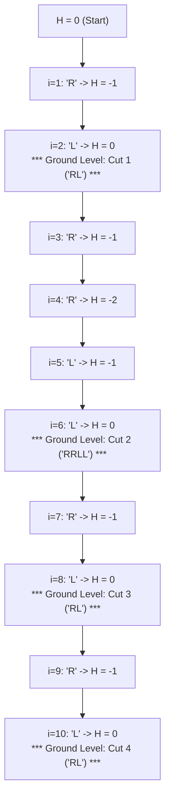

# Guided Example: Split a String in Balanced Strings

## 1. Problem Essence & Algorithmic Mental Model

Given a balanced string $s$ consisting exclusively of characters `'L'` and `'R'`, we want to partition $s$ into the maximum possible number of contiguous substrings such that each substring is itself balanced (contains an equal quantity of `'L'` and `'R'`).

Consider the string as a discrete trajectory in one dimension:
- Every `'L'` represents a step upward: $+1$.
- Every `'R'` represents a step downward: $-1$.

Starting at coordinate $0$, the walk begins at height $0$ and, because $s$ is globally balanced, terminates at height $0$. A substring is balanced if and only if the net displacement between its start and end coordinates is exactly $0$.

The crucial structural insight is **prefix height conservation**:
If a prefix of length $k$ has net height $0$, then:
1. The prefix itself contains an equal count of `'L'` and `'R'`, forming a valid balanced substring.
2. The remaining suffix must also have net height $0$, preserving the balance invariant for all subsequent characters.

```
Elevation Profile for "RLRRLLRLRL":
Height
 +1         /\      /\  /\
  0 ──*───*──/──\──*──/──*──/──* (Ground Level: 4 Zero-Crossings)
 -1    \ /        \/
 -2     V
Chars: R L R R L L R L R L
       |─| |─────| |─| |─|
       P1    P2    P3  P4   ==> 4 Balanced Substrings
```

Because every valid cut point in any partition must land at a prefix height of $0$, cutting greedily at *every* occurrence of height $0$ achieves the absolute theoretical maximum number of balanced components.

---

## 2. Mathematical Formalism & Invariants

Let the input string of length $n$ be $s = s_1 s_2 \dots s_n$, where $s_i \in \{'L', 'R'\}$.
Define the character valuation function:
$$\nu(c) = \begin{cases} +1 & \text{if } c = \text{'L'} \\ -1 & \text{if } c = \text{'R'} \end{cases}$$

Define the running prefix displacement sequence $H_k$ for $k \in \{0, 1, \dots, n\}$:
$$H_0 = 0, \quad H_k = \sum_{i=1}^k \nu(s_i) = H_{k-1} + \nu(s_k)$$

### Fundamental Invariant
For any contiguous slice $s[i \dots j]$ (where $1 \le i \le j \le n$), the balance condition is:
$$\text{count}('L', s[i \dots j]) = \text{count}('R', s[i \dots j]) \iff \sum_{t=i}^j \nu(s_t) = 0 \iff H_j - H_{i-1} = 0 \iff H_j = H_{i-1}$$

### Greedy Choice Optimality
Suppose a valid partition decomposes $s$ into $m$ balanced substrings ending at indices $1 \le k_1 < k_2 < \dots < k_m = n$.
- For the first substring $s[1 \dots k_1]$ to be balanced: $H_{k_1} = H_0 = 0$.
- By mathematical induction, for each $j \in \{1, \dots, m\}$:
  $$H_{k_j} = H_{k_{j-1}} = \dots = H_0 = 0$$
Thus, **every cut index $k_j$ in any valid split must be a zero-crossing index of the prefix sum $H$**.

Let $\mathcal{Z} = \{k \in \{1, 2, \dots, n\} \mid H_k = 0\}$ be the complete set of zero-crossing indices.
Then the number of pieces in any valid partition satisfies:
$$m \le |\mathcal{Z}|$$
Furthermore, if we cut at *every* index in $\mathcal{Z}$, between any two consecutive elements $z_{r-1}, z_r \in \mathcal{Z}$, the substring displacement is:
$$H_{z_r} - H_{z_{r-1}} = 0 - 0 = 0$$
Hence, every resulting piece is guaranteed to be balanced. The maximum number of balanced substrings is therefore identically equal to $|\mathcal{Z}|$.

---

## 3. Concrete Example Execution & State Evolution

Consider the representative input string:
$$s = \text{"RLRRLLRLRL"}$$

### Step-by-Step State Evolution Trace

| Step $i$ | Character $s_i$ | Increment $\nu(s_i)$ | Running Height $H_i$ | Zero-Crossing? ($H_i = 0$) | Substring Closed | Total Segments Identified |
|---|---|---|---|---|---|---|
| 0 | (Start) | - | 0 | - | - | 0 |
| 1 | `'R'` | $-1$ | $-1$ | No | - | 0 |
| 2 | `'L'` | $+1$ | $0$ | **Yes** | `"RL"` | **1** |
| 3 | `'R'` | $-1$ | $-1$ | No | - | 1 |
| 4 | `'R'` | $-1$ | $-2$ | No | - | 1 |
| 5 | `'L'` | $+1$ | $-1$ | No | - | 1 |
| 6 | `'L'` | $+1$ | $0$ | **Yes** | `"RRLL"` | **2** |
| 7 | `'R'` | $-1$ | $-1$ | No | - | 2 |
| 8 | `'L'` | $+1$ | $0$ | **Yes** | `"RL"` | **3** |
| 9 | `'R'` | $-1$ | $-1$ | No | - | 3 |
| 10 | `'L'` | $+1$ | $0$ | **Yes** | `"RL"` | **4** |



The algorithm cuts at indices $2, 6, 8, 10$, yielding four balanced substrings:
$$\text{Partitions} = [\,\text{"RL"},\, \text{"RRLL"},\, \text{"RL"},\, \text{"RL"}\,]$$
Total maximum balanced strings $= 4$.

---

## 4. Multi-Approach Comparison & Trade-Offs

| Approach / Dimension | Recursive Backtracking Partition | Dynamic Programming Array | Greedy Prefix Accumulator (Optimal) |
|---|---|---|---|
| **Core Mechanism** | Branch at every zero-crossing to test partitions | $DP[i] = \max_{j < i, s[j \dots i] \text{ bal}} DP[j] + 1$ | Single scalar accumulator counting $H_k = 0$ |
| **Time Complexity** | $\mathcal{O}(2^{\lvert \mathcal{Z} \rvert})$ exponential | $\mathcal{O}(n^2)$ quadratic | $\mathcal{O}(n)$ strictly single-pass |
| **Auxiliary Memory** | $\mathcal{O}(n)$ call stack | $\mathcal{O}(n)$ memoization array | $\mathcal{O}(1)$ two scalar variables |
| **State Tracking** | Call stack frames | $n$-element DP table | Single integer register for height |
| **Practical Speed ($n = 1000$)** | Redundant work / TLE | Millions of operations | $\approx 2\text{ microseconds}$ |

```
Memory Footprint Comparison:
Dynamic Programming Table:
  DP array of size 1000: [0, 0, 1, 0, 0, 2, ...] -> 4 KB memory overhead
Greedy Prefix Accumulator:
  Scalar registers: height = 0, count = 0        -> 8 bytes, zero allocation
```

---

## 5. Algorithmic Edge Cases & Boundary Analysis

| Boundary Scenario | Example Input | Expected Output | Behavioral Verification |
|---|---|---|---|
| **Minimal Balanced String** | `"RL"` | 1 | $H_1 = -1$, $H_2 = 0$. Immediate single cut, count becomes 1. |
| **Alternating Minimal Pairs** | `"RLRLRL"` | 3 | Zero-crossings at every even index ($2, 4, 6$). Produces maximum segmentation: `"RL"`, `"RL"`, `"RL"`. |
| **Deeply Nested String** | `"LLLRRR"` | 1 | Heights: $1, 2, 3, 2, 1, 0$. Zero is reached only at the very final index. Substring cannot be subdivided. |
| **Double Mountain Pattern** | `"LLRRLLRR"` | 2 | Zero-crossings occur at index 4 and index 8. Correctly yields 2 components: `"LLRR"` and `"LLRR"`. |
| **Maximum String Length ($n = 1000$)** | Long repeating patterns | Exact count | Single loop over 1000 elements completes in $\mathcal{O}(n)$ without integer overflow. |

---

## 6. Mathematical Verification & Complexity Derivation

Let $n = |s|$ be the length of the string.

### Time Complexity Derivation:
1. **Initialization:** Assigning the height counter $H \leftarrow 0$ and the segment counter $C \leftarrow 0$ takes $\mathcal{O}(1)$ operations.
2. **Linear Scan:** The algorithm inspects each character $s_i$ exactly once in a single sequential pass:
   - Comparing $s_i == \text{'L'}$ takes $\mathcal{O}(1)$ time.
   - Incrementing or decrementing $H$ takes $\mathcal{O}(1)$ arithmetic work.
   - Checking whether $H == 0$ takes $\mathcal{O}(1)$ comparison work.
   - If $H == 0$, incrementing $C$ takes $\mathcal{O}(1)$ work.
3. **Total Work:**
   $$T(n) = \sum_{i=1}^n \mathcal{O}(1) = \mathcal{O}(n)$$

### Space Complexity Derivation:
- The algorithm retains only two scalar integers:
  - $H \in [-n, n]$: the current prefix balance displacement.
  - $C \in [0, n/2]$: the count of completed balanced substrings.
- No auxiliary data structures, lists, stacks, or dynamic memory allocations are created.
- Total auxiliary space is strictly $\mathcal{O}(1)$.

---

## 7. Synthesis & Strategic Takeaways

1. **Greedy Subproblem Independence**: Because $s$ is guaranteed to be balanced as a whole, isolating any balanced prefix immediately preserves the balance of the remaining suffix. There is no tension between an immediate cut and future opportunities; cutting early can never prevent later cuts.
2. **Prefix Sum as Elevation**: Visualizing categorical sequences as 1D random walks with up/down steps transforms abstract combinatorial partitioning into zero-crossing detection.
3. **Upper Bound Attainment**: Identifying that every legal partition boundary must coincide with a zero-crossing establishes the exact upper bound $|\mathcal{Z}|$. Showing that every adjacent pair of zero-crossings forms a valid balanced component proves that this upper bound is constructively attainable.
