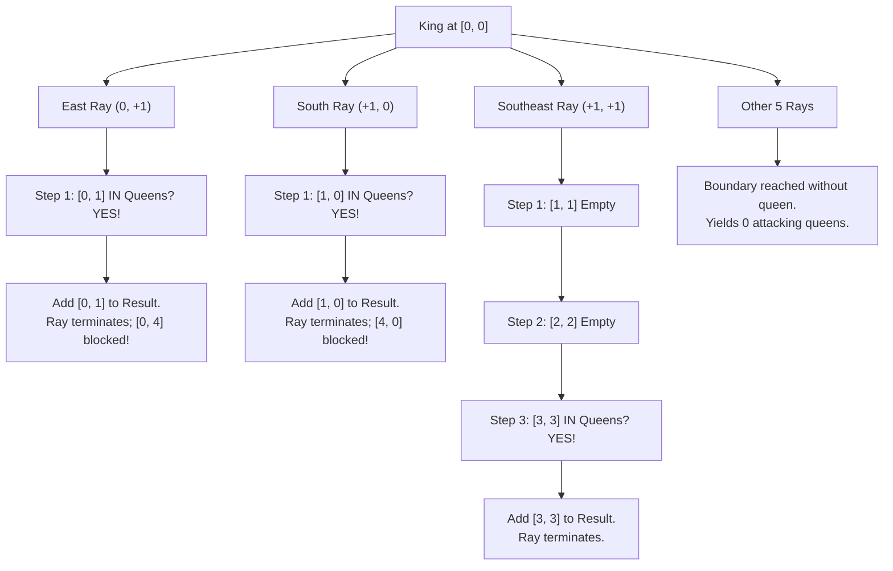

# Guided Example: Queens That Can Attack the King

## 1. Problem Essence & Algorithmic Mental Model

On an $8 \times 8$ chessboard, we are given the position of a single white king at coordinate $(r_K, c_K)$ and the positions of several black queens. A queen can move any number of unoccupied squares vertically, horizontally, or diagonally. Consequently, a queen can attack the king if and only if:
1. She shares a row, column, or diagonal with the king.
2. The line segment connecting her square to the king contains no intervening pieces.

A naive perspective evaluates each queen individually, calculating whether its line to the king is collinear and scanning all other queens to detect collisions. This leads to $\mathcal{O}(Q^2)$ pairwise obstruction checks.

The optimal perspective inverts the search: **Ray-casting outward from the King**.
Because there are only 8 possible directions of attack on a 2D chessboard:
- 4 Cardinal directions: North, South, East, West.
- 4 Intercardinal directions: Northeast, Northwest, Southeast, Southwest.

From the king's square, we project 8 distinct directional rays. Along each ray, we step outward square by square. The **first** queen encountered along any ray is the unique queen in that direction that possesses an unobstructed line of sight to the king. Any queen situated further down that same ray is physically blocked by this first queen.

```
Ray-Casting Schematic from King [0, 0]:
       c=0  c=1  c=2  c=3  c=4
r=0   [ K ]──>Q1 ──────────>Q4   (East Ray: Q1 hits first, blocks Q4)
        │ \
r=1     v   \
       Q2    \
r=2     │     \
        │      \
r=3     v       v
       Q3       Q5               (SE Ray: hits Q5 directly)
      (blocked)
```

By storing all queen coordinates in an $\mathcal{O}(1)$ lookup hash set, traversing each ray takes at most 7 steps. Since the chessboard is fixed at $8 \times 8$, the entire search terminates in at most $8 \times 7 = 56$ board queries.

---

## 2. Mathematical Formalism & Invariants

Let the board coordinate space be $\mathcal{B} = \{0, 1, \dots, 7\} \times \{0, 1, \dots, 7\}$.
Let $K = (r_K, c_K) \in \mathcal{B}$ denote the king's coordinate.
Let $\mathcal{Q} \subset \mathcal{B}$ denote the set of black queen positions, with $|\mathcal{Q}| \le 63$.

Define the 8 unit direction vectors:
$$\mathcal{D} = \{(\Delta r, \Delta c) \in \{-1, 0, 1\}^2 \setminus \{(0, 0)\}\}$$

For any direction vector $\vec{d} = (\Delta r, \Delta c) \in \mathcal{D}$, the ray originating from $K$ is the parameterized sequence of squares:
$$\mathcal{R}(\vec{d}) = \{ K + t \vec{d} \mid t \in \{1, 2, \dots, 7\} \} \cap \mathcal{B}$$

### Direct Line-of-Sight Invariant
A queen at square $P \in \mathcal{Q}$ can directly attack $K$ if and only if there exists $\vec{d} \in \mathcal{D}$ and $t^* \ge 1$ such that:
$$P = K + t^* \vec{d} \quad \text{and} \quad \forall t \in \{1, 2, \dots, t^* - 1\}, \; (K + t \vec{d}) \notin \mathcal{Q}$$

That is, $P$ is the minimal-parameter element in $\mathcal{R}(\vec{d}) \cap \mathcal{Q}$:
$$t^* = \min \{ t \ge 1 \mid K + t \vec{d} \in \mathcal{Q} \}$$
If $\mathcal{R}(\vec{d}) \cap \mathcal{Q} = \emptyset$, no queen attacks the king from direction $\vec{d}$.

Because the 8 rays partition the set of collinear attack vectors into mutually disjoint rays originating at $K$:
- At most one attacking queen can be found per direction $\vec{d}$.
- The maximum number of attacking queens is at most $8$.

---

## 3. Concrete Example Execution & State Evolution

Consider the representative instance:
- King: $K = [0, 0]$
- Queens: $\mathcal{Q} = \{[0, 1], [1, 0], [4, 0], [0, 4], [3, 3], [2, 4]\}$

### Step-by-Step Ray Exploration Trace

| Direction Name | Vector $(\Delta r, \Delta c)$ | Steps Explored $(r, c)$ | First Occupied Square Hit? | Attacking Queen Identified | Termination Reason |
|---|---|---|---|---|---|
| North | $(-1, 0)$ | $(-1, 0)$ | No | None | Board boundary exceeded ($r < 0$) |
| South | $(+1, 0)$ | $(1, 0) \in \mathcal{Q}$ | **Yes** at step 1 | $[1, 0]$ | First queen encountered; blocks $[4, 0]$ |
| West | $(0, -1)$ | $(0, -1)$ | No | None | Board boundary exceeded ($c < 0$) |
| East | $(0, +1)$ | $(0, 1) \in \mathcal{Q}$ | **Yes** at step 1 | $[0, 1]$ | First queen encountered; blocks $[0, 4]$ |
| Northwest | $(-1, -1)$ | $(-1, -1)$ | No | None | Board boundary exceeded ($r < 0, c < 0$) |
| Northeast | $(-1, +1)$ | $(-1, 1)$ | No | None | Board boundary exceeded ($r < 0$) |
| Southwest | $(+1, -1)$ | $(1, -1)$ | No | None | Board boundary exceeded ($c < 0$) |
| Southeast | $(+1, +1)$ | $(1, 1) \to (2, 2) \to (3, 3) \in \mathcal{Q}$ | **Yes** at step 3 | $[3, 3]$ | First queen encountered |



### Result Synthesis:
The set of directly attacking queens is:
$$[\,[1, 0],\, [0, 1],\, [3, 3]\,]$$

Notice how:
- Along South, $[1, 0]$ stopped the ray immediately, preventing $[4, 0]$ from being considered.
- Along East, $[0, 1]$ stopped the ray immediately, preventing $[0, 4]$ from being considered.
- The isolated queen at $[2, 4]$ lies along direction vector $(+1, +2)$, which is a knight's move, not a legal queen attack direction.

---

## 4. Multi-Approach Comparison & Trade-Offs

| Dimension / Approach | Queen-to-King Collinearity Check | Full Board $8 \times 8$ Grid Simulation | King Ray-Casting via Hash Set (Optimal) |
|---|---|---|---|
| **Perspective** | Inward from all queens $\mathcal{Q} \to K$ | $8 \times 8$ 2D matrix allocation | Outward from king along 8 unit vectors |
| **Collinearity Verification** | Slope calculation $\Delta r / \Delta c \in \{0, \pm 1, \infty\}$ | Iterative ray traversal on matrix | Simple coordinate increments $(r + \Delta r, c + \Delta c)$ |
| **Obstruction Handling** | Sort queens by distance, find closest per ray | Natural collision on first non-zero cell | Immediate loop break upon first set hit |
| **Time Complexity** | $\mathcal{O}(|\mathcal{Q}| \log |\mathcal{Q}|)$ sorting or hash grouping | $\mathcal{O}(B^2 + 8 B)$ where $B = 8$ | $\mathcal{O}(|\mathcal{Q}| + 8 B)$ set build + 56 lookups |
| **Auxiliary Space** | $\mathcal{O}(|\mathcal{Q}|)$ for grouped lists | $\mathcal{O}(B^2) = 64$ integers | $\mathcal{O}(|\mathcal{Q}|)$ hash set of pairs |

```
Execution Efficiency Comparison:
Matrix Simulation: Allocates 64-cell board array, writes all queens, then scans.
Ray-Casting (Optimal): Converts input list to hash set; executes at most 56 hash lookups.
At most 8 queens can ever be returned.
```

---

## 5. Algorithmic Edge Cases & Boundary Analysis

| Boundary Scenario | Configuration Details | Expected Output Behavior | Verification Mechanism |
|---|---|---|---|
| **King in Corner** | $K = [0, 0]$ | At most 3 directions valid (South, East, Southeast) | 5 directions exit the board on the very first step ($r < 0$ or $c < 0$), performing 0 redundant work. |
| **King in Center** | $K = [3, 3]$ surrounded on all 8 sides | Exactly 8 queens returned | Each of the 8 unit directions finds a queen at distance 1 and terminates instantly. |
| **No Queens on Board** | $\mathcal{Q} = \emptyset$ | Empty list `[]` | All 8 rays advance until hitting board edges; 0 queens added. |
| **Multiple Queens on Same Ray** | Queens at $[0, 1], [0, 3], [0, 5]$ with King at $[0, 0]$ | Only $[0, 1]$ returned | Loop executes `break` on hitting $[0, 1]$; subsequent collinear queens are never added. |
| **Non-Attacking Positions** | Queens positioned at knight-jump offsets from king | Empty list `[]` | Knight-offset cells are never visited by cardinal or diagonal unit rays. |

---

## 6. Mathematical Verification & Complexity Derivation

Let $B = 8$ be the side length of the chessboard ($B \times B = 64$ squares).
Let $Q = |\text{queens}|$ be the number of queen coordinates provided ($1 \le Q \le 63$).

### Time Complexity Analysis:
1. **Hash Set Construction:**
   - Inserting $Q$ coordinate pairs into a hash set requires $Q$ hash evaluations and insertions.
   - Cost: $\mathcal{O}(Q)$.
2. **Ray Traversal:**
   - There are exactly 8 directions.
   - In any direction $\vec{d}$, the ray length is bounded by the board dimension $B - 1 \le 7$.
   - For each step along a ray, computing $(x + \Delta r, y + \Delta c)$ takes $\mathcal{O}(1)$ time.
   - Looking up whether $(x, y)$ exists in the hash set takes $\mathcal{O}(1)$ average time.
   - Total ray steps across all 8 directions cannot exceed $8 \times 7 = 56$ operations.
   - Cost: $\mathcal{O}(8 \times B) = \mathcal{O}(1)$ since $B$ is constant.
3. **Total Asymptotic Time:**
   $$\mathcal{O}(Q + B) = \mathcal{O}(Q) \quad (\text{strictly bounded by } 64 \text{ operations})$$

### Space Complexity Analysis:
- The hash set stores $Q$ pairs of integers: $\mathcal{O}(Q)$ space.
- The output list stores at most 8 attacking queen coordinates: $\mathcal{O}(1)$ space.
- Total auxiliary space is $\mathcal{O}(Q)$, which is strictly bounded by $63 \times \mathcal{O}(1) \le 1\text{ KB}$.

---

## 7. Synthesis & Strategic Takeaways

1. **Invert the Search Origin**: When many candidates could potentially reach a single target, tracing outward from the target along the canonical geometry often eliminates massive combinatorial filtering.
2. **First-Hit Occlusion**: By marching outward monotonically along each ray from closest to farthest, the first collision encountered is unconditionally the blocking obstacle. No sorting or distance comparison is needed.
3. **Discrete Constant Bounds**: Fixed grid dimensions ($8 \times 8$) turn asymptotic complexity into hard operational ceilings. Recognizing that at most 56 cells can ever be inspected guarantees real-time execution regardless of input order.
