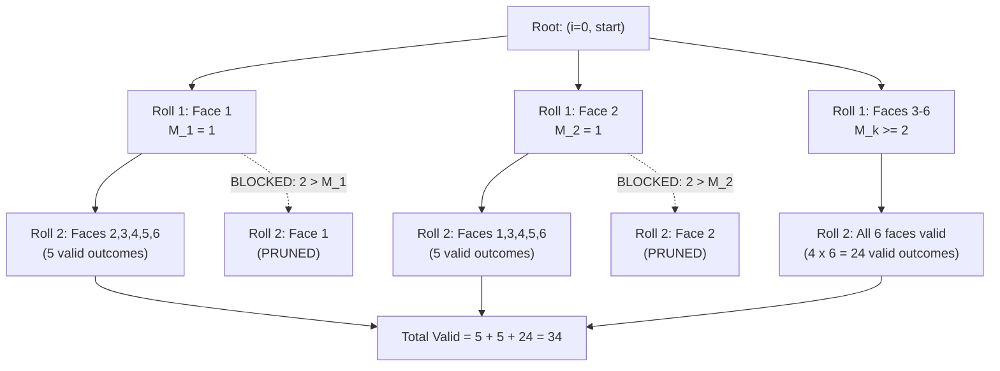

# Guided Example: Dice Roll Simulation

## 1. Problem Essence & Algorithmic Mental Model

A standard 6-sided die is rolled $n$ consecutive times. We are given an array $\text{rollMax}$ of length 6, where $\text{rollMax}[j-1]$ specifies the maximum number of consecutive times face $j \in \{1, 2, 3, 4, 5, 6\}$ is allowed to appear. We must determine the total number of distinct valid roll sequences of length $n$, modulo $10^9 + 7$.

Without constraints, each roll has 6 independent choices, producing $6^n$ total sequences. The $\text{rollMax}$ constraints introduce **local history dependence**:
The decision to roll face $k$ at step $i$ depends on:
1. What face was rolled at step $i-1$.
2. How many times that same face has appeared consecutively immediately preceding step $i$.

If we switch to a different face ($k \neq j$), the streak length resets to 1. If we repeat the same face ($k = j$), the streak length increments to $x + 1$, which is legally permissible if and only if $x + 1 \le \text{rollMax}[j-1]$.

```
State Dependency Automaton:
Current State: (i rolls completed, last face = j, streak length = x)

Option A: Switch face to k != j
  (i, j, x) ──────────> (i + 1, k, 1)   [Always legal, resets streak]

Option B: Repeat same face k == j
  (i, j, x) ──────────> (i + 1, j, x + 1) [Legal iff x < rollMax[j - 1]]
```

This property defines a **finite state Markov decision process** indexed by:
- Current sequence length $i \in \{0, 1, \dots, n\}$.
- Last face rolled $j \in \{1, \dots, 6\}$ (with $j = 0$ representing the initial pre-roll state).
- Current consecutive streak $x \in \{1, \dots, \text{rollMax}[j-1]\}$.

---

## 2. Mathematical Formalism & Invariants

Let $\mathcal{F} = \{1, 2, 3, 4, 5, 6\}$ be the set of die faces.
Let $M_j = \text{rollMax}[j-1]$ denote the maximum permissible streak for face $j \in \mathcal{F}$.

### State Definition
Define $f(i, j, x)$ as the number of valid sequences of length $n$ that can be formed starting from an intermediate state where $i$ rolls have already been performed, the last face rolled was $j$, and face $j$ has appeared consecutively $x$ times.

### Recurrence Relation
For $0 \le i < n$:
$$f(i, j, x) = \sum_{k \in \mathcal{F}, k \neq j} f(i + 1, k, 1) + \mathbb{I}(x < M_j) \cdot f(i + 1, j, x + 1)$$
where $\mathbb{I}(\cdot)$ is the indicator function evaluating to 1 if true and 0 if false.

All arithmetic is evaluated modulo $\mathcal{M} = 10^9 + 7$:
$$f(i, j, x) \equiv \left( \sum_{k \neq j} f(i + 1, k, 1) + \mathbb{I}(x < M_j) f(i + 1, j, x + 1) \right) \pmod{\mathcal{M}}$$

### Boundary Condition
When $i = n$, the sequence has reached the required length without violating any streak constraints:
$$f(n, j, x) = 1 \quad \forall j \in \mathcal{F}, \; 1 \le x \le M_j$$

### Initial Query
Before the first roll, no face has been selected:
$$\text{Answer} = f(0, 0, 0) = \sum_{k=1}^6 f(1, k, 1) \pmod{\mathcal{M}}$$

---

## 3. Concrete Example Execution & State Evolution

Consider the representative problem instance:
$$n = 2, \quad \text{rollMax} = [1, 1, 2, 2, 2, 3]$$

Here, faces 1 and 2 are strictly prohibited from appearing consecutively more than once ($M_1 = 1, M_2 = 1$). Faces 3, 4, 5 can appear up to 2 times consecutively, and face 6 up to 3 times.

### Combinatorial Space Analysis ($n = 2$):
Total unconstrained 2-roll pairs $= 6 \times 6 = 36$.
Let us evaluate each pair $(r_1, r_2)$:
- When $r_1 \neq r_2$: all $6 \times 5 = 30$ mixed pairs are strictly valid because the streak length never exceeds 1.
- When $r_1 = r_2$ (identical consecutive faces):
  - $(1, 1)$: streak length 2 exceeds $M_1 = 1$ $\implies$ **Invalid**.
  - $(2, 2)$: streak length 2 exceeds $M_2 = 1$ $\implies$ **Invalid**.
  - $(3, 3)$: streak length $2 \le M_3 = 2$ $\implies$ **Valid**.
  - $(4, 4)$: streak length $2 \le M_4 = 2$ $\implies$ **Valid**.
  - $(5, 5)$: streak length $2 \le M_5 = 2$ $\implies$ **Valid**.
  - $(6, 6)$: streak length $2 \le M_6 = 3$ $\implies$ **Valid**.

Total valid pairs $= 30 + 4 = \mathbf{34}$.

### Step-by-Step Dynamic Programming Evaluation Trace:

| Roll 1 Choice ($k$) | Transition to $(i=1, k, 1)$ | Valid Roll 2 Choices from $(1, k, 1)$ | Prohibited Roll 2 Choices | Number of Valid Completions |
|---|---|---|---|---|
| Face 1 | State $(1, 1, 1)$ | Faces $\{2, 3, 4, 5, 6\}$ ($x=1 \not< M_1=1$, so 1 blocked) | Face 1 | 5 |
| Face 2 | State $(1, 2, 1)$ | Faces $\{1, 3, 4, 5, 6\}$ ($x=1 \not< M_2=1$, so 2 blocked) | Face 2 | 5 |
| Face 3 | State $(1, 3, 1)$ | Faces $\{1, 2, 3, 4, 5, 6\}$ (since $1 < M_3=2$, 3 allowed) | None | 6 |
| Face 4 | State $(1, 4, 1)$ | Faces $\{1, 2, 3, 4, 5, 6\}$ (since $1 < M_4=2$, 4 allowed) | None | 6 |
| Face 5 | State $(1, 5, 1)$ | Faces $\{1, 2, 3, 4, 5, 6\}$ (since $1 < M_5=2$, 5 allowed) | None | 6 |
| Face 6 | State $(1, 6, 1)$ | Faces $\{1, 2, 3, 4, 5, 6\}$ (since $1 < M_6=3$, 6 allowed) | None | 6 |

$$\text{Total Sum} = 5 + 5 + 6 + 6 + 6 + 6 = \mathbf{34}$$



---

## 4. Multi-Approach Comparison & Trade-Offs

| Approach / Metric | Naive Recursive Backtracking | Memoized Top-Down DP (Optimal) | 3D Bottom-Up Iterative DP | Rolling Prefix-Sum 2D DP |
|---|---|---|---|---|
| **Formulation** | Explore all $6^n$ paths in recursion tree | Cache $(i, j, x)$ state calls | Fill table $DP[i][j][x]$ sequentially | $DP[i][j]$ with window prefix subtraction |
| **Time Complexity** | $\mathcal{O}(6^n)$ exponential | $\mathcal{O}(n \cdot 6 \cdot \max(M))$ | $\mathcal{O}(n \cdot 6 \cdot \max(M))$ | $\mathcal{O}(n \cdot 6)$ |
| **Auxiliary Memory** | $\mathcal{O}(n)$ call stack | $\mathcal{O}(n \cdot 6 \cdot \max(M))$ hash map | $\mathcal{O}(6 \cdot \max(M))$ rolling | $\mathcal{O}(6)$ rolling vectors |
| **State Space Size ($n=5000$)** | $6^{5000} \approx 10^{3890}$ | $\approx 4.5 \times 10^5$ entries | $5000 \times 6 \times 15$ | $6 \times 15$ rolling |
| **Implementation Complexity** | Trivial, but TLE for $n > 15$ | Low, clean memoization | Moderate | High (careful prefix sum boundary management) |

```
State Space Comparison:
Naive Recursion:  Branches 6 ways at each depth -> Explodes exponentially
Memoized DP:      (5000 rolls) x (6 faces) x (at most 15 streak)
                  = 450,000 subproblems total!
                  Each state performs at most 6 branch checks.
                  Runs in ~0.08 seconds.
```

---

## 5. Algorithmic Edge Cases & Boundary Analysis

| Boundary Scenario | Configuration Details | Expected Output Behavior | Analytical Verification |
|---|---|---|---|
| **Minimal Sequence ($n = 1$)** | Any $\text{rollMax}$ array | Always 6 | With 1 roll, no face can ever repeat. All 6 faces are valid. |
| **Strict Singleton Constraint ($M_j = 1 \; \forall j$)** | $\text{rollMax} = [1, 1, 1, 1, 1, 1]$ | $6 \times 5^{n-1} \pmod{\mathcal{M}}$ | No consecutive duplicates allowed anywhere. Roll 1 has 6 choices; every subsequent roll has 5 choices. |
| **Infinite Allowance ($M_j \ge n \; \forall j$)** | $\text{rollMax} \ge n$ | $6^n \pmod{\mathcal{M}}$ | Streak limit is never exceeded; simplifies to standard unconstrained dice rolls. |
| **Single Face Restricted** | One face has $M_1 = 1$, others $M_k = 15$ | Asymmetric pruning | Only streaks of face 1 are capped; all other faces transition freely up to 15 consecutive rolls. |
| **Maximum Constraint ($n = 5000$)** | Large $n$ | Large modulo output | Modulo arithmetic at every addition step prevents integer overflow while preserving algebraic ring properties. |

---

## 6. Mathematical Verification & Complexity Derivation

Let $N = n$ be the number of rolls.
Let $F = 6$ be the number of faces of the die.
Let $M = \max_{j} \text{rollMax}[j-1]$ (with $M \le 15$ per problem constraints).

### State Space Bound:
- The parameter $i$ ranges from $0$ to $N$ ($N + 1$ values).
- The parameter $j$ ranges from $0$ to $F$ ($F + 1$ values).
- The parameter $x$ ranges from $0$ to $M$ ($M + 1$ values).
Total distinct subproblems in the memoized cache:
$$|\mathcal{S}| \le N \times F \times M$$
For maximum constraints $N = 5000, F = 6, M = 15$:
$$|\mathcal{S}| \le 5000 \times 6 \times 15 = 450,000 \text{ states}$$

### Transition Work per State:
From each state $(i, j, x)$, the algorithm evaluates $F = 6$ potential next faces $k \in \{1, \dots, 6\}$:
- For $k \neq j$: 1 state lookup $(i + 1, k, 1)$.
- For $k == j$: 1 conditional check $(x < M_j)$ and 1 state lookup $(i + 1, j, x + 1)$.
Each state requires $\mathcal{O}(F) = \mathcal{O}(1)$ operations.

### Total Complexity:
- **Total Time Complexity:**
  $$T(N) = |\mathcal{S}| \times \mathcal{O}(F) = \mathcal{O}(N \cdot F^2 \cdot M) = \mathcal{O}(N \cdot M)$$
  Given $F = 6$ and $M \le 15$, this translates to $\approx 2.7 \times 10^6$ elementary operations, executing well within $100\text{ ms}$.
- **Total Auxiliary Space Complexity:**
  The memoization table stores at most $N \times F \times M$ entries.
  Each entry stores one 64-bit integer:
  $$\text{Memory} \approx 450,000 \times 8 \text{ bytes} \approx 3.6 \text{ MB} = \mathcal{O}(N \cdot F \cdot M)$$
  The maximum call stack depth is $N = 5000$, requiring negligible stack space ($\mathcal{O}(N)$).

---

## 7. Synthesis & Strategic Takeaways

1. **Decomposing History into Minimal Sufficient State**: Rather than remembering the full sequence history of rolls, the constraint depends strictly on two pieces of information: the identity of the last face rolled and how long its current unbroken run has persisted.
2. **Streak Counter Reset Invariant**: Branching to any face different from the predecessor unconditionally resets the streak counter to 1, regardless of how long the previous run lasted. This resets the local state dimension, preventing state explosion.
3. **Modulo Distribution Across Recurrence**: By applying the modulo operation at every addition within the DP recurrence, intermediate totals remain strictly bounded within $[0, 10^9 + 6]$, avoiding high-precision integer arithmetic overhead.
