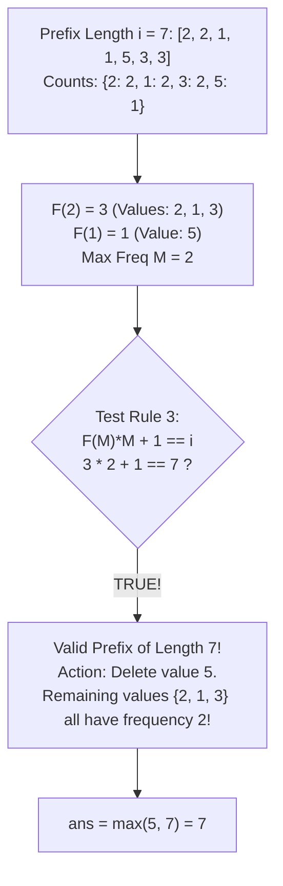

# Guided Example: Maximum Equal Frequency

## 1. Problem Essence & Algorithmic Mental Model

Given an array of positive integers, we want to determine the maximum length of a prefix such that removing **exactly one element** from that prefix leaves all remaining distinct integers with identical occurrence counts.

Imagine the elements of a prefix organized into a histogram of frequencies:
- The horizontal axis lists each distinct value.
- The vertical height represents how many times that value appears.

Our goal is to make all columns in the histogram have the exact same height after removing a single block (one element). Removing one element from a column of height $h$:
- Either reduces that column's height to $h - 1$.
- Or, if $h = 1$, eliminates that column entirely (height becomes 0, so it no longer counts as a distinct value).

```
Frequency Histogram Profiles after Removing One Element:

Case 1: All heights are 1 (e.g., [1, 2, 3, 4, 5])
Columns: [1] [1] [1] [1] [1]
Action:  Remove any block -> Remaining columns still all height 1!

Case 2: Exactly one column has height M, all others have height M - 1
Columns: [M-1] [M-1] [ M ] [M-1]
Action:  Remove 1 block from the height M column -> Now all heights are M - 1!

Case 3: All columns have height M, plus one solitary column of height 1
Columns: [ M ] [ M ] [ 1 ] [ M ]
Action:  Remove the solitary height 1 column entirely -> All remaining heights are M!
```

Instead of recalculating the entire histogram for every prefix (which takes $\mathcal{O}(N^2)$ time), we maintain an online **two-level frequency histogram**:
1. Level 1: `count[x]` tracks how many times integer $x$ appears in the prefix.
2. Level 2: `freq_count[f]` tracks how many distinct integers appear exactly $f$ times.
3. Running maximum: $M$ tracks the maximum frequency among all present integers.

---

## 2. Mathematical Formalism & Invariants

Let the prefix of length $i \in \{1, \dots, n\}$ be $A_i = \text{nums}[1 \dots i]$.
Let $\mathcal{U}_i = \{x \in A_i\}$ denote the set of distinct elements present in $A_i$.

Define the primary count function:
$$c_i(x) = \sum_{k=1}^i \mathbb{I}(\text{nums}[k] = x) \quad \forall x \in \mathcal{U}_i$$

Define the second-order frequency distribution:
$$F_i(f) = |\{ x \in \mathcal{U}_i \mid c_i(x) = f \}| \quad \text{for } f \ge 1$$
Notice that the total number of elements in the prefix satisfies the conservation law:
$$\sum_{f \ge 1} f \cdot F_i(f) = i$$

Define the maximum frequency at step $i$:
$$M_i = \max_{x \in \mathcal{U}_i} c_i(x)$$

### Valid Prefix Invariants
A prefix of length $i$ is valid if and only if at least one of the following three algebraic conditions holds:

1. **Uniform Singletons Condition ($M_i = 1$):**
   Every present distinct number appears exactly once ($F_i(1) = i$). Removing any element leaves $i - 1$ distinct elements, each appearing once.

2. **Single Peak Reduction Condition:**
   Exactly one distinct element has frequency $M_i$, and every other distinct element has frequency $M_i - 1$:
   $$F_i(M_i) = 1 \quad \text{and} \quad 1 \cdot M_i + F_i(M_i - 1) \cdot (M_i - 1) = i$$
   Removing one occurrence from the peak element reduces its count to $M_i - 1$, harmonizing all remaining elements at frequency $M_i - 1$.

3. **Isolated Singlet Elimination Condition:**
   All distinct elements except one appear with frequency $M_i$, while the remaining element appears exactly once:
   $$F_i(1) = 1 \quad \text{and} \quad F_i(M_i) \cdot M_i + 1 = i$$
   Removing the single occurrence of that solitary element eliminates it completely, leaving all remaining distinct values with uniform frequency $M_i$. (Note: When $M_i \cdot 1 + 1 = i$ with only one distinct element repeated $i$ times, removing one element leaves count $i-1$, satisfying the condition trivially).

---

## 3. Concrete Example Execution & State Evolution

Consider the input array:
$$\text{nums} = [2, 2, 1, 1, 5, 3, 3, 5]$$

We process each prefix of length $i = 1, 2, \dots, 8$:

### Step-by-Step State Evolution Trace

| Step $i$ | Value $v$ | Updated `count[v]` | Max Freq $M$ | Active Frequency Counts $F(f)$ | Validity Check Rule | Valid Prefix? | Best Length `ans` |
|---|---|---|---|---|---|---|---|
| 1 | 2 | $c(2)=1$ | 1 | $F(1)=1$ | $M=1$ (Rule 1) | **Yes** | 1 |
| 2 | 2 | $c(2)=2$ | 2 | $F(2)=1$ | $F(2)\cdot 2 + 0 = 2 \implies F(1)=0$, single distinct element | **Yes** | 2 |
| 3 | 1 | $c(1)=1$ | 2 | $F(2)=1, F(1)=1$ | $F(2)\cdot 2 + 1 = 3$ and $F(1)=1$ (Rule 3) | **Yes** | 3 |
| 4 | 1 | $c(1)=2$ | 2 | $F(2)=2$ | $F(2)\cdot 2 = 4$, no deletion can balance (would need $F(1)=1$ or $F(2)=1, F(1)=2$) | No | 3 |
| 5 | 5 | $c(5)=1$ | 2 | $F(2)=2, F(1)=1$ | $F(2)\cdot 2 + 1 = 5$ and $F(1)=1$ (Rule 3) | **Yes** | 5 |
| 6 | 3 | $c(3)=1$ | 2 | $F(2)=2, F(1)=2$ | $2\cdot 2 + 2\cdot 1 = 6$, neither Rule 2 nor Rule 3 holds | No | 5 |
| 7 | 3 | $c(3)=2$ | 2 | $F(2)=3, F(1)=1$ | $F(2)\cdot 2 + 1 = 7$ and $F(1)=1$ (Rule 3) | **Yes** | **7** |
| 8 | 5 | $c(5)=2$ | 2 | $F(2)=4$ | $4 \cdot 2 = 8$, no single deletion leaves equal positive counts | No | 7 |



At step $i = 7$:
- Distinct values $\{2, 1, 3\}$ each have frequency 2.
- Distinct value $\{5\}$ has frequency 1.
Removing the single instance of $5$ yields three distinct values each occurring exactly 2 times. Thus length 7 is valid.
At step $i = 8$, adding another $5$ causes all four values to have frequency 2. Removing any single element would leave one value with frequency 1 and three values with frequency 2, which is not equal.
Therefore, the maximum equal frequency prefix length is **7**.

---

## 4. Multi-Approach Comparison & Trade-Offs

| Metric / Approach | Offline Histogram Recalculation | Sorting Frequencies per Prefix | Online Dual Hash Maps (Optimal) |
|---|---|---|---|
| **Mechanism** | Rebuild frequency table from scratch for each prefix $i$ | Compute frequency array and sort at every step | Incremental update of `count` and `freq_count` |
| **Per-Step Complexity** | $\mathcal{O}(i)$ rebuild | $\mathcal{O}(|\mathcal{U}| \log |\mathcal{U}|)$ sort | $\mathcal{O}(1)$ hash increments and decrements |
| **Total Time Complexity** | $\mathcal{O}(N^2)$ quadratic | $\mathcal{O}(N \cdot K \log K)$ | $\mathcal{O}(N)$ strictly linear single pass |
| **Auxiliary Memory** | $\mathcal{O}(N)$ scratch space | $\mathcal{O}(N)$ buffer | $\mathcal{O}(N)$ two hash counters |
| **Runtime for $N = 10^5$** | $> 30\text{ seconds}$ (TLE) | $\approx 2.5\text{ seconds}$ | $\approx 0.05\text{ seconds}$ |

```
Frequency Transition Mechanism:
When element v arrives with prior frequency f:
1. Decrement F(f):       freq_count[f] -= 1
2. Increment count[v]:   count[v] = f + 1
3. Increment F(f + 1):   freq_count[f + 1] += 1
4. Update M:             M = max(M, f + 1)
Total work per element: Exactly 4 constant-time hash map updates!
```

---

## 5. Algorithmic Edge Cases & Boundary Analysis

| Boundary Scenario | Example Input | Expected Output | Behavioral Justification |
|---|---|---|---|
| **Minimal Array ($N = 2$)** | `[1, 1]` | 2 | Length 2 has $F(2)=1$, $M=2$. $F(2)\cdot 2 = 2$ and $F(1)=0$. Removing 1 element leaves single element with frequency 1. |
| **All Distinct Elements** | `[1, 2, 3, 4, 5]` | 5 | $M = 1$ throughout entire array. Removing any element leaves remaining values with frequency 1. Rule 1 holds for all $i$. |
| **Single Value Repeated** | `[7, 7, 7, 7]` | 4 | $F(4) = 1$. Removing one element leaves frequency 3. Rule 3 applies ($1 \times 4 = 4$, single component). |
| **All Same Except One Single** | `[1, 1, 1, 2, 2, 2, 3]` | 7 | Three 1s, three 2s, one 3. $F(3)=2, F(1)=1$. Deleting 3 leaves uniform frequency 3. |
| **All Same Except One Peak** | `[1, 1, 2, 2, 3, 3, 3]` | 7 | Two 1s, two 2s, three 3s. $F(3)=1, F(2)=2$. Deleting one 3 leaves uniform frequency 2. Rule 2 applies. |

---

## 6. Mathematical Verification & Complexity Derivation

Let $N = |\text{nums}|$ be the length of the array.

### Time Complexity:
1. **Loop Iterations:** The loop runs exactly $N$ times, with prefix index $i$ advancing from $1$ to $N$.
2. **Operations per Iteration:**
   - Hash map lookup and update for `count[v]`: $\mathcal{O}(1)$ average.
   - Hash map decrement for `freq_count[f]`: $\mathcal{O}(1)$ average.
   - Hash map increment for `freq_count[f + 1]`: $\mathcal{O}(1)$ average.
   - Scalar comparison `M = max(M, new_freq)`: $\mathcal{O}(1)$.
   - Checking the three algebraic validity conditions involves at most 6 arithmetic operations and table lookups: $\mathcal{O}(1)$.
3. **Overall Running Time:**
   $$T(N) = \sum_{i=1}^N \mathcal{O}(1) = \mathcal{O}(N)$$

### Auxiliary Space Complexity:
- `count` stores frequency counts for at most $\min(N, |\text{alphabet}|)$ distinct integers: $\mathcal{O}(N)$ memory.
- `freq_count` stores counts of frequencies ranging from $1$ to $N$: at most $N$ non-zero entries, requiring $\mathcal{O}(N)$ memory.
- Scalar variables `ans, mx, i, v`: $\mathcal{O}(1)$ space.
- Total auxiliary space is strictly $\mathcal{O}(N)$.

---

## 7. Synthesis & Strategic Takeaways

1. **Second-Order State Aggregation**: When a condition requires global uniformity among dynamic entities, tracking the distribution of the primary metric (frequency of frequencies) converts an $\mathcal{O}(K)$ inspection into $\mathcal{O}(1)$ arithmetic checks.
2. **Exhaustive Case Characterization**: Removing a single block can resolve non-uniformity in only two topological ways: trimming the tallest peak by 1 to match the plateau, or shaving a singlet down to 0 to eliminate its category entirely.
3. **Incremental Bucket Shifting**: As frequencies increase by 1, an element shifts from bucket $f$ to bucket $f + 1$. Maintaining consistency only requires decrementing $F(f)$ and incrementing $F(f+1)$, avoiding full re-evaluations.
