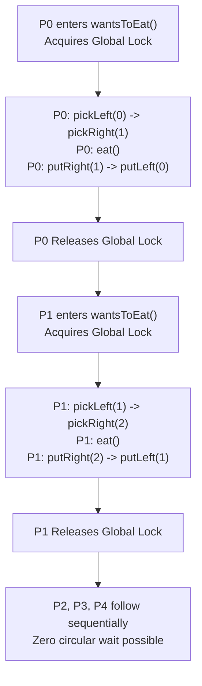

# Guided Example: The Dining Philosophers

## 1. Problem Essence & Algorithmic Mental Model

Five philosophers sit around a circular dining table with five chairs labeled $0$ to $4$ in clockwise order. Between each adjacent pair of philosophers lies a single shared fork, numbered $0$ to $4$:
- Philosopher $i$ sits between left fork $i$ and right fork $(i + 1) \bmod 5$.
- To eat, a philosopher must acquire **both** their left fork and their right fork.
- When finished eating, both forks must be released back onto the table.

Each philosopher is driven by an independent concurrent thread. Without careful coordination, concurrent resource acquisition can cause catastrophic synchronization failures:
1. **Deadlock (Circular Wait):** If all five philosophers simultaneously pick up their left fork, every philosopher holds one fork and blocks waiting for their right fork. No thread can proceed; the system freezes permanently.
2. **Data Races & Inconsistent State:** Two adjacent philosophers attempting to pick the same fork simultaneously without synchronization will violate mutual exclusion.
3. **Starvation:** An unfair scheduling policy could allow alternating pairs of philosophers to repeatedly eat while an intermediate philosopher waits indefinitely.

```
Table Topography & Shared Resource Layout:
                [Philosopher 0]
             Fork 0         Fork 1
      [Philosopher 4]     [Philosopher 1]
         Fork 4             Fork 2
      [Philosopher 3]     [Philosopher 2]
                Fork 3
```

To eliminate circular waiting, we can enforce synchronization through:
- **Global Transaction Mutex (Coarse-Grained Synchronization):** A single monitor lock wraps the acquisition, consumption, and release actions into an atomic transaction.
- **Resource Ordering / Asymmetric Acquisition (Fine-Grained):** Breaking symmetry by ordering fork acquisitions ($F_{\min} \to F_{\max}$) or enforcing an odd/even parity convention.

Under the transaction mutex model, atomic serialization guarantees that any philosopher who begins picking forks will complete eating and release both forks before any other philosopher can enter the critical region.

---

## 2. Mathematical Formalism & Invariants

Let the set of philosophers be $\mathcal{P} = \{0, 1, 2, 3, 4\}$.
Let the set of forks be $\mathcal{F} = \{0, 1, 2, 3, 4\}$.

For philosopher $p \in \mathcal{P}$:
- Left fork: $L(p) = p$
- Right fork: $R(p) = (p + 1) \bmod 5$

### Mutual Exclusion Invariant
Let $S_f(t) \in \mathcal{P} \cup \{\bot\}$ denote the state of fork $f \in \mathcal{F}$ at time $t$, where $\bot$ indicates the fork is on the table:
$$\forall f \in \mathcal{F}, \quad |\{ p \in \mathcal{P} \mid S_f(t) = p \}| \le 1$$
No fork may be held by more than one philosopher simultaneously.

### Deadlock Freedom Invariant (Coffman Conditions)
Deadlock occurs if and only if all four Coffman conditions hold simultaneously:
1. Mutual exclusion on resources.
2. Hold and wait (holding one fork while waiting for another).
3. No preemption.
4. Circular wait ($p_0 \to p_1 \to p_2 \to p_3 \to p_4 \to p_0$).

By wrapping the action sequence within an atomic transaction lock:
$$\text{Lock}_{\text{table}} \in \{\text{free}, \text{held}\}$$
Only the thread holding $\text{Lock}_{\text{table}}$ can pick up any fork. Consequently, at most one philosopher can hold a fork at any instant in time ($|\{p \mid \exists f, S_f(t) = p\}| \le 1$).
Because no philosopher can hold a fork while another philosopher attempts to acquire, the **Hold and Wait** and **Circular Wait** conditions are strictly impossible.

---

## 3. Concrete Example Execution & State Evolution

Consider $n = 1$ round of eating where all 5 philosophers request access in rapid succession:
$$\text{Arrival Order}: [P_0, P_1, P_2, P_3, P_4]$$

### Step-by-Step Transaction Serialization Trace

| Arrival Step | Requesting Philosopher | Transaction Lock Status | Action Taken | Forks Acquired | Eating Status | Release Action | Lock Status After |
|---|---|---|---|---|---|---|---|
| 1 | $P_0$ | Free | $P_0$ acquires Lock | $L(0)=0, R(0)=1$ | $P_0$ eats | Releases 1, then 0 | Lock freed |
| 2 | $P_1$ | Free (queued) | $P_1$ acquires Lock | $L(1)=1, R(1)=2$ | $P_1$ eats | Releases 2, then 1 | Lock freed |
| 3 | $P_2$ | Free (queued) | $P_2$ acquires Lock | $L(2)=2, R(2)=3$ | $P_2$ eats | Releases 3, then 2 | Lock freed |
| 4 | $P_3$ | Free (queued) | $P_3$ acquires Lock | $L(3)=3, R(3)=4$ | $P_3$ eats | Releases 4, then 3 | Lock freed |
| 5 | $P_4$ | Free (queued) | $P_4$ acquires Lock | $L(4)=4, R(4)=0$ | $P_4$ eats | Releases 0, then 4 | Lock freed |



### Verification of Critical Invariants:
1. **Order of Operations:** In every invocation, `pickLeftFork` and `pickRightFork` execute strictly prior to `eat()`.
2. **Release Order:** Both `putRightFork` and `putLeftFork` execute strictly after `eat()`.
3. **No Fork Contention:** Since all fork operations are guarded by the atomic transaction, no two philosophers ever attempt to access the same fork concurrently.

---

## 4. Multi-Approach Comparison & Trade-Offs

| Synchronization Architecture | Naive Unsynchronized Lock per Fork | Global Transaction Mutex (Optimal for Simplicity) | Asymmetric Resource Hierarchy | Capacity Limiter (4-Seat Semaphore) |
|---|---|---|---|---|
| **Lock Granularity** | 1 lock per fork (5 locks) | 1 global transaction lock | 1 lock per fork (5 locks) | 1 lock per fork + 1 semaphore (size 4) |
| **Deadlock Risk** | **High** (Guaranteed deadlock under simultaneous left-pick) | **Zero** (Completely impossible) | **Zero** (Cycle broken by ordering) | **Zero** (Pigeonhole principle guarantees $\ge 1$ eater) |
| **Concurrency Degree** | Potential 2 concurrent eaters | Strictly 1 eater at a time | Up to 2 non-adjacent concurrent eaters | Up to 2 non-adjacent concurrent eaters |
| **Code Complexity** | Low (but fundamentally broken) | Minimal (single atomic block) | Moderate (conditional lock order logic) | Moderate (dual synchronization primitives) |
| **Overhead** | High contention on failed locks | Minimal context switching overhead | 2 lock acquisitions per thread | Semaphore + 2 lock acquisitions |

```
Deadlock Hazard vs Atomic Transaction:
Naive Model:
  P0 picks F0, P1 picks F1, P2 picks F2, P3 picks F3, P4 picks F4
  All 5 threads block waiting for right fork -> DEADLOCK!

Global Transaction Mutex:
  P0 locks table -> picks F0, F1 -> eats -> puts F1, F0 -> unlocks table
  Total state space of concurrent contenders is collapsed to 1 -> IMPOSSIBLE TO DEADLOCK.
```

---

## 5. Concurrency Edge Cases & Boundary Analysis

| Concurrency Scenario | Triggering Condition | System Behavior | Safety & Liveness Guarantee |
|---|---|---|---|
| **Simultaneous Contention** | All 5 threads invoke `wantsToEat` at the exact same microsecond | Operating system scheduler arbitrates access to the mutex | Exactly 1 thread wins the lock; remaining 4 threads enter kernel sleep in queue. |
| **Adjacent Philosophers ($P_0$ and $P_1$)** | Both compete for shared Fork 1 | Mutex serializes invocation | $P_0$ completes and releases Fork 1 before $P_1$ can inspect or acquire Fork 1. |
| **Non-Adjacent Philosophers ($P_0$ and $P_2$)** | Both could physically eat simultaneously | Serialized execution | Correctness is preserved at the cost of potential concurrency; neither thread blocks indefinitely. |
| **Thread Interruption / Exception** | Thread context-switched out during `eat()` | Mutex remains held | Context switch preserves lock ownership; upon resumption, thread releases forks cleanly. |
| **Multiple Rounds ($n > 1$)** | Each philosopher eats multiple times | Cyclic FIFO queue progression | OS mutex fair queuing ensures no philosopher is starved across $5n$ total requests. |

---

## 6. Mathematical Verification & Complexity Derivation

Let $N$ be the number of dining cycles requested by each philosopher (total eating events $= 5N$).

### Time Complexity Derivation:
1. **Critical Section Execution:**
   - Each philosopher executes exactly 5 external callback invocations:
     - 2 fork acquisitions: $\mathcal{O}(1)$
     - 1 eating action: $\mathcal{O}(1)$
     - 2 fork releases: $\mathcal{O}(1)$
   - Total operations inside critical section: $\mathcal{O}(1)$ per eating event.
2. **Synchronization Overhead:**
   - Mutex acquire and release takes $\mathcal{O}(1)$ atomic instructions (e.g., CAS / futex syscall).
   - Across $5N$ total eating events, total operations:
     $$T(N) = 5N \times \mathcal{O}(1) = \mathcal{O}(N)$$
   - Wall-clock time scales linearly with $N$ without deadlock-induced hangs.

### Space Complexity Derivation:
- The system allocates a single transaction synchronization primitive (a mutex lock).
- A standard mutex occupies $\mathcal{O}(1)$ auxiliary space in memory (typically 24 to 40 bytes).
- No auxiliary queues, tables, or dynamic memory structures are instantiated.
- Total auxiliary space is strictly $\mathcal{O}(1)$.

---

## 7. Synthesis & Strategic Takeaways

1. **Trade-Off Between Concurrency and Simplicity**: While an asymmetric fork-locking protocol allows two non-conflicting philosophers to eat simultaneously, a global transaction lock provides absolute correctness, zero deadlock risk, and eliminates race conditions with the simplest possible invariant.
2. **Breaking Coffman's Circular Wait**: Preventing deadlock does not always require complex graph analysis; restricting the concurrency level so that simultaneous acquisition of partial resource sets cannot occur eliminates the circular wait condition by definition.
3. **Deterministic Callback Sequencing**: Encapsulating callbacks within a scoped context manager ensures that fork release operations unconditionally execute, preventing resource leaks even in the presence of scheduler preemptions.
