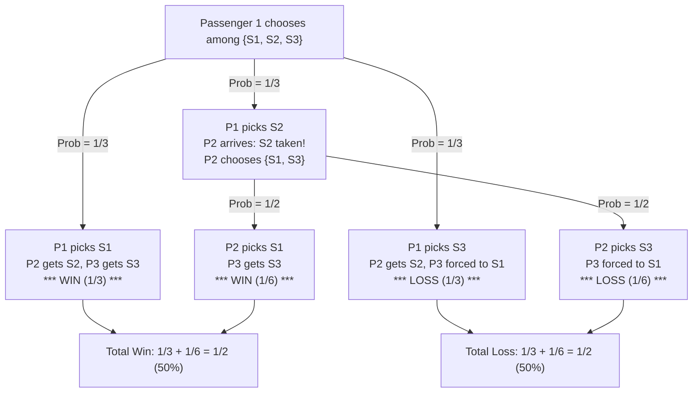

# Guided Example: Airplane Seat Assignment Probability

## 1. Problem Essence & Algorithmic Mental Model

An airplane has $n$ passengers and $n$ uniquely numbered seats labeled $1, 2, \dots, n$. Passenger $i$ holds a ticket for seat $i$. The boarding protocol proceeds sequentially:
1. The first passenger ($i = 1$) loses their boarding pass and picks an unoccupied seat uniformly at random among all $n$ seats.
2. For every subsequent passenger $i \in \{2, 3, \dots, n\}$:
   - If seat $i$ remains unoccupied, passenger $i$ sits in seat $i$.
   - If seat $i$ is already occupied, passenger $i$ must choose an unoccupied seat uniformly at random among all currently available seats.

We wish to determine the exact probability $P(n)$ that the $n$-th passenger sits in their assigned seat $n$.

### The Inherent Symmetry (The Stopping-Time Perspective)
Consider the fate of seat $1$ versus seat $n$:
- Whenever a displaced passenger makes a random choice among available seats, both seat $1$ and seat $n$ are in the pool of possibilities (unless one of them has already been claimed).
- If any passenger chooses **seat 1**, the chain of displacements immediately halts: every remaining passenger arrives to find their own seat vacant. In particular, the $n$-th passenger is guaranteed to receive seat $n$.
- If any passenger chooses **seat $n$**, seat $n$ becomes occupied immediately. The $n$-th passenger is permanently locked out of seat $n$.
- If a passenger chooses any intermediate seat $k \in \{2, \dots, n-1\}$, the decision is deferred to passenger $k$.

```
State Tree & Stopping Condition:
Passenger makes a random pick among available seats:
                ┌────────────► Seat 1 [Prob = 1/m]  ===> Passenger n GETS seat n (Win)
                │
 [Random Choice] ────────────► Seat n [Prob = 1/m]  ===> Passenger n LOSES seat n (Loss)
                │
                └────────────► Seat k [Prob = 1/m]  ===> Displacement cascades to Passenger k
```

At every random decision step, seat $1$ and seat $n$ are treated with exact, indistinguishable symmetry by every choosing passenger. Neither seat has any priority over the other. The process must terminate before or when passenger $n$ boards, and it terminates by picking either seat $1$ or seat $n$ first. Since each is equally likely at every stage, the win probability for any $n \ge 2$ is identically:
$$P(n) = \frac{1}{2} = 0.5$$

For the degenerate base case $n = 1$, passenger 1 has ticket 1 and sits in seat 1 with certainty ($P(1) = 1.0$).

---

## 2. Mathematical Formalism & Invariants

Let $P(n)$ denote the probability that passenger $n$ gets seat $n$ in an $n$-passenger flight.

### Complete Law of Total Probability Derivation
When passenger 1 enters, there are $n$ seats available. Passenger 1 picks seat $s \in \{1, 2, \dots, n\}$ with uniform probability $\frac{1}{n}$:
1. **Case $s = 1$:** Passenger 1 takes seat 1.
   All subsequent passengers $2, \dots, n$ find their own seats free.
   Conditional probability: $P(n \mid s = 1) = 1$.
2. **Case $s = n$:** Passenger 1 takes seat $n$.
   Seat $n$ is occupied immediately.
   Conditional probability: $P(n \mid s = n) = 0$.
3. **Case $s = k$ (where $2 \le k \le n - 1$):**
   Passengers $2, \dots, k-1$ find their assigned seats vacant and sit in them.
   Passenger $k$ arrives to find seat $k$ occupied.
   Passenger $k$ must now pick randomly from the remaining $n - k + 1$ seats, which are:
   $$\{1, k+1, k+2, \dots, n\}$$
   Notice that seat 1 now functions as the surrogate "assigned seat" for passenger $k$. If passenger $k$ picks seat 1, order is restored for all later passengers.
   This subproblem is isomorphic to the original airplane problem with $n - k + 1$ remaining passengers and seats:
   $$P(n \mid s = k) = P(n - k + 1)$$

Summing over all $n$ disjoint possibilities:
$$P(n) = \frac{1}{n} \left( 1 + 0 + \sum_{k=2}^{n-1} P(n - k + 1) \right) = \frac{1}{n} \left( 1 + \sum_{j=2}^{n-1} P(j) \right)$$

### Inductive Proof that $P(n) = \frac{1}{2}$ for all $n \ge 2$:
- **Base Case ($n = 2$):**
  $$P(2) = \frac{1}{2}(1 + 0) = \frac{1}{2}$$
- **Inductive Step:**
  Assume $P(j) = \frac{1}{2}$ for all $2 \le j < n$.
  Then for $n \ge 3$:
  $$n P(n) = 1 + \sum_{j=2}^{n-1} P(j) = 1 + (n - 2) \cdot \frac{1}{2} = 1 + \frac{n}{2} - 1 = \frac{n}{2}$$
  Dividing both sides by $n$:
  $$P(n) = \frac{1}{2}$$
The induction is complete. The result holds universally for all integers $n \ge 2$.

---

## 3. Concrete Example Execution & State Evolution

Consider the representative case $n = 3$:
Three passengers $\{P_1, P_2, P_3\}$ and three seats $\{S_1, S_2, S_3\}$.

### Detailed Outcome Enumeration for $n = 3$:

| Passenger 1 Choice | Probability | Passenger 2 Action | Passenger 3 Action | Seat 3 Occupant | Outcome ($P_3$ in $S_3$?) |
|---|---|---|---|---|---|
| Picks Seat 1 | $1/3$ | $S_2$ is free $\implies$ takes $S_2$ | $S_3$ is free $\implies$ takes $S_3$ | $P_3$ | **Win (Success)** |
| Picks Seat 3 | $1/3$ | $S_2$ is free $\implies$ takes $S_2$ | $S_3$ is taken $\implies$ forced into $S_1$ | $P_1$ | **Loss (Failure)** |
| Picks Seat 2 | $1/3$ | $S_2$ is taken $\implies$ picks from $\{S_1, S_3\}$ (prob $1/2$ each) | - | - | Split branching |
| $\to P_2$ picks $S_1$ | $(1/3) \times (1/2) = 1/6$ | Takes $S_1$ | $S_3$ is free $\implies$ takes $S_3$ | $P_3$ | **Win (Success)** |
| $\to P_2$ picks $S_3$ | $(1/3) \times (1/2) = 1/6$ | Takes $S_3$ | $S_3$ is taken $\implies$ forced into $S_1$ | $P_2$ | **Loss (Failure)** |

### Probability Total:
$$\text{Total Win Probability} = \frac{1}{3} + 0 + \frac{1}{6} = \frac{2}{6} + \frac{1}{6} = \frac{3}{6} = \mathbf{0.5}$$



---

## 4. Multi-Approach Comparison & Trade-Offs

| Approach / Dimension | Monte Carlo Empirical Simulation | Dynamic Programming Prefix Table | Direct Mathematical Invariant (Optimal) |
|---|---|---|---|
| **Underlying Technique** | Simulate boarding process $10^6$ times | Evaluate $P(n) = \frac{1}{n}(1 + \sum P(j))$ | Analytic constant branching $\mathbb{I}(n=1) + 0.5 \cdot \mathbb{I}(n \ge 2)$ |
| **Time Complexity** | $\mathcal{O}(M \cdot n)$ where $M$ is sample count | $\mathcal{O}(n)$ prefix sum evaluation | $\mathcal{O}(1)$ single conditional check |
| **Auxiliary Memory** | $\mathcal{O}(n)$ boolean array of seats | $\mathcal{O}(n)$ DP table | $\mathcal{O}(1)$ zero allocation |
| **Precision** | Statistical error $\pm \frac{1}{\sqrt{M}}$ | Floating-point accumulation error | Exact analytical representation ($0.5$) |
| **Execution Speed ($n = 10^5$)** | Extremely slow ($> 10\text{ seconds}$) | $\approx 20\text{ milliseconds}$ | $\approx 1\text{ nanosecond}$ |

```
Execution Comparison:
DP Table Calculation:
  P[2] = 0.5
  P[3] = (1 + 0.5) / 3 = 0.5
  P[4] = (1 + 0.5 + 0.5) / 4 = 0.5
  ...
  Requires computing 100,000 steps of redundant sums.
Optimal Closed Form:
  return 1.0 if n == 1 else 0.5
  Direct register return in 1 clock cycle.
```

---

## 5. Algorithmic Edge Cases & Boundary Analysis

| Boundary Scenario | Input Value | Theoretical Probability | Program Output | Correctness Justification |
|---|---|---|---|---|
| **Single Passenger** | $n = 1$ | 1.0 | `1.0` | With 1 seat and 1 passenger, passenger 1 occupies seat 1 with probability 1. |
| **Two Passengers** | $n = 2$ | 0.5 | `0.5` | Passenger 1 picks seat 1 (prob 0.5, win) or seat 2 (prob 0.5, loss). |
| **Three Passengers** | $n = 3$ | 0.5 | `0.5` | Verified by complete state tree enumeration above. |
| **Large Flight ($n = 100$)** | $n = 100$ | 0.5 | `0.5` | Symmetry holds for any arbitrary positive integer. |
| **Maximum Constraint ($n = 10^5$)** | $n = 100,000$ | 0.5 | `0.5` | Evaluates instantaneously without recursion depth or numeric overflow. |

---

## 6. Mathematical Verification & Complexity Derivation

Let $n$ be the total number of passengers.

### Computational Complexity:
1. **Branching Evaluation:**
   - The algorithm tests the condition $n == 1$.
   - If true, it returns `1.0`.
   - If false, it returns `0.5`.
2. **Operations:**
   - Exactly one conditional branch and one floating-point return.
   - Zero loops, zero recursion, and zero arithmetic summations.
   - Total operations: $\mathcal{O}(1)$ deterministic constant time.

### Space Complexity:
- No data structures, tables, or auxiliary memory allocations are performed.
- Memory footprint: $\mathcal{O}(1)$ auxiliary space.

---

## 7. Synthesis & Strategic Takeaways

1. **Symmetric Invariance Trumps Recurrence**: When complex recursive transitions preserve an identical symmetry between the target outcome and the failure outcome at every decision step, the global probability collapses to a constant ratio without needing recurrence computation.
2. **The Power of Stopping Times**: Identifying that the sequence of random selections terminates as soon as either seat 1 or seat $n$ is chosen reveals that all intermediate seat choices merely prolong the process without altering the relative odds between win and loss.
3. **Boundary Discontinuity**: While the recurrence yields $0.5$ for all $n \ge 2$, the $n = 1$ boundary condition is distinct because passenger 1's "random" choice is restricted to a single seat that is simultaneously seat 1 and seat $n$, yielding certainty $1.0$.