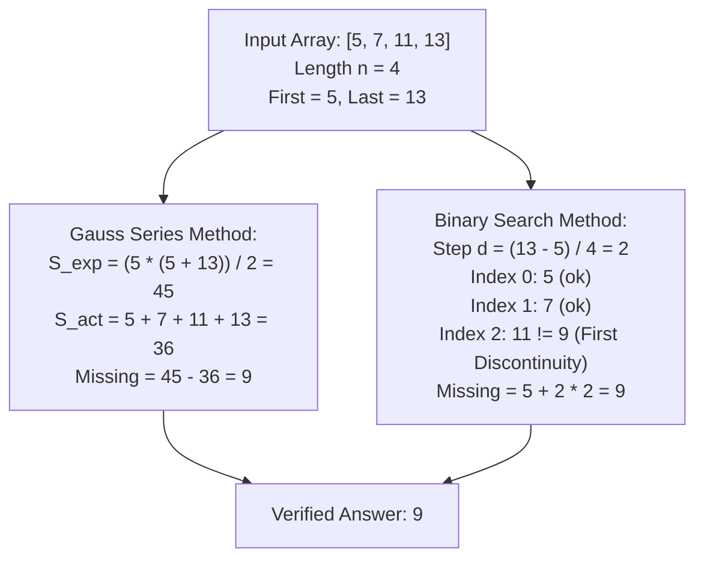

# Guided Example: Missing Number In Arithmetic Progression

## 1. Problem Essence & Algorithmic Mental Model

An array originally contained $n + 1$ numbers forming a strictly uniform arithmetic progression:
$$a_k = a_0 + k \cdot d \quad \text{for } k \in \{0, 1, \dots, n\}$$
where $d$ is the common difference. Exactly one interior value was removed (the first element $a_0$ and the last element $a_n$ are guaranteed to remain intact), leaving $n$ elements in the given array `arr`. We are asked to identify the single missing number.

Because the boundary endpoints are preserved:
- The first element is $a_0 = \text{arr}[0]$.
- The final element is $a_n = \text{arr}[n-1]$.
- The original sequence spanned $n$ intervals of common step size $d$.

Hence, the true common difference is uniquely and exactly determined:
$$d = \frac{\text{arr}[n-1] - \text{arr}[0]}{n}$$

```
Arithmetic Progression Gap Topology:
Index:     0        1             2        3
Values:  [ 5 ] ──> [ 7 ] ───?───> [ 11 ] ─> [ 13 ]
Step:        +2          +4 (+2+2)       +2
                        ^
                 Missing Value = 9!
```

There are two algorithmic approaches to identify the missing element:
1. **The Gauss Arithmetic Series Identity ($\mathcal{O}(n)$ time, $\mathcal{O}(1)$ space):**
   The theoretical sum of all $n + 1$ elements in the complete arithmetic progression is $\frac{(n + 1)(a_0 + a_n)}{2}$.
   Subtracting the actual observed sum of elements in `arr` directly exposes the missing value in a single pass.
2. **Binary Search on Index Alignment ($\mathcal{O}(\log n)$ time, $\mathcal{O}(1)$ space):**
   For every index $i$ before the missing element, $\text{arr}[i] = a_0 + i \cdot d$.
   For every index $i$ after the missing element, $\text{arr}[i] = a_0 + (i + 1) \cdot d$.
   The first index where $\text{arr}[i] \neq a_0 + i \cdot d$ marks the location of the missing element.

---

## 2. Mathematical Formalism & Invariants

Let $n = |\text{arr}| \ge 3$ be the number of elements in the given array.
Let $a_{\text{first}} = \text{arr}[0]$ and $a_{\text{last}} = \text{arr}[n-1]$.

### Common Difference Invariant
In an arithmetic progression with $n + 1$ terms:
$$a_{\text{last}} - a_{\text{first}} = n \cdot d \implies d = \frac{a_{\text{last}} - a_{\text{first}}}{n}$$
Notice that $d$ can be positive, negative (for descending progressions), or zero (for constant arrays).

### Arithmetic Series Sum Identity
The sum of the complete $(n + 1)$-term sequence is given by Gauss's summation formula:
$$S_{\text{expected}} = \sum_{k=0}^n (a_{\text{first}} + k \cdot d) = \frac{(n + 1)(a_{\text{first}} + a_{\text{last}})}{2}$$

Let $S_{\text{actual}}$ denote the sum of all elements currently present in `arr`:
$$S_{\text{actual}} = \sum_{i=0}^{n-1} \text{arr}[i]$$

Since exactly one term $x$ is missing from the progression:
$$S_{\text{expected}} = S_{\text{actual}} + x \iff x = S_{\text{expected}} - S_{\text{actual}} = \frac{(n + 1)(a_{\text{first}} + a_{\text{last}})}{2} - \sum_{i=0}^{n-1} \text{arr}[i]$$

### Binary Search Predicate Invariant
Alternatively, define the boolean predicate $\Pi(i)$ for $i \in \{0, 1, \dots, n-1\}$:
$$\Pi(i) \iff \text{arr}[i] = a_{\text{first}} + i \cdot d$$
- For all indices $i$ strictly before the missing item: $\Pi(i) = \text{True}$.
- For all indices $i$ at or after the missing item: $\Pi(i) = \text{False}$.
The sequence $\Pi(0), \Pi(1), \dots, \Pi(n-1)$ is monotonically non-increasing ($\text{True}, \dots, \text{True}, \text{False}, \dots, \text{False}$).
The missing value is precisely $a_{\text{first}} + i^* \cdot d$, where $i^*$ is the minimal index such that $\Pi(i^*) = \text{False}$.

---

## 3. Concrete Example Execution & State Evolution

Consider the representative input:
$$\text{arr} = [5, 7, 11, 13]$$
Here, length $n = 4$, first element $a_0 = 5$, last element $a_{n-1} = 13$.

### Evaluation via Summation Identity:
1. Expected number of terms: $N_{\text{full}} = n + 1 = 5$.
2. Expected sum:
   $$S_{\text{expected}} = \frac{(4 + 1) \cdot (5 + 13)}{2} = \frac{5 \cdot 18}{2} = 5 \cdot 9 = 45$$
3. Actual sum of given elements:
   $$S_{\text{actual}} = 5 + 7 + 11 + 13 = 36$$
4. Missing element:
   $$x = 45 - 36 = \mathbf{9}$$

### Evaluation via Binary Search Discontinuity:
- Calculated step size: $d = \frac{13 - 5}{4} = \frac{8}{4} = 2$.

| Binary Search Step | Search Window $[L, R]$ | Midpoint $M$ | Array Value $\text{arr}[M]$ | Expected Value $a_0 + M \cdot d$ | Predicate $\Pi(M)$ | Window Update Action |
|---|---|---|---|---|---|---|
| Step 1 | $[0, 3]$ | $M = 1$ | $\text{arr}[1] = 7$ | $5 + 1 \cdot 2 = 7$ | **True** (Match) | Missing element lies to right: $L \leftarrow 2$ |
| Step 2 | $[2, 3]$ | $M = 2$ | $\text{arr}[2] = 11$ | $5 + 2 \cdot 2 = 9$ | **False** (Mismatch) | Missing element at/before $M$: $R \leftarrow 2$ |
| Termination | $L = 2, R = 2$ | - | - | - | - | First mismatch index $i^* = 2$ |

Missing value $= a_0 + i^* \cdot d = 5 + 2 \cdot 2 = \mathbf{9}$.



---

## 4. Multi-Approach Comparison & Trade-Offs

| Dimension / Metric | Adjacent Difference Scan | Gauss Series Sum (Closed Form) | Binary Search on Index Displacement |
|---|---|---|---|
| **Mechanism** | Find adjacent pair where $\Delta = 2d$ | Compute $S_{\text{expected}} - S_{\text{actual}}$ | Dichotomic search on $\text{arr}[M] == a_0 + M \cdot d$ |
| **Time Complexity** | $\mathcal{O}(n)$ | $\mathcal{O}(n)$ single pass accumulation | $\mathcal{O}(\log n)$ logarithmic |
| **Auxiliary Space** | $\mathcal{O}(1)$ | $\mathcal{O}(1)$ zero allocation | $\mathcal{O}(1)$ two pointer registers |
| **Code Length** | $\approx 10$ lines | Single arithmetic line | $\approx 8$ lines |
| **Division by Zero Hazard**| Must handle $d = 0$ explicitly | Unaffected (division by 2 only) | Must handle $d = 0$ separately |
| **Overflow Resilience** | High | Bounded by $(n+1) \cdot \max(\lvert A \rvert)$ | High |

```
Algorithmic Trade-Off:
Gauss Sum Formula:
  Extremely concise (1 line), zero branching, optimal for small/medium arrays (n <= 10^5).
Binary Search:
  Asymptotically superior for gigantic arrays (n = 10^9), requiring only ~30 probes.
```

---

## 5. Algorithmic Edge Cases & Boundary Analysis

| Boundary Scenario | Example Array | Expected Output | Behavioral Justification |
|---|---|---|---|
| **Zero Difference ($d = 0$)** | `[0, 0, 0]` | 0 | $S_{\text{exp}} = \frac{4 \cdot (0 + 0)}{2} = 0$. $S_{\text{act}} = 0$. Missing value $= 0 - 0 = 0$. Handled seamlessly without division by zero. |
| **Negative Difference ($d < 0$)** | `[15, 10, 0]` | 5 | Descending progression: $d = \frac{0 - 15}{3} = -5$. $S_{\text{exp}} = \frac{4 \cdot 15}{2} = 30$. $S_{\text{act}} = 25$. Missing $= 30 - 25 = 5$. |
| **Minimal Array ($n = 3$)** | `[1, 2, 4]` | 3 | $S_{\text{exp}} = \frac{4 \cdot (1 + 4)}{2} = 10$. $S_{\text{act}} = 7$. Missing $= 10 - 7 = 3$. |
| **Negative Values** | `[-4, -2, 2]` | 0 | $S_{\text{exp}} = \frac{4 \cdot (-4 + 2)}{2} = -4$. $S_{\text{act}} = -4$. Missing $= -4 - (-4) = 0$. |
| **Missing Near Boundaries** | Missing at index 1 or $n-1$ | Exact value | Sum identity is invariant to the position of the missing interior item. |

---

## 6. Mathematical Verification & Complexity Derivation

Let $n = |\text{arr}|$ be the number of elements in the given array.

### Gauss Summation Method:
1. **Endpoint Access & Multiplication:**
   - Reading `arr[0]` and `arr[-1]` takes $\mathcal{O}(1)$ time.
   - Multiplying $(n + 1) \cdot (\text{arr}[0] + \text{arr}[-1])$ and integer dividing by $2$ takes $\mathcal{O}(1)$ arithmetic cycles.
2. **Array Summation:**
   - Summing $n$ elements in `arr` performs $n - 1$ additions in a single sequential pass:
     $$T_{\text{sum}}(n) = \mathcal{O}(n)$$
3. **Total Asymptotic Complexity:**
   - **Time Complexity:** $\mathcal{O}(n)$.
   - **Auxiliary Space Complexity:** $\mathcal{O}(1)$ constant memory (registers for sum accumulators).

### Binary Search Method:
1. Computing $d = (\text{arr}[n-1] - \text{arr}[0]) / n$ takes $\mathcal{O}(1)$.
2. If $d = 0$, return $\text{arr}[0]$ in $\mathcal{O}(1)$.
3. Otherwise, binary search reduces the active search interval $[L, R]$ by half in each iteration:
   $$T_{\text{bin}}(n) = \mathcal{O}(\log n)$$
4. Total Auxiliary Space: $\mathcal{O}(1)$.

---

## 7. Synthesis & Strategic Takeaways

1. **Global Conservation vs Local Probing**: Rather than inspecting local differences between adjacent neighbors, leveraging the global sum conservation of an arithmetic series solves the problem in a single vectorized pass.
2. **Monotonic Discontinuity for Logarithmic Search**: Because every element prior to the missing value maintains exact index-value alignment while every element after the missing value is shifted by exactly one step $d$, the sequence forms a monotonic step function amenable to binary search.
3. **Algebraic Robustness**: Gauss's summation formula naturally absorbs positive, negative, and zero common differences without branching, sign checks, or special boundary adjustments.
