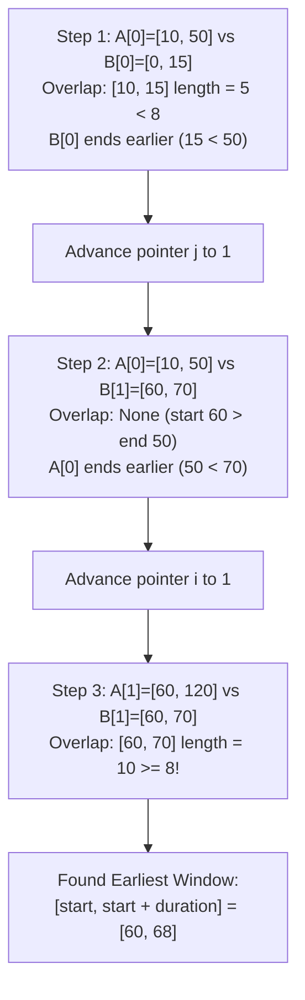

# Guided Example: Meeting Scheduler

## 1. Problem Essence & Algorithmic Mental Model

Given the availability time slots of two individuals, $\mathcal{A}$ (`slots1`) and $\mathcal{B}$ (`slots2`), and a required meeting duration $D$, we want to find the earliest continuous time window of length $D$ during which both people are simultaneously available. Each person's availability is given as a list of disjoint, non-overlapping intervals $[s, e)$. If no suitable common window exists, we return an empty list `[]`.

Consider the problem as sweeping a 1D timeline from past to future:
- An interval $[s_A, e_A)$ from person $\mathcal{A}$ and an interval $[s_B, e_B)$ from person $\mathcal{B}$ overlap if and only if:
  $$\max(s_A, s_B) < \min(e_A, e_B)$$
- The overlap is the intersection interval $[\text{start}, \text{end}) = [\max(s_A, s_B), \min(e_A, e_B))$.
- If the overlap duration satisfies $\text{end} - \text{start} \ge D$, then $[\text{start}, \text{start} + D]$ is a valid meeting window.

```
Interval Intersection Topology:
Person A:        [──────────── s_A ──────────── e_A ────────────)
Person B:              [────── s_B ────── e_B ──────)
Intersection:          [────── start ──── end ──────)
                              |<── D ──>|
Earliest Meeting Window:      [ start, start + D ]
```

Because we require the **earliest** possible time window, sorting both lists in ascending order by start time allows a **Two-Pointer Chronological Sweep**:
- We maintain pointer $i$ into $\mathcal{A}$ and pointer $j$ into $\mathcal{B}$.
- At each step, we test the intersection between interval $\mathcal{A}[i]$ and $\mathcal{B}[j]$.
- If the overlap satisfies the duration requirement, because both lists are processed in chronological order, this is unconditionally the earliest meeting possible globally.
- If the overlap is insufficient, we advance the pointer whose interval **terminates earlier**.

Why advance the earlier-terminating interval?
Because all intervals in a person's calendar are pairwise disjoint and sorted, if interval $\mathcal{A}[i]$ ends before $\mathcal{B}[j]$ ($e_A < e_B$), then $\mathcal{A}[i]$ cannot possibly overlap with any future interval $\mathcal{B}[j+1]$ (since $s_{B, j+1} \ge e_{B, j} > e_{A, i}$). Hence, $\mathcal{A}[i]$ can never participate in any future valid meeting and can be discarded.

---

## 2. Mathematical Formalism & Invariants

Let $\mathcal{A} = \{ [s_{A, i}, e_{A, i}) \}_{i=1}^m$ and $\mathcal{B} = \{ [s_{B, j}, e_{B, j}) \}_{j=1}^n$ be sorted:
$$s_{A, 1} < s_{A, 2} < \dots < s_{A, m}, \quad s_{B, 1} < s_{B, 2} < \dots < s_{B, n}$$
with disjointness invariants $e_{A, i} \le s_{A, i+1}$ and $e_{B, j} \le s_{B, j+1}$.

### Intersection Metric
For any pair of active intervals $I_A = [s_A, e_A)$ and $I_B = [s_B, e_B)$:
$$\text{Overlap}(I_A, I_B) = \max\Big(0, \; \min(e_A, e_B) - \max(s_A, s_B)\Big)$$

### Discard Invariant (Greedy Elimination)
Suppose $\min(e_A, e_B) - \max(s_A, s_B) < D$.
Without loss of generality, assume $e_A \le e_B$.
For any future interval $I_{B}' = [s_B', e_B') \in \mathcal{B}$ occurring after $I_B$:
$$s_B' \ge e_B \ge e_A \implies \min(e_A, e_B') \le e_A \le s_B' \le \max(s_A, s_B')$$
$$\implies \text{Overlap}(I_A, I_{B}') = 0 < D$$
Therefore, $I_A$ cannot satisfy the meeting requirement with any interval in the suffix of $\mathcal{B}$. Discarding $I_A$ (incrementing pointer $i$) preserves completeness: no valid meeting window can be missed.

---

## 3. Concrete Example Execution & State Evolution

Consider the representative problem instance:
- `slots1`: `[[10, 50], [60, 120], [140, 210]]`
- `slots2`: `[[0, 15], [60, 70]]`
- `duration`: `8`

Both lists are already sorted. Lengths: $m = 3$, $n = 2$.

### Step-by-Step Two-Pointer Trace

| Step | Pointer $i$ ($\mathcal{A}$) | Pointer $j$ ($\mathcal{B}$) | Interval $\mathcal{A}[i]$ | Interval $\mathcal{B}[j]$ | Overlap $[\max(s), \min(e))$ | Available Length | Condition $\ge 8$? | Pointer Advance Action |
|---|---|---|---|---|---|---|---|---|
| 1 | 0 | 0 | $[10, 50)$ | $[0, 15)$ | $[\max(10, 0), \min(50, 15)) = [10, 15)$ | $15 - 10 = 5$ | $5 < 8$ (Too short) | $\mathcal{B}[0]$ ends at 15 vs $\mathcal{A}[0]$ ends at 50 $\implies$ advance $j \leftarrow 1$ |
| 2 | 0 | 1 | $[10, 50)$ | $[60, 70)$ | $[\max(10, 60), \min(50, 70)) = [60, 50)$ | $\le 0$ (Disjoint) | No overlap | $\mathcal{A}[0]$ ends at 50 vs $\mathcal{B}[1]$ ends at 70 $\implies$ advance $i \leftarrow 1$ |
| 3 | 1 | 1 | $[60, 120)$ | $[60, 70)$ | $[\max(60, 60), \min(120, 70)) = [60, 70)$ | $70 - 60 = 10$ | **$10 \ge 8$ (Sufficient!)** | **Earliest slot found!** Return $[60, 60 + 8] = [60, 68]$ |



### Result:
The algorithm immediately halts and returns $[60, 68]$.
Even though subsequent slots $[140, 210]$ exist, chronological monotonicity guarantees that $[60, 68]$ is the earliest possible common availability.

---

## 4. Multi-Approach Comparison & Trade-Offs

| Metric / Dimension | Nested Pairwise Comparison | Min-Heap Priority Queue | Two-Pointer Merge Sweep (Optimal) |
|---|---|---|---|
| **Technique** | Test all pairs $(I_{A, i}, I_{B, j})$ | Push slots of length $\ge D$ into min-heap | Sort both arrays and advance pointers |
| **Pre-filtering** | None | Filter slots where $e - s < D$ | Direct comparison |
| **Time Complexity** | $\mathcal{O}(m \cdot n)$ quadratic | $\mathcal{O}((m + n) \log(m + n))$ | $\mathcal{O}(m \log m + n \log n + m + n)$ |
| **Auxiliary Memory** | $\mathcal{O}(1)$ | $\mathcal{O}(m + n)$ heap buffer | $\mathcal{O}(1)$ (in-place sort) |
| **Early Termination** | Requires full matrix search | Pops until top two overlap $\ge D$ | Terminates at first valid overlap |
| **Performance ($10^5$ slots)**| Severe TLE ($> 10\text{ seconds}$) | $\approx 0.08\text{ seconds}$ | $\approx 0.04\text{ seconds}$ |

```
Execution Pipeline Comparison:
Nested Loops: Tests all m * n combinations -> Disaster for large inputs.
Two-Pointer Sweep:
  Sort A (m log m) + Sort B (n log n)
  Scan A and B linearly (m + n comparisons)
  Halts immediately upon finding first valid intersection.
```

---

## 5. Algorithmic Edge Cases & Boundary Analysis

| Boundary Scenario | Example Configuration | Expected Output | Behavioral Justification |
|---|---|---|---|
| **Completely Disjoint Schedules** | $\mathcal{A} = [[1, 2]]$, $\mathcal{B} = [[3, 4]]$, $D = 1$ | `[]` | Pointers advance until $i = m$, exiting loop cleanly and returning `[]`. |
| **Overlap Smaller than Duration** | $\mathcal{A} = [[0, 10]]$, $\mathcal{B} = [[5, 12]]$, $D = 8$ | `[]` | Overlap is $[5, 10)$ with length $5 < 8$. Discards $\mathcal{A}[0]$ and terminates. |
| **Exact Match with Duration** | $\mathcal{A} = [[10, 20]]$, $\mathcal{B} = [[10, 20]]$, $D = 10$ | `[10, 20]` | Overlap length is $20 - 10 = 10 \ge 10$. Returns full interval. |
| **Contained Interval** | $\mathcal{A} = [[0, 100]]$, $\mathcal{B} = [[20, 35]]$, $D = 15$ | `[20, 35]` | Overlap is $[20, 35)$ with length 15. Returns $[20, 35]$. |
| **Empty Input Slots** | $\mathcal{A} = []$ or $\mathcal{B} = []$ | `[]` | Loop condition $i < m \land j < n$ is immediately false; returns `[]`. |

---

## 6. Mathematical Verification & Complexity Derivation

Let $m = |\text{slots1}|$ and $n = |\text{slots2}|$ be the number of availability intervals.

### Time Complexity Analysis:
1. **Sorting Phase:**
   - Sorting $\text{slots1}$ takes $\mathcal{O}(m \log m)$ comparisons.
   - Sorting $\text{slots2}$ takes $\mathcal{O}(n \log n)$ comparisons.
2. **Two-Pointer Scan Phase:**
   - At each iteration of the `while i < m and j < n` loop:
     - Computing $\max$, $\min$, and subtraction takes $\mathcal{O}(1)$ operations.
     - Either pointer $i$ increments by 1, or pointer $j$ increments by 1.
   - The loop can execute at most $m + n$ times before one pointer reaches the end.
   - Cost of scanning: $\mathcal{O}(m + n)$.
3. **Total Asymptotic Running Time:**
   $$T(m, n) = \mathcal{O}(m \log m + n \log n + m + n) = \mathcal{O}(m \log m + n \log n)$$

### Space Complexity Analysis:
- Sorting can be performed in-place (or takes $\mathcal{O}(\log m + \log n)$ stack frames for Timsort/Quicksort).
- Pointers $i, j$ and scalar registers $\text{start}, \text{end}$ take $\mathcal{O}(1)$ memory.
- Total auxiliary space is strictly $\mathcal{O}(1)$ beyond the sorting stack.

---

## 7. Synthesis & Strategic Takeaways

1. **Chronological Sweep Ordering**: Sorting intervals by start time establishes a monotonic temporal progression, ensuring that the first intersection satisfying the threshold is unconditionally the earliest global solution.
2. **Greedy Pointer Elimination**: An interval that terminates earlier than an overlapping or preceding interval has zero potential to overlap with any subsequent disjoint interval; discarding it immediately preserves completeness while avoiding redundant checks.
3. **Boundary Semantics**: Paying rigorous attention to half-open interval boundaries $[s, e)$ ensures that duration calculations $\min(e_A, e_B) - \max(s_A, s_B)$ accurately represent continuous elapsed time.
