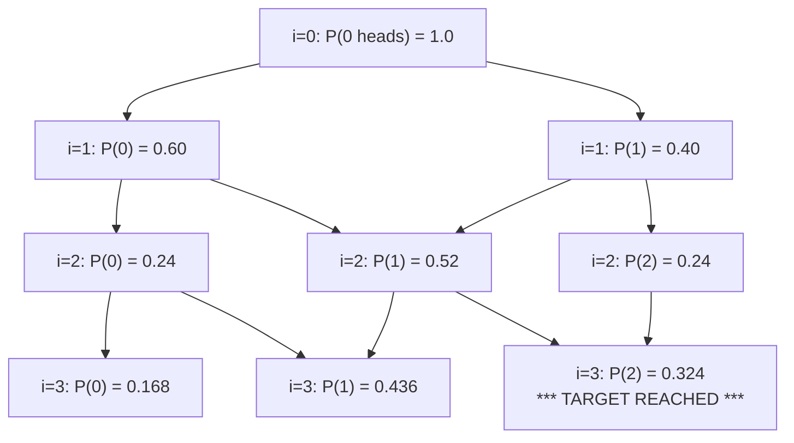

# Guided Example: Toss Strange Coins

## 1. Problem Essence & Algorithmic Mental Model

We are given an array of probabilities $\text{prob} = [p_1, p_2, \dots, p_n]$, where each coin $i$ lands on heads with probability $p_i \in [0, 1]$ and on tails with probability $1 - p_i$, independently of all other coins. We are also given an integer $K = \text{target}$. We must determine the exact probability that after tossing all $n$ coins, **exactly $K$ heads** are observed.

This is the canonical calculation of the **Poisson Binomial Distribution** (the sum of independent Bernoulli random variables with non-identical success probabilities).

If all coins had identical probability $p$, the answer would follow the standard binomial distribution formula $\binom{n}{K} p^K (1 - p)^{n-K}$. However, because each coin has an arbitrary individual bias $p_i$, heads from different coins are not interchangeable.
A naive brute-force approach inspects all $\binom{n}{K}$ subsets of coins that could turn up heads, which requires summing up to $\binom{1000}{500} \approx 10^{299}$ terms—computationally impossible.

The optimal mental model is **Sequential Probability Convolution (0-1 Knapsack DP)**:
Toss the coins one by one in chronological order. When tossing the $i$-th coin:
- Achieving $j$ total heads after coin $i$ can occur through exactly two disjoint pathways:
  1. We already had $j$ heads from the first $i-1$ coins, and coin $i$ lands on **tails** (probability $1 - p_i$).
  2. We had $j-1$ heads from the first $i-1$ coins, and coin $i$ lands on **heads** (probability $p_i$).

```
Probability Flow per Step:
Previous Heads (j):       [ f(i-1, j) ] ──x (1 - p_i)──┐
                                                       v
                                               [ f(i, j) ] (Sum of disjoint events)
                                                       ^
Previous Heads (j - 1):   [ f(i-1, j-1) ] ──x (p_i)────┘
```

Because each coin toss depends only on the head-count distribution of the immediately preceding prefix, the problem exhibits optimal substructure and evaluates sequentially in $\mathcal{O}(n \cdot K)$ operations.

---

## 2. Mathematical Formalism & Invariants

Let $X_i \sim \text{Bernoulli}(p_i)$ for $i \in \{1, 2, \dots, n\}$ be independent binary random variables, where $X_i = 1$ (heads) with probability $p_i$ and $X_i = 0$ (tails) with probability $1 - p_i$.
We want to evaluate:
$$\mathbb{P}\left( \sum_{i=1}^n X_i = K \right)$$

### Dynamic Programming Formulation
Define the state function $f(i, j)$ as the probability that the first $i$ coins produce exactly $j$ heads:
$$f(i, j) = \mathbb{P}\left( \sum_{t=1}^i X_t = j \right) \quad \text{for } 0 \le i \le n, \; 0 \le j \le \min(i, K)$$

### Base Condition
Before any coins are tossed ($i = 0$):
$$f(0, 0) = 1.0, \quad f(0, j) = 0.0 \quad (\forall j \ge 1)$$

### Recurrence System
For coin $i \in \{1, \dots, n\}$ with parameter $p_i$:
$$f(i, 0) = (1 - p_i) \cdot f(i - 1, 0)$$
$$f(i, j) = (1 - p_i) \cdot f(i - 1, j) + p_i \cdot f(i - 1, j - 1) \quad \text{for } 1 \le j \le \min(i, K)$$

### Probability Conservation Invariant
At every step $i$, the total probability over all possible head counts sums to unity:
$$\sum_{j=0}^i f(i, j) = 1.0$$
Furthermore, every state value satisfies $0 \le f(i, j) \le 1.0$, preventing numerical divergence.

---

## 3. Concrete Example Execution & State Evolution

Consider the representative input:
$$\text{prob} = [0.4, 0.6, 0.3], \quad K = 2$$

We have $n = 3$ coins with success rates $p_1 = 0.4$, $p_2 = 0.6$, $p_3 = 0.3$.
We track $f(i, j)$ for $j \in \{0, 1, 2\}$.

### Step-by-Step DP State Table Evolution

| Coin $i$ | Bias $p_i$ | Tails Prob $1 - p_i$ | $f(i, 0)$ (0 Heads) | $f(i, 1)$ (1 Head) | $f(i, 2)$ (2 Heads) |
|---|---|---|---|---|---|
| $i = 0$ (Base) | - | - | **1.000** | **0.000** | **0.000** |
| $i = 1$ | 0.4 | 0.6 | $0.6 \times 1.0 = \mathbf{0.600}$ | $0.4 \times 1.0 = \mathbf{0.400}$ | **0.000** |
| $i = 2$ | 0.6 | 0.4 | $0.4 \times 0.6 = \mathbf{0.240}$ | $(0.4 \times 0.4) + (0.6 \times 0.6) = 0.16 + 0.36 = \mathbf{0.520}$ | $(0.4 \times 0) + (0.6 \times 0.4) = \mathbf{0.240}$ |
| $i = 3$ | 0.3 | 0.7 | $0.7 \times 0.24 = \mathbf{0.168}$ | $(0.7 \times 0.52) + (0.3 \times 0.24) = 0.364 + 0.072 = \mathbf{0.436}$ | $(0.7 \times 0.24) + (0.3 \times 0.52) = 0.168 + 0.156 = \mathbf{0.324}$ |



### Direct Combinatorial Cross-Check for $K = 2$ Heads:
Out of 3 coins, 2 heads can occur in 3 disjoint configurations:
1. Coins $\{1, 2\}$ Heads, Coin 3 Tails:
   $$0.4 \times 0.6 \times (1 - 0.3) = 0.24 \times 0.7 = 0.168$$
2. Coins $\{1, 3\}$ Heads, Coin 2 Tails:
   $$0.4 \times (1 - 0.6) \times 0.3 = 0.4 \times 0.4 \times 0.3 = 0.048$$
3. Coins $\{2, 3\}$ Heads, Coin 1 Tails:
   $$(1 - 0.4) \times 0.6 \times 0.3 = 0.6 \times 0.6 \times 0.3 = 0.108$$

$$\text{Total Sum} = 0.168 + 0.048 + 0.108 = \mathbf{0.324}$$
The dynamic programming result matches the analytical combinatorial sum with exact precision.

---

## 4. Multi-Approach Comparison & Trade-Offs

| Approach / Architecture | Subset Combination Enumeration | 2D DP Matrix ($N \times K$) | 1D Rolling DP Array (Optimal) | FFT Generating Function |
|---|---|---|---|---|
| **Mechanism** | Generate all $\binom{n}{K}$ subsets of coin indices | Store full grid $f[i][j]$ | Single array $DP[j]$, reverse sweep | Polynomial multiplication $\prod (q_i + p_i x)$ |
| **Time Complexity** | $\mathcal{O}\left(\binom{n}{K} \cdot n\right)$ exponential | $\mathcal{O}(n \cdot K)$ polynomial | $\mathcal{O}(n \cdot K)$ polynomial | $\mathcal{O}(n \log^2 n)$ divide-and-conquer |
| **Auxiliary Memory** | $\mathcal{O}(K)$ recursion depth | $\mathcal{O}(n \cdot K)$ float grid | $\mathcal{O}(K)$ single buffer | $\mathcal{O}(n)$ complex buffers |
| **Numerical Stability** | Prone to cancellation error | Excellent (convex combinations) | Excellent | Subject to FFT floating-point roundoff |
| **Performance ($n=1000, K=500$)**| Impossible ($10^{299}$ operations) | $\approx 2.5\text{ MB}, \; 3\text{ ms}$ | $\approx 4\text{ KB}, \; 2\text{ ms}$ | $\approx 15\text{ ms}$ (high constant factor) |

```
Memory Compression Layout:
2D Matrix: (1001 rows) x (501 cols) x 8 bytes = 4.01 Megabytes
1D Rolling Array:
  DP = [0.0] * (K + 1); DP[0] = 1.0
  Iterate p in prob:
    for j from K down to 1:
      DP[j] = DP[j] * (1 - p) + DP[j - 1] * p
    DP[0] *= (1 - p)
Memory footprint: 501 floats = 4,008 bytes!
```

---

## 5. Algorithmic Edge Cases & Boundary Analysis

| Boundary Scenario | Configuration Details | Expected Output | Verification Mechanism |
|---|---|---|---|
| **Target Zero Heads ($K = 0$)** | Any array `prob`, $K = 0$ | $\prod_{i=1}^n (1 - p_i)$ | Only $j = 0$ is computed: $f(i, 0) = f(i-1, 0) \cdot (1 - p_i)$. Strictly multiplies tails probabilities. |
| **Target All Heads ($K = n$)** | Any array `prob`, $K = n$ | $\prod_{i=1}^n p_i$ | Diagonal transition: $f(n, n) = \prod p_i$. |
| **Deterministic Coins ($p_i \in \{0, 1\}$)** | Boolean coins | $0.0$ or $1.0$ | Pure integer outcomes without floating-point drift. |
| **Single Coin ($n = 1$)** | $\text{prob} = [0.7]$, $K = 1$ | $0.7$ | Loop executes once, returning $f(1, 1) = 0.7$. |
| **$K$ Exceeds Remaining Coins** | $j > i$ during loop | $0.0$ | Inner loop bound $\min(i, K)$ avoids updating impossible states where heads exceed tossed coins. |

---

## 6. Mathematical Verification & Complexity Derivation

Let $N = |\text{prob}|$ be the number of coins ($1 \le N \le 1000$).
Let $K = \text{target}$ be the target number of heads ($0 \le K \le N$).

### Time Complexity:
1. **Outer Loop:**
   - Runs exactly $N$ iterations, processing one coin $p_i$ per step.
2. **Inner Loop:**
   - For coin $i$, the number of heads can range from $0$ up to $\min(i, K)$.
   - At each state $j \in \{0, \dots, \min(i, K)\}$:
     - 1 multiplication and 1 addition are performed.
   - Total inner steps across all $N$ coins:
     $$\sum_{i=1}^N (\min(i, K) + 1) \le N \cdot (K + 1) = \mathcal{O}(N \cdot K)$$
3. **Worst Case ($K \approx N/2 = 500$):**
   - Total arithmetic operations $\le 1000 \times 500 = 5 \times 10^5$, executing in under $5\text{ milliseconds}$.

### Space Complexity:
- **2D Implementation:** Allocates an $(N + 1) \times (K + 1)$ table: $\mathcal{O}(N \cdot K)$ memory.
- **1D Space-Optimized Implementation:** Maintains a single array of size $K + 1$:
  $$\text{Memory} = (K + 1) \times 8 \text{ bytes} \le 8008 \text{ bytes} = \mathcal{O}(K)$$
  Auxiliary memory is bounded by less than $10\text{ KB}$.

---

## 7. Synthesis & Strategic Takeaways

1. **Probability Distribution as a Generating Function**: Each coin toss represents a polynomial factor $( (1 - p_i) + p_i x )$. The dynamic programming recurrence computes the exact coefficients of the generating function $P(x) = \prod_{i=1}^n ((1 - p_i) + p_i x)$, where the coefficient of $x^K$ is the desired probability.
2. **Convex Combination Stability**: Because every state transition computes $f(i, j) = (1 - p_i) f(i-1, j) + p_i f(i-1, j-1)$, each new value is a convex linear combination of probabilities in $[0, 1]$. This guarantees absolute numerical stability against overflow and underflow.
3. **Reverse Sweep for In-Place Updates**: Reversing the inner loop iteration ($j = K \to 1$) enables in-place state modification, reducing spatial overhead from $\mathcal{O}(N \cdot K)$ to $\mathcal{O}(K)$ without requiring scratch buffers.