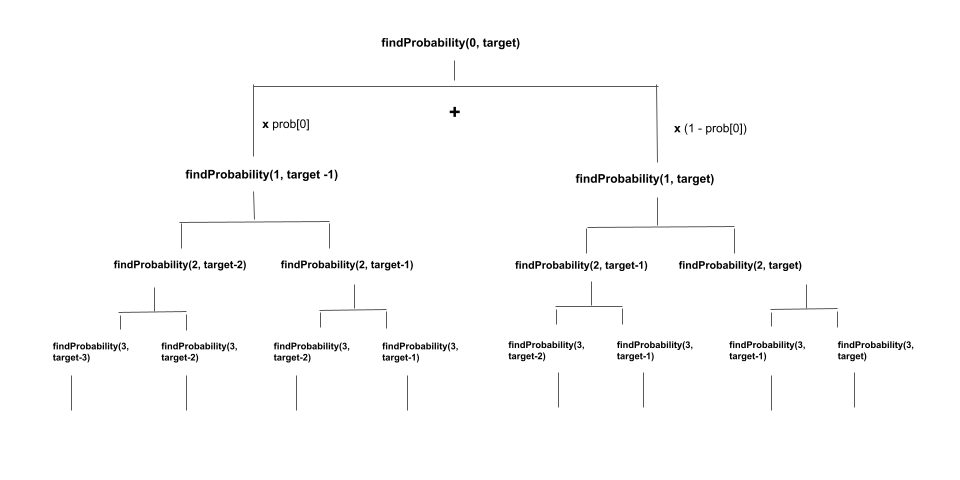

## Solution

---

### Overview

We are given some coins where the `i`-th coin has a probability $\text{prob}[i]$ of facing heads when tossed.

Our task is to return the probability that the number of coins facing heads equals `target` if you toss every coin exactly once.

---

### Approach 1: Recursive Dynamic Programming

#### Intuition

If you are new to Dynamic Programming, please see our [Leetcode Explore Card](https://leetcode.com/explore/featured/card/dynamic-programming/) for more information on it!

We toss each coin one by one and generate all possible combinations of coin tosses and add the probability of cases where we get the `target` number of heads. For each coin, we can consider both the head and tail scenarios. There are a total of $2^n$ possible cases if there are `n` coins.

We can use recursion to generate all the possible cases.

<details>
  <summary>Note: If you don't have a strong background in mathematics (probabilities) then you can read the following discussion to be aware that when we multiply or add probabilities. (click to expand)</summary>

The decision to multiply or add probabilities depends on the nature of the events involved and the question being asked.

If we want to find the probability of two independent events occurring together, we need to multiply their probabilities. For example, if we want to know the probability of rolling a six-sided die twice and getting `2` both times, we would multiply the probability of getting `2` on the first roll `(1/6)` by the probability of getting `2` on the second roll `(1/6)`, which gives us a probability of `(1/36)`.
> Thus, while forming one case and tossing `n` coins we will multiply the probability of each coin to get the overall probability of a particular case (or combination).

On the other hand, if we want to find the probability of either of two mutually exclusive events occurring, we need to add their probabilities. For example, if you want to know the probability of rolling a `1` or a `2` on a six-sided die, we would add the probability of rolling a `1` `(1/6)` to the probability of rolling a `2` `(1/6)`, which gives us a probability of `(1/3)`. These are two different cases but they both are included thus we add the probability of each case.

> Hence, to include a particular case (or combination) we add its probability.

</details>
<br>

Consider the first coin and the case in which it shows a head. We'd need another $target - 1$ heads from the remaining coins. The probability of such a case would be, probability of the first coin facing head multiplied by the probability of getting $target - 1$ heads from the remaining coins.

Now, consider the case where the first coin shows a tail. We'd need `target` heads from the remaining coins. The probability of such a case would be, the probability of the first coin facing tail (1 - probability of facing head) multiplied by the probability of getting `target` heads from the remaining coins.

The total probability of getting the `target` heads is the sum of the probabilities of both events as they both lead to the `target` heads independently (law of total probability).

We need two things to perform this recursion: the index of the coin under consideration and the number of more heads required. This is how the recursive relationship is expressed:

> answer = findProbability(index + 1, target - 1) * prob[index] + findProbability(index + 1, target) * (1 - prob[index])

where `findProbability(int index, int target)` is a recursive method that returns the probability of getting `target` heads using coins indexed from `index` to $n - 1$ (0-based indexing), and `n` is the total number of coins.

Because we are decrementing `target` by `1` in one of the recursive calls, one base case would be to return `0` if `target` drops below `0` because a negative number of heads is impossible to obtain.

The other case is when we have covered all of the coins, in which case $index = n$. If we have covered all of the coins and still have $target \neq 0$, we cannot get any more heads because there are no coins left. We should not include the possibility of the event that resulted in this state. As a result, we'd return `0` to never add probabilities in cases where we couldn't get `target` heads.

If we have covered all of the coins and $target = 0$, we have exactly the required number of heads. We should include the likelihood of the event that resulted in this state. As a result, we would return `1` to count the probability of receiving `target` heads in such cases.

The solution is `findProbability(0, target)`.

The recursion tree of the above relation would look something like this:



Several subproblems, such as $findProbability(2, target - 2)$, $findProbability(3, target - 1)$, $findProbability(3, target - 2)$, etc., are solved multiple times in the partial recursion tree shown above. If we draw the entire recursion tree, we can see that there are many subproblems that are solved repeatedly.

To avoid this issue, we store the solution of each sub-problem and when we encounter the same subproblem again, we simply refer to the stored result. This is called **memoization**.

As we know the current state of a sub-problem depends on the start `index` of the remaining array and the `target` heads we need from this remaining array. Thus, we can use a 2D array here.

#### Algorithm

1. Create an integer variable `n` and initialize it to the size of the `prob` array.
2. Create a 2D-array called `memo` having `n` rows and $target + 1$ columns where $\text{memo}[i][j]$ will store the probability of getting `j` heads using coins from index `i` to $n - 1$ (0-based indexing). Initialize the `memo` array with `-1`.
3. Return `findProbability(index, n, memo, prob, target)` where `findProbability` is a recursive method with five parameters: the starting index from which we should consider the coins as `index`, `n`, `memo`, `prob` and `target`. We perform the following in this method:
- If `target < 0`, it means we got more heads than we need, so we return `0` to ignore this case.
- If $index = n$, we have covered all the coins. If `target` is zero, it means we have the required number of heads and we return `1` to keep the probability of the last toss whatever it was as ($number * 1 = number$). The previous recursive call's answer (`number`) is returned to its parent caller where we multiply it with the required probability ($\text{prob}[index]$ or $1 - \text{prob}[index]$). Otherwise, we return `0` if we need more heads but have considered all the coins.
- If $\text{memo}[index][target] \neq -1$, it indicates that we have already solved this subproblem, so we return $\text{memo}[index][target]$.
- We recursively find probabilities considering the coin at `index` to show head and tail independently and add them up. When considering the coin to show head, we need $target - 1$ more heads from coins from index $index + 1$ until the last coin. Now, if we consider the case where the coin shows a tail, we need `target` heads from index $index + 1$ until the last coin. As a result, we perform $\text{memo}[index][target] = findProbability(index + 1, n, memo, prob, target - 1) * \text{prob}[index] + findProbability(index + 1, n, memo, prob, target) * (1 - \text{prob}[index])$.
- Return $\text{memo}[index][target]$.

#### Implementation

```python
class Solution:
    def probabilityOfHeads(self, prob: List[float], target: int) -> float:
        memo = {}

        def findProbability(index, target, n):
            # Return 0 if the target is less than zero because we have more heads
            # than we need.
            if target < 0:
                return 0
            # After tossing all of the coins, if we get the required number of heads,
            # return 1 to count this case, otherwise return 0.
            if index == n:
                if target == 0:
                    return 1
                else:
                    return 0

            if (index, target) in memo:
                return memo[index, target]

            memo[index, target] = findProbability(index + 1, target - 1, n) * prob[index] + \
                                  findProbability(index + 1, target, n) * (1 - prob[index])

            return memo[index, target]

        return findProbability(0, target, len(prob))
```

#### Complexity Analysis

Here, $n$ is the number of coins.

* Time complexity: $O(n \cdot \text{target})$

- Initializing the `memo` array takes $O(n \cdot \text{target})$ time.
- The recursive function might be called more than once as we saw in the recursion tree. However, due to memoization each state will be computed only once. There are a total of $O(n \cdot \text{target})$ states, so we would take $O(n \cdot \text{target})$ time to compute all of them once.

* Space complexity: $O(n \cdot \text{target})$

- The `memo` array consumes $O(n \cdot \text{target})$ space.
- The recursion stack used in the solution can grow to a maximum size of $O(n)$. When we try to form the recursion tree, we see that after each node two branches are formed. The recursion stack would only have one call out of the two branches. The height of such a tree will be $O(n)$ because at each level we are incrementing the index of the coin under consideration by `1`. As a result, the recursion tree that will be formed will have $O(n)$ height. Hence, the recursion stack will have a maximum of $O(n)$ elements.

---

### Approach 2: Iterative Dynamic Programming

#### Intuition

We used a top-down approach with memoization in the preceding approach to store the answers to subproblems in order to solve a larger problem. We can also use a bottom-up approach to solve such problems without using recursion. We build answers to smaller subproblems iteratively first, then use them to build answers to larger problems.

We use the same two states, the coin's index and the required number of heads. We make a 2D array `dp`, where $\text{dp}[i][j]$ represents the probability of getting `j` heads using the first `i` coins. $\text{dp}[n][target]$ is our answer, where `n` is the total number of coins.

We add probabilities considering the coin under consideration to show the head and tail. To form $\text{dp}[i][j]$, we first consider the case of getting a head from $i^{th}$ coin. If it's a head, we need $j - 1$ heads from the first $i - 1$ coins. So, the probability would be $dp[i - 1][j - 1] * prob[i - 1]$.

Now, we consider the case when it shows a tail. We need `j` heads from the first $i - 1$ coins. So, the probability would be $dp[i - 1][j] * (1 - prob[i - 1])$.

We would iterate using two loops with the outer loop iterating over the numbers of coins from $i = 1$ to `n` and the inner loop iterating over the number of heads from $j = 1$ to `target`. The state transition would be as follows:

> dp[i][j] = dp[i - 1][j - 1] * prob[i - 1] + dp[i - 1][j] * (1 - prob[i - 1])

For $j = 0$, the value for $\text{dp}[i][0]$ would be the probability of not getting any heads in the first $i - 1$ coins, and the $i^{th}$ coin also shows tails. It would be $dp[i - 1][0] * (1 - prob[i - 1])$.

Because we cannot get any number of heads from `0` coins, all values with `0` coins under consideration, i.e., $\text{dp}[0][j]$ for `j > 0` will be `0`. $\text{dp}[0][0]$ is set to `1` as the base case because getting `0` heads from `0` coins is always guaranteed.

#### Algorithm

1. Create an integer variable `n` and initialize it to the size of the `prob` array.
2. Create a 2D-array called `dp` having $n + 1$ rows and $target + 1$ columns where $\text{dp}[i][j]$ stores the probability of getting `j` heads using first `i` coins.
3. We set the base case $\text{dp}[0][0] = 1$.
4. We iterate using two loops. The outer loop iterates from $i = 1$ to $i = n$. For each `i`, we first set $\text{dp}[i][0]$. It denotes the probability of `i` coins with `0` heads and would be $\text{dp}[i][0] = dp[i - 1][0] * (1 - prob[i - 1])$, i.e., probability of getting `0` heads from first $i - 1$ coins multiplied by the probability of the current coin showing a tail. Then we start an inner loop that iterates over $j = 1$ to $j = target$. We perform $\text{dp}[i][j] = dp[i - 1][j - 1] * prob[i - 1] + dp[i - 1][j] * (1 - prob[i - 1])$. We added a minor optimization to break the loop if `j > i` as we cannot get more heads than the number of coins itself.
5. Return $\text{dp}[n][target]$.

#### Implementation

```python
class Solution:
    def probabilityOfHeads(self, prob: List[float], target: int) -> float:
        n = len(prob)
        dp = [[0] * (target + 1) for _ in range(n + 1)]
        dp[0][0] = 1

        for i in range(1, n + 1):
            dp[i][0] = dp[i - 1][0] * (1 - prob[i - 1])
            for j in range(1, target + 1):
                if j > i:
                    break
                dp[i][j] = dp[i - 1][j - 1] * prob[i - 1] + dp[i - 1][j] * (1 - prob[i - 1])

        return dp[n][target]
```

#### Complexity Analysis

Here, $n$ is the number of coins.

* Time complexity: $O(n \cdot \text{target})$

- Initializing the `dp` array takes $O(n \cdot \text{target})$ time.
- We fill the `dp` array which takes $O(n \cdot \text{target})$ time.

* Space complexity: $O(n \cdot \text{target})$

- The `dp` array consumes $O(n \cdot \text{target})$ space.

---

### Approach 3: Dynamic Programming with Space Optimization

#### Intuition

The state transition, as we discussed in previous approaches, is:

> dp[i][j] = dp[i - 1][j - 1] * prob[i - 1] + dp[i - 1][j] * (1 - prob[i - 1])

Looking closely at this transition, we can see that to fill $\text{dp}[i][j]$ for a specific `i` and all values of `j` we only need the values from the previous row. We need the values from row $i - 1$ in the `dp` grid to fill row `i` ($dp[i - 1][j - 1]$ and $dp[i - 1][j]$). Values in rows $i - 2$, $i - 3$, and so on are no longer needed.

This can be solved by using two 1D arrays of size `n`, `dp`, and `dpPrev`, where `n` is the total number of coins. We use `dp` to compute current row values and `dpPrev` to store previous row values. After each outer loop iteration, we copy all the values of the current row to `dpPrev` and use it for the next iteration. You may realize that after completing the $i^{th}$ outer loop iteration, $\text{dp}[j]$ here is similar to what $\text{dp}[i][j]$ stored in the previous approach, and $\text{dpPrev}[j]$ is similar to $dp[i - 1][j]$.

We can also solve problem this by using just one 1D array `dp`.

Consider that we have all of the values of row $i - 1$ in `dp` and that we now need to compute the values of row `i`. We can begin an inner loop that iterates in reverse, that is, from $j = target$ to `1`. Now, when we perform $\text{dp}[j] = dp[j - 1] * prob[i - 1] + \text{dp}[j] * (1 - prob[i - 1])$, we get values for $dp[j - 1]$ and $\text{dp}[j]$ from the previous row, not the current row, because we are iterating in reverse order. It is important to understand that we only change the values in the $i^{th}$ row (i.e., we use `i` coins) but never use them in the same outer loop iteration. The values modified in the $i^{th}$ iteration would be used to update values in the next iteration ($(i + 1)^{th}$ iteration).

Finally, we compute the case of zero heads, i.e., $j = 0$. We cannot use $j - 1$ for $j = 0$, so we need to compute it separately. The probability is simply $\text{dp}[0] = \text{dp}[0] * (1 - prob[i - 1])$ after completing the inner loop for each outer loop iteration.

#### Algorithm

1. Create an integer variable `n` and initialize it to the size of the `prob` array.
2. Create a 1D-array called `dp` of size $target + 1$.
3. We set the base case $\text{dp}[0] = 1$.
4. We iterate using two loops. The outer loop iterates from $i = 1$ to `n` and the inner loop iterates from $j = 1$ to `target`. We perform $\text{dp}[j] = dp[j - 1] * prob[i - 1] + \text{dp}[j] * (1 - prob[i - 1])$. After the completion of the inner loop, we also update $\text{dp}[0] = \text{dp}[0] * (1 - prob[i - 1])$ to cover the case of zero heads. We cannot use $j - 1$ for $j = 0$, so we need to compute it separately.
5. Return $\text{dp}[target]$.

#### Implementation

```python
class Solution(object):
    def probabilityOfHeads(self, prob, target):
        n = len(prob)
        dp = [0] * (target + 1)
        dp[0] = 1

        for i in range(1, n + 1):
            for j in range(target, 0, -1):
                dp[j] = dp[j - 1] * prob[i - 1] + dp[j] * (1 - prob[i - 1])
            dp[0] = dp[0] * (1 - prob[i - 1])

        return dp[target]
```

#### Complexity Analysis

Here, $n$ is the number of coins.

* Time complexity: $O(n \cdot \text{target})$

- Initializing the `dp` array takes $O(\text{target})$ time.
- To get the answer, we use two loops that take $O(n \cdot \text{target})$ time.

* Space complexity: $O(\text{target})$

- The `dp` arrays take $O(\text{target})$ space.