[TOC]

## Solution

---
### Overview

In this problem, we are asked to cut a chocolate bar into $k + 1$ pieces having one or more consecutive chunks. Each chunk has a sweetness value, the sweetness of a piece is equal to the total sweetness of all chunks in the piece, and we always receive the piece with the **minimum total sweetness**. Our goal is to find a way to **maximize** the sweetness of the piece that we take.

<br/>

---

### Approach 1: Binary Search + Greedy

**Intuition**

We can simplify the problem a little bit by thinking about it abstractly and focusing on the mathematical part: the chocolate bar is represented by a list of non-zero integers, the sum of a contiguous subarray stands for the sweetness of the chocolate piece represented by this subarray. Here the task is to find the maximum possible minimum sum of all subarrays after dividing the array into $k + 1$ contiguous subarrays.

At first glance, this looks like an **optimization problem**, where we need to find the best cutting plan (the plan that has the maximum value for us among all possible cutting plans). A cutting plan is a plan that distributes $k + 1$ contiguous pieces of chocolate bar with no leftover chunks of chocolate.

However, before we get lost optimizing a cutting plan, let's consider this problem from a different perspective:

In every distinct cutting plan, there is always a minimum value (the sweetness of the chocolate piece for us). Hence, we have a collection of all possible minimum values (we will call it **workable value** from now on) from all cutting plans. Likewise, we will call any minimum value that cannot result from a valid cutting plan an **unworkable value**.

For example, for a given chocolate bar, we have `i` cutting plans and the collection of all workable values is `[a, b, c, d]`. In this example, all the other numbers besides `a`, `b`, `c`, and `d` are unworkable. The workable values might distribute like below. Note that the figure does not necessarily stand for the true case; it's just a representative since the actual distribution of the workable values is still unknown to us!

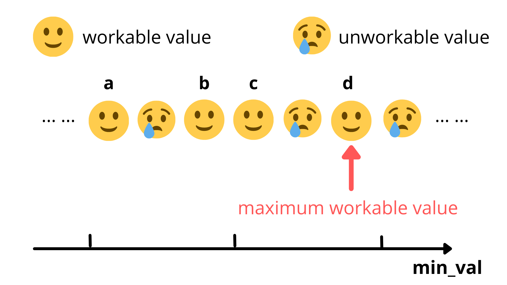

Thus the original question becomes: how can we find the maximum workable value among all workable values `a`, `b`, `c`, and `d`?

We could use a brute force approach and try every possible combination of `k` cuts from the $N - 1$ positions where the chocolate bar can be cut, and then select the combination that results in us getting a piece with the optimal minimum sweetness. However, there are $N - 1 \choose k$ ways we can cut the chocolate bar `k` times, and many of the combinations may have the same minimum sweetness value, so this is probably not the most efficient approach. However, since we are only interested in the minimum sweetness value, rather than trying every possible combination of cuts, we could instead try every possible minimum sweetness value.

We can start with a large number `x` which must be unworkable, for example, the sum of total sweetness plus 1, that is $x = sum(sweetness) + 1$. Since this number is larger than the sweetness of the entire chocolate bar, there is no way we can cut a piece with the sweetness of this number from the bar. Therefore, `x` and all larger numbers must be unworkable. Then our task is to reduce `x` by one each time until `x` becomes a workable value; this will be the answer.

- Test if the value $x - 1$ works, that is, cut the chocolate into $k + 1$ pieces of which the minimum sweetness is $x - 1$.

- If $x - 1$ works, then we have found the maximum workable value!

- However, if $x - 1$ still doesn't work, we go ahead and check if the value $x - 2$ works.

- If $x - 2$ doesn't work, we will move on to test whether $x - 3$ works.

- So on so forth till we find the first value that works.

Interesting! We no longer need to optimize the cutting plan. We can just try every value to see if it works or not, and we will still find the final answer! In other words, we convert this **optimization** problem into a **decision** problem posed as a series of yes-no questions.

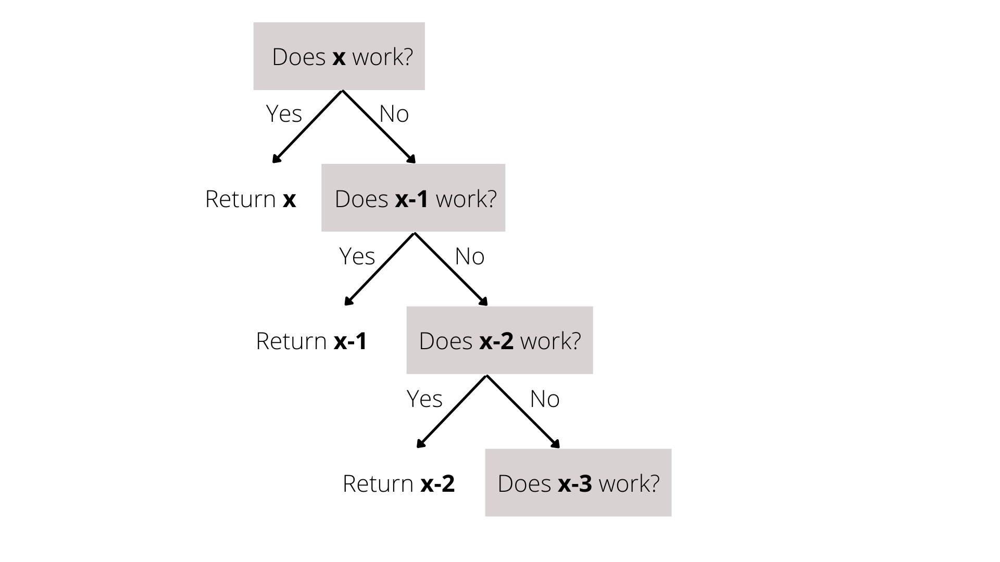

---

Don't celebrate too early, here comes two questions for this new decision problem:

- Given a minimum sweetness `x`, how do we check if a cutting plan exists? That is, to answer the yes-no questions above.

- Is there a more efficient method to find the maximum workable value `x`?

Let's solve these two questions one by one.

---

A straightforward approach to verify if a cutting plan works is as follows. Once we have selected a minimal sweetness `x` to test, we just need to traverse the chocolate bar chunk by chunk and sum the sweetness. Once the total sweetness of a piece reaches `x`, then we cut the current piece off of the bar and start building the next piece. Since we want to see if the cutting plan works in the best case, there is no need to add any more chunks to a piece once it reaches the minimum sweetness `x`.
For this approach, there are two possible ending conditions:
  1. We reach the end of the chocolate bar.
  2. Everyone has a piece with sweetness no less than `x`.

Thus, if we meet the first ending condition and not everyone has received a chunk of chocolate, then we know `x` is not a workable value.  On the other hand, if we meet the second ending condition, then we know that `x` is a workable value.

Let's get our hands dirty by going through two examples. Imagine you have a chocolate bar that consists of 9 chunks indicated by the list in the figure below, and you would like to cut it into 5 pieces for your four friends and yourself.
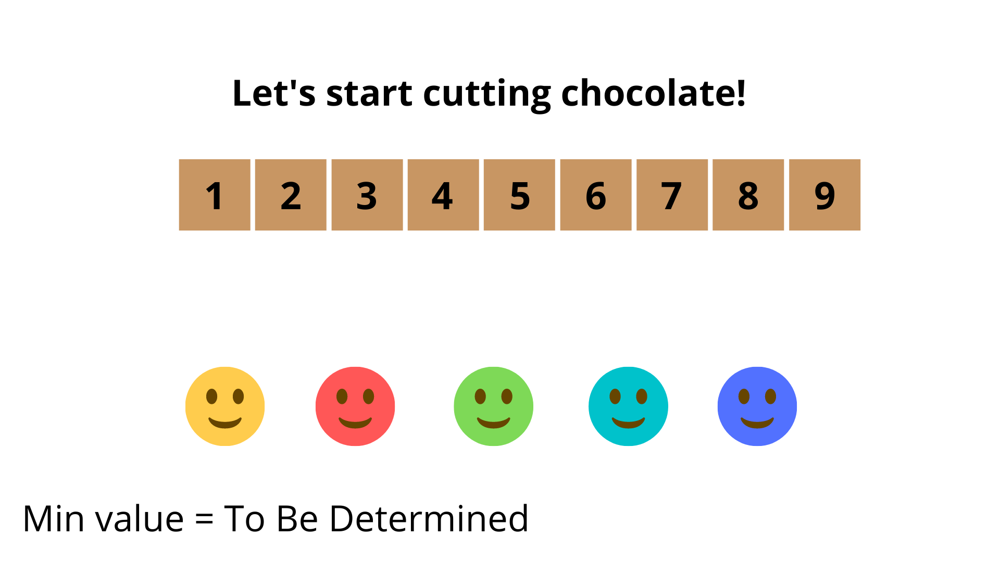

In case 1, for demonstration purposes, we will select 5 as the minimum value.  This means that every piece should have a sweetness of at least 5.

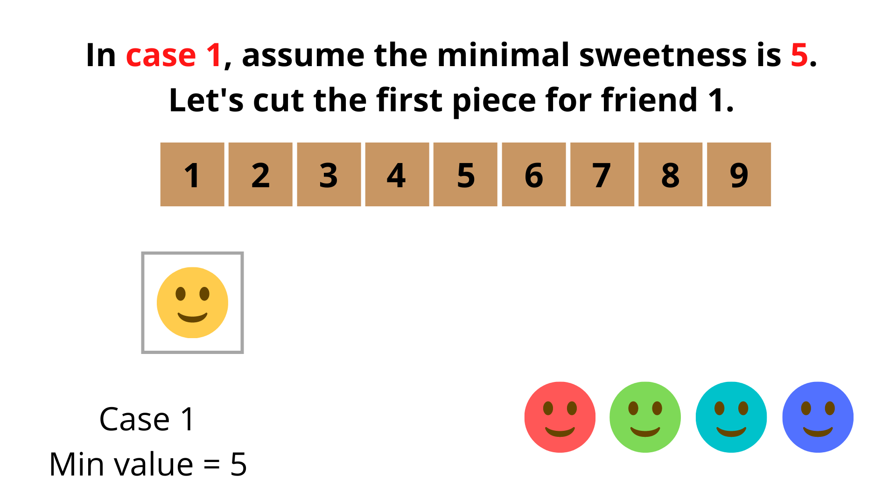

Let's cut the first chocolate piece for the first person.  We start on the left side of the chocolate bar and count the total sweetness accumulated so far.

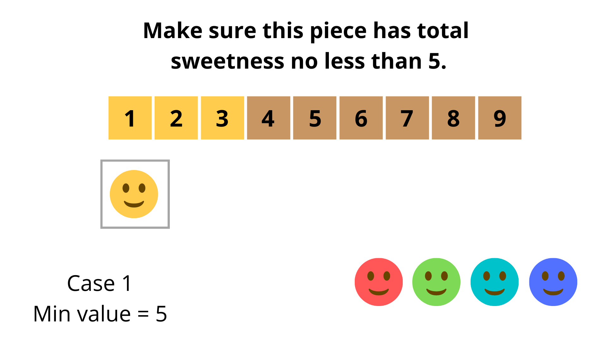

When we take the third chunk into account, the total sweetness is 6, which is not less than 5. So let's cut this piece off and give it to the first person. Job well done! (Partially)

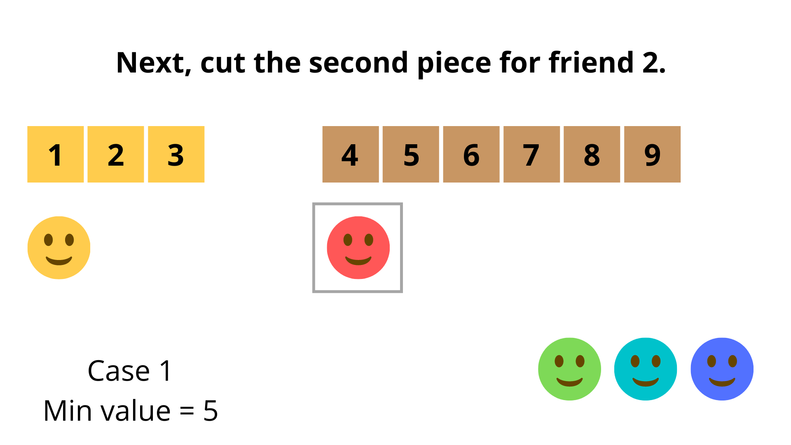

Let's pick up from where we just cut the chocolate and start counting chunks for the second person.

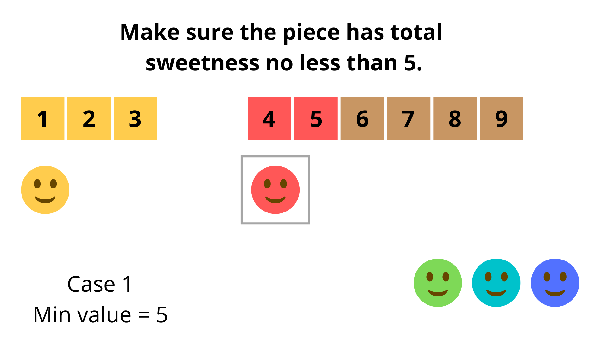

Once we reach the fifth chunk, the total sweetness of the current piece is 4 + 5 = 9, which is not less than 5, so we can cut this piece off and give it to the second person.

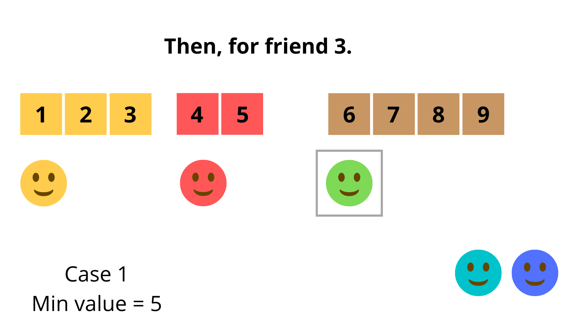

We will repeat this process for the third person.

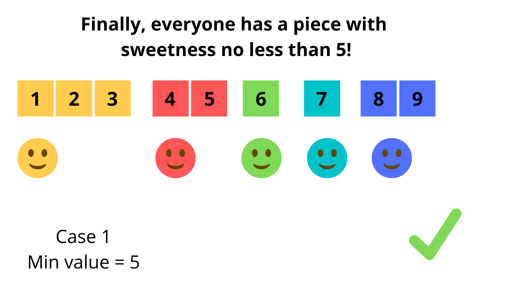

Finally, every person (including yourself) has a valid piece with sweetness no less than 5. Job done!

---

In case 2, since we know that 5 works, let's try a larger value.  For demonstration purposes, we will select 8 as the minimum value.  This means that every piece should have a sweetness of at least 8. Let's test if this plan works!

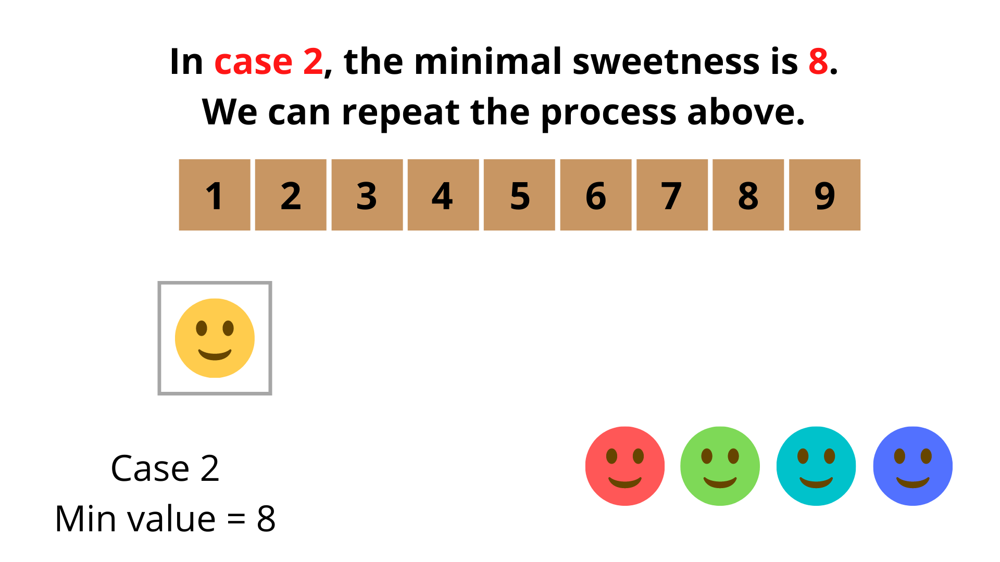

As before, we will start by cutting chocolate for the first person.

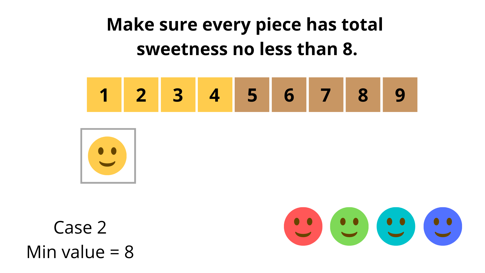

Notice that the minimum sweetness is 8 in this case, and we get a total sweetness that is not less than 8 after taking the fourth piece into account.

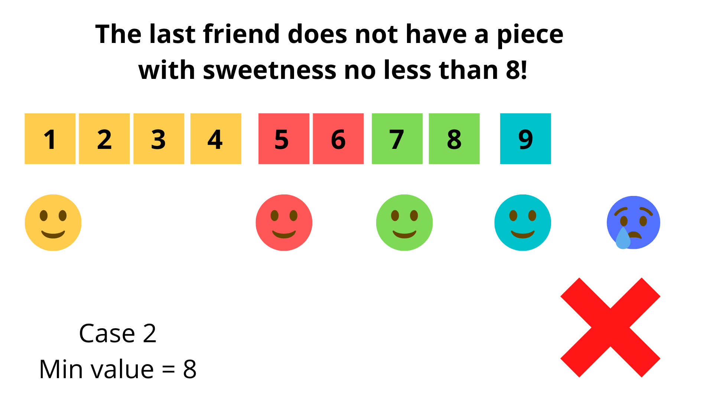

Oops, the last person does not have a piece with sweetness of at least 8, which means we failed at cutting chocolate!

---

Now we understand how to cut the chocolate with any given minimum value. Let's move on to the second question: Is there a better method of searching for the optimal minimum value?

A key observation that we can make from the first example is:
> If a cutting plan with the minimum value of `x` exists, then there also exists a cutting plan with the minimum value of $x - 1$. In other words, since 5 is a workable value, 4 is guaranteed to be a workable value.

In the cutting plan for value `x`, every piece has sweetness no less than `x`, which is no less than $x - 1$ as well, so the cutting plan for the value of `x` will automatically work for the value of $x - 1$!

Wait a second, we are asked to find the cutting plan where the minimum sweetness piece has a value of **exactly** `x`, but this plan does not guarantee that. For instance, in the first example 5 was a workable value, but none of the pieces had a value of **exactly** 5.  So how can we handle this special case?

Take the figure below as an example, where 3 people share a chocolate bar that consists of 3 chunks of sweetness 8.

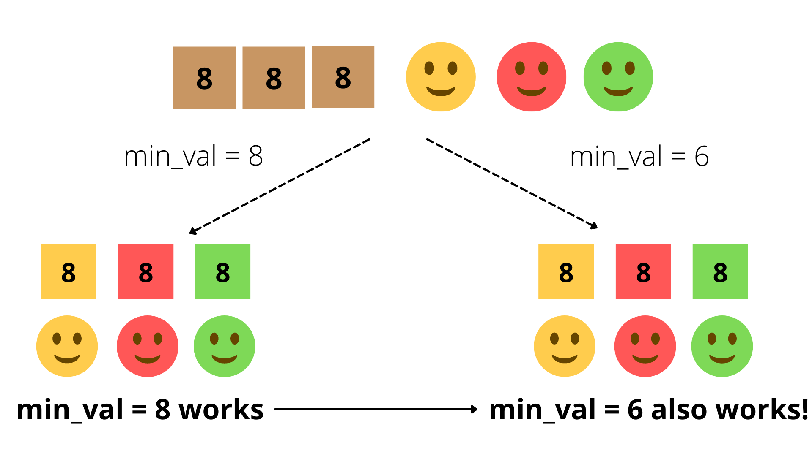

If we set 8 as the minimum value, we can find a workable cutting plan and this plan has the exact minimum value 8. However, if we set 6 as the minimum value, the original cutting plan for a minimum value of 8 still works for 6, but we can not find any piece with the sweetness of exactly 6!

Fortunately, we do not need to worry about the special case above. The reason is that when a fixed cutting plan with the minimal value `x` exists but we can not find a single piece with the sweetness of exactly `x`, it means that every piece has a sweetness greater than `x`. Thus the minimum sweetness in this cutting plan must be a workable value.

Hence, once we find a cutting plan with a minimum workable value of `x`, there are only two possible scenarios:
  1. There exists a piece with a sweetness of exactly `x`.
  2. There does not exist a piece with an exact sweetness of `x`.  However, a workable value exists that is **larger than** `x`.

Note that we do not need to worry about the possibility of there always being a larger workable value. This is because if the minimum value of `x` does not work, then the value of $x + 1$ also will not work. Similarly, according to the previous law, if `x` works, then $x - 1$ will work.

This idea is presented visually in the figure below.

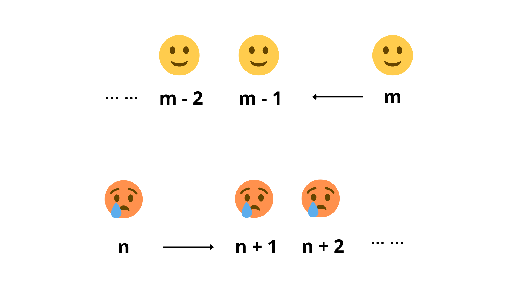

Therefore, the workable values (the sweetness we can get) distribute like the figure below, we are supposed to get the maximum workable value among all the workable values.

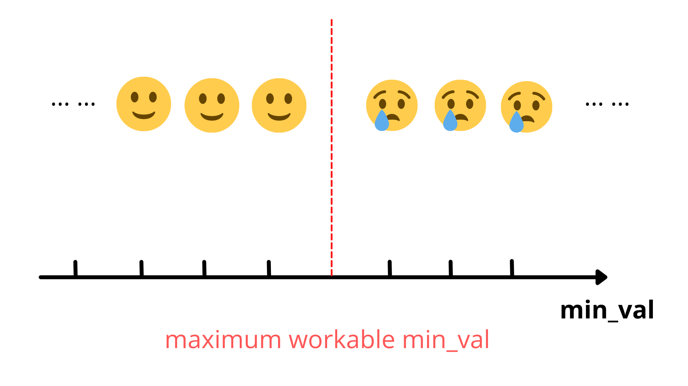

>This quality, a division of the workable and unworkable values at the optimal value, tells us that **binary search** is a promising method.

---

Thus, let's see how we can apply binary search to solve this problem.  Anytime we approach a problem using binary search, we should consider these three common questions:
- What is the search space?
- How can we reduce the search space?
- When can we return the result?

Let's solve these three questions one by one.

>The boundaries of the search space are the minimum possible answer (lower boundary) and the maximum possible answer (upper boundary). Therefore, our binary search will not miss any possible workable value.

In this problem, the left boundary `left` is the minimum of sweetness, that is $left = min(sweetness)$, since `left` is the smallest possible sweetness for this piece of chocolate. (There is no piece with sweetness less than `left`!)

The right boundary `right` is the total sweetness of the chocolate bar (`total`) divided by the number of people $k + 1$ , that is $total / (k + 1)$. It is the largest possible sweetness we can get for ourselves. Note that if the sweetness of the chunk for us is larger than this value, say $total / (k + 1) + 1$, this will still be the smallest sweetness.  Thus, the total sweetness is no less than $(total / (k + 1) + 1) * (k + 1)$ which is strictly larger than `total`, meaning any value larger than $total / (k + 1)$ is impossible.

Therefore, we can assign the lower boundary $left = min(sweetness)$ and the upper boundary $right = total / (k + 1)$. The optimal minimum sweetness must be within this range.

>Since we are looking for the maximum possible value, thus the middle value should be $mid = (left + right + 1) / 2$.

If we can successfully cut the chocolate into $k + 1$ pieces and every piece has a sweetness no less than `mid`, this means `mid` is a workable value and that there may exist a larger workable value. Thus, we can eliminate the search space `[left, mid)` and continue searching on the remaining interval `[mid, right]`. Accordingly, we will reassign the left boundary `left` as `mid`, that is to say, $left = mid$.

On the other hand, if we cannot cut the chocolate into $k + 1$ pieces with sweetness no less than `mid`, this means the current value `mid` is too large. Therefore we should eliminate the search space `[mid, right]` and continue searching on the remaining half `[left, mid)` containing values smaller than `mid`. Therefore, we reassign the right boundary `right` as $mid - 1$, that is to say, $right = mid - 1$.

**Why do we use $mid = (left + right + 1) / 2$ here instead of $mid = (left + right) / 2$?**

To understand why let's consider the example in the figure below:

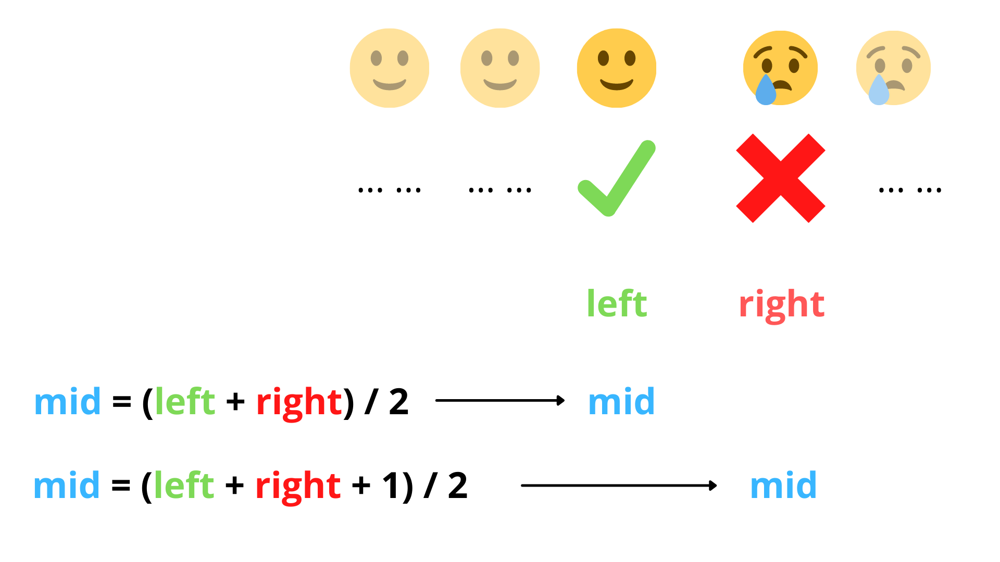

Consider the case where `left` is already at the maximum workable value and `right` is the minimum unworkable value, as described in the figure above. We are only one step away from finishing the binary search. If we use $mid = (left + right) / 2$, then `mid` will be equal to `left` for which a workable plan exists. According to the rule for how we reduce the search space, we will set $left = mid$ for the next search.  Thus, the new search space is `[mid, right] = [left, right]`, which is exactly the same as our previous search space.  Thus, the search will loop forever!

However, using $mid = (left + right + 1) / 2$ means we will now set `mid` equal to `right` instead. Since the new `mid` is not workable, we will create the new search space according to the rule, that is `[left, mid - 1] = [left, left]`. Since the left boundary equals the right boundary, we can successfully stop the binary search and return either boundary as the correct answer!

---

<details>

<summary>There are many other interesting problems that can be solved by performing a binary search to find the optimal value. You can practice using the binary search approach on the following problems! (click to show)</summary>

<br>

- [410. Split Array Largest Sum](https://leetcode.com/problems/split-array-largest-sum/)
- [774. Minimize Max Distance to Gas Station](https://leetcode.com/problems/minimize-max-distance-to-gas-station/)
- [875. Koko Eating Bananas](https://leetcode.com/problems/koko-eating-bananas/)
- [1011. Capacity To Ship Packages Within D Days](https://leetcode.com/problems/capacity-to-ship-packages-within-d-days/)

</details>

**Algorithm**

1) Set up the two boundaries (`left` and `right`) of the search space, that is: $left = 1$, $right = total / (k + 1)$.

2) Get the middle value from `left` and `right`, that is $mid = (left + right + 1) / 2$.

3) Check if we can cut the chocolate into $k + 1$ pieces with sweetness no less than `mid`, where `mid` is our current guess at the optimal workable value.

4) If cutting the chocolate bar in this method results in everyone receiving a piece of chocolate that is at least as sweet as `mid`, then let $left = mid$. Otherwise, let $right = mid - 1$.

5) Repeat the **steps 2, 3, and 4** until the two boundaries overlap, i.e., $left = right$, which means that you have found the maximum total sweetness of a piece you can receive by cutting the chocolate bar optimally. We can return either `left` or `right` as the answer.

**Implementation**

```python
class Solution:
    def maximizeSweetness(self, sweetness: List[int], k: int) -> int:
        # Initialize the left and right boundaries.
        # left = 1 and right = (total sweetness) / (number of people).
        number_of_people = k + 1
        left = min(sweetness)
        right = sum(sweetness) // number_of_people

        while left < right:
            # Get the middle index between left and right boundary indexes.
            # cur_sweetness stands for the total sweetness for the current person.
            # people_with_chocolate stands for the number of people that have
            # a piece of chocolate of sweetness greater than or equal to mid.
            mid = (left + right + 1) // 2
            cur_sweetness = 0
            people_with_chocolate = 0

            # Start assigning chunks to the current person.
            for s in sweetness:
                cur_sweetness += s

                # If the total sweetness is no less than mid, this means we can break off
                # the current piece and move on to assigning chunks to the next person.
                if cur_sweetness >= mid:
                    people_with_chocolate += 1
                    cur_sweetness = 0

            if people_with_chocolate >= k + 1:
                left = mid
            else:
                right = mid - 1

        return right
```

**Complexity Analysis**

Let $n$ be the number of chunks in the chocolate and $S$ be the total sweetness of the chocolate bar.

* Time complexity: $O(n \cdot \log(S / (k + 1)))$

    The lower and upper bounds are `min(sweetness)` and $S / (k + 1)$ respectively. In the worst case (when `k` is small), the right boundary will have the same magnitude as `S`, and the left boundary will be 1. Thus, the maximum possible time complexity for a single binary search is $O(\log S)$.
    For every single search, we need to traverse the chocolate bar in order to allocate chocolate chunks to everyone, which takes $O(n)$ time.

* Space complexity: $O(1)$

    For every search, we just need to count the number of people who receive a piece of chocolate with enough sweetness, and the total chocolate sweetness for the current people, both only cost constant space.

<br/>