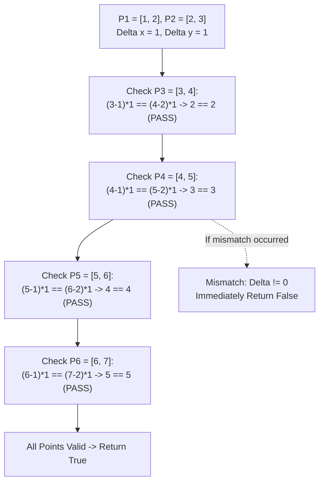

# Guided Example: Check If It Is a Straight Line

## 1. Problem Essence & Algorithmic Mental Model

Given an array of 2D Cartesian coordinates where each point is represented as an integer pair $[x, y]$, we must determine whether all points lie on a single straight line.

In Euclidean geometry, two distinct points $P_1(x_1, y_1)$ and $P_2(x_2, y_2)$ uniquely define a line $\mathcal{L}$. Every subsequent point $P_k(x_k, y_k)$ for $k \ge 3$ must lie on $\mathcal{L}$ for the entire set to be collinear.

A conventional textbook approach equates slopes:
$$\frac{y_2 - y_1}{x_2 - x_1} \stackrel{?}{=} \frac{y_k - y_1}{x_k - x_1}$$
However, slope division in numerical computation is fraught with hazards:
1. **Division by Zero:** When $x_2 = x_1$ (a vertical line), the denominator is zero.
2. **Floating-Point Precision Drift:** Slopes such as $1/3$ or $7/9$ cannot be represented with finite binary floating-point precision, causing spurious rounding errors.

The optimal mathematical mental model is the **2D Vector Cross-Product (Wedge Product)**:
Define the baseline displacement vector from $P_1$ to $P_2$:
$$\vec{v} = (x_2 - x_1, y_2 - y_1) = (\Delta x, \Delta y)$$
For each subsequent point $P_k$, define the test displacement vector from $P_1$ to $P_k$:
$$\vec{w}_k = (x_k - x_1, y_k - y_1)$$
Two 2D vectors are collinear if and only if the signed area of the parallelogram they span is identically zero.

```
Vector Collinearity & Parallelogram Area:
        y ^
          |                 P_k (Collinear: Area = 0)
          |                /
          |          P2  /
          |         /  /
          |       /  /  vec(w_k)
          |     /  /
          |   P1  / vec(v)
          |   | /
          +───+───────────────────> x
          Area = (x_k - x_1) * Delta y - (y_k - y_1) * Delta x == 0
```

Cross-multiplying converts the problem into pure integer arithmetic:
$$(x_k - x_1) \cdot \Delta y - (y_k - y_1) \cdot \Delta x = 0$$
This eliminates division entirely, handles vertical and horizontal lines uniformly, and runs in exact integer precision without floating-point errors.

---

## 2. Mathematical Formalism & Invariants

Let the input array be $\mathcal{P} = [P_1, P_2, \dots, P_n]$ with $n \ge 2$, where $P_i = (x_i, y_i) \in \mathbb{Z}^2$.
All points in $\mathcal{P}$ are guaranteed to be pairwise distinct.

### Baseline Vector
Anchor on $P_1 = (x_1, y_1)$ and $P_2 = (x_2, y_2)$. Define:
$$\Delta x = x_2 - x_1, \quad \Delta y = y_2 - y_1$$
Because $P_1 \neq P_2$, the vector $\vec{v} = (\Delta x, \Delta y) \neq (0, 0)$.

### 2D Determinant (Cross-Product) Invariant
For any point $P_k = (x_k, y_k)$, define the test vector $\vec{w}_k = (x_k - x_1, y_k - y_1)$.
The points $P_1, P_2, P_k$ are collinear if and only if the $2 \times 2$ determinant vanishes:
$$\mathcal{D}(P_k) = \det \begin{bmatrix} x_k - x_1 & \Delta x \\ y_k - y_1 & \Delta y \end{bmatrix} = (x_k - x_1)\Delta y - (y_k - y_1)\Delta x = 0$$

### Global Collinearity Theorem
The set $\mathcal{P}$ is collinear if and only if:
$$\forall k \in \{3, 4, \dots, n\}, \quad \mathcal{D}(P_k) = 0$$

*Proof:*
- $(\implies)$ If all points lie on line $\mathcal{L}$, then for all $k$, the vector $P_k - P_1$ is a scalar multiple of $P_2 - P_1$: $\vec{w}_k = c_k \vec{v}$.
  Then $\det[\vec{w}_k, \vec{v}] = c_k \det[\vec{v}, \vec{v}] = 0$.
- $(\impliedby)$ If $\mathcal{D}(P_k) = 0$ for all $k \ge 3$, then $\vec{w}_k$ and $\vec{v}$ are linearly dependent. Since $\vec{v} \neq \vec{0}$, there exists scalar $\lambda_k \in \mathbb{R}$ such that $P_k - P_1 = \lambda_k(P_2 - P_1) \implies P_k \in \mathcal{L}$. $\blacksquare$

---

## 3. Concrete Example Execution & State Evolution

Consider the representative input coordinates:
$$\mathcal{P} = [[1, 2], [2, 3], [3, 4], [4, 5], [5, 6], [6, 7]]$$

### Anchor Initialization:
- $P_1 = (1, 2)$
- $P_2 = (2, 3)$
- $\Delta x = 2 - 1 = 1$
- $\Delta y = 3 - 2 = 1$

### Step-by-Step Determinant Evaluation Trace

| Index $k$ | Point $P_k$ | Vector $\vec{w}_k = (x_k - x_1, y_k - y_1)$ | Left Product $(x_k - x_1)\Delta y$ | Right Product $(y_k - y_1)\Delta x$ | Determinant $\mathcal{D}(P_k)$ | Collinear? |
|---|---|---|---|---|---|---|
| 2 | $(3, 4)$ | $(3 - 1, 4 - 2) = (2, 2)$ | $2 \times 1 = 2$ | $2 \times 1 = 2$ | $2 - 2 = 0$ | **Yes** |
| 3 | $(4, 5)$ | $(4 - 1, 5 - 2) = (3, 3)$ | $3 \times 1 = 3$ | $3 \times 1 = 3$ | $3 - 3 = 0$ | **Yes** |
| 4 | $(5, 6)$ | $(5 - 1, 6 - 2) = (4, 4)$ | $4 \times 1 = 4$ | $4 \times 1 = 4$ | $4 - 4 = 0$ | **Yes** |
| 5 | $(6, 7)$ | $(6 - 1, 7 - 2) = (5, 5)$ | $5 \times 1 = 5$ | $5 \times 1 = 5$ | $5 - 5 = 0$ | **Yes** |

Every inspected point produces $\mathcal{D}(P_k) = 0$.
The algorithm successfully returns `true`.



### Counterexample Demonstration:
Suppose the third point had been $P_3 = (3, 5)$:
- $\vec{w}_3 = (3 - 1, 5 - 2) = (2, 3)$
- Left Product: $2 \times 1 = 2$
- Right Product: $3 \times 1 = 3$
- Determinant: $2 - 3 = -1 \neq 0$
The condition fails immediately on $P_3$, returning `false` without inspecting $P_4, P_5, P_6$.

---

## 4. Multi-Approach Comparison & Trade-Offs

| Evaluation Paradigm | Floating-Point Slope Division | Reduced Fraction GCD Normalization | Integer Cross-Product (Optimal) |
|---|---|---|---|
| **Formula** | $\text{slope} = \frac{y_k - y_1}{x_k - x_1}$ | $(\Delta y / g, \Delta x / g)$ via Euclidean GCD | $(x_k - x_1)\Delta y == (y_k - y_1)\Delta x$ |
| **Zero Denominator Hazard**| Crashes or requires explicit `inf` branch | Requires explicit vertical/horizontal branches | Handled naturally (0 * k == 0) |
| **Floating Point Precision**| Vulnerable to precision loss (e.g. $1/7$) | Exact integer representation | Exact integer representation |
| **Operations per Point** | 1 float division | 1 GCD calculation + 2 divisions | 2 multiplications, 1 subtraction |
| **Time Complexity** | $\mathcal{O}(n)$ | $\mathcal{O}(n \log(\min(\Delta x, \Delta y)))$ | $\mathcal{O}(n)$ strictly minimal constants |
| **Auxiliary Space** | $\mathcal{O}(1)$ | $\mathcal{O}(1)$ | $\mathcal{O}(1)$ |

```
Efficiency Comparison:
Floating-Point Division: float(y2 - y1) / float(x2 - x1)  -> Division by zero crash if vertical!
GCD Reduced Fraction:    gcd(dx, dy) -> multiple loops per point -> unnecessary overhead.
Cross-Product:           (dx_k * dy) == (dy_k * dx)      -> 2 CPU multiplications, 0 branching.
```

---

## 5. Algorithmic Edge Cases & Boundary Analysis

| Boundary Scenario | Example Configuration | Expected Output | Geometric Justification |
|---|---|---|---|
| **Vertical Line ($\Delta x = 0$)** | `[[0, 0], [0, 1], [0, 5], [0, -2]]` | `true` | $\Delta x = 0, \Delta y = 1$. For all $k$, $x_k - x_1 = 0$. $0 \times 1 == (y_k - y_1) \times 0 \implies 0 == 0$. Handled without zero-division errors. |
| **Horizontal Line ($\Delta y = 0$)** | `[[1, 0], [2, 0], [10, 0]]` | `true` | $\Delta y = 0$. $(x_k - x_1) \times 0 == 0 \times \Delta x \implies 0 == 0$. Handled uniformly. |
| **Minimal Points ($n = 2$)** | `[[1, 1], [2, 2]]` | `true` | Any two distinct points define a line. Loop over `coordinates[2:]` executes 0 times; returns `true`. |
| **Negative Coordinates** | `[[-2, -2], [-1, -1], [1, 1]]` | `true` | Signed integer multiplication handles negative differences and coordinate signs without distortion. |
| **Large Coordinates ($|x|, |y| \le 10^4$)** | Extreme values | Exact boolean | Maximum coordinate difference $\le 2 \times 10^4$. Product $\le 4 \times 10^8$, safely within standard 32-bit/64-bit integer limits. |

---

## 6. Mathematical Verification & Complexity Derivation

Let $n = |\text{coordinates}|$ be the number of given points.

### Time Complexity Analysis:
1. **Anchor Point Selection:**
   - Reading $P_1$ and $P_2$ takes $\mathcal{O}(1)$ operations.
   - Computing $\Delta x = x_2 - x_1$ and $\Delta y = y_2 - y_1$ takes $\mathcal{O}(1)$ subtractions.
2. **Iterative Verification Loop:**
   - The loop runs over the remaining $n - 2$ points.
   - For each point $P_k = (x_k, y_k)$:
     - 2 coordinate subtractions: $(x_k - x_1)$ and $(y_k - y_1)$.
     - 2 integer multiplications: $(x_k - x_1) \cdot \Delta y$ and $(y_k - y_1) \cdot \Delta x$.
     - 1 integer equality comparison.
     - Total work per point: $\mathcal{O}(1)$ elementary CPU instructions.
3. **Early Exit Opportunity:**
   - If the points are not collinear, the loop halts at the very first offending point ($k \le n$).
4. **Worst-Case Running Time:**
   $$T(n) = \sum_{k=3}^n \mathcal{O}(1) = \mathcal{O}(n)$$

### Space Complexity Analysis:
- The algorithm stores four scalar integer coordinates: $x_1, y_1, x_2, y_2$.
- Loop iterator variables: $x, y$.
- No auxiliary lists, sets, or dynamic data structures are instantiated.
- Total auxiliary space is strictly $\mathcal{O}(1)$.

---

## 7. Synthesis & Strategic Takeaways

1. **Cross-Multiplication Eliminates Singularities**: Transforming rational equality $A / B = C / D$ into integer cross-multiplication $A \cdot D = B \cdot C$ completely avoids division-by-zero exceptions on vertical lines.
2. **Determinant as a Geometric Invariant**: The cross-product of two 2D vectors measures the oriented area of the parallelogram they span; collinearity is the exact degenerate state where this area collapses to zero.
3. **Anchor Point Sufficiency**: Because any straight line is determined by two points, testing all other points against the single baseline vector formed by the first two points is both necessary and sufficient, reducing an $\mathcal{O}(n^2)$ pairwise comparison to a clean $\mathcal{O}(n)$ scan.
