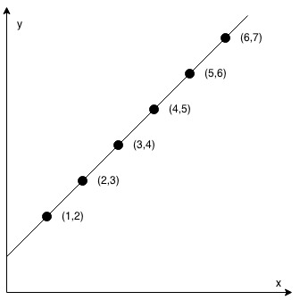
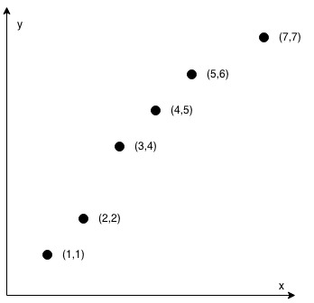

## Description

You are given an integer array `coordinates`, $\text{coordinates}[i] = [x, y]$, where `[x, y]` represents the coordinate of a point. Check if these points make a straight line in the XY plane.
### Function Contract

- `n`: Input parameter.
- Returns expected result.

### Examples

#### Example 1

- **Input:** $coordinates = [[1,2],[2,3],[3,4],[4,5],[5,6],[6,7]]$
- **Output:** `true`
#### Example 2

**

**

- **Input:** $coordinates = [[1,1],[2,2],[3,4],[4,5],[5,6],[7,7]]$
- **Output:** `false`
### Constraints

- $2 \le \text{coordinates.length} \le 1000$

- $\text{coordinates}[i].length = 2$

- $-10^{4} \le \text{coordinates}[i][0], \text{coordinates}[i][1] \le 10^{4}$

- `coordinates` contains no duplicate point.