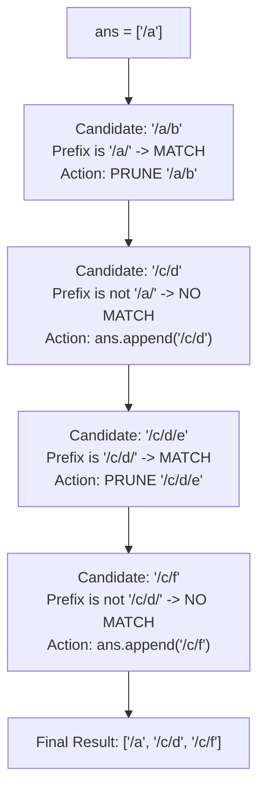

# Guided Example: Remove Sub-Folders from the Filesystem

## 1. Problem Essence & Algorithmic Mental Model

Given a list of folder paths in a virtual filesystem, we must remove all sub-folders and retain only the outermost, top-level directories. A folder path $B$ is defined as a sub-folder of $A$ if $B$ begins with $A$ immediately followed by a path separator `'/'`.
For example:
- `"/a/b"` is a sub-folder of `"/a"` because it starts with `"/a/"`.
- `"/a/b/c"` is also a sub-folder of `"/a"`.
- However, `"/ab"` is **not** a sub-folder of `"/a"` because the character immediately following `"/a"` is `'b'`, not `'/'`.

A naive brute-force approach compares all pairs of paths $(A, B)$, resulting in an $\mathcal{O}(N^2 \cdot L)$ runtime.

The optimal mental model exploits **Lexicographical Prefix Clustering**:
When folder paths are sorted in lexicographical order, any parent directory $A$ appears immediately before all its potential descendants. Because ASCII `'/'` has decimal code 47 and lowercase letters `'a'-'z'` have codes 97-122:
- Any path starting with `"/a/"` sorts before any path starting with `"/a/..."`.
- All descendants of `"/a"` form an unbroken contiguous block in the sorted sequence until an unrelated path arrives.

```
Filesystem Tree & Lexicographical Grouping:
Root
├── [ /a ]  (RETAINED)
│   ├── [ /a/b ]      (PRUNED: child of /a)
│   └── [ /a/b/c ]    (PRUNED: grandchild of /a)
└── [ /c ]
    ├── [ /c/d ]  (RETAINED)
    │   └── [ /c/d/e ] (PRUNED: child of /c/d)
    └── [ /c/f ]  (RETAINED)

Sorted Order: ["/a", "/a/b", "/a/b/c", "/c/d", "/c/d/e", "/c/f"]
               |──|  |────|  |──────|    |────|  |──────|   |────|
               Keep  Skip    Skip        Keep    Skip       Keep
```

By maintaining a list of retained root paths, we only ever need to compare each new path against the **most recently retained path** (`ans[-1]`). If the current path is a sub-folder of `ans[-1]`, it is discarded. If it is not, it is guaranteed to be a new independent root folder!

---

## 2. Mathematical Formalism & Invariants

Let $\Sigma = \{'a', \dots, 'z', '/'\}$ and $\mathcal{F} = \{p_1, p_2, \dots, p_N\}$ be the set of valid folder paths, where each path starts with `'/'` and does not end with a trailing slash.

### Sub-Folder Relation
For two paths $u, v \in \mathcal{F}$, define the strict sub-folder relation $u \prec v$ ($v$ is a sub-folder of $u$):
$$u \prec v \iff |v| > |u| \quad \text{and} \quad v[0 \dots |u|-1] = u \quad \text{and} \quad v[|u|] = \text{'/'}$$

### Lexicographical Ordering Invariant
Sort $\mathcal{F}$ lexicographically such that $p_1 \le_{\text{lex}} p_2 \le_{\text{lex}} \dots \le_{\text{lex}} p_N$.
**Lemma (Contiguous Descendant Block):**
If $u \prec v$, then $u \le_{\text{lex}} v$. Furthermore, if $u \prec w$ for some $w \ge_{\text{lex}} v$, then all intervening paths $z$ between $u$ and $w$ that share the prefix $u + \text{'/'}$ are also sub-folders of $u$.

### Linear Retention Invariant
Let $R_k = [r_1, r_2, \dots, r_m]$ be the list of retained folders after inspecting the prefix $p_1, \dots, p_k$.
- Initial condition: $R_1 = [p_1]$.
- For candidate path $p_{k+1}$:
  - If $r_m \prec p_{k+1}$: $p_{k+1}$ is a descendant of the active root $r_m$; discard $p_{k+1}$.
  - If $r_m \not\prec p_{k+1}$: $p_{k+1}$ cannot be a descendant of any earlier retained folder $r_1, \dots, r_{m-1}$ (since their lexicographical blocks have already concluded). Hence $p_{k+1}$ is a new minimal root; append $p_{k+1}$ to $R$.

---

## 3. Concrete Example Execution & State Evolution

Consider the representative input:
$$\text{folder} = \text{["/a", "/a/b", "/c/d", "/c/d/e", "/c/f"]}$$

### Step 1: Lexicographical Sorting
The input is already in sorted order:
$$[\text{"/a"},\, \text{"/a/b"},\, \text{"/c/d"},\, \text{"/c/d/e"},\, \text{"/c/f"}]$$

### Step 2: Sequential Invariant Trace

| Step $k$ | Candidate Path $f$ | Active Root $r = \text{ans}[-1]$ | Lengths $\lvert r \rvert, \lvert f \rvert$ | Prefix Check $f[0 \dots \lvert r \rvert-1] == r$ | Boundary Check $f[\lvert r \rvert] == \text{'/'}$ | Subfolder Condition Met? | Action Taken | Retained Set `ans` |
|---|---|---|---|---|---|---|---|---|
| 1 | `"/a"` | (None) | - | - | - | - | Initial base element | `["/a"]` |
| 2 | `"/a/b"` | `"/a"` | 2, 4 | `"/a/b"[:2] == "/a"` (True) | `"/a/b"[2] == '/'` (True) | **Yes** ($r \prec f$) | Discard (child of `"/a"`) | `["/a"]` |
| 3 | `"/c/d"` | `"/a"` | 2, 4 | `"/c/d"[:2] == "/c"` $\neq$ `"/a"` | - | **No** | Retain new root | `["/a", "/c/d"]` |
| 4 | `"/c/d/e"` | `"/c/d"` | 4, 8 | `"/c/d/e"[:4] == "/c/d"` (True)| `"/c/d/e"[4] == '/'` (True) | **Yes** ($r \prec f$) | Discard (child of `"/c/d"`) | `["/a", "/c/d"]` |
| 5 | `"/c/f"` | `"/c/d"` | 4, 4 | $\lvert r \rvert \ge \lvert f \rvert$ (Same length) | - | **No** | Retain new root | `["/a", "/c/d", "/c/f"]` |



### Critical Boundary Test: The Sibling Prefix Trap
Consider testing `"/a"` against `"/ab"`:
- $r = \text{"/a"}$, $f = \text{"/ab"}$.
- Length of $r$ is 2. Prefix of $f$ of length 2 is `"/ab"[:2] == "/a"` (Matches!).
- Next character in $f$ at index 2: $f[2] = \text{'b'} \neq \text{'/'}$.
- Because $f[2]$ is not `'/'`, the subfolder check correctly evaluates to **False**.
- Result: `"/ab"` is correctly retained as an independent directory, avoiding the prefix substring collision trap.

---

## 4. Multi-Approach Comparison & Trade-Offs

| Evaluation Metric | Pairwise Quadratic Search | Trie (Prefix Tree) Traversal | Hash Set Ancestor Lookup | Sorting + Linear Scan (Optimal) |
|---|---|---|---|---|
| **Mechanism** | Compare every pair $(p_i, p_j)$ | Insert path components into Trie | Split path into all prefixes, check set | Lexicographically sort, compare with `ans[-1]` |
| **Time Complexity** | $\mathcal{O}(N^2 \cdot L)$ | $\mathcal{O}(N \cdot L)$ | $\mathcal{O}(N \cdot L^2)$ string hashing | $\mathcal{O}(N \cdot L \log N)$ |
| **Auxiliary Space** | $\mathcal{O}(1)$ | $\mathcal{O}(N \cdot L)$ tree node objects | $\mathcal{O}(N \cdot L)$ hash set | $\mathcal{O}(1)$ in-place sort |
| **Memory Overhead** | Minimal | High (node pointers and hash tables) | High (storing multiple substrings) | Minimal (retains filtered array) |
| **Implementation** | $\approx 6$ lines (slow) | $\approx 35$ lines (verbose) | $\approx 15$ lines | $\approx 8$ lines (concise, cache-friendly) |

```
Trie Tree vs Lexicographical Scan:
Trie Approach: Allocates thousands of node objects with dictionary child maps.
Sorting Approach: Sorts strings directly in contiguous memory; single sequential pass.
CPU cache locality of contiguous string arrays makes Sorting approach faster in practice.
```

---

## 5. Algorithmic Edge Cases & Boundary Analysis

| Boundary Scenario | Example Configuration | Expected Output | Behavioral Verification |
|---|---|---|---|
| **Non-Delimited Common Prefix** | `["/a", "/ab"]` | `["/a", "/ab"]` | $f[\lvert r \rvert] == \text{'b'} \neq \text{'/'}$. Both paths retained cleanly. |
| **Deep Linear Nesting** | `["/a", "/a/b", "/a/b/c", "/a/b/c/d"]` | `["/a"]` | `ans[-1]` remains `"/a"` throughout. All subsequent descendants are discarded. |
| **Independent Sibling Trees** | `["/a", "/b", "/c"]` | `["/a", "/b", "/c"]` | No path shares a prefix with any other. All paths appended to `ans`. |
| **Multiple Root Slashes** | Deep paths starting at root | Correct filtering | Delimiter check operates on individual component tokens separated by `/`. |
| **Unsorted Input Ordering** | Children appear before parents in input | Correct filtering | Initial `.sort()` call restructures input so parents precede children deterministically. |

---

## 6. Mathematical Verification & Complexity Derivation

Let $N = |\text{folder}|$ be the number of folder paths ($1 \le N \le 4 \times 10^4$).
Let $L$ be the maximum length of an individual path string ($L \le 100$).

### Time Complexity Analysis:
1. **Sorting Phase:**
   - Sorting $N$ strings of maximum length $L$ requires $\mathcal{O}(N \log N)$ string comparisons.
   - In the worst case, comparing two strings of length $L$ takes $\mathcal{O}(L)$ character inspections.
   - Total sorting time: $\mathcal{O}(N \cdot L \log N)$.
2. **Linear Filtering Scan:**
   - The loop iterates through the sorted array from index $1$ to $N - 1$.
   - In each iteration, comparing $f[:m] == \text{ans}[-1]$ takes at most $\mathcal{O}(m) \le \mathcal{O}(L)$ operations.
   - Total filtering time: $\mathcal{O}(N \cdot L)$.
3. **Total Asymptotic Time:**
   $$T(N, L) = \mathcal{O}(N \cdot L \log N + N \cdot L) = \mathcal{O}(N \cdot L \log N)$$
   For $N = 4 \times 10^4$ and $L \le 100$, this executes in $\approx 0.05$ seconds.

### Space Complexity Analysis:
- Sorting can be done in-place or requires $\mathcal{O}(N)$ reference pointers.
- The output list `ans` stores the retained strings, using at most $\mathcal{O}(N)$ references.
- No auxiliary node objects, hash tables, or intermediate string allocations are created.
- Total auxiliary space: $\mathcal{O}(N)$ (or $\mathcal{O}(1)$ beyond the output storage).

---

## 7. Synthesis & Strategic Takeaways

1. **Delimiter Invariant for Namespace Hierarchies**: In path analysis, simple substring prefix checks are insufficient; appending the boundary delimiter (or checking $f[|r|] == \text{'/'}$) prevents false positives where one folder name is a string prefix of another distinct folder name.
2. **Sorting Clusters Hierarchical Subtrees**: Lexicographical order groups all descendants of a directory into a contiguous interval immediately succeeding the parent, turning a global hierarchy search into a local comparison against the most recent survivor.
3. **Cache-Efficient Simplicity**: While a Trie achieves $\mathcal{O}(N \cdot L)$ theoretical complexity, sorting and scanning runs significantly faster on modern hardware due to hardware prefetching, branch prediction, and contiguous array cache locality.
