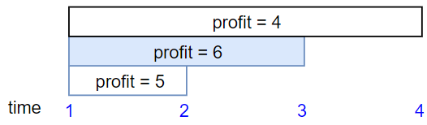

## Description

We have `n` jobs, where every job is scheduled to be done from $\text{startTime}[i]$ to $\text{endTime}[i]$, obtaining a profit of $\text{profit}[i]$.

You're given the `startTime`, `endTime` and `profit` arrays, return the maximum profit you can take such that there are no two jobs in the subset with overlapping time range.

If you choose a job that ends at time `X` you will be able to start another job that starts at time `X`.
### Function Contract

- `n`: Input parameter.
- Returns expected result.

### Examples
#### Example 1

**

**

- **Input:** $startTime = [1,2,3,3], endTime = [3,4,5,6], profit = [50,10,40,70]$
- **Output:** `120`
- **Explanation:** The subset chosen is the first and fourth job.
Time range [1-3]+[3-6] , we get profit of 120 = 50 + 70.
#### Example 2

**

 **

- **Input:** $startTime = [1,2,3,4,6], endTime = [3,5,10,6,9], profit = [20,20,100,70,60]$
- **Output:** `150`
- **Explanation:** The subset chosen is the first, fourth and fifth job.
Profit obtained 150 = 20 + 70 + 60.
#### Example 3

**

**

- **Input:** $startTime = [1,1,1], endTime = [2,3,4], profit = [5,6,4]$
- **Output:** `6`
### Constraints

- $1 \le \text{startTime.length} = \text{endTime.length} = \text{profit.length} \le 5 * 10^{4}$

- $1 \le \text{startTime}[i] < \text{endTime}[i] \le 10^{9}$

- $1 \le \text{profit}[i] \le 10^{4}$