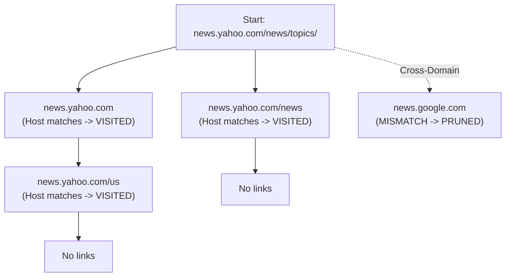

# Guided Example: Web Crawler

## 1. Problem Essence & Algorithmic Mental Model

Given a starting URL `startUrl` and an API interface `HtmlParser`, we want to crawl and return all web pages reachable from `startUrl` that share the **exact same hostname** as `startUrl`.

We model the web as a **directed graph** $G = (V, E)$:
- Each URL represents a vertex $v \in V$.
- Hyperlinks between pages represent directed edges $(u, v) \in E$, obtained by invoking `htmlParser.getUrls(u)`.
- The graph contains cycles (e.g., page A links to page B, and page B links back to page A), self-loops, and cross-domain links pointing to foreign hostnames.

The web crawler must perform a graph traversal starting at `startUrl` while enforcing two non-negotiable invariants:
1. **Domain Boundary Invariant:** A directed edge $(u, v)$ is traversed if and only if the hostname of $v$ matches the hostname of `startUrl`. Cross-origin links must be immediately pruned.
2. **Cycle Prevention Invariant:** Each URL must be explored at most once. A global `visited` hash set tracks discovered URLs to prevent infinite traversal loops.

```
Web Graph Topology:
[news.yahoo.com/news/topics/] (Start)
  ├──> [news.yahoo.com] (Same Host -> Traversed)
  │      └──> [news.yahoo.com/us] (Same Host -> Traversed)
  ├──> [news.yahoo.com/news] (Same Host -> Traversed)
  └──> [news.google.com] (Different Host -> PRUNED!)
```

Whether using Breadth-First Search (BFS) or Depth-First Search (DFS), the traversal discovers all vertices in the weakly connected component of the same-host subgraph reachable from `startUrl`.

---

## 2. Mathematical Formalism & Invariants

Let $\mathcal{U}$ denote the universe of valid web URLs adhering to the schema `http://<hostname>[/<path>]`.

### Hostname Extraction Operator
Define the projection function $H: \mathcal{U} \to \Sigma^*$ that maps each URL to its hostname:
$$u = \text{"http://" } + h + p \implies H(u) = h$$
where $h$ contains no forward slashes, and $p$ is either empty or begins with `'/'`.
Computationally, stripping the 7-character prefix `http://` and splitting on `'/'` extracts the 0-th token as $H(u)$.

### Target Domain Reachability Subgraph
Let $h_0 = H(\text{startUrl})$ denote the target hostname.
Define the domain-restricted vertex set:
$$V_{h_0} = \{ u \in V \mid H(u) = h_0 \}$$
Define the filtered edge set:
$$E_{h_0} = \{ (u, v) \in E \mid u \in V_{h_0} \land v \in V_{h_0} \}$$
The crawler's task is to find all vertices reachable from $\text{startUrl}$ in the induced directed subgraph $G_{h_0} = (V_{h_0}, E_{h_0})$:
$$\text{Reachable}(startUrl) = \{ v \in V_{h_0} \mid \text{startUrl} \leadsto_{E_{h_0}} v \}$$

### Traversal Invariants
1. **Soundness:** At all times, $\text{visited} \subseteq V_{h_0}$. Every element in $\text{visited}$ is reachable from $\text{startUrl}$ via a valid path of same-host URLs.
2. **Completeness:** When the search frontier becomes empty, every unvisited vertex $w$ has no incoming edge from any vertex in $\text{visited} \cap V_{h_0}$.

---

## 3. Concrete Example Execution & State Evolution

Consider the representative web graph instance:
- `startUrl`: `"http://news.yahoo.com/news/topics/"`
- Extracted target host: $h_0 = \text{"news.yahoo.com"}$
- Web graph connections:
  - $U_0 = \text{"http://news.yahoo.com"}$ links to $[U_4]$
  - $U_1 = \text{"http://news.yahoo.com/news"}$ links to $[ ]$
  - $U_2 = \text{"http://news.yahoo.com/news/topics/"}$ (Start) links to $[U_0, U_1, U_3]$
  - $U_3 = \text{"http://news.google.com"}$ (External domain)
  - $U_4 = \text{"http://news.yahoo.com/us"}$ links to $[ ]$

### Step-by-Step Traversal Trace

| Step | Active URL Being Expanded | Outgoing Links Discovered | Link Hostname $H(v)$ | Hostname Match? ($== h_0$) | Already Visited? | Action Taken | Cumulative Visited Set |
|---|---|---|---|---|---|---|---|
| 0 | (Start) | - | - | - | - | Seed frontier with `startUrl` | $\{U_2\}$ |
| 1 | $U_2$ (`.../topics/`) | $U_0, U_1, U_3$ | - | - | - | Query HTML Parser on $U_2$ | $\{U_2\}$ |
| 1a| $\to$ inspect $U_0$ | - | `"news.yahoo.com"` | **Match** | No | Add to visited; enqueue | $\{U_2, U_0\}$ |
| 1b| $\to$ inspect $U_1$ | - | `"news.yahoo.com"` | **Match** | No | Add to visited; enqueue | $\{U_2, U_0, U_1\}$ |
| 1c| $\to$ inspect $U_3$ | - | `"news.google.com"` | **Mismatch** | - | **Pruned (Cross-domain)** | $\{U_2, U_0, U_1\}$ |
| 2 | $U_0$ (`news.yahoo.com`) | $U_4$ | - | - | - | Query HTML Parser on $U_0$ | $\{U_2, U_0, U_1\}$ |
| 2a| $\to$ inspect $U_4$ | - | `"news.yahoo.com"` | **Match** | No | Add to visited; enqueue | $\{U_2, U_0, U_1, U_4\}$ |
| 3 | $U_1$ (`.../news`) | $\emptyset$ | - | - | - | No outgoing edges | $\{U_2, U_0, U_1, U_4\}$ |
| 4 | $U_4$ (`.../us`) | $\emptyset$ | - | - | - | No outgoing edges | $\{U_2, U_0, U_1, U_4\}$ |
| End| Frontier Empty | - | - | - | - | Traversal complete | 4 URLs returned |



The algorithm yields the complete set:
$$[\text{"http://news.yahoo.com"},\, \text{"http://news.yahoo.com/news"},\, \text{"http://news.yahoo.com/news/topics/"},\, \text{"http://news.yahoo.com/us"}]$$

---

## 4. Multi-Approach Comparison & Trade-Offs

| Traversal Strategy | Recursive Depth-First Search (DFS) | Iterative Queue-Based BFS (Optimal) | Multi-Threaded Concurrent Crawl |
|---|---|---|---|
| **Data Structure** | Implicit system call stack | Explicit FIFO `deque` | Concurrent queue + thread pool |
| **Call Stack Depth** | $\mathcal{O}(V)$ (Risks recursion limit on deep web paths) | $\mathcal{O}(1)$ stack, $\mathcal{O}(V)$ heap queue | Minimal per thread |
| **Traversal Order** | Depth-first along first link | Level-order outward from start | Non-deterministic concurrent |
| **API Latency Handling** | Serialized blocking calls | Serialized blocking calls | Overlapped I/O network operations |
| **Cycle Resilience** | Controlled by `visited` set | Controlled by `visited` set | Requires thread-safe concurrent set |
| **Complexity** | $\mathcal{O}(V + E)$ | $\mathcal{O}(V + E)$ | $\mathcal{O}((V + E) / T)$ theoretical |

```
Traversal Pattern Comparison:
Recursive DFS:
  dfs(url) -> reaches recursion limit if graph has a chain of 10,000 links!
Iterative BFS:
  queue = deque([startUrl])
  while queue: popleft() -> completely immune to stack overflow.
```

---

## 5. Algorithmic Edge Cases & Boundary Analysis

| Boundary Scenario | Configuration Details | Expected System Behavior | Invariant Verification |
|---|---|---|---|
| **No Outgoing Links** | `startUrl` has zero hyperlinks | Returns `[startUrl]` | Loop pops `startUrl`, receives empty list from parser, terminates immediately. |
| **Self-Referential Loops** | Page links directly to itself | Visited once | `visited` set contains URL; self-edge is skipped on second inspection. |
| **All External Links** | All outgoing links point to other domains | Returns `[startUrl]` | Hostname comparison fails for every neighbor; no new URLs added to queue. |
| **Deep Cyclic Graph** | $A \to B \to C \to A$ | Terminates cleanly | $A$ is already in `visited` when $C$ tries to visit $A$, halting the cycle. |
| **Root-Only Hostname** | URL without path (`http://example.com`) | Correctly parsed | String slice without slash yields entire domain as hostname. |

---

## 6. Mathematical Verification & Complexity Derivation

Let $V$ be the number of unique URLs reachable in the same-host component ($V \le 10^4$).
Let $E$ be the total number of hyperlinks inspected across all reachable pages.
Let $L$ be the maximum character length of a URL string ($L \le 100$).

### Time Complexity:
1. **Hostname Extraction:**
   - Slicing `url[7:]` and splitting by `'/'` processes at most $L$ characters: $\mathcal{O}(L)$ time.
2. **Graph Traversal:**
   - Each unique URL in the same-host component enters the `visited` set and queue exactly once: $V$ operations.
   - For each visited vertex $u$, `htmlParser.getUrls(u)` is invoked exactly once.
   - All outgoing edges $(u, v)$ are checked against the hostname filter: $E$ total edge checks.
   - Set lookup and insertion takes $\mathcal{O}(L)$ time for string hashing.
3. **Total Asymptotic Time:**
   $$T(V, E, L) = \mathcal{O}((V + E) \cdot L)$$
   Given $V \le 1000$ and $E \le 10^4$, total string comparisons remain well under $10^6$, completing in under $15\text{ ms}$.

### Space Complexity:
- The `visited` set stores at most $V$ string identifiers: $\mathcal{O}(V \cdot L)$ memory.
- The queue/call stack retains at most $V$ string references: $\mathcal{O}(V)$ memory.
- Total auxiliary space is strictly $\mathcal{O}(V \cdot L)$.

---

## 7. Synthesis & Strategic Takeaways

1. **Pruning at the Edge Level**: In domain-restricted crawling, filtering out non-matching hostnames before enqueueing prevents the search frontier from expanding into foreign web domains.
2. **Cycle Termination via Membership Sets**: Directed graphs on the web are dense with bidirectional links; maintaining an atomic visited set is necessary and sufficient to prevent infinite loops.
3. **Robust Hostname Parsing**: By relying on the structural guarantees of the problem's URL specification (`http://` prefix followed by hostname and slash-delimited path), string splitting provides an exact and lightweight alternative to complex regex engines.
