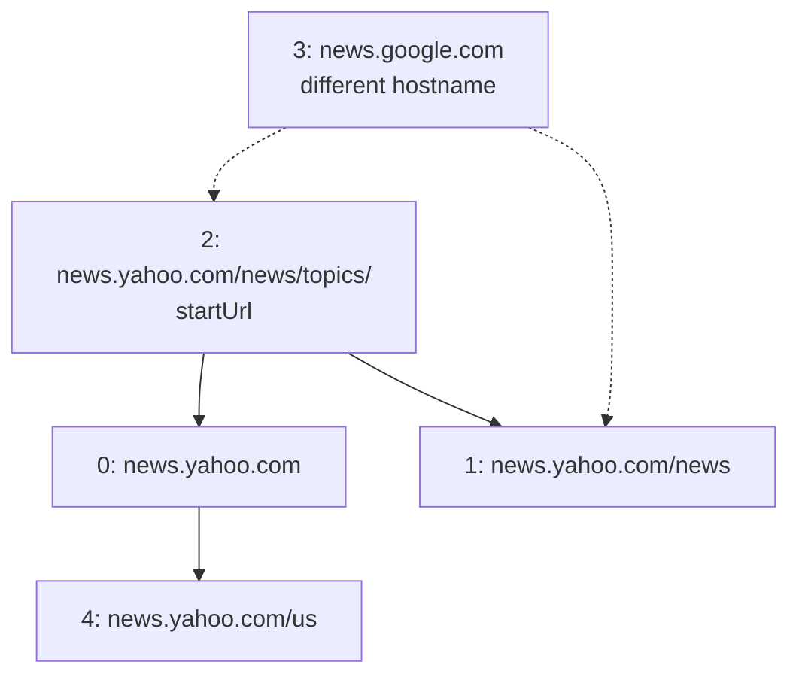
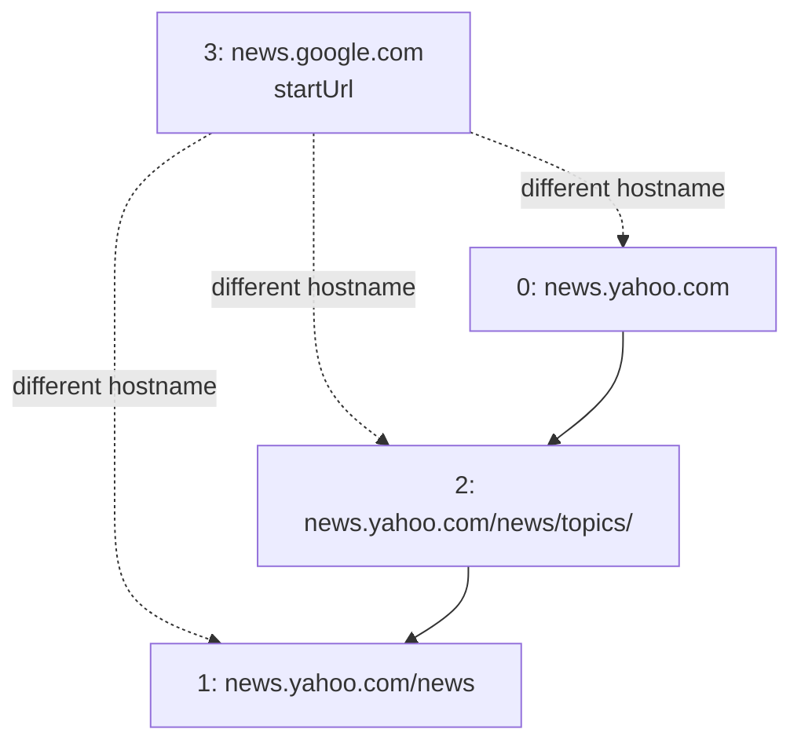

## Examples

**Example 1**

- Input: `urls = ["http://news.yahoo.com","http://news.yahoo.com/news","http://news.yahoo.com/news/topics/","http://news.google.com","http://news.yahoo.com/us"], edges = [[2,0],[2,1],[3,2],[3,1],[0,4]], startUrl = "http://news.yahoo.com/news/topics/"`
- Output: `["http://news.yahoo.com","http://news.yahoo.com/news","http://news.yahoo.com/news/topics/","http://news.yahoo.com/us"]`

The source graph contains all five directed links. Starting at URL `2`, the crawl reaches URLs `0`, `1`, and `4` on `news.yahoo.com`; URL `3` has hostname `news.google.com` and is not reached from the starting page.

**Example 2**

- Input: `urls = ["http://news.yahoo.com","http://news.yahoo.com/news","http://news.yahoo.com/news/topics/","http://news.google.com"], edges = [[0,2],[2,1],[3,2],[3,1],[3,0]], startUrl = "http://news.google.com"`
- Output: `["http://news.google.com"]`
- Explanation: Every URL linked directly from `startUrl` has a different hostname, so none of those links is followed.

The source graph also contains the Yahoo-to-Yahoo links, but they remain unreachable because the crawl must not cross the hostname boundary from URL `3`.

