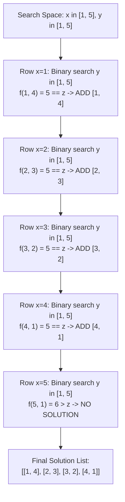

# Guided Example: Find Positive Integer Solution for a Given Equation

## 1. Problem Essence & Algorithmic Mental Model

Given a hidden black-box function $f(x, y)$ that operates on positive integers $x, y \in \{1, 2, \dots, 1000\}$ and returns positive integers, we are tasked with finding all integer pairs $(x, y)$ that satisfy the equation:
$$f(x, y) = z$$
The function guarantees **strict coordinate-wise monotonicity**:
1. $f(x + 1, y) > f(x, y)$ (strictly increasing with respect to $x$)
2. $f(x, y + 1) > f(x, y)$ (strictly increasing with respect to $y$)

Consider the values of $f(x, y)$ arranged as an infinite 2D grid:
- Moving **right** ($x \to x + 1$) strictly increases the value.
- Moving **down** ($y \to y + 1$) strictly increases the value.

This 2D surface is structurally identical to a **Young Tableau** or a monotonically sorted matrix. The solution set $\{(x, y) \mid f(x, y) = z\}$ forms a discrete level contour line (isocline) running diagonally across this grid.

```
2D Monotonic Level Surface (Example f(x, y) = x + y, z = 5):
    y=1  y=2  y=3  y=4  y=5
x=1   2    3    4  [ 5]   6   -> Solution [1, 4]
x=2   3    4  [ 5]   6    7   -> Solution [2, 3]
x=3   4  [ 5]   6    7    8   -> Solution [3, 2]
x=4 [ 5]   6    7    8    9   -> Solution [4, 1]
x=5   6    7    8    9   10
Contour line forms a monotonic staircase from top-right to bottom-left!
```

Because $f(x, y)$ is strictly increasing and integer-valued with $f(1, 1) \ge 1$:
- For any coordinate to satisfy $f(x, y) = z$, we must have $x \le z$ and $y \le z$.
- For each fixed $x$, the slice $g(y) = f(x, y)$ is a strictly increasing 1D sequence. Hence, there is **at most one** integer $y$ satisfying $f(x, y) = z$.

We can locate the level set using:
- **Independent Binary Searches:** For each $x \in [1, z]$, binary search for $y \in [1, z]$ in $\mathcal{O}(z \log z)$ queries.
- **Saddleback Search (Two Pointers):** Start at top-right $(x=1, y=z)$ and march monotonically across the grid in $\mathcal{O}(z)$ queries.

---

## 2. Mathematical Formalism & Invariants

Let $\mathbb{Z}^+ = \{1, 2, 3, \dots\}$.
The oracle $f: \mathbb{Z}^+ \times \mathbb{Z}^+ \to \mathbb{Z}^+$ satisfies:
$$\Delta_x f(x, y) = f(x + 1, y) - f(x, y) \ge 1$$
$$\Delta_y f(x, y) = f(x, y + 1) - f(x, y) \ge 1$$

### Search Window Bounding Theorem
**Theorem:** Any pair $(x, y) \in (\mathbb{Z}^+)^2$ satisfying $f(x, y) = z$ must have $1 \le x \le z$ and $1 \le y \le z$.

*Proof:*
Since $f(1, 1) \ge 1$ and every unit step increases the value by at least 1:
$$f(x, y) \ge f(1, y) + (x - 1) \ge f(1, 1) + (y - 1) + (x - 1) \ge x + y - 1$$
Thus:
$$z = f(x, y) \ge x + y - 1 \implies x \le z - y + 1 \le z \quad (\text{since } y \ge 1)$$
By symmetry, $y \le z$. $\blacksquare$

### Row Uniqueness Invariant
For any fixed $x_0$, the 1D function $h(y) = f(x_0, y)$ is strictly monotonic.
Therefore, $h(y)$ is injective, meaning there exists at most one $y^* \in [1, z]$ such that $h(y^*) = z$.

### Binary Search Predicate
For a given row $x$, define the monotonic predicate:
$$\Phi_x(y) \iff f(x, y) \ge z$$
The first integer index $y$ where $\Phi_x(y)$ becomes true is found via binary search in $\lceil \log_2 z \rceil$ steps. If $f(x, y) == z$, the pair $[x, y]$ is recorded.

---

## 3. Concrete Example Execution & State Evolution

Consider the representative instance:
- Function: $f(x, y) = x + y$
- Target: $z = 5$

Search bounds: $x \in [1, 5]$, candidate $y \in [1, 5]$.

### Step-by-Step Row Binary Search Trace

| Row $x$ | Search Range for $y$ | Midpoint $y_{\text{mid}}$ | Evaluated $f(x, y_{\text{mid}})$ | Comparison with $z = 5$ | Binary Search Outcome $y^*$ | Is $f(x, y^*) == 5$? | Solution Pair Recorded |
|---|---|---|---|---|---|---|---|
| $x = 1$ | $[1, 5]$ | $3 \to 4$ | $f(1, 3)=4 < 5$, $f(1, 4)=5$ | Exact match at $y = 4$ | $y^* = 4$ | **Yes** ($1 + 4 = 5$) | `[1, 4]` |
| $x = 2$ | $[1, 5]$ | $3$ | $f(2, 3)=5$ | Exact match at $y = 3$ | $y^* = 3$ | **Yes** ($2 + 3 = 5$) | `[2, 3]` |
| $x = 3$ | $[1, 5]$ | $3 \to 2$ | $f(3, 3)=6 > 5$, $f(3, 2)=5$ | Exact match at $y = 2$ | $y^* = 2$ | **Yes** ($3 + 2 = 5$) | `[3, 2]` |
| $x = 4$ | $[1, 5]$ | $3 \to 1$ | $f(4, 3)=7 > 5$, $f(4, 1)=5$ | Exact match at $y = 1$ | $y^* = 1$ | **Yes** ($4 + 1 = 5$) | `[4, 1]` |
| $x = 5$ | $[1, 5]$ | $1$ | $f(5, 1)=6 > 5$ | Exceeds target for all $y \ge 1$ | $y^* = 1$ | **No** ($6 \neq 5$) | None |



The algorithm collects the complete solution set:
$$[\,[1, 4],\, [2, 3],\, [3, 2],\, [4, 1]\,]$$

---

## 4. Multi-Approach Comparison & Trade-Offs

| Algorithmic Strategy | Brute-Force Grid Evaluation | Row-by-Row Binary Search | Two-Pointer Saddleback Search (Optimal) |
|---|---|---|---|
| **Mechanism** | Evaluate $f(x, y)$ for all $(x, y)$ pairs | Fix $x$, binary search for $y$ | March from $(1, z)$ adjusting $x$ or $y$ |
| **Monotonicity Used** | None | 1D monotonicity along rows | 2D monotonicity simultaneously |
| **Total Function Calls** | $Z^2$ calls ($10^6$ for $Z=1000$) | $Z \log_2 Z$ calls ($\approx 10^4$ calls) | $2Z$ calls ($\approx 2000$ calls) |
| **Time Complexity** | $\mathcal{O}(Z^2)$ | $\mathcal{O}(Z \log Z)$ | $\mathcal{O}(Z)$ linear |
| **Auxiliary Memory** | $\mathcal{O}(1)$ | $\mathcal{O}(1)$ | $\mathcal{O}(1)$ |
| **Implementation** | Trivial double loop | Clean single `bisect_left` per row | Two pointers `x=1, y=z` |

```
Saddleback Traversal Intuition:
Start at top-right corner (x = 1, y = z):
  If f(x, y) == z: record [x, y], x++, y--
  If f(x, y) > z:  y is too large! y-- (eliminates entire column x..z)
  If f(x, y) < z:  x is too small! x++ (eliminates entire row 1..y)
Each step eliminates one entire row or column! Total steps <= 2 * Z.
```

---

## 5. Algorithmic Edge Cases & Boundary Analysis

| Boundary Scenario | Configuration Details | Expected Output | Verification Mechanism |
|---|---|---|---|
| **Target Minimum ($z = 1$)** | Minimal target value | `[[1, 1]]` if $f(1,1)=1$, else `[]` | Loops over $x \in [1, 1]$. Evaluates single point. |
| **No Integer Solution Exists** | $f(x, y) = 2x + 2y$, $z = 5$ | `[]` | Binary search finds $y$ with $f(x, y) \in \{4, 6\}$; equality check $f(x, y) == 5$ fails on all rows. |
| **Multiplicative Growth** | $f(x, y) = x \cdot y$, $z = 12$ | Factor pairs: `[[1, 12], [2, 6], [3, 4], [4, 3], [6, 2], [12, 1]]` | Binary search finds exact divisors; non-divisors fail equality check. |
| **Asymmetric Functions** | $f(x, y) = x^2 + y$ | Correct non-symmetric pairs | Monotonicity holds independently along each axis regardless of differential rates of growth. |
| **Maximum Target ($z = 1000$)** | $Z = 1000$ | Exact solution list | Function calls strictly bounded by $1000 \log_2 1000 \approx 10,000 \ll 4 \times 10^4$ limit. |

---

## 6. Mathematical Verification & Complexity Derivation

Let $Z = z$ be the target integer value ($1 \le Z \le 1000$).

### Row Binary Search Complexity:
1. **Outer Loop:**
   - Iterates $x$ from $1$ to $Z$: exactly $Z$ iterations.
2. **Inner Binary Search:**
   - The search interval for $y$ is $[1, Z]$, containing $Z$ elements.
   - Standard binary search evaluates $\lceil \log_2 Z \rceil$ midpoints.
   - For $Z = 1000$, $\log_2(1000) \le 10$ evaluations per row.
3. **Total Function Evaluations:**
   $$N_{\text{eval}} = Z \cdot \lceil \log_2 Z \rceil \le 1000 \times 10 = 10,000 \text{ calls}$$
   The problem statement imposes a ceiling of at most $4 \times 10^4$ function calls; $10,000$ is well within the legal budget.
4. **Total Time Complexity:** $\mathcal{O}(Z \log Z)$ arithmetic operations.

### Space Complexity:
- Storing the output list of solution pairs: at most $Z$ pairs: $\mathcal{O}(Z)$ space.
- Search state registers $x, y$: $\mathcal{O}(1)$ auxiliary space.

---

## 7. Synthesis & Strategic Takeaways

1. **Monotonicity Enables Sublinear Search**: Whenever an oracle satisfies coordinate-wise monotonicity, full matrix evaluation can be replaced by dimensional projection: fixing one variable converts the remaining degrees of freedom into 1D binary search.
2. **The Saddleback Invariant**: In 2D monotonic matrices, starting at the off-diagonal corner (top-right or bottom-left) allows each comparison to eliminate either an entire row or an entire column, achieving optimal $\mathcal{O}(X + Y)$ search time.
3. **Natural Constraint Bounding**: Using mathematical deduction ($f(x, y) \ge x + y - 1$) establishes that neither coordinate can exceed $z$, naturally bounding the search space without requiring guesswork or heuristic limits.
