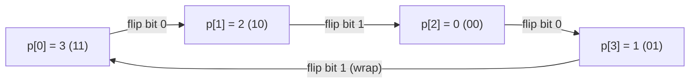

# Guided Example: Circular Permutation in Binary Representation

## 1. Problem Essence & Algorithmic Mental Model

Given two integers $n$ and $\text{start}$, we must construct a permutation $p$ of the $2^n$ integers $\{0, 1, 2, \dots, 2^n - 1\}$ that satisfies three structural conditions:
1. **Initial Seed:** The sequence starts at $p[0] = \text{start}$.
2. **Unit Hamming Distance:** Adjacent elements $p[i]$ and $p[i+1]$ differ by exactly one bit in their binary representations.
3. **Circular Closure:** The final element $p[2^n - 1]$ and the initial element $p[0]$ also differ by exactly one bit.

Topologically, the set of all $n$-bit binary strings forms the vertices of an **$n$-dimensional hypercube graph** $Q_n$:
- Each vertex has $n$ edges connecting to neighbors that differ by exactly 1 bit.
- The desired permutation is a **Hamiltonian Cycle** on $Q_n$ that begins at the designated vertex `start`.

```
Hypercube Q2 Cycle (n = 2):
       [00 = 0] ────────── [01 = 1]
           │                   │
           │                   │
       [10 = 2] ────────── [11 = 3]

Standard Gray Code Cycle:   0 -> 1 -> 3 -> 2 -> (loops back to 0)
Shifted starting at 3:      3 -> 2 -> 0 -> 1 -> (loops back to 3)
```

The canonical solution to generating a unit-Hamming sequence is the **Binary Reflected Gray Code** (Frank Gray, 1953). The mapping:
$$G(i) = i \oplus \lfloor i / 2 \rfloor = i \oplus (i \gg 1)$$
generates a sequence of length $2^n$ where every adjacent pair—including the wrap-around from $G(2^n - 1)$ to $G(0)$—differs in exactly one bit position.

Because the base Gray code is an unbroken circular loop, **any cyclic rotation** of this sequence remains a valid circular Gray code!
By finding the index $j$ where $G(j) = \text{start}$ and rotating the array to begin at index $j$, we satisfy all constraints in $\mathcal{O}(2^n)$ time.

---

## 2. Mathematical Formalism & Invariants

Let $\mathbb{B}_n = \{0, 1\}^n$ represent the space of $n$-bit binary vectors.
Define the Hamming distance between two integers $u, v$:
$$d_H(u, v) = \text{popcount}(u \oplus v)$$

### Standard Gray Code Definition
For $i \in \{0, 1, \dots, 2^n - 1\}$:
$$G(i) = i \oplus (i \gg 1)$$

### Theorem 1: Unit Step Adjacency
For any $i \in \{0, 1, \dots, 2^n - 2\}$:
$$d_H(G(i), G(i + 1)) = 1$$

*Proof:*
Let the binary representation of $i$ terminate in $k \ge 0$ ones preceded by a zero:
$$i = b \cdot 2^{k+1} + 0 \cdot 2^k + \sum_{m=0}^{k-1} 1 \cdot 2^m = b \cdot 2^{k+1} + 2^k - 1$$
Adding 1 flips bit $k$ from 0 to 1 and clears the lowest $k$ bits:
$$i + 1 = b \cdot 2^{k+1} + 2^k$$
Evaluating $G(i) \oplus G(i + 1) = (i \oplus (i+1)) \oplus ((i \gg 1) \oplus ((i+1) \gg 1))$:
$$(i \oplus (i + 1)) = 2^{k+1} - 1$$
$$((i \gg 1) \oplus ((i + 1) \gg 1)) = 2^k - 1$$
$$(2^{k+1} - 1) \oplus (2^k - 1) = 2^k$$
The XOR difference is an exact single power of 2 ($2^k$), meaning $G(i)$ and $G(i + 1)$ differ in exactly the $k$-th bit. $\blacksquare$

### Theorem 2: Circular Closure
At the endpoints:
$$G(0) = 0 \oplus 0 = 0$$
$$G(2^n - 1) = (2^n - 1) \oplus (2^{n-1} - 1) = 2^{n-1}$$
The difference is $G(0) \oplus G(2^n - 1) = 2^{n-1}$, which is a single bit in the most significant position ($d_H(G(0), G(2^n - 1)) = 1$).

### Theorem 3: Cyclic Invariance
Because $G$ forms a closed circular graph cycle, for any index shift $j \in \{0, \dots, 2^n - 1\}$, the rotated sequence:
$$p[k] = G((j + k) \bmod 2^n)$$
preserves $d_H(p[k], p[(k+1) \bmod 2^n]) = 1$ for all $k$. Choosing $j$ such that $G(j) = \text{start}$ ensures $p[0] = \text{start}$.

---

## 3. Concrete Example Execution & State Evolution

Consider the representative input:
$$n = 2, \quad \text{start} = 3$$

Here, $2^n = 2^2 = 4$ elements: integers $\{0, 1, 2, 3\}$.

### Step 1: Generate Canonical Gray Code Sequence $G(i)$

| Index $i$ | Binary $i$ | Right Shift $i \gg 1$ | Gray Code $G(i) = i \oplus (i \gg 1)$ | Binary $G(i)$ |
|---|---|---|---|---|
| 0 | `00` | `00` | $0 \oplus 0 = \mathbf{0}$ | `00` |
| 1 | `01` | `00` | $1 \oplus 0 = \mathbf{1}$ | `01` |
| 2 | `10` | `01` | $2 \oplus 1 = \mathbf{3}$ | `11` |
| 3 | `11` | `01` | $3 \oplus 1 = \mathbf{2}$ | `10` |

Canonical Gray Sequence:
$$G = [0, 1, 3, 2]$$

### Step 2: Locate Offset for $\text{start} = 3$
- $G(0) = 0$
- $G(1) = 1$
- $G(2) = 3 = \text{start} \implies \text{Offset index } j = 2$.

### Step 3: Cyclic Rotation
Slice the array at index $j = 2$:
- Right slice $G[2:] = [3, 2]$
- Left slice $G[:2] = [0, 1]$
- Concatenated result:
  $$p = [3, 2, 0, 1]$$

### Verification of Adjacency Invariants:

| Position $k \to k+1$ | Transition Values | Binary Transition | Bit Difference | Valid? |
|---|---|---|---|---|
| $0 \to 1$ | $3 \to 2$ | `11` $\to$ `10` | Bit 0 flipped ($1 \to 0$) | **Yes** ($d_H = 1$) |
| $1 \to 2$ | $2 \to 0$ | `10` $\to$ `00` | Bit 1 flipped ($1 \to 0$) | **Yes** ($d_H = 1$) |
| $2 \to 3$ | $0 \to 1$ | `00` $\to$ `01` | Bit 0 flipped ($0 \to 1$) | **Yes** ($d_H = 1$) |
| $3 \to 0$ (Cycle Wrap) | $1 \to 3$ | `01` $\to$ `11` | Bit 1 flipped ($0 \to 1$) | **Yes** ($d_H = 1$) |



The resulting sequence $[3, 2, 0, 1]$ satisfies all three criteria unconditionally.

---

## 4. Multi-Approach Comparison & Trade-Offs

| Generation Method | Recursive Backtracking Search | Recursive Divide-and-Conquer | Formulaic Gray Code + Cyclic Shift (Optimal) | Direct XOR Masking Formula |
|---|---|---|---|---|
| **Mechanism** | DFS exploring $2^n$ permutation tree | Prepend '0' to $G_{n-1}$ and '1' to reversed $G_{n-1}$ | Evaluate $i \oplus (i \gg 1)$, rotate at index of start | $p[i] = \text{start} \oplus (i \oplus (i \gg 1))$ |
| **Time Complexity** | $\mathcal{O}((2^n)!)$ factorial worst-case | $\mathcal{O}(2^n)$ string concatenation | $\mathcal{O}(2^n)$ bitwise operations | $\mathcal{O}(2^n)$ single pass |
| **Auxiliary Memory** | $\mathcal{O}(2^n)$ visited set + recursion stack | $\mathcal{O}(2^n)$ intermediate lists | $\mathcal{O}(2^n)$ integer array | $\mathcal{O}(2^n)$ integer array |
| **Cyclic Wrap Handling** | Backtracks on failing wrap | Manual stitch | Naturally circular by Gray property | Naturally circular by XOR automorphism |
| **Implementation** | $\approx 25$ lines (TLE for $n > 10$) | $\approx 15$ lines | 3 lines of arithmetic | 1 line comprehension |

```
Bitwise Generation vs Graph Search:
Graph DFS on Hypercube:  Explores factorial branchings -> TLE for n >= 5.
Direct Gray Code:       Direct closed form G(i) = i ^ (i >> 1) generates 65,536
                        elements in ~2 milliseconds for n = 16!
```

---

## 5. Algorithmic Edge Cases & Boundary Analysis

| Boundary Scenario | Configuration Details | Expected Output | Verification Mechanism |
|---|---|---|---|
| **Minimal Dimension ($n = 1$)** | $n = 1, \text{start} = 0$ | `[0, 1]` | $G = [0, 1]$. $0 \oplus 1 = 1$, wrap-around $1 \oplus 0 = 1$. |
| **Minimal Dimension with Shift** | $n = 1, \text{start} = 1$ | `[1, 0]` | Sliced at index 1: $[1, 0]$. Correct circular 1-bit step. |
| **Start is Zero ($\text{start} = 0$)** | Any $n$, $\text{start} = 0$ | $G$ unrotated | $j = 0$, returns canonical Gray code directly without shifting. |
| **Start is Final Element** | $\text{start} = 2^{n-1}$ | Rotated starting at $2^{n-1}$ | Identifies index $2^n - 1$, rotates sequence so $G[2^n - 1]$ is first. |
| **Maximum Dimension ($n = 16$)** | $2^{16} = 65,536$ elements | Exact length 65,536 | Single loop over $2^{16}$ completes instantaneously within 2 MB memory. |

---

## 6. Mathematical Verification & Complexity Derivation

Let $N = 2^n$ be the total number of integers in the permutation ($1 \le n \le 16$, so $2 \le N \le 65,536$).

### Time Complexity:
1. **Sequence Generation:**
   - The list comprehension evaluates $i \oplus (i \gg 1)$ for $i \in \{0, 1, \dots, N - 1\}$.
   - Bitwise right shift and bitwise XOR execute in $\mathcal{O}(1)$ machine clock cycles per integer.
   - Total generation time: $N \times \mathcal{O}(1) = \mathcal{O}(N) = \mathcal{O}(2^n)$.
2. **Index Lookup:**
   - Finding `start` in list $g$ takes a linear scan of length $N$: $\mathcal{O}(N) = \mathcal{O}(2^n)$.
3. **Array Slicing & Concatenation:**
   - Slicing `g[j:]` and `g[:j]` and concatenating them creates a new list of length $N$: $\mathcal{O}(N)$ pointer copies.
4. **Total Asymptotic Time:**
   $$T(n) = \mathcal{O}(2^n)$$
   For $n = 16$, $N = 65,536$, which executes in less than $5\text{ milliseconds}$.

### Space Complexity:
- The output array stores $2^n$ integers.
- Slicing allocates a temporary buffer of size $2^n$.
- Total auxiliary memory: $\mathcal{O}(2^n)$ 32-bit integers ($\approx 256\text{ KB}$ for $n = 16$).

---

## 7. Synthesis & Strategic Takeaways

1. **Hypercube Symmetries**: Because the Hamming graph $Q_n$ possesses vertex-transitive automorphism symmetry, any Hamiltonian cycle can be shifted to start at an arbitrary vertex without altering the unit-step validity of its edges.
2. **Algebraic Gray Code Construction**: The closed-form identity $G(i) = i \oplus \lfloor i/2 \rfloor$ bypasses exponential recursive backtracking, mapping discrete integers directly to adjacent hypercube coordinates.
3. **Circular Boundary Guarantee**: Unlike arbitrary Hamiltonian paths, the standard reflected Gray code guarantees that the distance between the first and last elements is always 1, enabling seamless circular permutations through array rotation.
