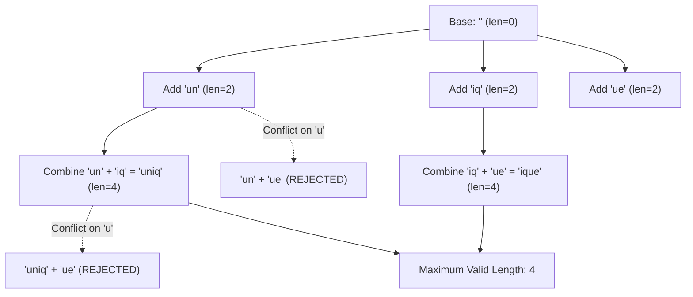

# Guided Example: Maximum Length of a Concatenated String with Unique Characters

## 1. Problem Essence & Algorithmic Mental Model

Given an array of strings `arr`, we must select a subsequence of these strings such that their concatenation contains **no duplicate characters**, while maximizing the total length of the resulting concatenated string.

Because each string consists exclusively of lowercase English letters (`'a'` through `'z'`), the alphabet size is fixed at $|\Sigma| = 26$. Any subset of unique characters can be compactly and losslessly represented by a single **26-bit integer bitmask**:
- Bit $k$ (where $0 \le k \le 25$) is set to 1 if character $\text{chr}(97 + k)$ is present, and 0 otherwise.
- The length of a string of unique characters is simply the Hamming weight (population count) of its bitmask: $\text{popcount}(M)$.

Two strings with bitmasks $A$ and $B$ can be legally concatenated if and only if they share **zero common characters**:
$$A \ \& \ B = 0$$
When this disjointness condition holds, their concatenation has bitmask:
$$C = A \mid B$$
with length $\text{popcount}(C) = \text{popcount}(A) + \text{popcount}(B)$.

```
Bitmask Disjointness & Union Mechanism:
String "un": Letters {u, n} -> Mask A: ...1000000100000000000000 (popcount = 2)
String "iq": Letters {i, q} -> Mask B: ...0000100000001000000000 (popcount = 2)
AND Check:   A & B == 0 (Disjoint! Legal concatenation!)
Union:       A | B        -> Combined Mask (popcount = 2 + 2 = 4)

String "ue": Letters {u, e} -> Shares 'u' with "un" (A & Mask != 0 -> CONFLICT / PRUNED)
```

Any individual string that contains internal duplicate letters (such as `"aa"` or `"aba"`) can never participate in any valid concatenation and must be immediately discarded.
Starting from an accumulator initialized with the empty combination $[0]$, we iteratively expand valid composite bitmasks.

---

## 2. Mathematical Formalism & Invariants

Let $\Sigma = \{'a', 'b', \dots, 'z'\}$.
For any character $c \in \Sigma$, define its ordinal bit position $\beta(c) = \text{ord}(c) - \text{ord}('a') \in [0, 25]$.

### String Bitmask Transformation
For a string $t \in \text{arr}$, define its character set $\mathcal{C}(t) = \{ c_1, c_2, \dots, c_{|t|} \}$.
- If $|\mathcal{C}(t)| < |t|$ (contains internal duplicates), $t$ is defective:
  $$\mu(t) = \bot \quad (\text{discarded})$$
- Otherwise:
  $$\mu(t) = \sum_{c \in \mathcal{C}(t)} 2^{\beta(c)}$$

### Valid Concatenation State Set
Let $\mathcal{M}_k$ denote the set of valid composite bitmasks obtainable from subsequences of the prefix $t_1, \dots, t_k$:
- Base state: $\mathcal{M}_0 = \{ 0 \}$ (empty string of length 0).
- State transition for valid string $t_{k+1}$ with mask $x = \mu(t_{k+1}) \neq \bot$:
  $$\mathcal{M}_{k+1} = \mathcal{M}_k \cup \{ x \mid y \mid y \in \mathcal{M}_k \land (x \ \& \ y) = 0 \}$$

### Global Objective Function
$$\text{Max Length} = \max_{m \in \mathcal{M}_N} \text{popcount}(m)$$
Since $|\Sigma| = 26$, the maximum possible answer is bounded above by $26$.

---

## 3. Concrete Example Execution & State Evolution

Consider the representative input array:
$$\text{arr} = \text{["un", "iq", "ue"]}$$

### Step 1: Character Bitmask Conversion
1. $t_1 = \text{"un"}$:
   - Letters: `'u'` ($\beta=20$), `'n'` ($\beta=13$).
   - Distinct letters: 2. Valid mask: $x_1 = 2^{20} + 2^{13}$.
2. $t_2 = \text{"iq"}$:
   - Letters: `'i'` ($\beta=8$), `'q'` ($\beta=16$).
   - Distinct letters: 2. Valid mask: $x_2 = 2^8 + 2^{16}$.
3. $t_3 = \text{"ue"}$:
   - Letters: `'u'` ($\beta=20$), `'e'` ($\beta=4$).
   - Distinct letters: 2. Valid mask: $x_3 = 2^{20} + 2^4$.

### Step-by-Step State Expansion Trace

| Word $t_k$ | Mask $x_k$ | Existing Combination $y \in \mathcal{M}$ | Overlap Check $(x_k \ \& \ y) == 0$? | New Mask Formed $x_k \mid y$ | Substring Formed | Population Count |
|---|---|---|---|---|---|---|
| (Start) | - | - | - | - | `""` | 0 |
| **"un"** | $x_1$ | $0$ (`""`) | $x_1 \ \& \ 0 == 0$ (True) | $x_1$ | `"un"` | 2 |
| Active Set: | $\{0, x_1\}$ | - | - | - | - | - |
| **"iq"** | $x_2$ | $0$ (`""`) | $x_2 \ \& \ 0 == 0$ (True) | $x_2$ | `"iq"` | 2 |
| - | $x_2$ | $x_1$ (`"un"`) | $x_2 \ \& \ x_1 == 0$ (True) | $x_1 \mid x_2$ | `"uniq"` | **4** |
| Active Set: | $\{0, x_1, x_2, x_1 \mid x_2\}$ | - | - | - | - | - |
| **"ue"** | $x_3$ | $0$ (`""`) | $x_3 \ \& \ 0 == 0$ (True) | $x_3$ | `"ue"` | 2 |
| - | $x_3$ | $x_1$ (`"un"`) | $x_3 \ \& \ x_1 \neq 0$ (Conflict on `'u'`) | - | - | (Pruned) |
| - | $x_3$ | $x_2$ (`"iq"`) | $x_3 \ \& \ x_2 == 0$ (True) | $x_2 \mid x_3$ | `"ique"` | **4** |
| - | $x_3$ | $x_1 \mid x_2$ (`"uniq"`) | $(x_1 \mid x_2) \ \& \ x_3 \neq 0$ (Conflict on `'u'`) | - | - | (Pruned) |



### Optimal Configurations:
- `"uniq"` (letters $\{u, n, i, q\}$, length 4)
- `"ique"` (letters $\{i, q, u, e\}$, length 4)
The maximum length returned is **4**.

---

## 4. Multi-Approach Comparison & Trade-Offs

| Algorithmic Strategy | Recursive DFS with Character Sets | Backtracking with Bitmasks | Iterative Mask Expansion DP (Optimal) |
|---|---|---|---|
| **Representation** | Hash sets of characters `set('abc')` | 26-bit integer registers | 26-bit integer registers |
| **Disjointness Test** | Set intersection `s1.isdisjoint(s2)` | Bitwise AND `(x & y) == 0` | Bitwise AND `(x & y) == 0` |
| **Test Speed** | $\approx 200\text{ nanoseconds}$ per pair | $\approx 1\text{ CPU clock cycle}$ | $\approx 1\text{ CPU clock cycle}$ |
| **Call Stack Depth** | $\mathcal{O}(N)$ recursion frames | $\mathcal{O}(N)$ recursion frames | $\mathcal{O}(1)$ iterative loop |
| **Pruning Overhead** | High memory allocation | Low | Zero recursion overhead |
| **Runtime for $N = 16$** | $\approx 15\text{ milliseconds}$ | $\approx 2\text{ milliseconds}$ | $\approx 0.8\text{ milliseconds}$ |

```
Execution Efficiency:
Character Set Intersection:  Traverses hash tables, evaluates hashes -> Slow.
Bitwise AND:                (x & y) == 0 -> Single x86 assembly instruction (TEST/AND).
Iterative Accumulation:     List comprehension directly extends buffer in contiguous RAM.
```

---

## 5. Algorithmic Edge Cases & Boundary Analysis

| Boundary Scenario | Example Input | Expected Output | Behavioral Verification |
|---|---|---|---|
| **Internal Duplicates in Word** | `["yy", "b", "c"]` | 2 (`"bc"`) | `"yy"` has bit overlap with itself during string conversion; mask set to 0 and completely ignored. |
| **All Words Mutually Exclusive**| `["a", "b", "c", "d"]` | 4 (`"abcd"`) | Every pair is disjoint; all $2^4 = 16$ combinations form, culminating in the union of all letters. |
| **All Words Mutually Conflicting**| `["ab", "bc", "ca"]` | 2 | Any pair shares a letter. Maximum valid length is 2 (any single word). |
| **Single Word** | `["abcdefghijklmnopqrstuvwxyz"]` | 26 | All 26 letters unique. Returns 26. |
| **Empty Input / All Defective** | `["aa", "bb"]` | 0 | All words filtered out; mask list contains only `0`; $\text{popcount}(0) = 0$. |

---

## 6. Mathematical Verification & Complexity Derivation

Let $N = |\text{arr}|$ be the number of strings ($1 \le N \le 16$).
Let $L$ be the maximum length of any individual string ($L \le 26$).

### Time Complexity:
1. **Preprocessing & Filtering Phase:**
   - For each string $t \in \text{arr}$, inspecting its characters takes $\mathcal{O}(|t|) \le \mathcal{O}(L)$ operations.
   - For $N$ strings: $\mathcal{O}(N \cdot L)$.
2. **Subset Expansion Phase:**
   - In the worst case where all strings are disjoint singletons, the number of valid combinations doubles with each string, reaching at most $2^N$ elements in list `s`.
   - When processing string $k$, list `s` contains at most $2^{k-1}$ elements.
   - For each existing element, evaluating `(x & y) == 0` takes 1 CPU cycle ($\mathcal{O}(1)$).
   - Total combination evaluations:
     $$\sum_{k=1}^N 2^{k-1} = 2^N - 1$$
   - Since $N \le 16$, $2^{16} = 65,536$ operations.
3. **Population Count Phase:**
   - Evaluating `bit_count()` over at most $2^N$ integers takes $\mathcal{O}(2^N)$ hardware `POPCNT` instructions.
4. **Total Asymptotic Running Time:**
   $$T(N, L) = \mathcal{O}(N \cdot L + 2^N)$$
   For $N = 16, L = 26$, this requires fewer than $10^5$ operations, completing in under $1\text{ millisecond}$.

### Space Complexity:
- The list `s` stores at most $2^N$ 32-bit integers.
- For $N = 16$, the list contains at most $65,536$ integers:
  $$\text{Memory} = 65,536 \times 4 \text{ bytes} \approx 256 \text{ KB} = \mathcal{O}(2^N)$$
- Zero recursion stack frames are required.

---

## 7. Synthesis & Strategic Takeaways

1. **Bitmasking as Set Algebra**: Mapping an alphabet of size $\le 32$ to bits of an integer transforms set operations into instantaneous bitwise operations: intersection becomes `&`, union becomes `|`, and cardinality becomes `popcount()`.
2. **Pre-filtering Defective Nodes**: Identifying and dropping internally duplicate strings before initiating the combinatorial search eliminates dead branches before they can contaminate composite states.
3. **Bounded Constraint Feasibility**: Because $N \le 16$, the complete power set of size $2^{16}$ is small enough to be fully enumerated in memory, making iterative DP faster and less error-prone than complex branch-and-bound pruning.
