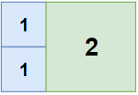
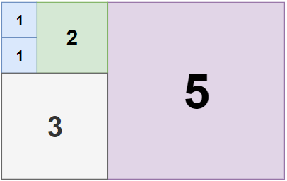
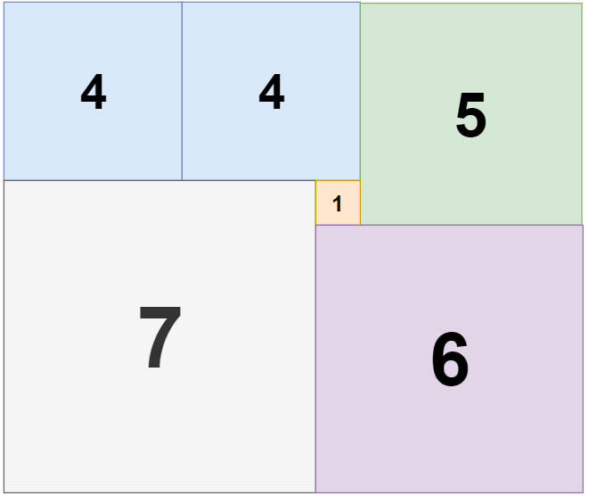

## Description

Given a rectangle of size `n` x `m`, return *the minimum number of integer-sided squares that tile the rectangle*.
### Function Contract

- `n`: Input parameter.
- Returns expected result.

### Examples

#### Example 1

- **Input:** $n = 2, m = 3$
- **Output:** `3`
- **Explanation:** 3 squares are necessary to cover the rectangle.
2 (squares of 1x1)
1 (square of 2x2)
#### Example 2

- **Input:** $n = 5, m = 8$
- **Output:** `5`
#### Example 3

- **Input:** $n = 11, m = 13$
- **Output:** `6`
### Constraints

- $1 \le n, m \le 13$