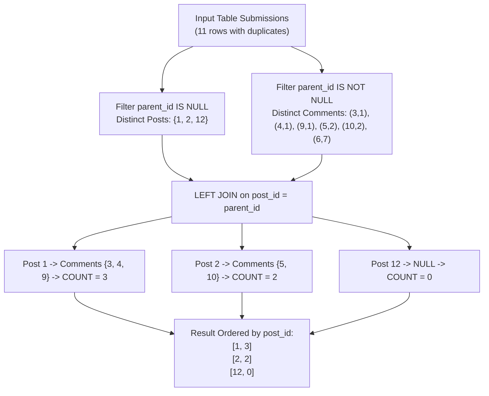

# Guided Example: Number of Comments per Post

## 1. Problem Essence & Algorithmic Mental Model

We are given a single relational table `Submissions` containing `sub_id` (submission ID) and `parent_id` (parent submission ID). The table lacks a primary key and may contain duplicate rows.
Submissions are categorized into two roles based on their parent reference:
1. **Posts:** Submissions with no parent (`parent_id IS NULL`).
2. **Comments:** Submissions that point to a parent (`parent_id IS NOT NULL`).

Our objective is to compute the total number of distinct comments associated with each distinct post. The result table must report `post_id` and `number_of_comments`, sorted by `post_id` in ascending order. Posts that have zero comments must be included with a comment count of $0$.

This relational task features three critical traps:
- **Duplicate Submissions:** A user may submit the same post or comment multiple times, producing duplicate rows in `Submissions`. We must aggregate unique `sub_id` occurrences.
- **Zero-Comment Posts:** Using an `INNER JOIN` would drop posts that received zero comments (e.g., post 12). A `LEFT JOIN` is required to preserve all posts in the output stream.
- **Null Counting Semantics:** In SQL, `COUNT(*)` counts total rows including nulls (which would incorrectly report $1$ for an isolated post with a null joined comment row), whereas `COUNT(column_name)` counts strictly non-null values, correctly evaluating to $0$.

```
Relational Self-Join Graph:
Posts (parent_id IS NULL)          Comments (parent_id = post_id)
[ Post 1 ] <─────────────────────── [ Comment 3 ], [ Comment 4 ], [ Comment 9 ] (Count = 3)
[ Post 2 ] <─────────────────────── [ Comment 5 ], [ Comment 10 ]               (Count = 2)
[ Post 12 ] <────────────────────── (No matching comments -> NULL)               (Count = 0)
(Orphan Comment 6 -> parent 7 does not exist -> Excluded from result)
```

---

## 2. Mathematical Formalism & Invariants

Let $\mathcal{S} \subseteq \mathbb{Z}^+ \times (\mathbb{Z}^+ \cup \{\bot\})$ denote the multiset of rows in `Submissions`, where $\bot$ represents `NULL`.

### Distinct Posts Set
Define the set of unique top-level posts:
$$\mathcal{P} = \{ s \mid (s, \bot) \in \mathcal{S} \}$$

### Distinct Comments Relation
Define the deduplicated set of directed comment edges:
$$\mathcal{C} = \{ (c, p) \mid (c, p) \in \mathcal{S} \land p \neq \bot \}$$

### Comment Count Metric
For each post $p \in \mathcal{P}$, the number of direct comments is the cardinality:
$$N(p) = |\{ c \mid (c, p) \in \mathcal{C} \}|$$

### Relational Join Invariant
Under a `LEFT OUTER JOIN` between distinct posts $\mathcal{P}$ and comments $\mathcal{C}$:
$$\mathcal{T} = \mathcal{P} \;{}_{p = parent\_id}^{\,\text{LEFT}}\; \mathcal{C}$$
Each row in $\mathcal{T}$ has the structure $(p, c)$, where $c \in \mathbb{Z}^+ \cup \{\bot\}$.
Aggregating over $p$ with the projection:
$$\text{COUNT}(c) = \sum_{(p, c) \in \mathcal{T}} \mathbb{I}(c \neq \bot)$$
guarantees that:
1. When $\{ c \mid (c, p) \in \mathcal{C} \} = \emptyset$, the single tuple $(p, \bot)$ contributes $0$.
2. When multiple unique comments exist, each contributes exactly $1$.
3. Duplicate comment rows in the input are collapsed prior to aggregation.

---

## 3. Concrete Example Execution & State Evolution

Consider the input table `Submissions`:
- Rows:
  - $(1, \bot)$, $(2, \bot)$, $(1, \bot)$ [Duplicate post 1]
  - $(12, \bot)$ [Post 12 with 0 comments]
  - $(3, 1)$, $(5, 2)$, $(3, 1)$ [Duplicate comment 3 on post 1]
  - $(4, 1)$, $(9, 1)$ [Comments 4 and 9 on post 1]
  - $(10, 2)$ [Comment 10 on post 2]
  - $(6, 7)$ [Comment on non-existent post 7]

### Step 1: Extract Distinct Posts
Filtering `WHERE parent_id IS NULL` and selecting `DISTINCT sub_id`:
$$\mathcal{P} = \{ 1, 2, 12 \}$$

### Step 2: Left Join and Distinct Deduplication Trace

| Post ID $p$ | Matching Comments $c$ from $\mathcal{S}$ | Deduplicated Comments | Joined State $(p, c)$ | Non-Null Count Contribution |
|---|---|---|---|---|
| **1** | $c \in \{3, 3, 4, 9\}$ | $\{3, 4, 9\}$ | $(1, 3), (1, 4), (1, 9)$ | **3** |
| **2** | $c \in \{5, 10\}$ | $\{5, 10\}$ | $(2, 5), (2, 10)$ | **2** |
| **12**| None | $\emptyset$ | $(12, \bot)$ | **0** (Null skipped) |

Note on $(6, 7)$: Comment 6 references parent 7. Because 7 does not appear in $\mathcal{P}$, comment 6 is never included in the left join.



### Final Result Set:
$$\begin{bmatrix}
\text{post\_id} & \text{number\_of\_comments} \\
1 & 3 \\
2 & 2 \\
12 & 0
\end{bmatrix}$$

---

## 4. Multi-Approach Comparison & Trade-Offs

| Query Formulation | Correlated Subquery per Post | CTE with Deduplicated View (Optimal) | Full Self-Join with `COUNT(DISTINCT)` |
|---|---|---|---|
| **Query Pattern** | `SELECT p, (SELECT COUNT(...) WHERE parent=p)` | Pre-deduplicate in CTE, then `LEFT JOIN` | Direct self-join with inline `COUNT(DISTINCT)` |
| **Engine Execution Plan**| Nested loop index seek per post | Single hash join + aggregation | Cartesian product of duplicates before distinct |
| **Duplicate Sensitivity** | Requires distinct in subquery | Cleanly eliminated in CTE | Expensive hash aggregate on large intermediate rows |
| **Handling 0 Comments** | Subquery returns 0 directly | Preserved by `LEFT JOIN` and `COUNT(sub_id)` | Preserved by `LEFT JOIN` and `COUNT(DISTINCT)` |
| **Complexity on $N = 10^5$**| $\mathcal{O}(P \cdot \log C)$ index seeks | $\mathcal{O}(N \log N)$ sort / hash merge | High memory pressure during group by |

```
Query Engine Execution Comparison:
Inline COUNT(DISTINCT):
  s1 (with duplicates) LEFT JOIN s2 (with duplicates) -> Generates m x n duplicate rows!
  Then performs slow distinct sorting on swollen intermediate table.
CTE Pre-deduplication (Optimal):
  SELECT DISTINCT s1.sub_id, s2.sub_id -> Filters out duplicates early!
  Aggregates cleanly with minimal memory overhead.
```

---

## 5. Algorithmic Edge Cases & Boundary Analysis

| Boundary Scenario | Configuration Details | Expected Output Behavior | Relational Verification |
|---|---|---|---|
| **Post with Zero Comments** | Post 12 has no corresponding rows in comments | `[12, 0]` | Left outer join generates row `(12, NULL)`. `COUNT(sub_id)` evaluates to 0. |
| **Duplicate Post Submissions** | Multiple rows `(1, NULL)` | 1 appears once in output | Distinct filter on posts ensures each unique post produces exactly one group. |
| **Duplicate Comments** | User submits comment `(3, 1)` twice | Counted only once | `DISTINCT s1.sub_id, s2.sub_id` drops identical comment duplicates. |
| **Orphan Comments** | Comment references a `parent_id` that is not a post | Discarded | Left join is anchored on `s1` (posts); non-existent posts cannot anchor rows. |
| **No Posts in Table** | Table contains only comments or is empty | Empty result set | `WHERE s1.parent_id IS NULL` yields 0 rows; query returns 0 rows cleanly. |

---

## 6. Mathematical Verification & Complexity Derivation

Let $N$ be the total number of rows in `Submissions`.
Let $P$ be the number of unique posts and $C$ be the number of unique comments ($P + C \le N$).

### Query Engine Computational Complexity:
1. **Selection & Deduplication:**
   - Filtering posts (`parent_id IS NULL`) requires a full table scan: $\mathcal{O}(N)$ operations.
   - Distinct sorting/hashing of posts takes $\mathcal{O}(P \log P)$ or $\mathcal{O}(P)$ with a hash set.
2. **Left Outer Join:**
   - Joining posts with comments on `s1.sub_id = s2.parent_id`:
     - Using Hash Join: building hash table on posts ($\mathcal{O}(P)$) and probing with comments ($\mathcal{O}(N)$).
     - Total join cost: $\mathcal{O}(P + N) = \mathcal{O}(N)$.
3. **Aggregation & Grouping:**
   - Grouping by `post_id` and counting non-null comment IDs takes $\mathcal{O}(P)$ hash aggregation.
4. **Final Sort:**
   - Sorting $P$ resulting rows by `post_id`: $\mathcal{O}(P \log P)$.
5. **Total Execution Cost:**
   $$T(N) = \mathcal{O}(N + P \log P)$$
   Auxiliary memory is bounded by the hash tables: $\mathcal{O}(P + C) = \mathcal{O}(N)$.

---

## 7. Synthesis & Strategic Takeaways

1. **The Critical Difference Between `COUNT(*)` and `COUNT(column)`**: In outer joins, `COUNT(*)` counts the existence of the row, yielding 1 for null-padded unmatched records, whereas `COUNT(column)` checks for non-null values, correctly returning 0.
2. **Early Deduplication Minimizes Cardinality Explosion**: Deduplicating rows prior to join operations prevents Cartesian explosion between duplicate parent rows and duplicate child rows.
3. **Unifying Symmetrical Roles via Self-Join**: When entities and their hierarchical relationships coexist in a single denormalized table, a self-join creates explicit parent-child edges for standard relational aggregation.
