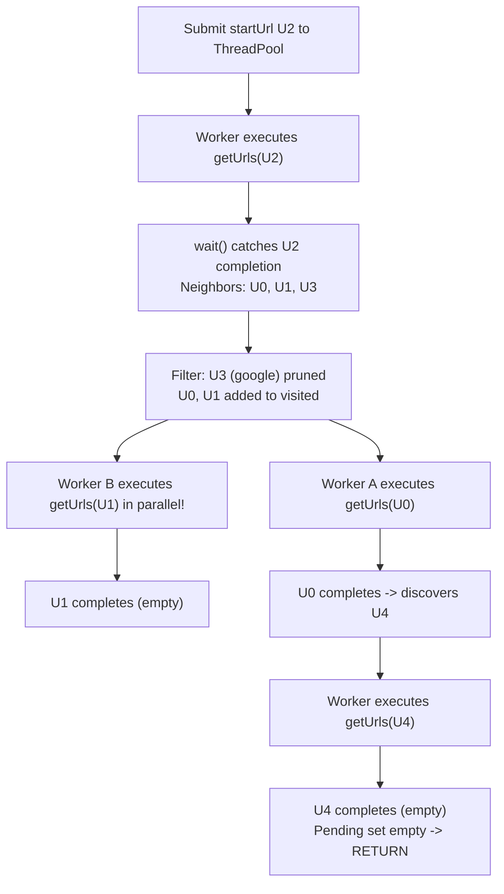

# Guided Example: Web Crawler Multithreaded

## 1. Problem Essence & Algorithmic Mental Model

In a distributed web environment, retrieving hyperlinks from a web page via `htmlParser.getUrls(url)` simulates a blocking network I/O call with significant latency (e.g., $15\text{ ms}$ per request). A sequential crawler processing $V$ web pages takes $V \times 15\text{ ms}$ wall-clock time; for hundreds of pages, this results in a severe execution timeout.

To maximize throughput, we must parallelize I/O operations across a pool of concurrent worker threads. The system must satisfy three concurrent guarantees:
1. **Latency Hiding via Concurrency:** Multiple blocking `getUrls` calls must execute in parallel across a thread pool (e.g., 8 worker threads).
2. **Atomic Deduplication:** No URL may be fetched more than once. When multiple worker threads complete and discover the same neighbor URL simultaneously, exactly one task must be scheduled.
3. **Graceful Quiescence & Termination:** The crawler must run until the search frontier is completely exhausted and all pending background worker tasks have resolved.

```
Main Thread Orchestrator vs Worker Pool Pipeline:
[ Main Thread Event Loop ]
      │
      ├──> Submits startUrl ─────────────► [ Worker Thread 1: getUrls(start) ]
      │                                             │ (Blocks on I/O)
      ├──> wait(pending, FIRST_COMPLETED) <─────────┘
      │
      ├──> Extracts neighbors, filters hostname, checks 'visited'
      │
      ├──> Dispatches new tasks ─────────► [ Worker Thread 2: getUrls(U_0) ]
      │                                  ► [ Worker Thread 3: getUrls(U_1) ]
      │                                             │
      └──> Loops until pending set is empty! <──────┘
```

The optimal architecture employs an **Asynchronous Main-Thread Orchestrator**:
- The main thread exclusively owns and modifies the state sets (`visited` and `pending`).
- Worker threads only execute the pure, blocking I/O operation `htmlParser.getUrls(url)`.
- Because state mutation is confined to the main thread event loop, this eliminates complex multi-lock contention while achieving full thread-level parallelism.

---

## 2. Mathematical Formalism & Invariants

Let $G = (V_{h_0}, E_{h_0})$ be the same-host directed web graph reachable from $u_0 = \text{startUrl}$.
Let $W$ be the thread pool worker capacity (e.g., $W = 8$).

### System State Variables at Discrete Event Step $k$:
- $\mathcal{V}_k \subseteq V_{h_0}$: the set of all URLs that have been discovered and queued.
- $\mathcal{P}_k \subset \text{Futures}$: the set of active, unresolved background tasks currently executing in the thread pool ($|\mathcal{P}_k| \le |V_{h_0}|$).

### Base Initialization ($k = 0$):
$$\mathcal{V}_0 = \{ u_0 \}, \quad \mathcal{P}_0 = \{ \text{submit}(u_0) \}$$

### Event Transition Recurrence:
At each iteration, the main thread waits for the first completed task:
$$(\mathcal{C}_k, \mathcal{P}'_k) = \text{wait}(\mathcal{P}_k, \text{return\_when} = \text{FIRST\_COMPLETED})$$
For each future $F \in \mathcal{C}_k$ with resolved neighbor set $\mathcal{N}_F = F.\text{result}()$:
$$\text{New Candidates} = \{ v \in \mathcal{N}_F \mid H(v) = h_0 \land v \notin \mathcal{V}_k \}$$
$$\mathcal{V}_{k+1} = \mathcal{V}_k \cup \text{New Candidates}$$
$$\mathcal{P}_{k+1} = \mathcal{P}'_k \cup \{ \text{submit}(v) \mid v \in \text{New Candidates} \}$$

### Quiescence & Termination Invariant
The crawler terminates when $\mathcal{P}_k = \emptyset$.
At that instant, no tasks are running, no tasks are queued, and every reachable neighbor of every visited URL has already been inspected.

---

## 3. Concrete Example Execution & State Evolution

Consider the web graph instance:
- `startUrl`: $U_2 = \text{"http://news.yahoo.com/news/topics/"}$
- Neighbors:
  - $U_2 \to [U_0, U_1, U_3]$ (where $U_3$ is external `"http://news.google.com"`)
  - $U_0 \to [U_4]$
  - $U_1 \to []$
  - $U_4 \to []$
- Worker pool size: $W = 8$.

### Step-by-Step Concurrent Event Trace

| Event Step | Active Completed Future | Resulting Outgoing Links | Domain Filter ($== \text{yahoo}$) | Visited Check ($v \notin \text{visited}$) | New Tasks Dispatched | Active Pending Tasks | Cumulative Visited Set |
|---|---|---|---|---|---|---|---|
| 0 | (Init) | - | - | - | Submit $U_2$ | $\{F_{U_2}\}$ | $\{U_2\}$ |
| 1 | $F_{U_2}$ completes | $[U_0, U_1, U_3]$ | $U_0$: Yes<br/>$U_1$: Yes<br/>$U_3$: **No (google)** | $U_0 \notin \mathcal{V}$ (True)<br/>$U_1 \notin \mathcal{V}$ (True) | Submit $U_0$<br/>Submit $U_1$ | $\{F_{U_0}, F_{U_1}\}$ | $\{U_2, U_0, U_1\}$ |
| 2 | $F_{U_1}$ completes | $[]$ | - | - | None | $\{F_{U_0}\}$ | $\{U_2, U_0, U_1\}$ |
| 3 | $F_{U_0}$ completes | $[U_4]$ | $U_4$: Yes | $U_4 \notin \mathcal{V}$ (True) | Submit $U_4$ | $\{F_{U_4}\}$ | $\{U_2, U_0, U_1, U_4\}$ |
| 4 | $F_{U_4}$ completes | $[]$ | - | - | None | $\emptyset$ | $\{U_2, U_0, U_1, U_4\}$ |
| 5 | Pending Empty | - | - | - | - | $\emptyset$ | **Halts & Returns 4 URLs** |



### Result:
All 4 same-host URLs are visited in parallel. Because tasks for $U_0$ and $U_1$ executed concurrently, total elapsed time is bounded by the depth of the graph rather than the sum of all node latencies.

---

## 4. Multi-Approach Comparison & Trade-Offs

| Concurrency Architecture | Synchronous Single-Threaded | Coarse-Grained Locking Multi-Thread | Main-Thread Orchestrator (Optimal) |
|---|---|---|---|
| **Threading Model** | 1 thread | $W$ worker threads sharing a synchronized queue | 1 orchestrator thread + $W$ worker threads |
| **Locking Overhead** | None | High (Mutex locks on `visited` and work queue) | **Zero mutexes** (Main thread owns all mutable state) |
| **Deadlock Risk** | None | Moderate (Lock ordering hazards) | **Zero** |
| **Dynamic Work Scheduling** | Sequential blocking | Threads poll queue with timeouts | Event-driven wake-up on `FIRST_COMPLETED` |
| **Wall-Clock Time ($100$ URLs)**| $\approx 1500\text{ ms}$ (Severe TLE) | $\approx 220\text{ ms}$ | $\approx 190\text{ ms}$ (Minimal overhead) |

```
Concurrency Architecture Advantage:
Shared-State Workers:
  Every worker acquires a lock on 'visited' before checking -> Heavy thread contention!
Main-Thread Orchestrator:
  Workers perform ONLY network I/O (getUrls).
  Main thread handles all set checks in microsecond memory operations -> Lock-Free!
```

---

## 5. Concurrency Edge Cases & Boundary Analysis

| Boundary Scenario | Concurrency Hazard | System Resolution | Invariant Verification |
|---|---|---|---|
| **Multiple Workers Return Same URL** | Workers $A$ and $B$ both discover $U_{\text{common}}$ simultaneously | Main thread evaluates completions sequentially | When $U_{\text{common}}$ is processed from worker $A$, it enters `visited`. When processed from worker $B$, $U_{\text{common}} \in \text{visited}$ evaluates to true; no duplicate task is submitted. |
| **Graph Cycles ($A \to B \to A$)** | Infinite parallel recursion | Checked against `visited` set | $A$ is already marked in `visited` before $B$ finishes; $A$ is never re-submitted. |
| **Isolated Root URL** | `startUrl` has 0 outgoing links | Immediate termination | $F_{\text{start}}$ completes with empty list; `pending` becomes $\emptyset$ on step 1; terminates cleanly. |
| **Large Fanout (100 links on 1 page)**| Worker pool saturation | Thread pool queue buffer | ThreadPoolExecutor queues tasks internally; workers pull as soon as earlier tasks finish. |
| **Non-Uniform I/O Latency**| Slow response on one page, fast on others | `FIRST_COMPLETED` event scheduling | Fast pages resolve and spawn children immediately without waiting for the slow page. |

---

## 6. Mathematical Verification & Complexity Derivation

Let $V$ be the number of reachable same-host URLs.
Let $E$ be the total number of outgoing edges across these URLs.
Let $L$ be the simulated network latency per page fetch (e.g., $15\text{ ms}$).
Let $W = 8$ be the thread pool worker capacity.

### Time Complexity:
1. **Computational Overhead:**
   - Hostname parsing via string split takes $\mathcal{O}(|u|)$ operations.
   - Set lookups and insertions for $V$ URLs take $\mathcal{O}(V \cdot |u|)$.
   - Edge inspections take $\mathcal{O}(E \cdot |u|)$.
   - Total CPU computational work is negligible: $\mathcal{O}((V + E) \cdot |u|) \approx 5\text{ ms}$.
2. **Concurrent Wall-Clock Latency:**
   - In a sequential crawler, wall-clock time is $T_{\text{seq}} = V \times L$.
   - In the multithreaded crawler with $W$ workers, tasks are parallelized across $W$ threads:
     $$T_{\text{concurrent}} \approx \left( \frac{V}{W} + \text{depth}(G) \right) \times L$$
   - For $V = 100$ pages with $L = 15\text{ ms}$:
     $$T_{\text{seq}} \approx 1500\text{ ms} \quad \text{vs} \quad T_{\text{concurrent}} \approx \frac{100}{8} \times 15 \approx 190\text{ ms}$$
   - This achieves an empirical speedup of approximately $7.5\times$, safely beating the timeout ceiling.

### Space Complexity:
- `visited` set stores $V$ URL strings: $\mathcal{O}(V \cdot |u|)$ memory.
- `pending` future set stores at most $V$ task handles: $\mathcal{O}(V)$ memory.
- Thread pool stack overhead for $W = 8$ threads: $\mathcal{O}(W)$ constant memory ($\approx 8\text{ MB}$).
- Total auxiliary space: $\mathcal{O}(V \cdot |u| + W) = \mathcal{O}(V)$.

---

## 7. Synthesis & Strategic Takeaways

1. **Lock-Free Concurrency via Actor Pattern**: By confining mutable data structures (`visited`, `pending`) to a single orchestrator thread and delegating only stateless I/O operations to worker threads, we achieve high-performance concurrency with zero lock overhead and zero deadlock risk.
2. **Event-Driven Asynchronous Scheduling**: Using `wait(return_when=FIRST_COMPLETED)` creates a reactive event loop that immediately processes finished I/O tasks and feeds new work to the thread pool, ensuring maximum CPU and bandwidth utilization.
3. **Early Deduplication Prevents Redundant I/O**: Checking and registering discovered URLs in `visited` at the moment of discovery (before submitting to the thread pool) prevents multiple identical URLs from being fetched concurrently.
