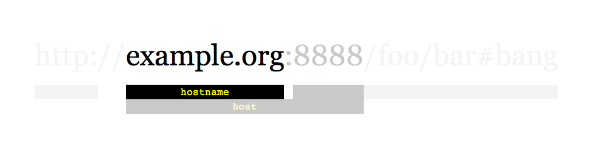
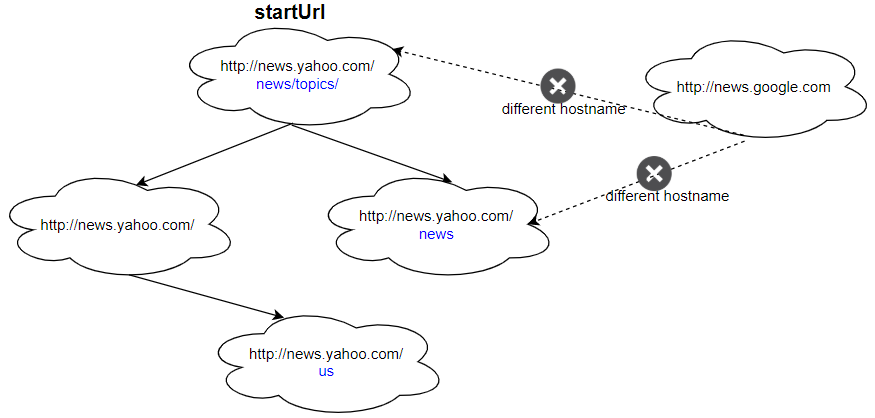
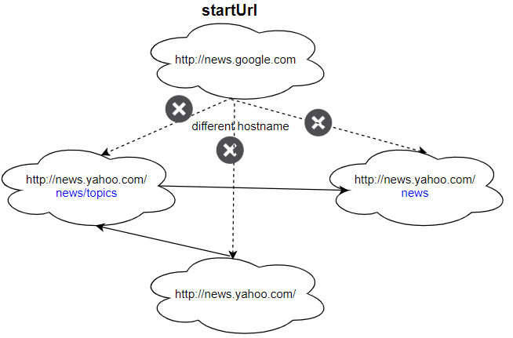

## Description

Given a URL `startUrl` and an interface `HtmlParser`, implement **a Multi-threaded web crawler** to crawl all links that are under the **same hostname** as `startUrl`.

Return all URLs obtained by your web crawler in **any** order.

Your crawler should:

- Start from the page: `startUrl`

- Call `HtmlParser.getUrls(url)` to get all URLs from a webpage of a given URL.

- Do not crawl the same link twice.

- Explore only the links that are under the **same hostname** as `startUrl`.



As shown in the example URL above, the hostname is `example.org`. For simplicity's sake, you may assume all URLs use **HTTP protocol** without any **port** specified. For example, the URLs `http://leetcode.com/problems` and `http://leetcode.com/contest` are under the same hostname, while URLs `http://example.org/test` and `http://example.com/abc` are not under the same hostname.

The `HtmlParser` interface is defined as such:

interface HtmlParser {
// Return a list of all urls from a webpage of given *url*.
// This is a blocking call, that means it will do HTTP request and return when this request is finished.
public List<String> getUrls(String url);
}
```
Note that `getUrls(String url)` simulates performing an HTTP request. You can treat it as a blocking function call that waits for an HTTP request to finish. It is guaranteed that `getUrls(String url)` will return the URLs within **15ms. ** Single-threaded solutions will exceed the time limit so, can your multi-threaded web crawler do better?
Below are two examples explaining the functionality of the problem. For custom testing purposes, you'll have three variables `urls`, `edges` and `startUrl`. Notice that you will only have access to `startUrl` in your code, while `urls` and `edges` are not directly accessible to you in code.
### Function Contract

**Inputs**

- `startUrl`: The URL where the crawl begins. It is present in the parser's URL library.
- `htmlParser`: An injected interface whose blocking `getUrls(url)` operation returns the URLs linked from `url`.

Conceptually, the supplied interface has this operation:

```text
getUrls(url) -> list of URLs linked from url
```

Each call simulates an HTTP request, blocks until that request finishes, and is guaranteed to return within 15 ms. A single-threaded crawler exceeds the time limit, so independent parser calls must overlap.

For authored custom tests, `urls` is the URL library and each pair `[from, to]` in `edges` is a directed link between indexed URLs. Submitted code receives only `startUrl` and `htmlParser`; it cannot access `urls` or `edges` directly.

Let $V$ be the number of same-host URLs reachable from `startUrl`, and let $E$ be the number of outgoing links returned while processing those $V$ pages. URL strings have source-bounded length at most 300.

**Return value**

Return every URL reachable from `startUrl` through a path consisting only of URLs with the starting hostname. Include `startUrl`, include every qualifying URL exactly once, exclude all off-host URLs, and return the result in any order.

### Examples
#### Example 1

```
- **Input:** ``
**urls = [
"http://news.yahoo.com",
"http://news.yahoo.com/news",
"http://news.yahoo.com/news/topics/",
"http://news.google.com",
"http://news.yahoo.com/us"
]
edges = [[2,0],[2,1],[3,2],[3,1],[0,4]]
startUrl = "http://news.yahoo.com/news/topics/"
- **Output:** `[`
"http://news.yahoo.com",
"http://news.yahoo.com/news",
"http://news.yahoo.com/news/topics/",
"http://news.yahoo.com/us"
]
#### Example 2

**



**

- **Input:** ``
urls = [
"http://news.yahoo.com",
"http://news.yahoo.com/news",
"http://news.yahoo.com/news/topics/",
"http://news.google.com"
]
edges = [[0,2],[2,1],[3,2],[3,1],[3,0]]
startUrl = "http://news.google.com"
- **Output:** `["http://news.google.com"]`
- **Explanation:** The startUrl links to all other pages that do not share the same hostname.
### Constraints

- $1 \le \text{urls.length} \le 1000$

- $1 \le \text{urls}[i].length \le 300$

- `startUrl` is one of the `urls`.

- Hostname label must be from `1` to `63` characters long, including the dots, may contain only the ASCII letters from `'a'` to `'z'`, digits from `'0'` to `'9'` and the hyphen-minus character (`'-'`).

- The hostname may not start or end with the hyphen-minus character ('-').

- See:  <a href="https://en.wikipedia.org/wiki/Hostname#Restrictions_on_valid_hostnames" target="_blank">https://en.wikipedia.org/wiki/Hostname#Restrictions_on_valid_hostnames</a>

- You may assume there're no duplicates in the URL library.

**Follow up:**

- Assume we have 10,000 nodes and 1 billion URLs to crawl. We will deploy the same software onto each node. The software can know about all the nodes. We have to minimize communication between machines and make sure each node does equal amount of work. How would your web crawler design change?

- What if one node fails or does not work?

- How do you know when the crawler is done?