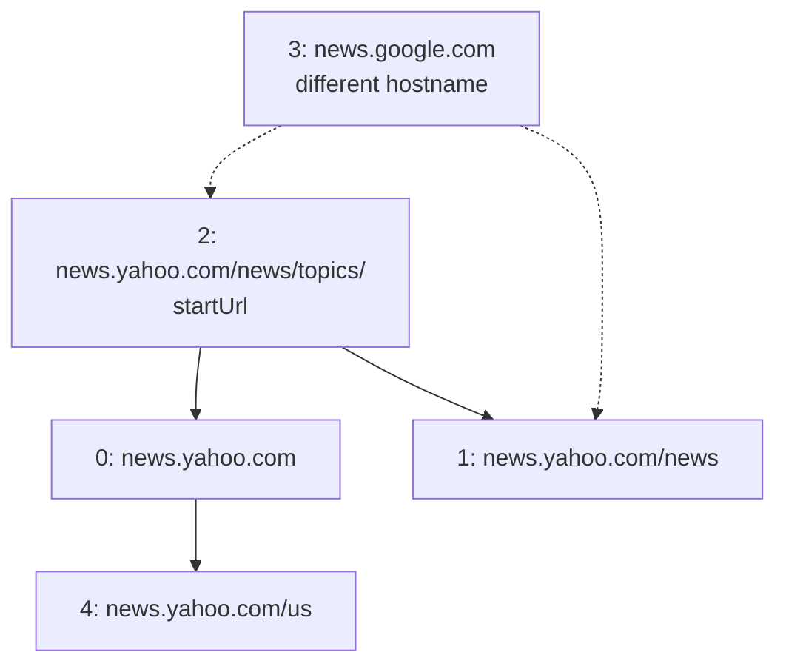
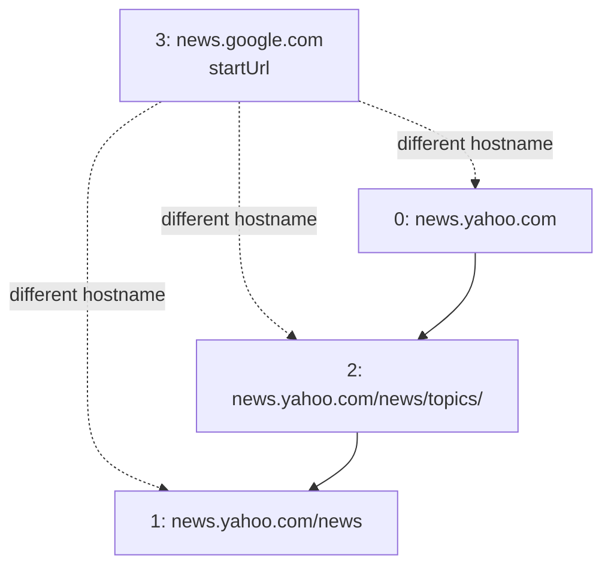

## Examples

**Example 1**

- Input: `urls = ["http://news.yahoo.com","http://news.yahoo.com/news","http://news.yahoo.com/news/topics/","http://news.google.com","http://news.yahoo.com/us"], edges = [[2,0],[2,1],[3,2],[3,1],[0,4]], startUrl = "http://news.yahoo.com/news/topics/"`
- Output: `["http://news.yahoo.com","http://news.yahoo.com/news","http://news.yahoo.com/news/topics/","http://news.yahoo.com/us"]`

Starting from URL `2`, the crawler reaches Yahoo URLs `0`, `1`, and `4`. Google URL `3` has a different hostname and is excluded.

**Example 2**

- Input: `urls = ["http://news.yahoo.com","http://news.yahoo.com/news","http://news.yahoo.com/news/topics/","http://news.google.com"], edges = [[0,2],[2,1],[3,2],[3,1],[3,0]], startUrl = "http://news.google.com"`
- Output: `["http://news.google.com"]`
- Explanation: Every outgoing link from `startUrl` has a different hostname, so none of those pages may be crawled.

The Yahoo-to-Yahoo links exist in the source graph but remain unreachable because crossing the hostname boundary is forbidden.

