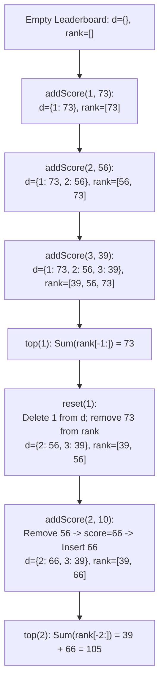

# Guided Example: Design A Leaderboard

## 1. Problem Essence & Algorithmic Mental Model

We are tasked with designing a real-time `Leaderboard` supporting three dynamic operations:
1. `addScore(playerId, score)`: Add `score` to the specified player's total. If the player is not currently on the leaderboard, enroll them with this score.
2. `top(K)`: Return the sum of scores of the top $K$ highest-scoring players currently on the leaderboard.
3. `reset(playerId)`: Remove the specified player from the leaderboard (resetting their score to zero).

This design problem requires managing **two distinct structural views** over the same dynamic dataset:
- **Key-Value Indexing:** Fast lookup and mutation by `playerId` (best served by an $\mathcal{O}(1)$ hash map).
- **Rank-Order Indexing:** Fast extraction of the largest $K$ scores (best served by an ordered balanced multiset or order-statistic tree).

```
Dual Data Structure Architecture:
Player Lookup (Hash Map):
  [Player 1] ──> Score: 73
  [Player 2] ──> Score: 56
  [Player 3] ──> Score: 39

Rank-Ordered Multiset (Balanced Tree / SortedList):
  [ 39 ] <── [ 56 ] <── [ 73 ]
                        |──── Top 1 = 73 ────|
                 |─────── Top 2 Sum = 56 + 73 = 129 ───────|
```

By coupling an $\mathcal{O}(1)$ hash map with a self-balancing sorted multiset:
- `addScore`: Remove the player's stale score from the sorted multiset, increment the score in the hash map, and reinsert the updated score into the multiset in $\mathcal{O}(\log N)$ time.
- `reset`: Remove the score from the sorted multiset and delete the player from the hash map in $\mathcal{O}(\log N)$ time.
- `top(K)`: Directly sum the rightmost $K$ elements in the sorted multiset in $\mathcal{O}(K)$ time, avoiding full sorting of all players.

---

## 2. Mathematical Formalism & Invariants

Let $\mathcal{P} \subset \mathbb{Z}^+$ denote the active set of players.
Let $S: \mathcal{P} \to \mathbb{Z}^+$ be the score mapping function stored in the hash map.
Let $\mathcal{R}$ be the multiset of active scores maintained in sorted order:
$$\mathcal{R} = \{ S(p) \mid p \in \mathcal{P} \}$$
where $|\mathcal{R}| = |\mathcal{P}| = N$.

### Invariant 1: Multi-Set Synchronization
At the beginning and conclusion of every public method call:
$$\mathcal{R} = \biguplus_{p \in \mathcal{P}} \{ S(p) \}$$
Every active player contributes exactly one score entry to $\mathcal{R}$. Tied scores are retained with their exact multiplicity.

### Invariant 2: Top-K Sum Equivalence
For any $K \le N$, let $r_1 \le r_2 \le \dots \le r_N$ denote the elements of $\mathcal{R}$ in non-decreasing order.
The query `top(K)` evaluates:
$$\text{Top}(K) = \sum_{j = N - K + 1}^N r_j$$
Since $\mathcal{R}$ is persistently sorted, accessing the top $K$ scores takes $\mathcal{O}(K)$ time without scanning or sorting the remaining $N - K$ players.

---

## 3. Concrete Example Execution & State Evolution

Consider the sequence of operations:
1. `addScore(1, 73)`
2. `addScore(2, 56)`
3. `addScore(3, 39)`
4. `top(1)`
5. `reset(1)`
6. `addScore(2, 10)`
7. `top(2)`

### Step-by-Step State Evolution Trace

| Step | Operation Invoked | Hash Map State (`d`) | Sorted Multiset State (`rank`) | Return Value | Algorithmic Mechanism |
|---|---|---|---|---|---|
| 1 | `addScore(1, 73)` | `{1: 73}` | `[73]` | `null` | New player 1 inserted into map; 73 added to sorted list. |
| 2 | `addScore(2, 56)` | `{1: 73, 2: 56}` | `[56, 73]` | `null` | New player 2 inserted into map; 56 added in sorted order. |
| 3 | `addScore(3, 39)` | `{1: 73, 2: 56, 3: 39}` | `[39, 56, 73]` | `null` | New player 3 inserted into map; 39 added. |
| 4 | `top(1)` | (Unchanged) | `[39, 56, 73]` | **73** | Slice `rank[-1:]`: $73$. |
| 5 | `reset(1)` | `{2: 56, 3: 39}` | `[39, 56]` | `null` | Pop player 1 ($S=73$); remove 73 from sorted list. |
| 6 | `addScore(2, 10)` | `{2: 66, 3: 39}` | `[39, 66]` | `null` | Player 2 exists: remove old 56 from list; $56+10=66$; insert 66. |
| 7 | `top(2)` | (Unchanged) | `[39, 66]` | **105** | Slice `rank[-2:]`: $39 + 66 = 105$. |



---

## 4. Multi-Approach Comparison & Trade-Offs

| Design Paradigm | Hash Map + On-Demand Full Sort | Hash Map + Min-Heap of Size $K$ | Hash Map + Sorted Multiset (Optimal) |
|---|---|---|---|
| **`addScore` Cost** | $\mathcal{O}(1)$ | $\mathcal{O}(1)$ | $\mathcal{O}(\log N)$ |
| **`reset` Cost** | $\mathcal{O}(1)$ | $\mathcal{O}(1)$ | $\mathcal{O}(\log N)$ |
| **`top(K)` Cost** | $\mathcal{O}(N \log N)$ full sort of all players | $\mathcal{O}(N \log K)$ push-pop across all players | $\mathcal{O}(K)$ direct tail slice |
| **Optimal Workload** | Heavy updates, very rare `top` queries | Infrequent `top` queries with small $K$ | Read-heavy or balanced read/write workflows |
| **Space Overhead** | $\mathcal{O}(N)$ | $\mathcal{O}(N + K)$ | $\mathcal{O}(N)$ tree nodes / sorted array |

```
Trade-Off Analysis:
If top(K) is called frequently:
  Full Sort Approach:   Sorts 10,000 players on every query -> Massive latency!
  Heap on Demand:       Pushes 10,000 players through a heap of size K.
  Sorted Multiset:      Maintains global order incrementally. top(K) takes only O(K) operations!
```

---

## 5. Algorithmic Edge Cases & Boundary Analysis

| Boundary Scenario | Configuration Details | Expected System Behavior | Invariant Verification |
|---|---|---|---|
| **$K$ Equals Active Players** | $K = N$ | Sum of all players | Slices `rank[-N:]`, summing the entire active player pool. |
| **Tied Scores** | Players 1 and 2 both have score 50 | Both scores retained | Multiset preserves duplicates `[50, 50]`; `top(1)` takes 50, `top(2)` sums $50 + 50 = 100$. |
| **Score Decreases or Reset** | Player reset, then re-added | Correct new score | `reset` completely purges player; subsequent `addScore` initializes as new player. |
| **Single Active Player** | 1 player on leaderboard | Correct scalar return | $N = 1, K = 1 \implies \text{top}(1)$ returns that player's score. |
| **Multiple Sequential Updates** | Same player scores repeatedly | Old score always purged | Updating existing score removes old score before inserting new score, preventing ghost entries. |

---

## 6. Mathematical Verification & Complexity Derivation

Let $N$ be the number of active players currently on the leaderboard ($N \le 10^4$).
Let $K$ be the parameter passed to `top(K)` ($1 \le K \le N$).

### Computational Complexity per Operation:
1. **`addScore(playerId, score)`:**
   - Hash map lookup for `playerId`: $\mathcal{O}(1)$ average.
   - If present:
     - Remove old score from balanced sorted structure: $\mathcal{O}(\log N)$.
     - Insert updated score: $\mathcal{O}(\log N)$.
   - If new:
     - Insert into map: $\mathcal{O}(1)$.
     - Insert into sorted structure: $\mathcal{O}(\log N)$.
   - **Total Time:** $\mathcal{O}(\log N)$.
2. **`reset(playerId)`:**
   - Hash map pop: $\mathcal{O}(1)$.
   - Remove score from balanced sorted structure: $\mathcal{O}(\log N)$.
   - **Total Time:** $\mathcal{O}(\log N)$.
3. **`top(K)`:**
   - Accessing the last $K$ elements in a sorted random-access structure: $\mathcal{O}(1)$ slice.
   - Summing $K$ scalar integers: $\mathcal{O}(K)$ additions.
   - **Total Time:** $\mathcal{O}(K)$.

### Space Complexity:
- The hash map stores $N$ key-value pairs: $\mathcal{O}(N)$ memory.
- The sorted multiset stores $N$ integer scores: $\mathcal{O}(N)$ memory.
- Total auxiliary space: $\mathcal{O}(N)$ memory.

---

## 7. Synthesis & Strategic Takeaways

1. **Dual Indexing for Asymmetric Operations**: When a data system requires fast primary key operations (find/update by ID) alongside rank-order queries (top $K$), coupling a hash table with a self-balancing tree provides optimal logarithmic performance across all access paths.
2. **Eager vs Lazy Maintenance**: Eagerly maintaining sorted order during mutations ($\mathcal{O}(\log N)$ per write) dramatically accelerates queries ($\mathcal{O}(K)$ per read), which is ideal for gaming leaderboards where rankings are queried continuously.
3. **Multiset Duplicity Preservation**: Scores on a leaderboard frequently collide; using a multiset representation ensures that identical scores from different players remain distinct without collision or overwrite errors.
