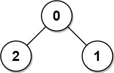
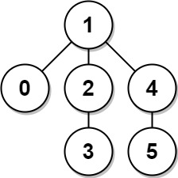

### 1. Description

The **diameter** of a tree is **the number of edges** in the longest path in that tree.

There is an undirected tree of `n` nodes labeled from `0` to $n - 1$. You are given a 2D array `edges` where $\text{edges.length} = n - 1$ and $\text{edges}[i] = [a_{i}, b_{i}]$ indicates that there is an undirected edge between nodes $a_{i}$ and $b_{i}$ in the tree.

Return *the **diameter** of the tree*.

### 2. Function Contract

### Inputs

- `edges`: The $n-1$ undirected edges of one tree, with each edge written as $[a_{i}, b_{i}]$.

The nodes are the consecutive integers from $0$ through $n-1$, where

$n = \lvert \texttt{edges} \rvert + 1.$

The input is guaranteed to be connected and acyclic. Edge orientation and row order carry no meaning.

### Return value

Return the greatest number of edges on a simple path between any two nodes. When $n=1$, `edges` is empty and the diameter is `0`.

### 3. Examples

#### Example 1

- **Input:** $edges = [[0,1],[0,2]]$
- **Output:** `2`
- **Explanation:** The longest path of the tree is the path 1 - 0 - 2.
#### Example 2

- **Input:** $edges = [[0,1],[1,2],[2,3],[1,4],[4,5]]$
- **Output:** `4`
- **Explanation:** The longest path of the tree is the path 3 - 2 - 1 - 4 - 5.

### 4. Constraints

- $n = \text{edges.length} + 1$

- $1 \le n \le 10^{4}$

- $0 \le a_{i}, b_{i} < n$

- $a_{i} \neq b_{i}$